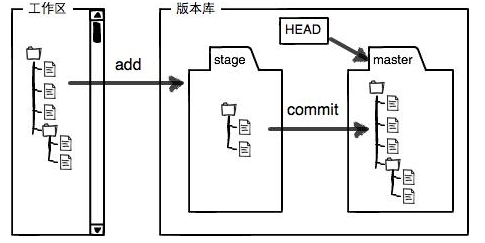

Git是目前世界上最先进的**分布式版本控制系统**

## 版本库与文件操作

#### 初始化创建版本库

使用**`git init`** 命令将这个目录成为Git可以管理的仓库

执行完此命令后当前目录下回出现**`.git`** 的目录。此目录是Git用来跟踪管理版本库的

#### 查看仓库状态

**`git status`** 命令可以随时查看 **工作区/仓库** 当前的状态

 1. *Changes not staged for commit*：文件更改了，但是还未进入暂存区 ，需要**`git add`** ；
  2. *Changes to be committed*：文件已进入暂存区，但还未提交到版本库，需要**`git commit`** ；
  3. *Untracked files*：表示该文件还从来没有被添加进版本库，这是新添加的文件；

#### 文件操作

使用**`git add 文件名`**命令将文件放进**暂存区**，此命令课反复多次使用，也可同时添加多个文件

使用**`git commit -m "备注(描述)"`**命令，将**暂存区**的所有内容提交到**当前分支**

#### 查看修改内容

**`git diff 文件名`**  命令可以查看指定文件修改内容(暂存区和工作区的差异)

## 版本回退

**`git log`** 可以查看从最近到最远的提交日志（即查看版本库的状态 ）

**`git diff 文件名`**查看修改的内容

**`git diff HEAD -- 文件名 `**可以查看工作区和版本库里面最新版本的区别

**`git reset --hard HEAD^`** 表示回退一个版本**`HEAD`**其实是个指向当前版本的指针

**`git reset --hard HEAD^^`**表示回退两个版本

**`git reset --hard HEAD~100`**表示回退100个版本

**`git reset --hard 版本号`**将head指针指向那个版本号(版本号可以只写前几位)

**`git reflog`**查看历史每一次命令，可以查看每一次提交时的**`commit id`**

#### 工作区和暂存区

**`工作区`** 比如电脑中看到的目录

**`版本库`** 工作区有一个隐藏目录**`.git`** 这个不算工作区，而是Git的版本库。

Git的版本库里存了很多东西，其中最重要的就是称为stage（或者叫index）的暂存区，还有Git为我们自动创建的第一个分支`master`，以及指向`master`的一个指针叫`HEAD`

#### 撤销修改

**`git checkout -- 文件名`**把文件在工作区的修改全部撤销

**`git reset HEAD 文件名`**把文件在暂存区的修改撤销掉，重新放回工作区

#### 删除文件

如果在文件管理器中吧文件删除了，这个时候工作区和版本库不一致。可以使用**`git checkout -- 文件名`**可以将版本库中文件恢复到工作区。

**`git rm 文件名`**  删除版本库中的文件

## 远程仓库

#### 推送/拉取

**`git push 远程主机 本地分支:远程分支`**  推送

**`git pull 远程主机 远程分支:本地分支`**  拉取

#### 添加远程库

第1步：创建SSH Key。在用户主目录下，看看有没有.ssh目录，如果有，再看看这个目录下有没有**`id_rsa`**和**`id_rsa.pub`**这两个文件。创建SSH Key：

~~~
ssh-keygen -t rsa -C "youremail@example.com"
~~~

然后在github上添加SSH，将**`id_rsa.pub`**内容复制进去

**`git remote add origin git库的地址`**将本地库与远程库连接 `origin`是远程库的一个名字

#### 删除远程库

**`git remote rm 远程库名`** 删除远程库使用前最好先使用

**`git remote -v`**查看远程库信息

#### 克隆远程库

**`git clone 地址`** 将远程库克隆下来

## 分支管理

Git 中的分支,其实本质上仅仅是个指向 commit 对象的可变指针。 Git 会使用 master 作为分支的默认名字。

#### 创建与合并分支

**`git branch`**  查看分支，当前分支前面会标一个**`*`** 号

**`git branch 分支名`** 创建分支

**`git branch -d 分支名`** 将分支删除

**`git branch -D 分支名`** 将还未合并的分支强行删除

**`git checkout 分支名`** 切换分支

**`git merge 分支A`**  将分支A合并到此分支上

#### 分支管理策略

通常，合并分支时，如果可能，Git会用`Fast forward`模式，但这种模式下，删除分支后，会丢掉分支信息。

**`git merge --no --ff -m "说明信息" 分支名`** **`--no --ff`** 参数用来禁用 **` Fast forward`** 模式

#### Bug分支

主分支上发现一个Bug，但是在此分支上的工作还没有提交，这个时候使用

**`git stash`** 将当前工作现场“储藏”起来。

**`git stash list`** 查看被储藏的工作现场

**`git stash apply`** 可以恢复被储藏起来的工作现场，但是stash内容并不删除，需要使用**`git stash drop`** 来删除。另一种**`git stash pop`** 可以恢复并删除

`git stash apply ` + `git stash drop` = `git stash pop`

新建了一个分支去修复主分支上的问题后想要将此修复内容同步到正在开发的分支上可以使用**`git cherry-pick <commit名称>`** 

## 标签管理

Git的标签相当于版本库的快照

#### 创建标签

**`git tag `**  查看所有标签

**`git tag 标签名`** 创建标签 

#### 操作标签

**`git tag -d 标签名`**  删除标签

**`git push origin 标签名`** 推送一个本地标签到远程库

**`git push origin --tags`**  推送全部未推送的本地标签

## 自定义Git

#### 忽略文件

有些时候我们不想把某些文件纳入版本控制中，比如数据库文件，临时文件，设计文件等

在主目录下建立**` .gitignore`** 文件，有以下规则：

- 忽略文件中的空行或者（#）开始的行会被忽略
- 如果名称前有一个感叹号（！）表示例外，将不被忽略
- 如果名称后面有路径分隔符（/）表示忽略此目录下该名称的子目录

~~~bash
#为注释
*.txt		#忽略所有 .txt结尾的文件
!test.txt	#除了test.txt都被忽略
temp/		#temp目录下所有文件都被忽略
~~~
