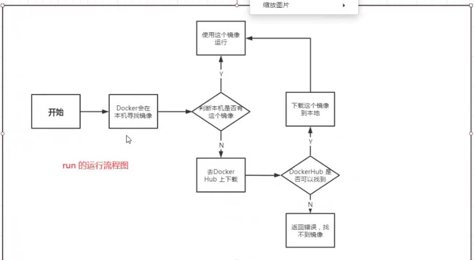
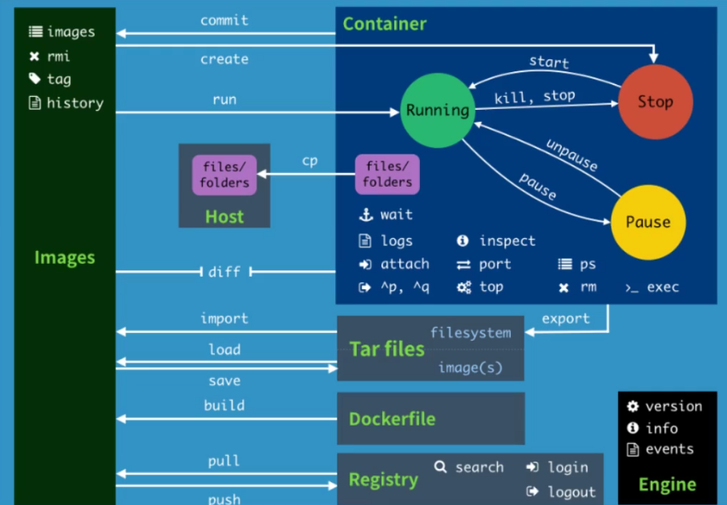
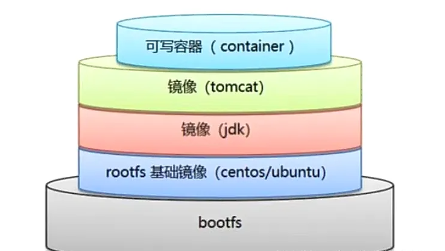
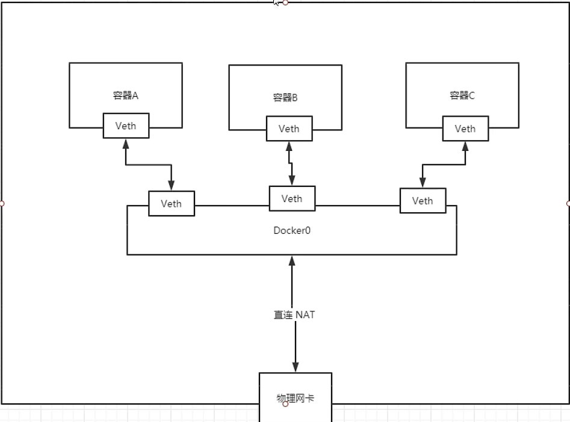
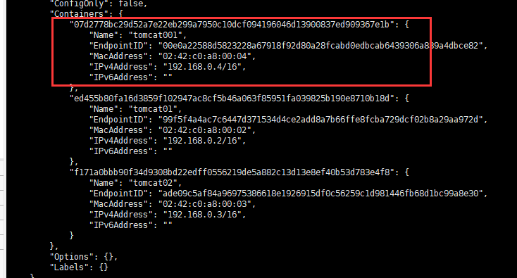

Docker

> Docker 是一个开源的应用容器引擎。可以实现虚拟化。容器是完全使用沙箱机制，相互之间不会有人和接口

[Docker 官网](https://www.docker.com/) [Docker文档](https://docs.docker.com/)

**镜像（image）：**

Docker镜像可以想象为一个模板，可以通过这个模板来创建容器服务。例如tomcat镜像==》run==》tomcat01容器（提供服务器），通过这个镜像可以创建多个容器（最终服务运行或者项目运行就是在容器中）

**容器（container）：**

Docker 利用容器技术，独立运行一个或者一个组应用，通过镜像来创建的

启动，停止，删除等基本命令

**仓库（repository）：**

仓库就是存放镜像的地方

## 安装docker(linux)

> centos7

[Install Docker Engine on CentOS | Docker Documentation](https://docs.docker.com/engine/install/centos/)

1. 卸载旧的版本

~~~shell
yum remove docker \
            docker-client \
            docker-client-latest \
            docker-common \
            docker-latest \
            docker-latest-logrotate \
            docker-logrotate \
            docker-engine
~~~

2. 设置存储仓库

~~~shell
# 需要的安装包
yum install -y yum-utils
# 设置镜像的仓库 官方默认的是国外的，此处换成阿里云的
yum-config-manager \
    --add-repo \
    http://mirrors.aliyun.com/docker-ce/linux/centos/docker-ce.repo
~~~

3.  安装 docker 引擎

~~~shell
# docker-ce 社区版本
yum install docker-ce docker-ce-cli containerd.io
~~~

4. 启动docker

~~~shell
systemctl start docker
~~~

5. 查看

~~~shell
docker version
~~~

6. 测试 hello-word

~~~shell
docker run hello-world
# Hello from Docker!	出现这个说明 ok 了
~~~

7. 查看下载的镜像

~~~shell
docker images
~~~

8. 卸载docker

~~~shell
# 卸载依赖
yum remove docker-ce docker-ce-cli containerd.io
# 删除资源
rm -rf /var/lib/docker
rm -rf /var/lib/containerd
~~~

#### 配置阿里云镜像加速

在阿里云控制台找到容器镜像服务，运行以下四个命令

[容器镜像服务 (aliyun.com)](https://cr.console.aliyun.com/cn-shanghai/instances/mirrors)

~~~shell
sudo mkdir -p /etc/docker

sudo tee /etc/docker/daemon.json <<-'EOF'
{
  "registry-mirrors": ["https://lyxyoucz.mirror.aliyuncs.com"]
}
EOF

sudo systemctl daemon-reload

sudo systemctl restart docker
~~~

## Run流程和原理

~~~
[root@zyh ~]# docker run hello-world
Unable to find image 'hello-world:latest' locally
latest: Pulling from library/hello-world
2db29710123e: Pull complete 
Digest: sha256:bfea6278a0a267fad2634554f4f0c6f31981eea41c553fdf5a83e95a41d40c38
Status: Downloaded newer image for hello-world:latest

Hello from Docker!
This message shows that your installation appears to be working correctly.

To generate this message, Docker took the following steps:
 1. The Docker client contacted the Docker daemon.
 2. The Docker daemon pulled the "hello-world" image from the Docker Hub.
    (amd64)
 3. The Docker daemon created a new container from that image which runs the
    executable that produces the output you are currently reading.
 4. The Docker daemon streamed that output to the Docker client, which sent it
    to your terminal.

To try something more ambitious, you can run an Ubuntu container with:
 $ docker run -it ubuntu bash

Share images, automate workflows, and more with a free Docker ID:
 https://hub.docker.com/

For more examples and ideas, visit:
 https://docs.docker.com/get-started/
~~~



**底层原理**

Docker 是一个Client-Server结构的系统，Docker的守护进程运行在主机上。通过Socket从客户端访问

DockerServer接收到Docker-Client的指令，就会执行这个命令

**Docker为什么比VM快**

1. Docker有更少的抽象层
2. Docker 利用的是宿主机的内核，vm 是加载了一个Guest OS 

所以，新建一个容器的时候，docker不需要像虚拟机一样加载一个操作系统内核

## 基本命令

~~~shell
docker version		# 显示docker的版本信息
docker info			# 显示docker的系统信息，包括镜像和容器的数量
docker 命令 --help   # 帮助命令
~~~

[Docker run reference | Docker Documentation](https://docs.docker.com/engine/reference/run/)

#### 镜像命令

**docker images**  查看本地的主机上的镜像

~~~shell
[root@zyh ~]# docker images
REPOSITORY    TAG       IMAGE ID       CREATED        SIZE
hello-world   latest    feb5d9fea6a5   6 months ago   13.3kB
# 解释
REPOSITORY	镜像的仓库员
TAG			镜像的标签
TMAGE ID 	镜像的id
CREATED		镜像的创建时间
SIZE		镜像的大小
# 可选项
-a			# 列出所有镜像
-q			# 只显示镜像的id
~~~

**docker search**	搜索镜像

~~~shell
docker search mysql
# 可选项，通过收藏来过滤
-f =STARS=3000	# 搜索出来的镜像就是STARS大于3000的
[root@zyh ~]# docker search mysql -f stars=3000
NAME      DESCRIPTION                                     STARS     OFFICIAL   AUTOMATED
mysql     MySQL is a widely used, open-source relation…   12380     [OK]       
mariadb   MariaDB Server is a high performing open sou…   4764      [OK] 
~~~

**docker pull**		下载镜像

~~~shell
# 下载镜像 		docker pull 镜像名[:tag]
# 指定版本下载   docker pull 镜像名:xx
[root@zyh ~]# docker pull mysql
Using default tag: latest			# 如果不指定tag，默认下载latest
latest: Pulling from library/mysql	
72a69066d2fe: Pull complete 		# 分层下载，docker image的核心
93619dbc5b36: Pull complete 
99da31dd6142: Pull complete 
626033c43d70: Pull complete 
37d5d7efb64e: Pull complete 
ac563158d721: Pull complete 
d2ba16033dad: Pull complete 
688ba7d5c01a: Pull complete 
00e060b6d11d: Pull complete 
1c04857f594f: Pull complete 
4d7cfa90e6ea: Pull complete 
e0431212d27d: Pull complete 
Digest: sha256:e9027fe4d91c0153429607251656806cc784e914937271037f7738bd5b8e7709	# 签名
Status: Downloaded newer image for mysql:latest
docker.io/library/mysql:latest		# 真实地址

# 等价于它
docker pull mysql 
docker pull docker.io/library/mysql:latest
~~~

**docker rmi**		删除镜像

~~~shell
docker rmi -f 镜像id					 # 删除指定的镜像
docker rmi -f 镜像id 镜像id				# 删除多个镜像(空格分开)
docker rmi -f $(docker images -aq)     # 删除全部的镜像
~~~

**docker history**     查看镜像构建的过程

~~~shell
docker history 镜像id
~~~

#### 容器命令

> 有了镜像才可以创建容器

**docker run**		新建容器并启动

~~~shell
docker run [可选参数] 镜像名
# 参数说明
--name="Name"	容器名字，用来区分容器
-d				后台方式运行
-it				使用交互方式运行，进入容器查看内容
-p				指定容器的端口
	-p ip:主机端口:容器端口
	-p 主机端口:容器端口(常用)
	-p 容器端口
-P				随机指定端口(大写)
-v				挂载
~~~

**docker ps**		列出所有运行的容器

~~~shell
docker ps [可选参数]
# 参数说明
说明都不加		# 列出当前正在运行的容器
-a 			   # 列出当前正在运行的容器+历史运行过的容器
-n=?		   # 显示最近创建的 ？个 容器
-q 			   # 只显示容器的编号
~~~

**退出容器**

~~~shell
exit 		# 直接容器停止并退出
ctrl+p+q 	# 容器不停止退出
~~~

 **docker rm** 	删除容器

~~~shell
docker rm 容器id				# 删除指定容器
docker rm 					 # 删除多个容器(空格分开)
docker rm -f $(docker ps -aq)   # 删除全部容器
# 不能删除正在运行的容器，如要要删除，需要强制删除	rm -f
~~~

**启动和停止容器**

~~~shell
docker start 容器id		# 启动容器
docker restart 容器id		# 重启容器
docker stop 容器id		# 停止当前正在运行的容器
docker kill 容器id		# 强制停止当前容器
~~~

#### 其他常用命令

**后台启动容器**

~~~shell
# 命令 docker run -d 镜像名
docker run -d centos

# 问题：通过docker ps 发现没有正在运行的容器
docker 容器使用后台运行，就必须要有一个前台进程，docker发现没有应用，就会自动停止
~~~

**docker logs** 		查看日志

~~~shell
docker logs [可选参数] 容器id
# 参数属性
-tf					# 显示日志
--tail number		# 要显示的条数
~~~

**docker top**			查看容器中进程信息

~~~shell
docker top 容器id
~~~

**docker inspect** 		查看镜像的元数据

~~~java
docker inspect 容器id
~~~

**docker exec -it**		 进入当前运行的容器

**docker attach**

~~~shell
# 进入容器后打开一个新的终端，可以在里面进行操作(常用)
docker exec -it 容器id /bash/bin
# 进入容器正在执行的终端，不会启动新的进程
docker attach 容器id
~~~

**docker stats**	查看容器运行状态，消耗的资源

~~~shell
docker stats [容器id]
~~~

**docker network**    查看网卡

~~~shell
docker network ls   		# 查看所有网卡
docker network rm name 		# 移除网卡
~~~

**docker cp**	  从容器内拷贝文件到主机上

~~~shell
docker cp 容器id:容器内路径 目的地主机路径

[root@zyh home]# docker run -it centos 
[root@86bfeca8e2d6 /]# ls
bin  dev  etc  home  lib  lib64  lost+found  media  mnt  opt  proc  root  run  sbin  srv  sys  tmp  usr  var
[root@86bfeca8e2d6 /]# cd /home/
[root@86bfeca8e2d6 home]# touch zyh.txt
[root@86bfeca8e2d6 home]# ls
zyh.txt
[root@86bfeca8e2d6 home]# exit
exit
[root@zyh home]# docker cp 86bfeca8e2d6:/home/zyh.txt /home
[root@zyh home]# ls
zyh.txt
~~~

#### 小结



~~~shell
attach      Attach local standard input, output, and error streams to a running container
#当前shell下 attach连接指定运行的镜像
build       Build an image from a Dockerfile # 通过Dockerfile定制镜像
commit      Create a new image from a container's changes #提交当前容器为新的镜像
cp          Copy files/folders between a container and the local filesystem #拷贝文件
create      Create a new container #创建一个新的容器
diff        Inspect changes to files or directories on a container's filesystem #查看docker容器的变化
events      Get real time events from the server # 从服务获取容器实时时间
exec        Run a command in a running container # 在运行中的容器上运行命令
export      Export a container's filesystem as a tar archive #导出容器文件系统作为一个tar归档文件[对应import]
history     Show the history of an image # 展示一个镜像形成历史
images      List images #列出系统当前的镜像
import      Import the contents from a tarball to create a filesystem image #从tar包中导入内容创建一个文件系统镜像
info        Display system-wide information # 显示全系统信息
inspect     Return low-level information on Docker objects #查看容器详细信息
kill        Kill one or more running containers # kill指定docker容器
load        Load an image from a tar archive or STDIN #从一个tar包或标准输入中加载一个镜像[对应save]
login       Log in to a Docker registry # 注册或者登录一个 docker源服务器
logout      Log out from a Docker registry # 从当前docker registry退出
logs        Fetch the logs of a container # 输出当前容器日志信息
pause       Pause all processes within one or more containers # 暂停容器
port        Lookup the public-facing port which is NAT-ed to PRIVATE_PORT # 查看映射端口对应的容器内部源端
ps          List containers	# 列出容器列表
pull        Pull an image or a repository from a registry # 从docker镜像源服务器拉取指定镜像或者库镜像
push        Push an image or a repository to a registry # 推送指定镜像或者库惊醒至docker源服务器
rename      Rename a container
restart     Restart one or more containers	# 重启运行的容器
rm          Remove one or more containers	# 移除一个或多个容器
rmi         Remove one or more images		# 一出一个或者多个镜像(只有该镜像没有被容器使用才可以删除，或者 -f 强制删除)
run         Run a command in a new container # 创建并运行一个新容器
save        Save one or more images to a tar archive (streamed to STDOUT by default) # 保存一个镜像为一个 tar 包
search      Search the Docker Hub for images # 在docker hub 中搜索镜像
start       Start one or more stopped containers # 启动容器
stop        Stop one or more running containers # 停止容器
tag         Create a tag TARGET_IMAGE that refers to SOURCE_IMAGE  # 給源中镜像打标签
top         Display the running processes of a container # 查看容器中运行的进程信息
unpause     Unpause all processes within one or more containers # 取消暂停容器
version     Show the Docker version information # 查看 docker 版本号
wait        Block until one or more containers stop, then print their exit codes # 截取容器停止时的退出状态值
~~~

## 小练习

#### 部署nginx

1. 下载镜像

~~~shell
[root@zyh home]# docker pull nginx
~~~

2. 启动容器

~~~shell
[root@zyh home]# docker run -d --name nginx01 -p 3344:80 nginx

# -d 后台运行
# --name 起个名字
# -p 宿主机端口:容器端口
~~~

3. 进入容器

~~~shell
[root@zyh home]# docker exec -it nginx01 /bin/bash
~~~

#### 部署tomcat

~~~shell
# 官方	docker run -it --rm 一般用来测试，用完就自动删除了
docker run -it --rm tomcat:9.0
~~~

1. 下载镜像

~~~shell
[root@zyh home]# docker pull tomcat:9.0
~~~

2. 启动容器

~~~shell
[root@zyh home]# docker run -d -p 3344:8080 --name tomcat01 tomcat:9.0
~~~

3. 进入容器

~~~shell
[root@zyh home]# docker exec -it  tomcat01 /bin/bash
# 进入后发现问题：1. linux命令少了 2.webapps目录下没有文件
# 这是镜像的原因。默认是最小的镜像，所有不必要的都剔除掉了
~~~

~~~shell
# 但是在tomcat目录下的webapps.dist 中放着，将文件拷过去就可以了
root@584cc0bf32bc://usr/local/tomcat# cp -r webapps.dist/* webapps/
~~~

#### 可视化

- portainer（先用这个）
- Rancher（CI/CD再用）

**portainer**

> Docker图形化界面管理工具，提供一个后台面板给我们操作

```shell
docker run -d -p 8088:9000 --name portainer --restart always -v /var/run/docker.sock:/var/run/docker.sock -v portainer_data:/data portainer/portainer
```

访问测试：外网:8088

## Docker镜像讲解

> 镜像是一种轻量级、可执行的独立软件包，用来打包软件运行环境和基于运行环境开发的软件，它包含运行某个软件所需的所有内容，包括代码、运行时、库、环境变量和配置文件。

#### Docker镜像加载原理

**UnionFS（联合文件系统**）

UnionFS(联合文件系统）:Union文件系统(UnionFS )是一种分层、轻量级并且高性能的文件系统，它支持对文件系统的修改作为一次提交来一层层的叠加，同时可以将不同目录挂载到同一个虚拟文件系统下(unite several directories into a single virtual filesystem)。Union文件系统是Docker镜像的基础。镜像可以通过分层来进行继承，基于基础镜像（没有父镜像），可以制作各种具体的应用镜像。

特性：一次同时加载多个文件系统，但从外面看起来，只能看到一个文件系统，联合加载会把各层文件系统叠加起来，这样最终的文件系统会包含所有底层的文件和目录

**Docker镜像加载原理**

docker的镜像实际上由一层一层的文件系统组成，这种层级的文件系统UnionFS。

bootfs(boot file system)主要包含bootloader和kernel, bootloader主要是引导加载kernel, Linux刚启动时会加载bootfs文件系统，在Docker镜像的最底层是bootfs。这一层与我们典型的Linux/Unix系统是一样的，包含boot加载器和内核。当boot加载完成之后整个内核就都在内存中了，此时内存的使用权已由bootfs转交给内核，此时系统也会卸载bootfs。

rootfs (root file system)，在bootfs之上。包含的就是典型Linux系统中的/dev, /proc, /bin,/letc等标准目录和文件。rootfs就是各种不同的操作系统发行版，比如Ubuntu , Centos等等。

> 平时安装进虚拟机的CentOS 都是好几个G，而Docker才200M？

因为对一个精简的OS，rootfs可以很小，只需要包含最基本的命令、工具和程序库就可以，底层都直接用Host的kernel，自己只需要提供rootfs就可以。

#### 分层

当我们去下载一个镜像的时候，下载的日志输出，是一层一层的在下载

这种分层下载最大的好处就是**资源共享**！比如有多个镜像都是从相同的Base镜像构建而来，那么宿主机只要在磁盘是那个保留一份base镜像，同时内存中也只需要加载一份base惊醒，就可以为所有的容器服务了，而且镜像的每一层都可以被共享

查看镜像分层的方式可以通过 `docker image inspect` 命令

~~~shell
[root@zyh home]# docker image inspect nginx
// ......
"RootFS": {
    "Type": "layers",
    "Layers": [
        "sha256:2edcec3590a4ec7f40cf0743c15d78fb39d8326bc029073b41ef9727da6c851f",
        "sha256:e379e8aedd4d72bb4c529a4ca07a4e4d230b5a1d3f7a61bc80179e8f02421ad8",
        "sha256:b8d6e692a25e11b0d32c5c3dd544b71b1085ddc1fddad08e68cbd7fda7f70221",
        "sha256:f1db227348d0a5e0b99b15a096d930d1a69db7474a1847acbc31f05e4ef8df8c",
        "sha256:32ce5f6a5106cc637d09a98289782edf47c32cb082dc475dd47cbf19a4f866da",
        "sha256:d874fd2bc83bb3322b566df739681fbd2248c58d3369cb25908d68e7ed6040a6"
    ]
},
// ......
~~~

**理解：**

所有的Docker镜像都起始于一个基础镜像层，当进行修改或增加新的内容时，就会在当前镜像层之上，创建新的镜像层。

这种情况下，上层镜像层中的文件覆盖了底层镜像层中的文件。这样就使得文件的更新版本作为一个新镜像层添加到镜像当中。

Docker通过存储引擎（新版本采用快照机制）的方式来实现镜像层堆栈，并保证多镜像层对外展示为统一的文件系统。

**特点：**

Docker镜像都是**只读**的，当容器启动时，一个新的可写层被加载到镜像的顶部！

这一层就是我们通常说的容器层，容器之下都叫镜像层！

#### commit镜像

**docker commit** 	提交镜像

~~~shell
# 命令和git原理类似
docker commit -m="提交的信息" -a="作者" 容器id 目标镜像名:[TAG]
~~~

以一个tomcat举例

~~~shell
# 1. 启动一个默认的tomcat
docker run -d -p 3344:8080 --name tomcat01 tomcat:9.0
# 2. 发现这个默认的tomcat的webapps目录下没有文件

# 3. 拷贝了点进去

# 4. 将操作过的容器通过commit提交为一个镜像
docker commit -m="测试一下commit提交tomcat" -a="测试人" 584cc0bf32bc mytomcat:0.0.1
~~~

## 容器数据卷

> 如果数据在容器中，那么删除容器，数据也会丢失！
>
> 容器数据卷就是将Docker容器中产生的数据同步到本地
>
> 这就是卷技术。目录的挂载，将容器内的目录，挂载到Linux上

**总结一句话：容器的持久化和同步操作！容器间也可以数据共享**

#### 使用数据卷

使用数据卷方式一： -v

~~~shell
docker run -v 宿主机目录:容器内目录
# 测试
[root@zyh ceshi]# docker run -it -v /home/ceshi:/home centos /bin/bash
# 启动起来后通过docker inspect 容器id 来查看挂载情况

// ......
"Mounts": [
            {
                "Type": "bind",
                "Source": "/home/ceshi",
                "Destination": "/home",
				// ......
// ......
~~~

#### MySql同步数据

1. 下载镜像
2. 运行容器

~~~shell
# 安装启动mysql需要配置密码！
-e 环境配置
[root@zyh ceshi]# docker run -d -p 3344:3306 -v /home/ceshi/mysql/conf:/etc/mysql/conf.d -v /home/ceshi/mysql/data:/var/lib/mysql -e MYSQL_ROOT_PASSWORD=123456 --name mysql01 mysql
~~~

#### 具名匿名挂载

**docker volume** 查看卷

**匿名挂载**

~~~shell
-v 容器内的路径
docker run -d -P --name nginx01 -v /etc/nginx nginx

# 查看所有volume的情况
[root@zyh mysql]# docker volume ls
DRIVER    VOLUME NAME
local     1c3db708e507dd1decda14062948b7ec433f80420818f61b25cbcf3f0d00a694
~~~

**具名挂载**

~~~shell
docker run -d -P --name nginx02 -v juming:/etc/nginx nginx

# 查看所有volume的情况
[root@zyh mysql]# docker volume ls
DRIVER    VOLUME NAME
local     juming
~~~

**查看一下这个卷**

~~~shell
docker volume inspect 卷名	# 匿名的就不能这么查看只能通过docker inspect
~~~

所有的docker容器的卷如果没有指定目录的情况下都在`/var/lib/docker/volumes/` 目录下

>  大多数情况下都使用具名挂载，因为方便找到一个卷

~~~shell
# 如何确定具名还是匿名又或者是指定路径挂载
-v 容器内路径            	# 匿名挂载
-v 卷名:容器内路径            # 具名挂载
-v /宿主机路径:容器内路径 	 # 指定路径挂载
~~~

**拓展：**

~~~shell
# 通过 -v 容器内路径：ro rw 改变读写权限 	默认为 rw
ro readonly         # 只读
rw readwrite    	# 可读可写

# 一旦设置了这个容器权限，容器对我们挂载出来的内容就有限定了
docker run -d -P --name nginx02 -v juming-nginx:/etc/nginx:ro nginx
 
docker run -d -P --name nginx02 -v juming-nginx:/etc/nginx:rw nginx
# ro 只要看到ro就说明这个路径只能通过宿主机来改变，容器内部是无法操作的
~~~

#### 初始Dockerfile

> Dockerfile 就是用来构建 docker 镜像的构建文件，是一个命令脚本

可以通过这个脚本来生成镜像，镜像是一层一层的，脚本一个个的命令，每个命令就是一层

使用数据卷方式二： VOLUME ["volume01","volume02"] （但是是匿名的）

~~~shell
# 创建一个dockerfile文件，名字可以任意，但建议 dockerfile
# 文件中的内容 指令(要大写) 参数
[root@zyh docker-test]# cat dockerfile1 
FROM centos

VOLUME ["volume01","volume02"]

CMD echo "------end--------"

CMD /bin/bash
~~~

~~~shell
# 构建镜像	docker build -f 构建文件 -t 要构建的镜像名[:TAG] . "."别忘了
docker build -f ./dockerfile1 -t zzz:0.1 .
~~~

#### 数据卷容器

~~~shell
# 启动自己的写的镜像时候，要么直接使用镜像id，要么使用名字带上TAG，不然它会去hub找最新版
# --volumes-from 数据卷容器
docker run -it --name docker01 zzz:0.1

docker run -it --name docker02 --volumes-from docker01 zzz:0.1
~~~

**多个mysql同步数据**

> 这里，虽然两个mysql共用一个数据，但是同时在线只能在线一个mysql容器，另一个连接不上

~~~shell
# 第一个mysql
docker run -d -p 3344:3306 -v /home/ceshi/mysql/conf:/etc/mysql/conf.d -v /home/ceshi/mysql/data:/var/lib/mysql -e MYSQL_ROOT_PASSWORD=123456 --name mysql01 mysql
~~~

~~~shell
# 第二个mysql
docker run -d -p 3344:3306 -e MYSQL_ROOT_PASSWORD=123456 --name mysql02 --volumes-from mysql01 mysql
~~~

**容器数据卷结论**

容器之间配置信息的传递，数据卷容器的生命周期一直持续到没有容器使用为止。

但是一旦持久化到了本地，这个时候本地的数据是不会删除的。

## DockerFile

> dockerfile是用来构建doker镜像的文件 是一个命令参数的脚本

构建步骤：

1. 编写一个 dockerfile 文件
2. docker build 构建成为一个镜像
3. docker run 运行镜像
4. docker push 发布镜像（DockerHub、阿里云镜像仓库）

#### 构建过程

基础知识：

1. 每个保留关键字（指令） 都是必须是大写字母
2. 执行从上到下顺序执行
3. #表示注释
4. 每一个指令都会创建提交一个新的镜像层，并提交



dockerfile 是面向发开的，要发布项目，作镜像就要编写dockerfile文件

Docker镜像逐渐成为了企业交付的标准

DockerFile：构建文件，定义了一切的步骤，源代码

DockerImages：通过dockerFile构建生成的镜像，最终要发布和运行的产品。

Docker容器：容器就是镜像运行起来提供服务的

#### DockerFile的指令

~~~shell
FROM           	 # 基础镜像，一切从这里开始构建
MAINTAINER       # 镜像是谁写的，姓名+邮箱
RUN              # docker镜像构建的时候需要运行的命令
ADD              # 步骤：tomcat镜像，这个tomcat压缩包就是添加内容
WORKDIR          # 镜像的工作目录
VOLUME           # 挂载的目录
EXPOSE           # 暴露端口配置 -p是一样的
CMD              # 指定这个容器启动的时候要运行的命令，只有最后一个会生效，可被替代
ENTRYPOINT       # 指定这个容器启动的时候要运行的命令，可以追加命令
ONBUILD          # 当构建一个被继承DockerFile 这个时候就会运行ONBUILD 的指令。触发指令
COPY             # 类似ADD，将我们的文件拷贝到镜像中
ENV              # 构建的时候设置环境变量
~~~

#### 构建自己的centos

Docker Hub  中99%的镜像都是从基础镜像`FROM scratch` 开始构建

1. 编写dockerfile文件

~~~shell
[root@zyh dockerfile]# cat mydockerfile 
FROM centos
MAINTAINER zyh<123123@qq.com>

ENV MYPATH /usr/local
WORKDIR $MYPATH

RUN yum -y install vim
RUN yum -y install net-tools

EXPOSE 80

CMD echo $MYPATH
CMD echo "-----------end-------------"
CMD /bin/bash
~~~

这么做可能会报 yum 的错误，这是因为默认会去找centos8版本，要换成7版本

~~~shell
# FROM 改一下就可以
FROM centos:7
~~~

2. 构建镜像

~~~shell
# 命令 docker build -f dockerfile文件路径 -t 镜像名[:TAG] . "." 不要忘记
docker build -f mydockerfile -t mycentos:0.1 .

Successfully built e1a9fa1b7b9a
Successfully tagged mycentos:0.1
~~~

**docker history**  查看镜像构建的过程

~~~shell
docker history 镜像id
~~~

**CMD 和 ENTRYPOINT 区别**

~~~shell
CMD             # 指定这个容器启动的时候要运行的命令，只有最后一个会生效，可被替代
ENTRYPOINT      # 指定这个容器启动的时候要运行的命令，可以追加命令
~~~

**CMD 测试**

>  cmd的情况下， -l 会替换了CMD["ls","-a"]命令 -l 不是一个命令所以报错

~~~shell
# 编写 dockerfile 文件
[root@zyh dockerfile]# vim dockerfile-cmd-test
FROM centos
CMD ["ls","-a"]
# 构建镜像
[root@zyh dockerfile]# docker build -f dockerfile-cmd-test -t cmdtest:0.1 .
# run运行
[root@zyh dockerfile]# docker run cmdtest
.
..
.dockerenv
bin
dev
// ....还有很多
# 想在追加一个命令
[root@zyh dockerfile]# docker run cmdtest -l	# 会报错
# cmd的情况下， -l 会替换了CMD["ls","-a"]命令 -l 不是一个命令所以报错
~~~

**ENTRYPOINT 测试**

>  ENTRYPOINT的情况下， -l 会拼接

~~~shell
# 编写 dockerfile 文件
[root@zyh dockerfile]# vim docker-entrypoint-test
FROM centos
ENTRYPOINT ["ls","-a"]
# 构建镜像
[root@zyh dockerfile]# docker build -f docker-entrypoint-test -t entrytest:0.1 .
# run运行
[root@zyh dockerfile]# docker run entrytest
.
..
.dockerenv
bin
dev
// ....还有很多
# 想在追加一个命令
[root@zyh dockerfile]# docker run entrytest -l
# ENTRYPOINT的情况下， -l 会拼接
~~~

#### 构建tomcat

1. 准备镜像文件：tomcat压缩包以及jdk压缩包
2. 编写dockerfile 文件，官方命名`Dockfile` ,build就会自动寻找这个文件，不需要在 -f 制定了

~~~shell
FROM centos:7
MAINTAINER zhangtest<123123@qq.com>

ADD jdk-8u321-linux-x64.tar.gz /usr/local
ADD apache-tomcat-9.0.58.tar.gz /usr/local

RUN yum -y install vim

ENV MYPATH /usr/local
WORKDIR $MYPATH

ENV JAVA_HOME /usr/local/jdk1.8.0_321
ENV CLASSPATH $JAVA_HOME/lib/dt.jar:$JAVA_HOME/lib/tools.jar
ENV CATALINA_HOME /usr/local/apache-tomcat-9.0.58
ENV CATALINE_BASH /usr/local/apache-tomcat-9.0.58
ENV PATH $PATH:$JAVA_HOME/bin:$CATALINE_HOME/lib:$CATALINE_HOME/bin

EXPOSE 8080

CMD /usr/local/apache-tomcat-9.0.58/bin/startup.sh && tail -F /url/local/apache-tomcat-9.0.58/bin/logs/catalina.out
~~~

3. 构建镜像

~~~shell
[root@zyh tomcat]# docker build -t diytomcat .
~~~

4.  启动镜像

~~~shell
[root@zyh tomcat]# docker run -d -p 3344:8080 --name tomcattest -v /home/zyh/tomcat/test:/usr/local/apache-tomcat-9.0.58/webapps/test -v /home/zyh/tomcat/tomcatlogs/:/usr/local/apache-tomcat-9.0.58/logs diytomcat
~~~

5. 访问测试

~~~shell
[root@zyh tomcat]# curl localhost:3344
~~~

6. 发布项目（做了卷挂载，直接在本地发布就可以） 

    在映射的test目录下新建`WEB-INF` ,进入`WEB-INF` 新建`web.xml`

~~~xml
<web-app xmlns="http://xmlns.jcp.org/xml/ns/javaee"
         xmlns:xsi="http://www.w3.org/2001/XMLSchema-instance"
         xsi:schemaLocation="http://xmlns.jcp.org/xml/ns/javaee
                      http://xmlns.jcp.org/xml/ns/javaee/web-app_4_0.xsd"
         version="4.0"
         metadata-complete="true">
</web-app>
~~~

回到test目录下，新建`index.jsp`

~~~jsp
<%@ page language="java" contentType="text/html; charset=UTF-8"
    pageEncoding="UTF-8"%>
<!DOCTYPE html>
<html>
<head>
<meta charset="utf-8">
<title>HELLO WORLD</title>
</head>
<body>
Hello World!<br/>
<%
System.out.println("---test----");
%>
</body>
</html>
~~~

部署成功！

#### 发布镜像

**发布到DockerHub**

1. 登录账号

~~~shell
[root@zyh test]# docker login
Login with your Docker ID to push and pull images from Docker Hub. If you don't have a Docker ID, head over to https://hub.docker.com to create one.
Username: han35
Password: 

Login Succeeded
~~~

2. 推送

~~~shell
[root@zyh ~]# docker push diytomcat
Using default tag: latest
The push refers to repository [docker.io/library/diytomcat]
34ec07d55b5a: Preparing 
4962e28cc63f: Preparing 
d534a8a995da: Preparing 
174f56854903: Preparing 
denied: requested access to the resource is denied
# 直接带镜像名字会被拒绝
~~~

~~~shell
# 先创建一个带用户名带版本的再提交才可以
docker tag diytomcat dockerhub的用户名/diytomcat:1.0
[root@zyh ~]# docker push dockerhub的用户名/diytomcat:1.0
~~~

提交的时候也是一层一层的提交的

**发布到阿里云**

1. 登录阿里云，找到容器镜像服务
2. 在实例列表创建个人实例
3. 创建命名空间
4. 剩下的看官方地址吧

## 网络

输入 `ip add` 查看网卡情况，可以查看到三个

> docke 是如何处理容器网络访问的？

~~~shell
docker run -d -p 3344:8080 --name tomcat01 tomcat
# 如果ip addr 报错，就进入容器内输入  apt update && apt install -y iproute2
# 查看容器内部网络地址 ip addr 可以发现容器得到一个 eth0@if95 的ip地址
[root@zyh ~]# docker exec -it tomcat01 ip addr
1: lo: <LOOPBACK,UP,LOWER_UP> mtu 65536 qdisc noqueue state UNKNOWN group default qlen 1000
    link/loopback 00:00:00:00:00:00 brd 00:00:00:00:00:00
    inet 127.0.0.1/8 scope host lo
       valid_lft forever preferred_lft forever
94: eth0@if95: <BROADCAST,MULTICAST,UP,LOWER_UP> mtu 1500 qdisc noqueue state UP group default 
    link/ether 02:42:ac:11:00:02 brd ff:ff:ff:ff:ff:ff link-netnsid 0
    inet 172.17.0.2/16 brd 172.17.255.255 scope global eth0
       valid_lft forever preferred_lft forever
       
# 用本机尝试ping容器内部
[root@zyh ~]# ping 172.17.0.2
PING 172.17.0.2 (172.17.0.2) 56(84) bytes of data.
64 bytes from 172.17.0.2: icmp_seq=1 ttl=64 time=0.063 ms
64 bytes from 172.17.0.2: icmp_seq=2 ttl=64 time=0.104 ms
~~~

**原理：**

1. 我们每启动一个docker容器，docker就会给docker容器分配一个ip，我们只要安装了docker，就会有一个网卡docker0

桥接模式，使用的技术是 evth-pair 技术

2. 在启动一个容器测试，发现又多了一对网卡

~~~shell
# 发现这个容器带的网卡是一对对的
# wvth-pair 就是一对的虚拟设备接口，它们是成对出现的，一端连着协议，一端彼此相连
# 因为这个特性，evth-pair 充当了一个桥梁，连接各种虚拟网络设备
~~~

3. 测试两个容器是否可以ping通

~~~shell
# 如果 ping 报错，就进入容器内输入  apt update && apt install iputils-ping
[root@zyh ~]# docker exec -it tomcat01 ping 172.17.0.3
PING 172.17.0.3 (172.17.0.3) 56(84) bytes of data.
64 bytes from 172.17.0.3: icmp_seq=1 ttl=64 time=0.116 ms
64 bytes from 172.17.0.3: icmp_seq=2 ttl=64 time=0.109 ms
~~~

**结论：**tomcat01 和 tomcat02 是共用的一个路由器 docker0

所有的容器不指定网络的情况下，都是docker0 路由的，docker会给容器分配一个默认的可用ip

Docker使用的是linux的桥接，宿主机中是一个Docker容器的网桥 docker0



Docker 中的所有的网络接口都是虚拟的，虚拟的转发效率高！

#### --link

> 不通过ip，通过服务名进行ping通

~~~shell
[root@zyh ~]# docker exec -it tomcat01 ping tomcat02
ping: tomcat02: Name or service not known

# 如何解决？ 使用--link
[root@zyh ~]# docker run -d -P --name tomcat03 --link tomcat02 tomcat
[root@zyh ~]# docker exec -it tomcat03 ping tomcat02
PING tomcat02 (172.17.0.3) 56(84) bytes of data.
64 bytes from tomcat02 (172.17.0.3): icmp_seq=1 ttl=64 time=0.107 ms
64 bytes from tomcat02 (172.17.0.3): icmp_seq=2 ttl=64 time=0.103 ms
# 能不能反向ping通？
[root@zyh ~]# docker exec -it tomcat02 ping tomcat03
ping: tomcat03: Name or service not known
~~~

~~~shell
# 不能用ping的话 进入容器 apt update && apt install iputils-ping
~~~

进入tomcat03 的 `/ect/hosts` 查看本质

~~~shell
[root@zyh ~]# docker exec -it tomcat03 cat /etc/hosts
127.0.0.1	localhost
::1	localhost ip6-localhost ip6-loopback
fe00::0	ip6-localnet
ff00::0	ip6-mcastprefix
ff02::1	ip6-allnodes
ff02::2	ip6-allrouters
172.17.0.3	tomcat02 e4c95971b62d
172.17.0.4	f56a50006bc8
~~~

本质探究： --link 就是在hosts配置中添加了一个 172.17.0.3	tomcat02 e4c95971b62d

现在使用Docker 已经不建议使用 --link 了！太笨了

使用 自定义网络而不使用dokcer0		

docker0的问题：不支持容器名链接网络

#### 自定义网络

~~~shell
# 查看所有docker 网络
[root@zyh ~]# docker network ls
NETWORK ID     NAME      DRIVER    SCOPE
3413bf3634d6   bridge    bridge    local
366d553b59ff   host      host      local
695c28a1f72a   none      null      local
~~~

**网络模式**

bright：桥接（默认，自定义网络也使用bridge模式）

none：不配置网络

host：和宿主机共享网络

container：容器网络联通（用得少，局限大）

~~~shell
# 直接启动的命令，--net bridge 是默认的，也就是docker0
docker run -d -P --name tomcat01 tomcat
docker run -d -P --name tomcat01 --net bridge tomcat

# docker0特点：默认、域名不能访问	--link 可以打通连接，但笨重
~~~

**自定义网络**

~~~shell
# --driver bridge
# --subnet 192.168.0.0/16
# --gateway 192.168.0.1
[root@zyh ~]# docker network create --driver bridge --subnet 192.168.0.0/16 --gateway 192.168.0.1 mynet
0b148ed9680b17df4bd36c771d23efad38cd9c60ab8f55bc2a510bd2c42e97fe
[root@zyh ~]# docker network ls
NETWORK ID     NAME      DRIVER    SCOPE
3413bf3634d6   bridge    bridge    local
366d553b59ff   host      host      local
0b148ed9680b   mynet     bridge    local
695c28a1f72a   none      null      local
~~~

**查看自己的网络**

~~~shell
[root@zyh ~]# docker network inspect mynet
[
    {
        "Name": "mynet",
        "Id": "0b148ed9680b17df4bd36c771d23efad38cd9c60ab8f55bc2a510bd2c42e97fe",
        "Created": "2022-04-12T14:46:56.292682251+08:00",
        "Scope": "local",
        "Driver": "bridge",
        "EnableIPv6": false,
        "IPAM": {
            "Driver": "default",
            "Options": {},
            "Config": [
                {
                    "Subnet": "192.168.0.0/16",
                    "Gateway": "192.168.0.1"
                }
            ]
        },
        "Internal": false,
        "Attachable": false,
        "Ingress": false,
        "ConfigFrom": {
            "Network": ""
        },
        "ConfigOnly": false,
        "Containers": {},
        "Options": {},
        "Labels": {}
    }
]
~~~

**测试**

~~~shell
# 创建两个容器
[root@zyh ~]# docker run -d -P --name tomcat01 --net mynet tomcat
ed455b80fa16d3859f102947ac8cf5b46a063f85951fa039825b190e8710b18d
[root@zyh ~]# docker run -d -P --name tomcat02 --net mynet tomcat
f171a0bbb90f34d9308bd22edff0556219de5a882c13d13e8ef40b53d783e4f8
# 可以不能用ping命令，进入容器 apt update && apt install iputils-ping
~~~

~~~shell
[root@zyh ~]# docker exec -it tomcat01 ping 192.168.0.3
PING 192.168.0.3 (192.168.0.3) 56(84) bytes of data.
64 bytes from 192.168.0.3: icmp_seq=1 ttl=64 time=0.114 ms
64 bytes from 192.168.0.3: icmp_seq=2 ttl=64 time=0.094 ms
[root@zyh ~]# docker exec -it tomcat01 ping tomcat02
PING tomcat02 (192.168.0.3) 56(84) bytes of data.
64 bytes from tomcat02.mynet (192.168.0.3): icmp_seq=1 ttl=64 time=0.084 ms
64 bytes from tomcat02.mynet (192.168.0.3): icmp_seq=2 ttl=64 time=0.105 ms
~~~

自定义的网络docker 都已经帮我们维护好了对应的关系，推荐平时这样使用网络！

好处： 不同的集群使用不同的网络，保证集群是安全的和健康的

#### 网络连通

~~~shell
# 在新建两个容器 使用自定义的 (网段在172.17.0.0/16)
[root@zyh ~]# docker run -d -P --name tomcat001 tomcat
07d2778bc29d52a7e22eb299a7950c10dcf094196046d13900837ed909367e1b
[root@zyh ~]# docker run -d -P --name tomcat002 tomcat
9fc21355e3bb44fc0cbd0d77a52093127f3c8b5d163cd199a039d45fa52ddad0
~~~

~~~shell
[root@zyh ~]# docker exec -it tomcat01 ping 172.17.0.2
PING 172.17.0.2 (172.17.0.2) 56(84) bytes of data.
^C
--- 172.17.0.2 ping statistics ---
95 packets transmitted, 0 received, 100% packet loss, time 94001ms
~~~

**docker network connect** 	 网络连通

~~~shell
docker network connect mynet tomcat001
# 使用docker network inspect mynet查看
# 连通之后就是将tomcat001 放到了mynet网络下
# 一个容器两个ip！
~~~



~~~shell
[root@zyh ~]# docker exec -it tomcat01 ping tomcat001
PING tomcat001 (192.168.0.4) 56(84) bytes of data.
64 bytes from tomcat001.mynet (192.168.0.4): icmp_seq=1 ttl=64 time=0.124 ms
64 bytes from tomcat001.mynet (192.168.0.4): icmp_seq=2 ttl=64 time=0.105 ms
~~~

**结论：** 如果要跨网络操作别人，就需要使用docker network connect 连通

## SpringBoot打包成Docker镜像

1. 构建springboot项目

2. 打包应用

3. 编写dockerfile

    >  idea需要下载Docker的插件

    ~~~shell
    # 文件名最好起 Dockerfile
    FROM java:8
    COPY *.jar /app.jar
    CMD ["--server.port=8080"]
    EXPOSE 8080
    ENTRYPOINT ["java","-jar","./app.jar"]
    ~~~

4. 构建镜像

    将打好的`jar包`和编写的`Dockerfile文件` 上传到同一目录下，进行构建镜像

    ~~~shell
    [root@zyh idea]# docker build -t zyhideatest .
    ~~~

5. 发布运行

    ~~~shell
    [root@zyh idea]# docker run -d -p 3344:8080 --name spring-test-01 zyhideatest
    ~~~

6. 测试

~~~shell
curl localhost:3344
~~~

