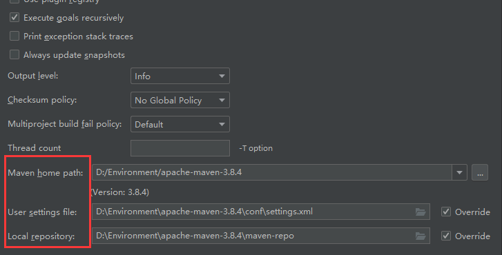

**项目架构管理工具**

> 方便导入jar包

## 下载安装

官网下载 [Maven – Download Apache Maven](https://maven.apache.org/download.cgi)下载 **bin** 

#### windows

​	解压就可以

## 环境变量

#### windows

- 新建一个 **`MAVEN_HOME`** 值写入maven的目录
- 最好新建一个**`M2_HOME`**值写入maven的目录\bin（防止后面有问题）
- 在path 中 配置**`%MAVEN_HOME%\bin`**

配置好后在cmd 输入**`mvn -version`**来检查有没有配置成功

**配置镜像**

- 修改配置镜像文件（加速下载jar包用），可以选择阿里云镜像
- 将找到的镜像url放在**`maven目录\conf\setting.xml`**

~~~xml
# 放在<mirror></mirror>标签中
<mirror>
      <id>nexus-aliyun</id>
      <mirrorOf>central</mirrorOf>
      <name>Nexus aliyun</name>
      <url>http://maven.aliyun.com/nexus/content/groups/public</url>
</mirror>
~~~

**配置仓库**

- 在maven 目录下新建一个文件夹**`maven-repo`**(啥名都行)
- 将路径 放在**`maven目录\conf\setting.xml`**

~~~bash
# 放在<localRepository></localRepository>标签中
<localRepository>D:\Environment\apache-maven-3.8.6\maven-repo</localRepository>
~~~

## idea中使用Maven

新建一个maven项目，记得配置好引用的设置，存储的仓库

**porm.xml**   --Maven的核心文件

~~~xml
<?xml version="1.0" encoding="UTF-8"?>

<!--Maven 版本和头文件-->
<project xmlns="http://maven.apache.org/POM/4.0.0" xmlns:xsi="http://www.w3.org/2001/XMLSchema-instance"
  xsi:schemaLocation="http://maven.apache.org/POM/4.0.0 http://maven.apache.org/xsd/maven-4.0.0.xsd">
  <modelVersion>4.0.0</modelVersion>

  <!--刚才配置的GAV-->
  <groupId>org.example</groupId>
  <artifactId>mavenTest</artifactId>
  <version>1.0-SNAPSHOT</version>
  <packaging>war</packaging>

  <name>mavenTest Maven Webapp</name>
  <!-- FIXME change it to the project's website -->
  <url>http://www.example.com</url>

  <!--配置-->
  <properties>
    <!--项目的默认构建编码-->
    <project.build.sourceEncoding>UTF-8</project.build.sourceEncoding>
    <!--编码的版本-->
    <maven.compiler.source>1.8</maven.compiler.source>
    <maven.compiler.target>1.8</maven.compiler.target>
  </properties>

  <!--项目依赖-->
  <dependencies>
    <!--具体依赖的jar包配置-->
    <dependency>
      <groupId>junit</groupId>
      <artifactId>junit</artifactId>
      <version>4.11</version>
    </dependency>
  </dependencies>
  <!--项目构建用的东西-->
  <build>
      <!--更改打的jar包名字为xxx-->
      <finalName>xxx</finalName>
  </build>
</project>
~~~

## Maven的常见命令

~~~java
clean			// 对项目清理，删除target目录下编译的内容
compile	     // 编译项目
test			// 对项目进行测试
package		// 打包文件并存放到项目的target目录下，打包好的文件通常是class文件
install			// 在本地仓库生成仓库的安装包，可供其他项目引用，同时打包后的文件放在项目的target目录下
~~~

## Maven 父子工程

~~~xml
<!--依赖中所有的jar包都会被子工程加载，无论使用与否，会造成空间过大，除非都需要-->
<dependencies>
    <!--具体依赖的jar包配置-->
    <dependency>
        <groupId>junit</groupId>
        <artifactId>junit</artifactId>
        <version>4.11</version>
    </dependency>
</dependencies>
~~~

~~~xml
<!--会管理依赖中的jar包，子工程需要会加载不需要不加载，父工程只管理不下载！！！-->
<dependencyManagement>
    <dependencies>
        <!--具体依赖的jar包配置-->
        <dependency>
            <groupId>junit</groupId>
            <artifactId>junit</artifactId>
            <version>4.11</version>
        </dependency>
    </dependencies>
</dependencyManagement>
~~~

## Maven jar包

更改jar包名称

~~~xml
<build>
    <!--更改打的jar包名字为xxx-->
    <finalName>xxx</finalName>
</build>
~~~

**将发过来的jar包手动配置到项目中**

~~~bash
mvn install:install-file -Dfile="jar包地址\xxx.jar" -DgroupId=com.zhang -DartifactId=test-jar -Dversion=1.0.1 -Dpackaging=jar
~~~

对应的引入：

~~~xml
<dependency>
    <groupId>com.zhang</groupId>
    <artifactId>test</artifactId>
    <version>1.0.1</version>
</dependency>
~~~

## Maven 项目资源导出问题

maven由于他的约定大于配置，我们之后可以能遇到我们写的配置文件，无法被导出或者生效的问题，解决方案：

~~~xml
<!--在build中配置resources，来防止我们资源导出失败的问题-->
<build>
    <resources>
        <resource>
            <directory>src/main/resources</directory>
            <includes>
                <include>**/*.properties</include>
                <include>**/*.xml</include>
            </includes>
            <!-- 不让过滤这些东西-->
            <filtering>true</filtering>
        </resource>
        <resource>
            <directory>src/main/java</directory>
            <includes>
                <include>**/*.properties</include>
                <include>**/*.xml</include>
            </includes>
            <filtering>true</filtering>
        </resource>
    </resources>
</build>
~~~

## Maven仓库

仓库地址 [Maven Repository: Search/Browse/Explore (mvnrepository.com)](https://mvnrepository.com/)
