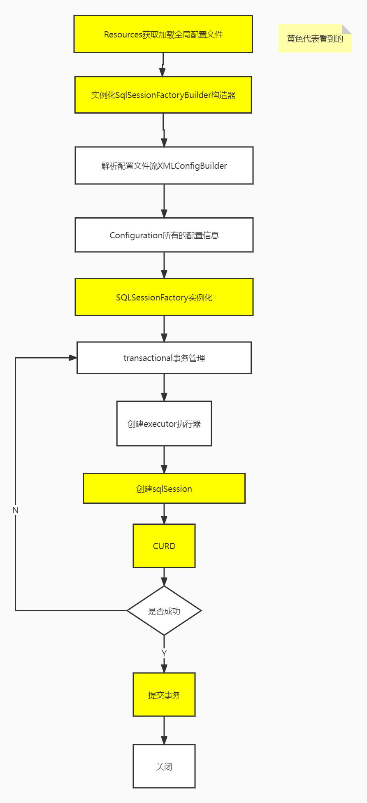

## 简介

> 如果这个世界总是这么简单就好了。

- MyBatis 是一款优秀的**持久层框架**
- 它支持自定义 SQL、存储过程以及高级映射
- MyBatis 免除了几乎所有的 JDBC 代码以及设置参数和获取结果集的工作
- MyBatis 可以通过简单的 XML 或注解来配置和映射原始类型、接口和 Java POJO为数据库中的记录。

文档地址：[mybatis – MyBatis 3 ](https://mybatis.org/mybatis-3/zh/index.html)

## 获得Mybatis

- maven 仓库[ mybatis ](https://mvnrepository.com/artifact/org.mybatis/mybatis)
- Github[mybatis/mybatis-3](https://github.com/mybatis/mybatis-3)
- 中文文档[mybatis – MyBatis 3 ](https://mybatis.org/mybatis-3/zh/index.html)

## 第一个Mybatis程序

- 导入包

~~~xml
<dependency>
    <groupId>junit</groupId>
    <artifactId>junit</artifactId>
    <version>4.11</version>
    <scope>test</scope>
</dependency>
<dependency>
    <groupId>mysql</groupId>
    <artifactId>mysql-connector-java</artifactId>
    <version>8.0.27</version>
</dependency>
<!-- https://mvnrepository.com/artifact/org.mybatis/mybatis -->
<dependency>
    <groupId>org.mybatis</groupId>
    <artifactId>mybatis</artifactId>
    <version>3.5.7</version>
</dependency>
~~~

- 编写mybatis的核心配置文件

> 在resources 目录下建一个mybatis-config.xml 配置文件

> 在设置url时，xml中的"&"需要换成" &amp ;"进行转义

~~~xml
<!--mysql8.0之后 url可能需要加上时区 serverTimezone=GMT-->
<?xml version="1.0" encoding="UTF-8" ?>
<!DOCTYPE configuration
        PUBLIC "-//mybatis.org//DTD Config 3.0//EN"
        "http://mybatis.org/dtd/mybatis-3-config.dtd">
<!--Mybatis核心配置文件-->
<configuration>
    <environments default="development">
        <environment id="development">
            <transactionManager type="JDBC"/>
            <dataSource type="POOLED">
                <property name="driver" value="com.mysql.cj.jdbc.Driver"/>
                <property name="url" value="jdbc:mysql://localhost:3306/school?useUnicode=true&amp;characterEncoding=utf8&amp;useSSl=true"/>
                <property name="username" value="root"/>
                <property name="password" value="123456"/>
            </dataSource>
        </environment>
    </environments>
    <!--    每一个Mapper.xml都需要在mybatis核心配置文件中注册-->
    <mappers>
        <mapper resource="dao/UserMapper.xml"/>
    </mappers>
</configuration>
~~~

- 编写mybatis工具类

~~~java
public class MybatisUtils {
    private static SqlSessionFactory sqlSessionFactory;
    static {
        try {
            // 使用 Mybatis 第一步：获取sqlSessionFactory 对象
            String resource = "mybatis-config.xml";
            InputStream inputStream = Resources.getResourceAsStream(resource);
            sqlSessionFactory = new SqlSessionFactoryBuilder().build(inputStream);
        } catch (IOException e) {
            e.printStackTrace();
        }
    }
    // 既然有了sqlSessionFactory，就可以从中获得 SqlSession 的实例了
    // SqlSession 完全包含了面向数据库执行 SQL命令所需的所有方法
    public static SqlSession getSqlSession(){
        return sqlSessionFactory.openSession();
    }
}
~~~

~~~java
public static SqlSession getSqlSession(){
    //设置true 后面的代码中可以不用手动提交事务
    return sqlSessionFactory.openSession(true);
}
~~~

#### 编写代码

- 实体类

- Dao接口

    ~~~java
    public interface UserDao {
        public List<User> getUserList();
    }
    ~~~

- **接口实现类** 由原来的UserDaoImpl转变为一个Mapper配置文件.

    ~~~xml
    <?xml version="1.0" encoding="UTF-8" ?>
    <!DOCTYPE mapper
            PUBLIC "-//mybatis.org//DTD Mapper 3.0//EN"
            "http://mybatis.org/dtd/mybatis-3-mapper.dtd">
    
    <!--namespace=绑定的一个对应的Dao/Mapper接口-->
    <mapper namespace="dao.UserDao">
    	<!--select查询语句-->
        <!--id="实现的方法名" resultType="结果的类型"-->
        <select id="getUserList" resultType="pojo.User">
            select * from user
        </select>
    </mapper>
    ~~~

#### 测试

- 每一个Mapper.xml都需要在mybatis核心配置文件中注册

    ~~~xml
    <!--    每一个Mapper.xml都需要在mybatis核心配置文件中注册-->
    <mappers>
        <mapper resource="dao/UserMapper.xml"/>
    </mappers>
    ~~~

- 如果出现资源导出失败的问题

    ~~~xml
    <!--在build中配置resources，来防止我们资源导出失败的问题-->
    <build>
        <resources>
            <resource>
                <directory>src/main/resources</directory>
                <includes>
                    <include>**/*.properties</include>
                    <include>**/*.xml</include>
                </includes>
                <!-- 不让过滤这些东西-->
                <filtering>true</filtering>
            </resource>
            <resource>
                <directory>src/main/java</directory>
                <includes>
                    <include>**/*.properties</include>
                    <include>**/*.xml</include>
                </includes>
                <filtering>true</filtering>
            </resource>
        </resources>
    </build>
    ~~~

- 测试代码

    > 关闭很重要，因为SqlSession的实例不是线程安全的

    ~~~java
    public class UserDaoTest {
        @Test
        public void test(){
            // 1. 获得SqlSession对象
            SqlSession sqlSession = MybatisUtils.getSqlSession();
            // 2. 执行sql 方式一：getMapper(推荐)
                    UserDao mapper = sqlSession.getMapper(UserDao.class);
                    List<User> userList = mapper.getUserList();
            // 执行sql 方式二 (不推荐了)
            // List<User> userList = sqlSession.selectList("dao.UserDao.getUserList");
            for (User user:userList){
                System.out.println(user);
            }
    
            // 关闭SqlSession，很重要
            sqlSession.close();
        }
    }
    ~~~

## CRUD

- id : 就是对应的namespace中的方法名
- resultType：sql 语句执行的返回值
- parameterType：传递的参数类型

#### select

- 接口

    ~~~java
    // 查询全部用户
    public List<User> getUserList();
    
    // 根据ID 查询用户
    public User getUserById(int id);
    ~~~

- 实现，编写对应的mapper中的sql语句

    ~~~xml
    <select id="getUserList" resultType="pojo.User">
        select * from user
    </select>
    <select id="getUserById" resultType="pojo.User">
        select * from user where id=#{id}
    </select>
    ~~~

- 测试

    ~~~java
    @Test
    public void test(){
        SqlSession sqlSession = MybatisUtils.getSqlSession();
        UserMapper mapper = sqlSession.getMapper(UserMapper.class);
        List<User> userList = mapper.getUserList();
        for (User user:userList){
            System.out.println(user);
        }
        sqlSession.close();
    }
    @Test
    public void test1(){
        SqlSession sqlSession = MybatisUtils.getSqlSession();
        UserMapper mapper = sqlSession.getMapper(UserMapper.class);
        User user = mapper.getUserById(1);
        System.out.println(user);
        sqlSession.close();
    }
    ~~~

#### insert（需要提交事务才能生效）

- 接口

    ~~~java
    // insert 一个用户
    public int addUser(User user);
    ~~~

- 实现，编写对应的mapper中的sql语句

    ~~~xml
    <!--    对象中的属性，可以直接取出来-->
    <insert id="addUser" parameterType="pojo.User">
        insert into user (id, name, password)
        values (#{id},#{name},#{password});
    </insert>
    ~~~

- 测试

    ~~~java
    @Test
    public void test2(){
        SqlSession sqlSession = MybatisUtils.getSqlSession();
        UserMapper mapper = sqlSession.getMapper(UserMapper.class);
        mapper.addUser(new User(4,"nih","123123"));
        sqlSession.commit();    // 提交事务
        sqlSession.close();
    }
    ~~~

#### update（需要提交事务才能生效）

- 接口

    ~~~java
    // 修改用户
    public int updateUser(User user);
    ~~~

- 实现，编写对应的mapper中的sql语句

    ~~~xml
    <update id="updateUser" parameterType="pojo.User">
        update user set name = #{name}  where id = #{id};
    </update>
    ~~~

- 测试

    ~~~java
    @Test
    public void test3(){
        SqlSession sqlSession = MybatisUtils.getSqlSession();
        UserMapper mapper = sqlSession.getMapper(UserMapper.class);
        User user = new User();
        user.setId(4);
        user.setName("haha");
        mapper.updateUser(user);
        sqlSession.commit();    // 提交事务
        sqlSession.close();
    }
    ~~~

#### delete（需要提交事务才能生效）

- 接口

    ~~~java
    // 删除用户
    public int deleteUser(int id);
    ~~~

- 实现，编写对应的mapper中的sql语句

    ~~~xml
    <delete id="deleteUser" parameterType="int">
        delete from user where id = #{id};
    </delete>
    ~~~

- 测试

    ~~~java
    @Test
    public void test4(){
        SqlSession sqlSession = MybatisUtils.getSqlSession();
        UserMapper mapper = sqlSession.getMapper(UserMapper.class);
        mapper.deleteUser(4);
        sqlSession.commit();
        sqlSession.close();
    }
    ~~~

#### 万能 Map

假设，我们的实体类，或者数据库中的表，字段或者参数过多，应当考虑使用map

- 接口

    ```java
    // 万能的Map
    public int updateUser2(Map<String,Object> map);
    ```

- 实现，编写对应的mapper中的sql语句

    ```xml
    <!--传递的map 的key-->
    <update id="updateUser2" parameterType="map">
    update user set name = #{name} where id = #{userid}
    </update>
    ```

- 测试

    ```java
    @Test
    public void test5(){
    SqlSession sqlSession = MybatisUtils.getSqlSession();
    UserMapper mapper = sqlSession.getMapper(UserMapper.class);
    HashMap<String, Object> map = new HashMap<>();
    map.put("name","一二三");
    map.put("userid",1);
    mapper.updateUser2(map);
    sqlSession.commit();
    sqlSession.close();
    }
    ```

#### 模糊查询

- Java 代码执行的时候，传递通配符 % %

    ~~~java
    List<User> userList = mapper.getUserLike("%张%");
    ~~~

- 在 sql 拼接中使用通配符(写死)

    ~~~java
    select * from user where name like "%"#{value}"%"
    ~~~

## 配置解析

#### Mybatis详细执行过程



#### 核心配置文件

- mybatis-config.xml（官方建议起的名字）

- MyBatis 的配置文件包含了会深深影响 MyBatis 行为的设置和属性信息。 配置文档的顶层结构如下：

    ~~~xml
    configuration（配置）
    properties（属性）
    settings（设置）
    typeAliases（类型别名）
    typeHandlers（类型处理器）
    objectFactory（对象工厂）
    plugins（插件）
    environments（环境配置）
    environment（环境变量）
    transactionManager（事务管理器）
    dataSource（数据源）
    databaseIdProvider（数据库厂商标识）
    mappers（映射器）
    ~~~

#### 环境配置（environments）

- MyBatis 可以配置成适应多种环境，但每个SqlSessionFactory实例只能选择一种环境。每个数据库对应一个SqlSessionFactory实例
- Mybatis默认的事务管理器是 JDBC，还有一个 MANAGED
- 数据源默认使用 **POOLED** (有池子)

#### 属性（properties）

- 可以通过properties 属性来实现引用配置文件

- 这些属性可以外部配置且可动态替换的。可以在典型的 Java属性文件中配置，也可以通过properties元素的子元素来传递

    ~~~properties
    #编写一个配置文件  db.properties
    driver = com.mysql.cj.jdbc.Driver
    url1=jdbc:mysql://localhost:3306/mybatis?useUnicode=true&characterEncoding=utf8&useSSl=true
    username=root
    password=123456
    ~~~
    
    ~~~xml
    <!--在核心配置文件中引入-->
    <properties resource="db.properties"/>
    <environments default="development">
        <environment id="development">
            <transactionManager type="JDBC"/>
            <dataSource type="POOLED">
                <property name="driver" value="${driver}"/>
                <property name="url" value="${url1}"/>
                <property name="username" value="${username}"/>
                <property name="password" value="${password}"/>
            </dataSource>
        </environment>
    </environments>
    ~~~
    
    ~~~xml
    <!--也可以在properties属性中引入，但外部优先级更高-->
    <properties resource="db.properties">
        <property name="username" value="root"/>
        <property name="password" value="123456"/>
    </properties>
    ~~~
    
- 注意点：

    - 配置文件中的起名 url可能存在问题，上面改为了(url1)
- 如果两个文件有同一个字段，优先会使用外部配置文件

#### 类型别名（typeAliases）

- 类型别名可为 Java 类型设置一个缩写名字
- 存在的意义降低冗余的全限定类名书写

~~~xml
<!--之前-->
<select id="getUserList" resultType="pojo.User">
    select * from user
</select>
~~~

~~~xml
<!--起别名(在配置文件中)-->
<typeAliases>
    <!--具体到类名-->
    <typeAlias alias="User" type="pojo.User"/>
    <!--也可以只指定一个包名-->
    <package name="pojo"/>
</typeAliases>
~~~

~~~xml
<!--现在-->
<select id="getUserList" resultType="User">
    select * from user
</select>
~~~

指定包的时候也可以在实体类上添加注解，使用注解的名字

~~~java
package pojo;
import org.apache.ibatis.type.Alias;
@Alias("hello")
public class User{...}
~~~

~~~xml
<select id="getUserList" resultType="hello">
    select * from user
</select>
~~~

#### 设置（settings）

[mybatis – MyBatis 3 | 配置](https://mybatis.org/mybatis-3/zh/configuration.html#settings)

logImpl

#### 映射器（mappers）

方式一：（推荐使用）

~~~xml
<!-- 使用相对于类路径的资源引用 -->
<mappers>
  <mapper resource="dao/UserMapper.xml"/>
</mappers>
~~~

方式二： 使用class 文件绑定注册

~~~xml
<!-- 使用映射器接口实现类的完全限定类名 -->
<mappers>
    <mapper class="dao.UserMapper"></mapper>
</mappers>
~~~

注意：

- 接口和他的Mapper配置文件必须同名
- 接口和他的Mapper配置文件必须在同一个包下

方式三： 使用扫描包 进行绑定注册

~~~xml
<mappers>
    <package name="dao"/>
</mappers>
~~~

注意：

- 接口和他的Mapper配置文件必须同名
- 接口和他的Mapper配置文件必须在同一个包下

#### 生命周期和作用域

生命周期和作用域是至关重要的，因为错误的使用会导致非常严重的**并发问题**

 **SqlSessionFactoryBuilder**

- 一旦创建了 SqlSessionFactoryBuilder，就不在需要它了
- 局部变量

**SqlSessionFactory**

- 可以想象为：数据库连接池
- SqlSessionFactory 一旦被创建就应该在应用的运行期间一直存在，**没有任何理由丢弃它或重新创建另一个实例**
- 最佳作用域是应用作用域
- 最简单的就是使用 单例模式 或者 静态单例模式

 **SqlSession**

- 连接到连接池的一个请求
- SqlSession 的实例不是线程安全的，因此不能被共享
- 最佳的作用域是请求或者方法作用域
- 用完之后需要第一时间关闭，否则资源可能被占用

**每一个Mapper 就代表一个具体的业务**

## 结果集映射

>  出现了属性名和字段名不一致的问题

查询的结果可能出现 **null**

解决方法：

- 起别名

~~~xml
<select id="getUserList" resultType="pojo.User">
    select id,name,password as pwd from user
</select>
~~~

#### resultMap

~~~xml
<!--结果集映射 id 代表select标签中的resultMap值，type代表之前你的resultType，也就是结果的返回类型-->
<resultMap id="UserMap" type="pUser">
    <!--column数据库中的字段，property实体类中的属性-->
    <!-- 可以只改不一样的-->
    <!-- <result column="id" property="id"/>-->
    <!-- <result column="username" property="username"/>-->
    <result column="password" property="pwd"/>
</resultMap>
<select id="getUserList" resultMap="UserMap">
    select * from user
</select>
~~~

- `resultMap` 元素是 MyBatis 中最重要最强大的元素
- ResultMap 的设计思想是，对简单的语句做到零配置，对于复杂一点的语句，只需要描述语句之间的关系就行了。

## 日志

LOG4J

STDOUT_LOGGING 

在 Mybatis 中具体使用哪一个日志实现，在设置中设定

在 mybatis  核心配置文件中，配置日志

#### **STDOUT_LOGGING**  标准日志工厂

~~~xml
<settings>
    <!--STDOUT_LOGGING是标准日志工厂，不用怎么配置-->
    <setting name="logImpl" value="STDOUT_LOGGING"/>
</settings>
~~~

#### LOG4J（有漏洞，不再使用）

- Log4j 是 apache的一个开源项目，通过使用Log4j，可以控制日志信息输出到控制台、文件、GUI组件
- 可以控制每一条日志的输出格式
- 通过定义每一条日志信息的级别，能够更加细致的控制日志生成过程
- 通过一个配置文件进行灵活的配置，不需要修改应用的代码

## 分页

#### limit分页

- 接口

    ~~~java
    // 分页
    List<User> getUserByLimit(Map<String,Integer> map);
    ~~~

- 实现

    ~~~xml
    <!--参数是Map类型所以填写map，Mybatis的规定基本类型前面带_,封装类型写成小写-->
    <select id="getUserByLimit" resultType="pojo.User" parameterType="map">
        select * from user limit #{startIndex},#{pageSize}
    </select>
    ~~~

- 测试

    ~~~java
    @Test
    public void test1(){
        SqlSession sqlSession = MybatisUtils.getSqlSession();
        UserMapper mapper = sqlSession.getMapper(UserMapper.class);
        HashMap<String, Integer> map = new HashMap<>();
        map.put("startIndex",0);
        map.put("pageSize",2);
        List<User> userList = mapper.getUserByLimit(map);
        for (User user : userList) {
            System.out.println(user);
        }
        sqlSession.close();
    }
    ~~~

#### 分页插件

[MyBatis 分页插件 PageHelper](https://pagehelper.github.io/)

## 使用注解开发(mybatis最好不用)

​	使用注解来映射简单语句会使代码显得更加简洁，但对于稍微复杂一点的语句，Java 注解不仅力不从心，还会让你本就复杂的 SQL 语句更加混乱不堪。 因此，如果你需要做一些很 **复杂的操作**，最好 **用 XML 来映射语句**。

####  select

- 注解在接口上实现

    ~~~java
    // 使用注解查询全部用户
    @Select("select * from user")
    public List<User> getUserList();
    // 使用注解查询指定用户 @Param("和sql语句中的#{""}保持一致")
    // 参数前面必须加上@Param("")注解，如果多个参数：(@Param("id")int id,@Param("name")String name)
    @Select("select * from user where id = #{id}")
    public User getUserById(@Param("id")int id);
    ~~~

- 需要在核心配置文件中 

    ~~~xml
    <!--只用注册就可以了，不用写mapper.xml配置文件-->
    <mappers>
        <mapper class="dao.UserMapper" />
    </mappers>
    ~~~

- 测试

    ~~~java
    @Test
    public void test(){
        SqlSession sqlSession = MybatisUtils.getSqlSession();
        // 底层主要应用反射
        UserMapper mapper = sqlSession.getMapper(UserMapper.class);
        List<User> userList = mapper.getUserList();
        for (User user : userList) {
            System.out.println(user);
        }
        sqlSession.close();
    }
    @Test
    public void test2(){
        SqlSession sqlSession = MybatisUtils.getSqlSession();
        UserMapper mapper = sqlSession.getMapper(UserMapper.class);
        User user = mapper.getUserById(1);
        System.out.println(user);
        sqlSession.close();
    }
    ~~~

#### insert

- 接口上写注解

    ~~~java
    // 插入
    @Insert("insert into user(id,name,password) values (#{id},#{name},#{password})")
    public int addUser(User user);
    ~~~

- 在核心文件上注册

    ~~~xml
    <!--只用注册就可以了，不用写mapper.xml配置文件-->
    <mappers>
        <mapper class="dao.UserMapper" />
    </mappers>
    ~~~

- 测试

    ~~~java
    @Test
    public void test2(){
        SqlSession sqlSession = MybatisUtils.getSqlSession();
        UserMapper mapper = sqlSession.getMapper(UserMapper.class);
        mapper.addUser(new User(4,"aa","111"));
        sqlSession.commit();
        sqlSession.close();
    }
    ~~~

#### update

- 接口上写注解

    ~~~java
    // 更新
    @Update("update user set name=#{name} where id=#{iid}")
    public int updateUser(@Param("iid") int id,@Param("name")String name);
    ~~~

- 在核心文件上注册

    ~~~xml
    <!--只用注册就可以了，不用写mapper.xml配置文件-->
    <mappers>
        <mapper class="dao.UserMapper" />
    </mappers>
    ~~~

- 测试

    ~~~java
    @Test
    public void test3(){
        SqlSession sqlSession = MybatisUtils.getSqlSession();
        UserMapper mapper = sqlSession.getMapper(UserMapper.class);
        mapper.updateUser(4,"bb");
        sqlSession.commit();
        sqlSession.close();
    }
    ~~~

#### delete

- 接口上写注解

    ~~~java
    // 删除
    @Delete("delete from user where id = #{iid}")
    public int deleteUser(@Param("iid")int id);
    ~~~

- 在核心文件上注册

    ~~~xml
    <!--只用注册就可以了，不用写mapper.xml配置文件-->
    <mappers>
        <mapper class="dao.UserMapper" />
    </mappers>
    ~~~

- 测试

    ~~~java
    @Test
    public void test4(){
        SqlSession sqlSession = MybatisUtils.getSqlSession();
        UserMapper mapper = sqlSession.getMapper(UserMapper.class);
        mapper.deleteUser(4);
        sqlSession.commit();
        sqlSession.close();
    }
    ~~~

**关于@Param()注解**

- 基本类型的参数或者String类型，需要加上
- 引用类型不用加
- 如果只有一个基本类型，可以忽略，但最好加上
- 在SQL语句中引用的就是@Param()中设定的属性名

**#{} 和 ${} 区别**

- ${} 不安全，防止不了sql 注入
- #{} 是预编译，能用#{}就用#{}

## 多对一

#### 按照查询嵌套处理

> 和sql中的子查询一样

~~~xml
<!--思路：
    1. 查询所有的学生信息
    2.根据查询出来的学生的tid，寻找对应的老师
-->
<select id="getStudent" resultMap="StudentTeacher">
    select * from Student
</select>
<resultMap id="StudentTeacher" type="Student" >
    <!--复杂的属性，我们需要单独处理 对象：association 集合：collection-->
    <association property="teacher" column="tid" javaType="Teacher" select="getTeacher"/>
</resultMap>
<select id="getTeacher" resultType="Teacher">
    select * from Teacher where id = #{tid}
</select>
~~~

#### 按照结果嵌套处理

> 和sql中的连表查询一样

~~~xml
<!--按照结果嵌套处理-->
<select id="getStudent2" resultMap="StudentTeacher2">
    select student.id sid,student.name sname,teacher.id ttid,teacher.name tname
    from student,teacher where student.tid = teacher.id
</select>
<resultMap id="StudentTeacher2" type="Student">
    <result property="id" column="sid" />
    <result property="name" column="sname" />
    <association property="teacher" javaType="Teacher">
        <result property="id" column="ttid"/>   <!--这些地方要使用别名 teacher.id不可用-->
        <result property="name" column="tname" />
    </association>
</resultMap>
~~~

## 一对多

#### 按照查询嵌套处理

~~~xml
<!--    按照查询嵌套处理-->
<select id="getTeacherId2" resultMap="TeacherStudent2">
    select * from teacher where id = #{id}
</select>
<resultMap id="TeacherStudent2" type="Teacher">
    <result property="id" column="id"/>
    <collection property="students" ofType="Student" select="getStudentByTeacherId" column="id"/>
</resultMap>
<select id="getStudentByTeacherId" resultType="Student">
    select * from student where tid = #{id}
</select>
~~~

#### 按照结果嵌套处理

~~~xml
<!--    按照结果嵌套处理-->
<select id="getTeacherId" resultMap="TeacherStudent">
    select s.id sid,s.name sname,t.id tid,t.name tname
    from student s,teacher t where tid = t.id and t.id = #{id};
</select>
<resultMap id="TeacherStudent" type="Teacher">
    <result property="id" column="tid" />
    <result property="name" column="tname" />
    <!--
            javaType="" 指定属性的类型
            集合中的泛型信息，使用ofType获取
        -->
    <collection property="students" ofType="Student">
        <result property="id" column="sid"/>
        <result property="name" column="sname"/>
        <result property="tid" column="tid"/>
    </collection>
</resultMap>
~~~

**JavaType  & ofType**

- JavaType 用来指定实体类中的属性的类型
- ofType 用来指定映射到List或者集合中的 pojo 类型，泛型中的约束类型

## 动态sql

**动态SQL就是根据不同的条件生成不同的SQL语句**

#### *IF

~~~xml
<select id="getBlogIf" parameterType="map" resultType="pojo.Blog">
    select * from blog
    <where>
        <if test="title != null">
            and title = #{title}
        </if>
        <if test="author != null">
            and author = #{author}
        </if>
    </where>
</select>
~~~

#### 常用标签

**choose（when，otherwise）**

> 有时候，我们不想使用所有的条件，而只是想从多个条件中选择一个使用。针对这种情况，MyBatis 提供了 choose 元素，它有点像 Java 中的 switch 语句。

~~~xml
<!--如果第一个条件成立，会选择第一个，且不往下判断。如果when标签内都不成立，会自动拼接 otherwise-->
<select id="getBlogIf" parameterType="map" resultType="pojo.Blog">
    select * from blog
    <where>
      <choose>
        <when test="title != null">
          and title like #{title}
        </when>
        <when test="author != null">
          and author like #{author}
        </when>
        <otherwise>
          and views = #{views}
        </otherwise>
      </choose>
    </where>
</select>
~~~

**trim（where，set）**

> *where* 元素只会在需要的时候才插入 “WHERE” 子句。而且，若子句的开头为 “AND” 或 “OR”，*where* 元素也会将它们去除。

> *set* 元素会动态地在行首插入 SET 关键字，并会删掉额外的逗号

~~~xml
<update id="updateBlog" parameterType="map">
    update blog
    <set>
        <if test="title != null">
            title = #{title},
        </if>
        <if test="author != null">
            author = #{author},
        </if>
    </set>
    where views = 1000
</update>
~~~

#### Foreach

~~~xml
<!--select * from blog where id in (1,2,3)-->
<!--collection:集合，item：代表每一项，open:拼接开始的字符，close:拼接结束的字符，separator:分隔符-->
<select id="queryBlogForeach" parameterType="map" resultType="pojo.Blog">
    select * from blog
    <where>
        <foreach collection="ids" item="id" open="and id in (" close=")" separator=",">
            #{id}
        </foreach>
    </where>
</select>
~~~

~~~java
@Test
public void test4(){
    SqlSession sqlSession = MybatisUtils.getSqlSession();
    BlogMapper mapper = sqlSession.getMapper(BlogMapper.class);
    HashMap map = new HashMap();
    List idsList = new ArrayList();
    idsList.add(1);
    idsList.add(2);
    map.put("ids",idsList);
    List<Blog> blogs = mapper.queryBlogForeach(map);
    for (Blog blog : blogs) {
        System.out.println(blog);
    }
    sqlSession.close();
}
~~~

#### SQL 片段

> 有些时候，可能将一些功能抽取出来，方便复用

- 原来的语句

    ~~~xml
    <select id="getBlogIf" parameterType="map" resultType="pojo.Blog">
        select * from blog
        <where>
            <if test="title != null">
                and title = #{title}
            </if>
            <if test="author != null">
                and author = #{author}
            </if>
        </where>
    </select>
    ~~~

- 使用SQL标签抽取公共的部分

    ~~~xml
    <sql id="test">
        <if test="title != null">
            and title = #{title}
        </if>
        <if test="author != null">
            and author = #{author}
        </if>
    </sql>
    ~~~

- 在需要使用的地方使用 **include** 标签引用即可

    ~~~xml
    <select id="getBlogIf" parameterType="map" resultType="pojo.Blog">
        select * from blog
        <where>
            <include refid="test"></include>
        </where>
    </select>
    ~~~

sql片段使用注意事项：

- 最好基于单表来定义SQL片段（复杂的也没法复用）
- 不要包含存在where 标签，可能会出bug

## 缓存(了解)

#### 一级缓存

- 一级缓存也叫本地缓存：

    - 与数据库同一次会话期间查询到的数据会放在本地缓存中
    - 下次如果需要相同的数据，会直接从缓存中取

- 缓存失效的情况：

    - 映射语句文件中的所有 select 语句的结果将会被缓存

    - 映射语句文件中的所有 insert、update 和 delete 语句会刷新缓存

    - 缓存会使用最近最少使用算法（LRU, Least Recently Used）算法来清除不需要的缓存

    - 缓存不会定时进行刷新（也就是说，没有刷新间隔）

    - 手动清理缓存

        ~~~java
        sqlSession.clearCache();	// 手动清理缓存
        ~~~

一级缓存默认是开启的，只在一次SqlSession中有效，也就是拿到连接到关闭连接这个区间段

#### 二级缓存

[MyBatis 3二级缓存](https://mybatis.org/mybatis-3/zh/sqlmap-xml.html#cache)

- 二级缓存也叫全局缓存，一级缓存作用域太低了
- 基于namespace级别的缓存，一个名称空间，对应一个二级缓存
- 工作机制
    - 一个会话查询一条数据，这个数据会被放到当前会话的一级缓存中
    - 如果当前会话关闭了，对应的一级缓存就没了， 我们可以设置，会话关闭了，一级缓存的数据可以保存到二级缓存中
    - 新的会话查询信息，就可以从二级缓存中获取内容
    - 不同的mapper查出的数据会放在自己对应的缓存中

步骤：

1. 开启全局缓存

    ~~~xml
    <setting name="cacheEnabled" value="true"/>
    ~~~

2. 要使用二级缓存的Mapper中开启

    ~~~xml
    <!--参数解释见官方文档-->
    <cache
      eviction="FIFO"
      flushInterval="60000"
      size="512"
      readOnly="true"/>
    ~~~

#### 缓存原理

1. 会先查看二级缓存中有没有
2. 在查看一级缓存中有没有
3. 都没有查询数据库
