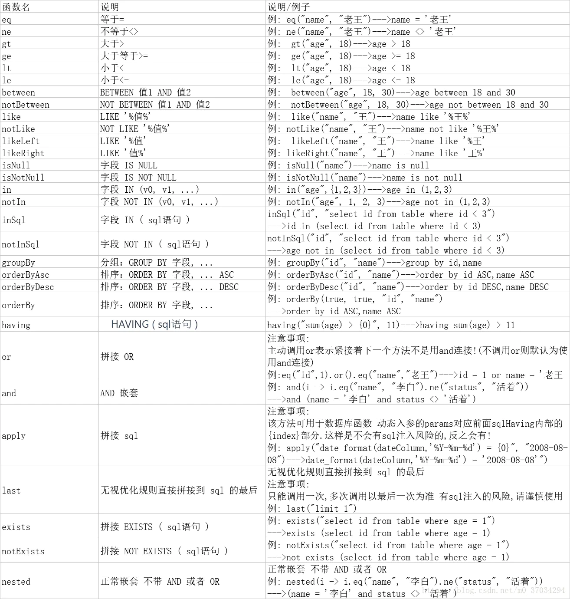

## MybtisPlus

[注解 | MyBatis-Plus (baomidou.com)](https://baomidou.com/pages/223848/)

> MyBatis-Plus（简称 MP）是一个 MyBatis的增强工具，在 MyBatis 的基础上只做增强不做改变，为简化开发、提高效率而生。

- **无侵入**：只做增强不做改变，引入它不会对现有工程产生影响，如丝般顺滑
- **损耗小**：启动即会自动注入基本 CURD，性能基本无损耗，直接面向对象操作
- **强大的 CRUD 操作**：内置通用 Mapper、通用 Service，仅仅通过少量配置即可实现单表大部分 CRUD 操作，更有强大的条件构造器，满足各类使用需求
- **支持 Lambda 形式调用**：通过 Lambda 表达式，方便的编写各类查询条件，无需再担心字段写错
- **支持主键自动生成**：支持多达 4 种主键策略（内含分布式唯一 ID 生成器 - Sequence），可自由配置，完美解决主键问题
- **支持 ActiveRecord 模式**：支持 ActiveRecord 形式调用，实体类只需继承 Model 类即可进行强大的 CRUD 操作
- **支持自定义全局通用操作**：支持全局通用方法注入（ Write once, use anywhere ）
- **内置代码生成器**：采用代码或者 Maven 插件可快速生成 Mapper 、 Model 、 Service 、 Controller 层代码，支持模板引擎，更有超多自定义配置等您来使用
- **内置分页插件**：基于 MyBatis 物理分页，开发者无需关心具体操作，配置好插件之后，写分页等同于普通 List 查询
- **分页插件支持多种数据库**：支持 MySQL、MariaDB、Oracle、DB2、H2、HSQL、SQLite、Postgre、SQLServer 等多种数据库
- **内置性能分析插件**：可输出 SQL 语句以及其执行时间，建议开发测试时启用该功能，能快速揪出慢查询
- **内置全局拦截插件**：提供全表 delete 、 update 操作智能分析阻断，也可自定义拦截规则，预防误操作

## 快速开始

先准备一张数据库

1. 导入依赖

~~~xml
<dependency>
    <groupId>mysql</groupId>
    <artifactId>mysql-connector-java</artifactId>
</dependency>
<dependency>
    <groupId>com.baomidou</groupId>
    <artifactId>mybatis-plus-boot-starter</artifactId>
    <version>3.5.1</version>
</dependency>
~~~

注：尽量不要mybatis和mybatis-plus同时导入

2. 实体类 pojo

~~~java
@Data
@AllArgsConstructor
@NoArgsConstructor
public class User {
    private Long id;
    private String name;
    private Integer age;
    private String email;
}
~~~

3. mapper

~~~java
// 在对应的Mapper上面实现基本的接口
@Mapper
public interface UserMapper extends BaseMapper<User> {

}
~~~

- 可以在mapper接口上使用`@Mapper` 注解
- 也可以在主启动类上加上 `@MapperScan("mapper包的全路径")`

4. 测试

~~~java
@Autowired
private UserMapper userMapper;
@Test
void contextLoads() {
    // 参数是一个 Wrapper,条件构造器，此处不用先写null
    List<User> users = userMapper.selectList(null);
    for (User user : users) {
        System.out.println(user);
    }
}
~~~

## 日志

```properties
# 配置日志 输出在控制台
mybatis-plus.configuration.log-impl=org.apache.ibatis.logging.stdout.StdOutImpl
```

## CRUD扩展

#### 插入操作

```java
// 测试插入
@Test
void testInsert(){
    User user = new User();
    user.setName("nihao");
    user.setAge(3);
    user.setEmail("12313213@qq.com");
    userMapper.insert(user);
}
```

发现id是自动生成的

**雪花算法：**

snowflake（雪花算法）是Twitter开源的分布式ID生成算法，结果是一个long型的ID.

核心思想是：使用41bit作为毫秒数，10bit作为机器的id（w个bit是数据中心，5个bit的机器id），12bit作为毫秒内的流水号（意味着每个节点在每个毫秒可以产生4096个id），最后还有一个符号位，永远是0。可以保证几乎全球唯一

**主键自增**

如果需要设置主键自增

1. 数据库的主键是设置的自增
2. 在实体类的主键字段上加上`@TableId(type = IdType.AUTO)`

#### 更新操作

~~~java
// 测试更新
@Test
void testUpdate(){
    User user = new User();
    user.setId(5L);
    user.setName("test");
    userMapper.updateById(user);
}
// 执行的sql Preparing: UPDATE user SET name=? WHERE id=?
~~~

~~~java
// 测试更新
@Test
void testUpdate(){
    User user = new User();
    user.setId(5L);
    user.setName("test");
    user.setAge(1);
    userMapper.updateById(user);
}
// 执行的sql Preparing: UPDATE user SET name=?, age=? WHERE id=?
~~~

所有的sql都是自动动态设置的

#### 自动填充

- 方式一：数据库级别（不建议使用，低版本只能一个表设置一个）

创建一个字段，类型选择datetime 选上根据当前时间戳更新

- 方式二：代码级别

1. 在实体类上写上注解和标注填充时机

~~~java
@TableField(fill = FieldFill.INSERT)
private LocalDateTime createTime;
@TableField(fill = FieldFill.INSERT_UPDATE)
private LocalDateTime updateTime;
~~~

2. 编写处理类 需要继承 MetaObjectHandler --第一种方式

```java
@Component
public class MyMetaObjectHandler implements MetaObjectHandler {
    @Override
    public void insertFill(MetaObject metaObject) {
        this.strictInsertFill(metaObject, "createTime", LocalDateTime.class, LocalDateTime.now());
        this.strictInsertFill(metaObject, "updateTime", LocalDateTime.class, LocalDateTime.now());
    }
    @Override
    public void updateFill(MetaObject metaObject) {
        this.strictUpdateFill(metaObject, "updateTime", LocalDateTime.class, LocalDateTime.now());
    }
}
```

2. 编写处理类 需要继承 MetaObjectHandler  -- 第二种方式

~~~java
@Component
public class MyMetaObjectHandler implements MetaObjectHandler {
    @Override
    public void insertFill(MetaObject metaObject) {
        metaObject.setValue("createTime",LocalDateTime.now());
        metaObject.setValue("updateTime",LocalDateTime.now());
    }
    @Override
    public void updateFill(MetaObject metaObject) {
        metaObject.setValue("updateTime",LocalDateTime.now());
    }
}
~~~

#### 乐观锁

> 乐观锁：十分乐观，认为不会出现问题，无论干什么不去上锁。如果出现了问题，再次更新值测试
>
> 悲观锁：十分悲观，认为总是出现问题，无论干什么都会上锁。再去操作

乐观锁实现方式：

- 取出记录时，获取当前version
- 更新时，带上这个version
- 执行更新时，set version = newVersion where version = oldVersion
- 如果version不对，就更新失败

#### 查询操作

~~~java
// 测试查询
@Test
void test1(){
    User user = userMapper.selectById(1l);
    System.out.println(user);
}
// 测试批量查询
@Test
void test2(){
    List<User> users = userMapper.selectBatchIds(Arrays.asList(1,2,3));
    for (User user : users) {
        System.out.println(user);
    }
}
// 按条件查询之一：map
@Test
void test3(){
    HashMap<String, Object> map = new HashMap<>();
    map.put("name","test");
    List<User> users = userMapper.selectByMap(map);
    for (User user : users) {
        System.out.println(user);
    }
}
~~~

#### 分页查询

1. 配置一个插件			[插件主体 | MyBatis-Plus (baomidou.com)](https://baomidou.com/pages/2976a3/#spring-boot)

~~~java
@Configuration
public class MybatisPlusConfig {
    /**
     * 新的分页插件,一缓和二缓遵循mybatis的规则,需要设置 MybatisConfiguration#useDeprecatedExecutor = false 避免缓存出现问题(该属性会在旧插件移除后一同移除)
     */
    @Bean
    public MybatisPlusInterceptor mybatisPlusInterceptor() {
        MybatisPlusInterceptor interceptor = new MybatisPlusInterceptor();
        interceptor.addInnerInterceptor(new PaginationInnerInterceptor(DbType.MYSQL));
        return interceptor;
    }
}
~~~

2. 测试

~~~java
// 分页查询
@Test
void testPage(){
    // 参数一：当前页
    // 参数二：页面大小
    Page<User> page = new Page<>(2, 5);
    userMapper.selectPage(page, null);
    List<User> lists = page.getRecords();
    for (User list : lists) {
        System.out.println(list);
    }
}
~~~

#### 删除操作

```java
// 测试删除
@Test
void testDelete1(){
    userMapper.deleteById(1512371235774066689l);
}
// 测试批量删除
@Test
void testDelete2(){
    userMapper.deleteBatchIds(Arrays.asList(1512356824401412097l,1512372919946526721l));
}
// 按条件删除之一：map
@Test
void testDelete3(){
    HashMap<String, Object> map = new HashMap<>();
    map.put("id",1512375529109815297l);
    userMapper.deleteByMap(map);
}
```

**逻辑删除**

> 物理删除：从数据库中直接移除
>
> 逻辑删除：在数据库中没有被移除，而是通过一个变量来让他失效

1. 增加一个deleted字段。设置默认值为 0 代表没有被删除

2. 在实体类加上这个字段，并加上 `@TableLogic` 注解

~~~java
@TableLogic
private Integer deleted;
~~~

3. 配置

~~~properties
# 配置
# 逻辑未删除
mybatis-plus.global-config.db-config.logic-not-delete-value=0
# 逻辑已删除
mybatis-plus.global-config.db-config.logic-delete-value=1
# 和实体类的注解写一个就可以
#mybatis-plus.global-config.db-config.logic-delete-field= deleted
~~~

## 条件查询器 Wrapper



测试一

~~~java
@Test        // 查询name不为空的用户，并且邮箱不为空，年龄大于等于12
void test1(){
    QueryWrapper<User> userWrapper = new QueryWrapper<>();
    userWrapper.isNotNull("name").isNotNull("email").ge("age",20);
    userMapper.selectList(userWrapper);
}
~~~

测试二

~~~java
@Test       // 查询名字是test的一个用户
void test2(){
    QueryWrapper<User> userWrapper = new QueryWrapper<>();
    userWrapper.eq("name","test");
    userMapper.selectOne(userWrapper);
}
~~~

测试三

~~~java
@Test       // 查询年龄在10 - 20 之间的
void test3(){
    QueryWrapper<User> userWrapper = new QueryWrapper<>();
    userWrapper.between("age",10,20);
    Long aLong = userMapper.selectCount(userWrapper); // 查询结果数
}
~~~

测试四

~~~java
@Test       // 模糊查询     左  %x   右x%     左右 %x%
void test4(){
    QueryWrapper<User> userWrapper = new QueryWrapper<>();
    userWrapper.like("name","t");
    List<User> users = userMapper.selectList(userWrapper);
}
~~~

测试五

```java
@Test       // 嵌套查询
void test5(){
    QueryWrapper<User> userWrapper = new QueryWrapper<>();
    // id 在子查询中查出来
    userWrapper.inSql("id","select id from user where id < 5");
    List<User> users = userMapper.selectList(userWrapper);
}
```

测试六

~~~java
@Test
void test6(){
    QueryWrapper<User> userWrapper = new QueryWrapper<>();
    // 通过 id 进行降序
    userWrapper.orderByDesc("id");
    List<User> users = userMapper.selectList(userWrapper);
}
~~~

## 代码自动生成

[代码生成器（新） | MyBatis-Plus (baomidou.com)](https://baomidou.com/pages/779a6e/#快速入门)

[代码生成器配置新 | MyBatis-Plus (baomidou.com)](https://baomidou.com/pages/981406/)

