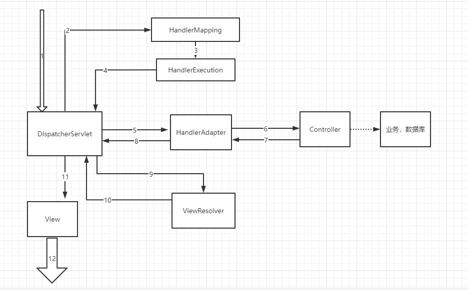

## 回顾servlet

1. 导包

    ~~~xml
    <dependencies>
        <dependency>
            <groupId>junit</groupId>
            <artifactId>junit</artifactId>
            <version>4.12</version>
            <scope>test</scope>
        </dependency>
        <dependency>
            <groupId>org.springframework</groupId>
            <artifactId>spring-webmvc</artifactId>
            <version>5.3.15</version>
        </dependency>
        <dependency>
            <groupId>javax.servlet</groupId>
            <artifactId>servlet-api</artifactId>
            <version>2.5</version>
        </dependency>
        <dependency>
            <groupId>javax.servlet.jsp</groupId>
            <artifactId>jsp-api</artifactId>
            <version>2.2</version>
        </dependency>
        <dependency>
            <groupId>javax.servlet.jsp.jstl</groupId>
            <artifactId>jstl</artifactId>
            <version>1.2</version>
        </dependency>
    </dependencies>
    ~~~

2. 编写Servlet

    ~~~java
    public class HelloServlet extends HttpServlet {
        @Override
        protected void doGet(HttpServletRequest req, HttpServletResponse resp) throws ServletException, IOException {
            // 1. 获取前端参数
            String method = req.getParameter("method");
            if (method.equals("add")){
                req.getSession().setAttribute("msg","执行了add方法");
            }
            if (method.equals("delete")){
                req.getSession().setAttribute("msg","执行了delete方法");
            }
            // 2. 调用业务层
    
            // 3. 视图转发或者重定向
            req.getRequestDispatcher("/WEB-INF/jsp/test.jsp").forward(req,resp);
        }
    ~~~

3. 在web.xml中注册

    ~~~xml
    <servlet>
        <servlet-name>hello</servlet-name>
        <servlet-class>HelloServlet</servlet-class>
    </servlet>
    <servlet-mapping>
        <servlet-name>hello</servlet-name>
        <url-pattern>/hello</url-pattern>
    </servlet-mapping>
    ~~~

## 初识SpringMVC

Spring MVC 是Spring Framework的一部分，是基于Java实现MVC的轻量级Web框架

[Web on Servlet Stack ](https://docs.spring.io/spring-framework/docs/current/reference/html/web.html)

使用SpringMVC必须配置的三大件：

**处理器映射器、处理器适配器、视图解析器**

1. 配置web.xml

    ~~~xml
    <!--注册DispatcherServlet-->
    <servlet>
        <servlet-name>springmvc</servlet-name>
        <servlet-class>org.springframework.web.servlet.DispatcherServlet</servlet-class>
        <!--关联一个springmvc的配置文件【servlet-name】-servlet.xml-->
        <init-param>
            <param-name>contextConfigLocation</param-name>
            <param-value>classpath:springmvc-servlet.xml</param-value>
        </init-param>
        <!--启动级别-1-->
        <load-on-startup>1</load-on-startup>
    </servlet>
    <!-- / 匹配所有的请求：（不包括.jsp）-->
    <!-- /* 匹配所有的请求：（包括.jsp）-->
    <servlet-mapping>
        <servlet-name>springmvc</servlet-name>
        <url-pattern>/</url-pattern>
    </servlet-mapping>
    ~~~

2. 配置springxxxx.xml

    ~~~xml
    <!--处理器映射器-->
    <bean class="org.springframework.web.servlet.handler.BeanNameUrlHandlerMapping"/>
    <!--处理器适配器-->
    <bean class="org.springframework.web.servlet.mvc.SimpleControllerHandlerAdapter"/>
    <!--视图解析器：DispatcherServlet 給他的ModelAndView-->
    <bean class="org.springframework.web.servlet.view.InternalResourceViewResolver" id="internalResourceViewResolver">
        <!--前缀-->
        <property name="prefix" value="/WEB-INF/jsp/"/>
        <!--后缀-->
        <property name="suffix" value=".jsp"/>
    </bean>
    <!--Handler-->
    <bean id="/hello" class="controller.HelloController"/>
    ~~~

3. 编写实现Controller接口的类

    ~~~java
    // 这里需要导入的是Controller接口
    public class HelloController implements Controller {
        @Override
        public ModelAndView handleRequest(HttpServletRequest request, HttpServletResponse response) throws Exception {
            // ModelAndView 模型和视图
            ModelAndView modelAndView = new ModelAndView();
            // 封装对象
            modelAndView.addObject("msg","你好SpringMVC！");
            // 封装要跳转的视图，放在ModelAndView中
            modelAndView.setViewName("hello");
            return modelAndView;
        }
    }
    ~~~

4. 编写成功的界面

    ~~~jsp
    <%@ page contentType="text/html;charset=UTF-8" language="java" %>
    <html>
        <head>
            <title>Title</title>
        </head>
        <body>
            ${msg}
        </body>
    </html>
    ~~~

5. 注意事项：完成以上可能会出现 404 界面

    1. 有可能是打包的时候 jar 没打进去
    2. 在idea的项目结构中找到**Artifacts**选择war包在WEB-INF中建立**lib**目录，将library都导进来
    3. 完成后重启一下即可

## SpringMVC 执行原理

**执行流程：**

**分析流程：**

1. DispatcherServlet表示前置控制器，是整个SpringMVC的控制中心。用户发出请求，DispatcherServlet接收请求并拦截请求。

    我们假设请求的url为 : http:/ /localhost:8080/SpringMVC/hello

    **如上url拆分成三部分：**

    http:/ /localhost:8080服务器域名

    SpringMVC部署在服务器上的web站点

    hello表示控制器

    通过分析，如上url表示为：请求位于服务器localhost:8080上的SpringMVC站点的hello控制器。

2. HandlerMapping为处理器映射。DispatcherServlet自行调用HandlerMapping根据请求url查找Handler。

3. HandlerExecution表示具体的Handler,其主要作用是根据url查找控制器，如上url被查找控制器为：hello。

4. HandlerExecution将解析后的信息传递给DispatcherServlet,如解析控制器映射等。

5. HandlerAdapter表示处理器适配器，其按照特定的规则去执行Handler。

6. Handler让具体的Controller执行。

7. Controller将具体的执行信息返回给HandlerAdapter,如ModelAndView。

8. HandlerAdapter将视图逻辑名或模型传递给DispatcherServlet。

9. DispatcherServlet调用视图解析器(ViewResolver)来解析HandlerAdapter传递的逻辑视图名。

10. 视图解析器将解析的逻辑视图名传给DispatcherServlet。

11. DispatcherServlet根据视图解析器解析的视图结果，调用具体的视图。

12. 最终视图呈现给用户。

>  自我理解：请求被DispatcherServlet(控制器)接受并拦截，根据请求调用处理器映射，处理器映射再去找控制器，控制器解析后结果传回DispathcherServlet，控制器再将信息传给处理器适配器，处理器适配器按照规则去执行，执行结果在返回DispatcherServlet，控制器再去调用视图解析器，视图解析器解析后在将结果返回给DispatcherServlet，控制器在根据结果调用具体的视图，然后响应请求

## 注解开发

使用SpringMVC必须配置的三大件：

**处理器映射器、处理器适配器、视图解析器**

使用注解开发，**处理器映射器** 和 **处理器适配器** 只需要**开启注解驱动**即可

1.  配置 web.xml	    和`初识SpringMVC` 一致

2. 配置springxxxx.xml

    ~~~xml
    <!--约束支持-->
    xmlns:context="http://www.springframework.org/schema/context"
    xmlns:mvc="http://www.springframework.org/schema/mvc"
    http://www.springframework.org/schema/context
    https://www.springframework.org/schema/context/spring-context.xsd
    http://www.springframework.org/schema/mvc
    https://www.springframework.org/schema/mvc/spring-mvc.xsd
    ~~~

    ~~~xml
    <!--扫描包-->
    <context:component-scan base-package="controller"/>
    <!--让SpringMVC不处理静态资源 .css .js .html .mp3······-->
    <mvc:default-servlet-handler />
    <!--开启mvc注解驱动-->
    <mvc:annotation-driven />
    
    <!--视图解析器-->
    <bean class="org.springframework.web.servlet.view.InternalResourceViewResolver" id="internalResourceViewResolver">
        <property name="prefix" value="/WEB-INF/jsp/"/>
        <property name="suffix" value=".jsp" />
    </bean>
    ~~~

3. 编写实现Controller接口的类

    ~~~java
    @Controller // 被这个注解的类中所有的方法，如果返回值是String，并且有具体页面可以跳转，那么就会被视图解析器解析
    public class HelloController {
        // 如果类上也加了@RequestMapping("x") 那么访问地址为  项目/x/h1
        @RequestMapping("/h1")  // 访问的地址：项目/h1	
        public String hello(Model model){
            // 封装数据
            model.addAttribute("msg","你好springmvc");
            return "test"; // 会被视图解析器处理 /WEB-INF/jsp/test.jsp
        }
    }
    ~~~

    ~~~xml
    <!--Handler-->
    <bean id="/hello" class="controller.HelloController"/>
    <!--@RequestMapping("/hello") 作用同上-->
    ~~~

4. 编写成功的界面     和`初识SpringMVC` 一致

## 配置说明

#### 控制器Controller说明

- 控制器负责提供访问用户的行为，通常通过接口或注解(推荐)来实现
- 负责解析用户的请求并将其转换为一个模型
- 一个控制器类可以包含多个方法
- 对于Controller的配置方式有很多种

#### RestFul 风格

Restful就是一个资源定位及资源操作的风格。不是标准也不是协议，只是一种风格。基于这个风格设计的软件可以更简洁，更有层次，更易于实现缓存等机制。

- 传统方式操作资源：通过不同的参数来实现不同的效果
- 使用RestFul风格：通过不同的请求方式来实现不同的效果

在Spring MVC中可以使用  **@PathVariable** 注解，让方法参数的值对应绑定到一个URI模板变量上。

~~~java
@Controller
public class RestFulController {
    //映射访问路径
    @RequestMapping("/commit/{p1}/{p2}")
    public String index(@PathVariable("p1") int p1, @PathVariable("p2") int p2, Model model){
        int result = p1+p2;
        //Spring MVC会自动实例化一个Model对象用于向视图中传值
        model.addAttribute("msg", "结果："+result);
        //返回视图位置
        return "test";
    }
}
~~~

@RequestMapping注解可以使用method属性指定请求类型，不是这个类型就会报错

~~~java
@Controller
public class RestFulController {
    //映射访问路径,如果提交的不是POST方式就会报错
    @RequestMapping(value="/commit/{p1}/{p2}",method={RequestMethod.POST})
    public String index(@PathVariable int p1, @PathVariable int p2, Model model){
        int result = p1+p2;
        model.addAttribute("msg", "结果："+result);
        return "test";
    }
}
~~~

**所有的地址栏请求默认都会是 HTTP GET 类型的。**

方法级别的注解变体有如下几个：组合注解

```java
@GetMapping
@PostMapping
@PutMapping
@DeleteMapping
@PatchMapping
```

#### 结果跳转方式

**ModeAndView**

页面：{视图解析器前缀}+viewName+{视图解析器后缀}

- 通过SpringMVC来实现转发和重定向 - 有视图解析器；

    重定向 , 不需要视图解析器 , 本质就是重新请求一个新地方嘛 , 所以注意路径问题.

    ~~~java
    @Controller
    public class ResultSpringMVC2 {
        @RequestMapping("/t1")
        public String test1(){
            //转发
            return "test";
        }
        @RequestMapping("/t2")
        public String test2(){
            //重定向
            return "redirect:/index.jsp";
        }
    }
    ~~~

- 通过SpringMVC来实现转发和重定向 - 无需视图解析器

    ~~~java
    @Controller
    public class ResultSpringMVC {
        @RequestMapping("/t1")
        public String test1(){
            //转发
            return "/index.jsp";
        }
        @RequestMapping("/t2")
        public String test2(){
            //转发二
            return "forward:/index.jsp";
        }
        @RequestMapping("/t3")
        public String test3(){
            //重定向
            return "redirect:/index.jsp";
        }
    }
    ~~~

#### 接受请求参数与数据回显

**提交请求参数**

- 提交的域名城和处理方法的参数名一致

    ~~~java
    @Controller
    public class UserController {
        // 提交的域名称和处理方法的参数名一致
        // /项目/t1?name=xxx
        @RequestMapping("t1")
        public String test1(String name){
            System.out.println(name);
            return "test";
        }
    }
    ~~~

- 提交的域名城和处理方法的参数名不一致

    ~~~java
    @Controller
    public class UserController {
        // 提交的域名称和处理方法的参数名不一致
        // /项目/t2?username=xxx
        @RequestMapping("t2")
        public String test2(@RequestParam("username") String name){
            System.out.println("不一致:"+name);
            return "test";
        }
    }
    ~~~

- 提交的是一个对象

    ~~~java
    @Controller
    public class UserController {
        // 提交的是一个对象
        // /项目/t3?id=xx&name=xx&age=xx   哪个对不上，哪个就为null
        @RequestMapping("t3")
        public String test3(User user){
            System.out.println(user);
            return "test";
        }
    }
    ~~~

**数据回显**

- 通过ModelAndView

    ~~~java
    public class ControllerTest1 implements Controller {
        public ModelAndView handleRequest(HttpServletRequest httpServletRequest, HttpServletResponse httpServletResponse) throws Exception {
            //返回一个模型视图对象
            ModelAndView mv = new ModelAndView();
            mv.addObject("msg","ControllerTest1");
            mv.setViewName("test");
            return mv;
        }
    }
    ~~~

- 通过Model（大多数用Model）

    ~~~java
    @RequestMapping("/hello")
    public String hello(@RequestParam("username") String name, Model model){
        //封装要显示到视图中的数据
        //相当于req.setAttribute("name",name);
        model.addAttribute("msg",name);
        return "test";
    }
    ~~~

- 通过ModelMap

    ~~~java
    @RequestMapping("/hello")
    public String hello(@RequestParam("username") String name, ModelMap modelMap){
        //封装要显示到视图中的数据
        //相当于req.setAttribute("name",name);
        modelMap.addAttribute("msg",name);
        return "test";
    }
    ~~~

#### 乱码问题

通过过滤器

- 自定义过滤器终极版

    ~~~java
    /**
    * 解决get和post请求 全部乱码的过滤器
    */
    public class GenericEncodingFilter implements Filter {
    
        @Override
        public void destroy() {
        }
    
        @Override
        public void doFilter(ServletRequest request, ServletResponse response, FilterChain chain) throws IOException, ServletException {
            //处理response的字符编码
            HttpServletResponse myResponse=(HttpServletResponse) response;
            myResponse.setContentType("text/html;charset=UTF-8");
    
            // 转型为与协议相关对象
            HttpServletRequest httpServletRequest = (HttpServletRequest) request;
            // 对request包装增强
            HttpServletRequest myrequest = new MyRequest(httpServletRequest);
            chain.doFilter(myrequest, response);
        }
    
        @Override
        public void init(FilterConfig filterConfig) throws ServletException {
        }
    
    }
    
    //自定义request对象，HttpServletRequest的包装类
    class MyRequest extends HttpServletRequestWrapper {
    
        private HttpServletRequest request;
        //是否编码的标记
        private boolean hasEncode;
        //定义一个可以传入HttpServletRequest对象的构造函数，以便对其进行装饰
        public MyRequest(HttpServletRequest request) {
            super(request);// super必须写
            this.request = request;
        }
    
        // 对需要增强方法 进行覆盖
        @Override
        public Map getParameterMap() {
            // 先获得请求方式
            String method = request.getMethod();
            if (method.equalsIgnoreCase("post")) {
                // post请求
                try {
                    // 处理post乱码
                    request.setCharacterEncoding("utf-8");
                    return request.getParameterMap();
                } catch (UnsupportedEncodingException e) {
                    e.printStackTrace();
                }
            } else if (method.equalsIgnoreCase("get")) {
                // get请求
                Map<String, String[]> parameterMap = request.getParameterMap();
                if (!hasEncode) { // 确保get手动编码逻辑只运行一次
                    for (String parameterName : parameterMap.keySet()) {
                        String[] values = parameterMap.get(parameterName);
                        if (values != null) {
                            for (int i = 0; i < values.length; i++) {
                                try {
                                    // 处理get乱码
                                    values[i] = new String(values[i]
                                                           .getBytes("ISO-8859-1"), "utf-8");
                                } catch (UnsupportedEncodingException e) {
                                    e.printStackTrace();
                                }
                            }
                        }
                    }
                    hasEncode = true;
                }
                return parameterMap;
            }
            return super.getParameterMap();
        }
    
        //取一个值
        @Override
        public String getParameter(String name) {
            Map<String, String[]> parameterMap = getParameterMap();
            String[] values = parameterMap.get(name);
            if (values == null) {
                return null;
            }
            return values[0]; // 取回参数的第一个值
        }
    
        //取所有值
        @Override
        public String[] getParameterValues(String name) {
            Map<String, String[]> parameterMap = getParameterMap();
            String[] values = parameterMap.get(name);
            return values;
        }
    }
    ~~~

- SpringMVC提供的过滤器

    ~~~XML
    <filter>
        <filter-name>encoding</filter-name>
        <filter-class>org.springframework.web.filter.CharacterEncodingFilter</filter-class>
        <init-param>
            <param-name>encoding</param-name>
            <param-value>utf-8</param-value>
        </init-param>
    </filter>
    <filter-mapping>
        <filter-name>encoding</filter-name>
        <url-pattern>/*</url-pattern>
    </filter-mapping>
    ~~~

## JSON

> 一种轻量级的数据交换格式

#### Jackson

> json解析工具

导包

~~~xml
<!-- https://mvnrepository.com/artifact/com.fasterxml.jackson.core/jackson-databind -->
<dependency>
    <groupId>com.fasterxml.jackson.core</groupId>
    <artifactId>jackson-databind</artifactId>
    <version>2.13.2</version>
</dependency>

~~~

- 编写Controller

    ~~~java
    @Controller
    public class UserController {
        @RequestMapping( "/t1")
        @ResponseBody   // 不让视图解析器解析
        public String test1(Model model) throws JsonProcessingException {
            //创建一个jackson的对象映射器，用来解析数据
            ObjectMapper mapper = new ObjectMapper();
            User user = new User(1,"张",123);
            // 将对象解析成Json格式
            String str = mapper.writeValueAsString(user);
            return str;
        }
    }
    ~~~
    
- 解决 Json会乱码

    ~~~java
    @Controller
    public class UserController {
    
        @RequestMapping(value = "/t1",produces = "application/json;charset=utf-8")	// 修改json不乱码
        @ResponseBody   // 不让视图解析器解析
        public String test1(Model model) throws JsonProcessingException {
            //创建一个jackson的对象映射器，用来解析数据
            ObjectMapper mapper = new ObjectMapper();
            User user = new User(1,"张",123);
            // 将对象解析成Json格式
            String str = mapper.writeValueAsString(user);
            return str;
        }
    }
    ~~~

    ~~~java
    @RestController
    public class UserController {
    	// 代码....
    }
    // @RestController = @Controller + @ResponseBody 的效果
    ~~~

- 配置 springmvcxxx.xml 统一解决Json乱码

    ~~~xml
    <!--开启mvc注解驱动,并解决Json乱码-->
    <mvc:annotation-driven>
        <mvc:message-converters register-defaults="true">
            <bean class="org.springframework.http.converter.StringHttpMessageConverter">
                <constructor-arg value="UTF-8"/>
            </bean>
            <bean class="org.springframework.http.converter.json.MappingJackson2HttpMessageConverter">
                <property name="objectMapper">
                    <bean class="org.springframework.http.converter.json.Jackson2ObjectMapperFactoryBean">
                        <property name="failOnEmptyBeans" value="false"/>
                    </bean>
                </property>
            </bean>
        </mvc:message-converters>
    </mvc:annotation-driven>
    ~~~


**输出时间**

- Java 方式

    ~~~java
    @RestController // @RestController = @Controller + @ResponseBody 的效果
    public class UserController {
        @RequestMapping( "/t1")
        public String test1() throws JsonProcessingException {
            //创建一个jackson的对象映射器，用来解析数据
            ObjectMapper mapper = new ObjectMapper();
            SimpleDateFormat simpleDateFormat = new SimpleDateFormat("yyyy-MM-dd HH:mm:ss");
            Date date = new Date();
            // 将对象解析成Json格式
            String str = mapper.writeValueAsString(simpleDateFormat.format(date));
            return str;
        }
    }
    ~~~

- 取消 timestamps (时间戳)形式

    ~~~java
    @RestController // @RestController = @Controller + @ResponseBody 的效果
    public class UserController {
        @RequestMapping("/t2")
        public String test2() throws JsonProcessingException {
            ObjectMapper mapper = new ObjectMapper();
            //不使用时间戳的方式
            mapper.configure(SerializationFeature.WRITE_DATES_AS_TIMESTAMPS, false);
            //自定义日期格式对象
            SimpleDateFormat sdf = new SimpleDateFormat("yyyy-MM-dd HH:mm:ss");
            //指定日期格式
            mapper.setDateFormat(sdf);
            Date date = new Date();
            String str = mapper.writeValueAsString(date);
            return str;
        }
    }
    ~~~

#### fastjson

> fastjson 是阿里巴巴开发的方便用于 Json 对象与 JavaBean 互相转换

## 拦截器

> SpringMVC处理器拦截器类似于Servlet 中的过滤器 Filter

- 过滤器在java web工程中都可以使用
- 拦截器是SpringMVC框架自己的，只有使用了SpringMVC框架的工程才能使用
- 过滤器是在执行所有servlet之前的组件，拦截器是在DispatcherServlet之后且在Controller之前执行的
- 拦截器只会拦截访问的控制器方法，如果访问的是jsp/html/css/js·····等是不会进行拦截的

过滤器和拦截器的区别：拦截器是AOP思想的具体应用

- 一个Controller 类 （测试用）

    ~~~java
    @Controller
    public class TestController {
    
        @RequestMapping("/t1")
        @ResponseBody
        public String test(){
            System.out.println("执行了...");
            return "ok";
        }
    }
    ~~~

- 编写拦截器 实现 HandlerInterceptor 接口

    ~~~java
    public class MyInterceptor implements HandlerInterceptor {
        // return true; 执行下一个拦截(放行)
        // return false; 不执行下一个拦截
        @Override
        public boolean preHandle(HttpServletRequest request, HttpServletResponse response, Object handler) throws Exception {
            System.out.println("拦截器执行了...");
            return false;
        }
    }
    ~~~

- 拦截器配置 (springxxx.xml下配置)

    ~~~xml
    <!--拦截器配置-->
    <mvc:interceptors>
        <mvc:interceptor>
            <!-- /** 代表拦截所有请求 -->
            <mvc:mapping path="/**"/>
            <bean class="config.MyInterceptor"/>
        </mvc:interceptor>
    </mvc:interceptors>
    ~~~

    
