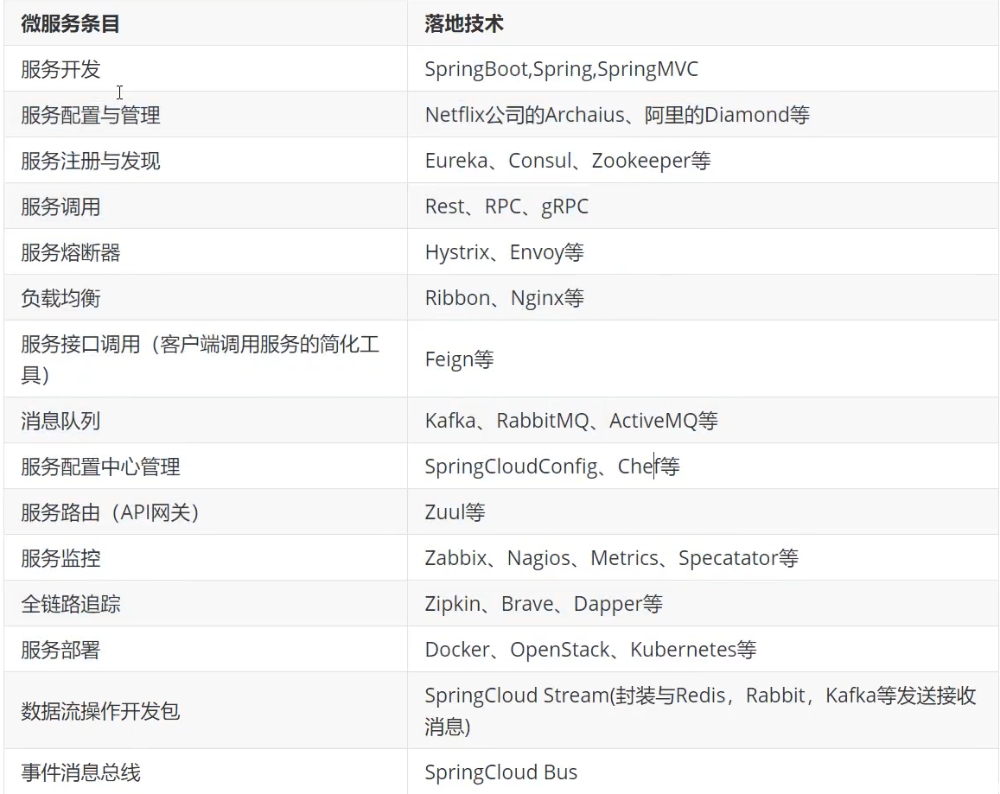

**微服务是一种思想，微服务架构是一种架构模式**

> 微服务是将大的拆成一个个小的模块
>
> 微服务架构是将单一应用程序划分为一组小的服务，服务之间互相协调、配合

**微服务和分布式的区别**

- 微服务是将一个大项目拆分成若干个小模块，进行单独开发，升级模块的时候不会影响到整个大项目运行不了

- 分布式是将各个模块运行在不同的服务器上去，来分散压力

- 微服务不一定是分布式的，分布式一定先是一个微服务

微服务架构问题、分布式架构问题

1. 这么多的服务，客户端怎么访问
2. 这么多的服务，服务之间怎么通信
3. 这么多的服务，怎么来管理
4. 服务器宕机了，怎么办

## **微服务技术栈**

## SpringCloudNetflix

[Spring Cloud Netflix 中文文档 参考手册 中文版](https://www.springcloud.cc/spring-cloud-netflix.html)

