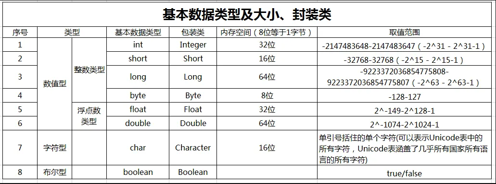
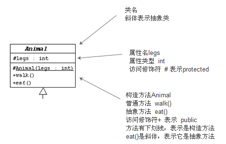
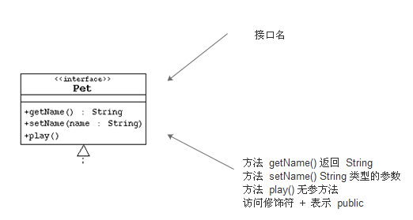
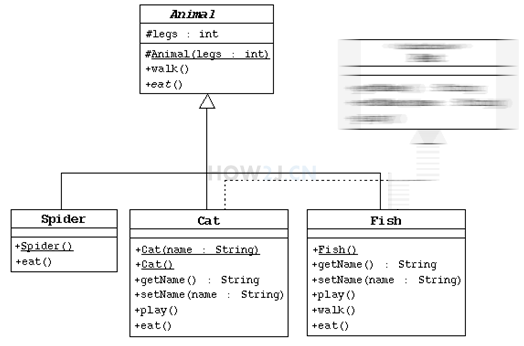
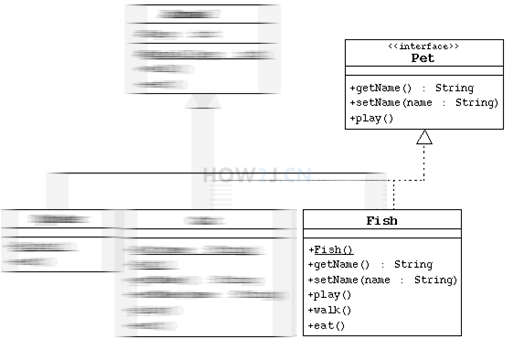

## cmd编译出现GBK问题

~~~bash
#需要带上 -encoding UTF-8 参数
javac xxx.java					# 之前
javac -encoding UTF-8 xxx.java  # 改为
~~~

## 数据类型

> Java中每一种数据都定义了明确的数据类型，在内存中分配了不同大小的内存空间

- 基本数据类型
    - 数值型
        - 整型
            - byte	1
            - short   2
            - int        4
            - long     8
        - 浮点（小数）
            - float      4
            - double  8
    - 字符型
        - char    2
    - 布尔型
        - boolean    1
- 引用数据类型
    - 类
    - 接口
    - 数组

注意点：

1. Java的整型常量默认为int型，声明long型后面需要加 ` "L"`或者 `"l"`
2. 浮点数在机器中存放形式是 符号位+指数位+尾数位 。尾数位部分有可能丢失，所以小数都是近似值
3. Java的浮点型常量默认为double型，声明float型后面需要加 ` F`或者 `"f"`

#### 包装类

>1. parse…()返回值都为基本类型
>2. valueOf返回值为对象类型，且valueOf会调用parse…()

~~~java
String a = "123";
int b = Integer.parseInt(a);		// 转换为基本类型
Integer b = Integer.valuesOf(a);	// 转换成对象类型
~~~

## 可变参数

> JDK1.5之后有的。支持传递同类型的可变参数給一个方法
>
> 在方法声明中，在指定参数类型后加一个省略号(...)
>
> 一个方法中只能指定一个可变参数，他必须是方法的最后一个参数，任何普通的参数必须在它之前声明。

~~~java
void test([int x,]int... i){}
~~~

## 随机数 公式

**Math.random()*(n-m)+m，生成大于等于m小于n的随机数；**

## 数组

> 数组是一种简单的线性序列，可以快速访问数组元素，效率高。但是 **不灵活**，容量需要事先定义好

> 删除数组中的某个元素，实质上是**数组的拷贝**

~~~java
//何构建一个对象？
//编译时类型 对象名 = new 运行时类型();
~~~

## 权限

> private 同类         
>
> default  同类同包      
>
> protected  同类同包子类	   
>
> public 所有

## 封装

> 低耦合，高内聚
>
> 隐藏信息，实现细节

## 继承

#### 语法

~~~java
class 父类{
    
}
class 子类 extends 父类{
    
}
//this 		--调用当前对象的...
//super 	--子类调用父类的变量、方法
~~~

#### super

> 1. super调用父类的构造方法，必须在构造方法的第一个
> 2. super 只能出现在子类的方法或者构造方法中
> 3. super 和 this 不能同时条用构造方法
> 4. super.x  来操作被隐藏的成员变量和方法

## 多态

> 1. 有继承关系
>
> 2. 子类重写父类方法
>
> 3. 父类引用指向子类对象
>
>     注意：多态是方法多态，**属性没有多态**

~~~java
//编译时      运行时
父类 变量名 = new 子类(); //向上转型,父类指针指向子类对象   子类->父类
~~~

> 如果子类没有，则会直接调用父类的
>
> 如果子类重写了，会直接调用子类的
>
> > **但父类如是private，则不会被重写。调用时，还会调用父类方法**
>
> 如果父类没有，则会强制类型转换

> 类型之间的转换：父	子	父类引用指向子类对象。
>
> **成员变量：编译看左边，运行看左边**
> **成员方法：编译看左边，运行看右边。**
>
> > 子类转父类，向上转型；**可能会丢失一些自己的方法**,扩展的方法没了
> >
> > 父类转子类，向下转型；需要**强制转换**

## 抽象类

> ​	只有声明。定义的是一种**规范** ，就是告诉子类必须要提供具体的实现

#### 语法

~~~java
abstract class 父类{ 
    abstract void test(){}
}
class 子类 extends 父类{
    void test(){
    //代码...
	}
}
~~~

####  使用要点

> 1. 有抽象方法的类只能定义为抽象类。
> 2. 抽象类不能实例化，即不能被new
> 3. 可以包含属性、方法、构造方法，但构造方法不能用new来实例，只能被子类调用。
> 4. 抽象类只能被用来继承
> 5. 抽象方法必须被子类来实现

## 接口

> ​	接口就是比 **抽象类**还 **抽象** ，可以更加规范的对子类进行约束
>
> ​	抽象类还可以提供一些具体实现，接口不提供任何实现，所有的方法都是抽象方法
>
> ​	是两个模块之前通信 的标准

#### 语法

~~~java
//不使用class 使用interface
//接口可以多继承
interface 接口名 [extends 父类1,父类2...]{
    常量定义;
    方法定义;
}
//实现接口
//实现类可以实现多个接口
class 类名 implements 接口名1[,接口名2...]{
    
}
~~~

#### 定义接口

> 1. 访问控制符：只能是public或default
> 2. 接口名：和类名相当命名机制
> 3. 常量：接口中的属性只能是常量。总是用public static final 修饰
> 4. 方法：接口中的方法只能是 public static final

#### 要点

> 1. 子类通过implements 来实现接口中的规范。
> 2. 接口不能被创建实例，但 **可以被用于引用变量类型**
> 3. 一个类实现了接口，必须要实现接口中所有方法，并且这些方法只能是public

## 内部类

> 内部类分为：静态内部类，非静态内部类，匿名内部类，局部内部类
>
> (类文件：外部类$内部类.class)

#### 非静态内部类

>1. 非静态内部类必须寄存在一个外部类对象中
>2. 非静态内部类可以直接访问外部类的成员
>3. 非静态内部类不能有静态方法，静态属性和静态初始化
>4. 外部类的静态方法，静态代码块不能访问非静态内部类

~~~java
//定义：
class 外部类{
	class 内部类{
        //代码...
    }
}
//实例化
外部类.内部类 变量名 = new 外部类().new 内部类();
~~~

###### 成员变量访问要点

> 1.  内部类里方法的局部变量：变量名
> 2. 内部类属性：this.变量名
> 3. 外部雷属性：外部类名.this.变量名

#### 静态内部类

> 静态内部类可以看做外部类的一个静态成员

~~~java
//定义：
class 外部类{
	static class 内部类{
        //代码...
    }
}
//实例化
外部类.内部类 变量名 = new 外部类.内部类();
~~~

#### 局部内部类

> 局部内部类被定义在方法中

~~~java
public static void main(String[] args){
    class 类名{
    }
}
~~~

#### 匿名内部类

> 适合只需要使用一次的类。没有名称，需要借助接口或者父类

~~~java
new 父类名或者接口名(){
    //代码
}
~~~

## lambda表达式

> 1. 避免匿名内部类
> 2. 代码看起来更简洁
> 3. 去掉无意义代码， 留下核心逻辑

使用lambda表达式前提是接口为函数式接口

~~~java
interface 接口名{
    int test(int a, int b);
}
接口名 a = (int a,int b) -> 5+5;
~~~

~~~java
// 之前的写法
interface 接口名{
    int test(int a, int b);
}
接口名 a = new 接口名 {
    @Override
    public int test(int a, int b) {
        return a+b;
    }
};
int a = a1.test(5,5);
~~~

#### 函数式接口

> 定义：任何接口，如果只包含唯一一个抽象方法，那么就是一个函数是接口。

## 异常

~~~java
try{
    //监控区域
}catch(想要捕获的异常类型 异常变量){
	//
}catch(父类异常){

}finally{
    //无论出不出异常，都会执行
    //有时可以不要finally
}
~~~

~~~java
throw throws //抛出异常
class 类名 throws 异常类型{
    void 方法名(){
        throw //用在方法中
    }
}
~~~

## 容器

> Collection 容器也叫集合
>
> 容器是基于数组
>
> **用来装其他对象的对象**

> List 接口的实现类 ArrayList 、LinkedList等	有顺序可重复
>
> ArrayList 	查找多，不存在线程安全问题时使用(一般使用)
>
> LinkedList	增加或删除多，不存在线程安全问题时使用
>
> Vector 		需要线程安全时使用

> Set接口的实现类 HashSet、TreeSet等			**无顺序不可重复**
>
> HashSet  采用哈希算法实现，底层实际使用HashMap，不可重复是因为添加的为键
>
> TreeSet 底层是TreeMap

> Map 接口 实现类有HashMap、TreeMap、HashTable、Properties
>
> 存放键值对，键不能重复，如果重复，新的会覆盖旧的
>
> 正常使用HashMap，需要排序的Map才是用TreeMap(底层使用红黑二叉树)
>
> HashMap 线程**不安全**，效率高。允许key或者value 为null
>
> HashTable线程安全，效率低，**不**允许key或者value为null

#### 迭代器模式

>  迭代器模式：就是提供一种方法对一个容器对象中的各个元素进行访问，而又不暴露该对象容器的内部细节

#### 遍历

###### List 的遍历

~~~java
//普通for循环
for(int i=0;i<list.size();i++){
	String temp = (String)list.get(i);
	System.out.println(temp);
}
//增强for循环
for(String temp:list){
    System.out.println(temp);
}
//Iterator(for迭代)
for(Iterator iter=list.iterator();iter.hasNext();){
    String temp = (String)iter.next();
    System.out.println(temp);
}
//Iterator(while迭代)
Iterator iter = list.iterator();
while(iter.hasNext()){
    Object obj = iter.next();
    iter.remove();//如果遍历时，删除集合中的元素，使用这种方式
}
~~~

###### set 的遍历

~~~java
//增强for循环
for(String temp:set){
    System.out.println(temp);
}
//Iterator
for(Iterator iter=set.iterator();iter.hasNext();){
    String temp = (String)iter.next();
    System.out.println(temp);
}
~~~

###### Map 的遍历

~~~java
//根据key获取value
Map<Integer,Man> maps = new HashMap<Integer,Man>();
Set<Integer> keySet =  maps.keySet();//获取key的集合
for(Integer temp:keySet){
    System.out.println(maps.get(temp).值);
}
//使用entrySet 获得键值对的集合
Set<Entry<Integer,Man>> ss = maps.entrySet();
for(Integer iterator = ss.iterator();iterator.hasNext();){
    Entry e= (Entry)iterator.next();
    System.out.println(e.getKey()+e.getValue());
}
~~~

#### Collections工具类

> 提供了对Set、List、Map进行排序、填充、查找元素的辅助方法

## 泛型

> JDK5.x 之后增加的.
>
> 泛型本质是"数据类型的参数化" 定义的是什么类型，就只能放什么类型

~~~java
//假设定义一个String容器
//实例的时候...
类名<String> 变量名 = new 类名</*JDK1.7以后可以不写*/>();
//E(T)(V) 可以看成一个形参，String是一个实参
class 类名<E(T)(V)>{
    //...
}
~~~

## 常用类

#### 时间字符串

> 时间类 Data
>
> DateFormat 属于java.text包下
>
> DateFormat是一个抽象类，一般使用它的具体实现子类SimpleDateFormat

~~~java
//把时间对象按照"格式字符串指定的格式"转成相应的字符串
DateFormat df = new SimpleDateFormat("yyyy-MM-dd hh:mm:ss");
String str = df.format(new Date());
System.out.println(str);
~~~

#### Calender日历类

> java.util 包下
>
> Calender类是一个抽象类，提供关于日期计算的相关功能
>
> GregorianCalender 是Calender类的一个具体子类，提供了标准日历系统

~~~java
Calender c = new GregorianCalender();//当天日期相关元素
c.get(...);//获取 
c.set(...);//设置
~~~

## 枚举

> JDK1.5引入的枚举类型
>
> 枚举实质上还是类，每个被枚举的成员实质就是一个枚举类型的实例
>
> 默认是 **public static final 修饰**，可以直接通过枚举类型名师用它们

~~~java
enum 枚举名{
	枚举体(也就是常量列表)
}
~~~

## 正则

相关类位于：java.util.regex包下

类 Pattern:

+ 正则表达式的编译表示形式

+ ~~~java
    Pattern p = Pattern.compile("正则模式");//建立正则表达式，启用相应模式
    ~~~

类 Matcher:

- 通过解释 Pattern 

- ~~~java
    Matcher m = p.matcher(str);//匹配str字符串
    m.group(数字)//按照正则模式的第几个范围匹配整个表达式的子字符串
    ~~~

## UML图

> UML	统一建模语言,用于描述类的属性，方法，以及类于类之间的关系

> 带箭头的实线，表示都继承

> 带箭头的虚线，表示实现

