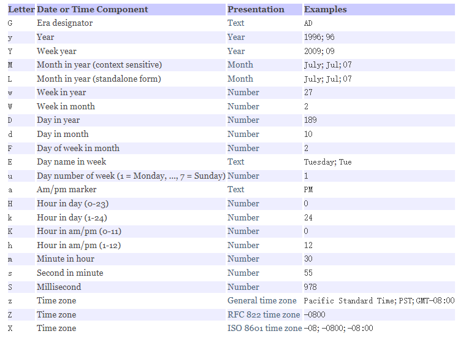

##  cmd编译出现GBK问题

~~~bash
#需要带上 -encoding UTF-8 参数
javac xxx.java					# 之前
javac -encoding UTF-8 xxx.java  # 改为
~~~

## 数据类型

> Java中每一种数据都定义了！明确的数据类型，在内存中分配了不同大小的内存空间

注意点：

1. Java的整型常量默认为int型，声明long型后面需要加 ` "L"`或者 `"l"`
2. 浮点数在机器中存放形式是 符号位+指数位+尾数位 。尾数位部分有可能丢失，所以小数都是近似值
3. Java的浮点型常量默认为double型，声明float型后面需要加 ` F`或者 `"f"`

## 位运算

#### 原码、反码、补码

1. 二进制最高位是符号位：0表示正数、1表示负数
2. 整数的原码、反码、补码都一样
3. 负数的反码 = 它的原码符号位不变，其它位取反
4. 负数的补码 = 他的反码 +1
5. 0的反码，补码都是0

按位与 **&** ：两位全为1，结果为 1 否则为 0				（全真为真）

按位或 **|**  ：两位有一个为 1 ，结果为 1 ，否则为 0 （有真为真）

按位异或 **^** ： 相同为 0   ，  不同为 1            			（一真一假为真）

按位取反 **~** ：0 ->1   1 -> 0											（真变假、假变真）

**运算时，先得到数的原码，然后算出补码，进行按位运算得到的是结果的补码，再将补码算出原码**

~~~shell
# ~-2 举例		1
-2原码：10000000 00000000 00000000 00000010
-2反码：11111111 11111111 11111111 11111101
-2补码：11111111 11111111 11111111 11111110 	# 反码 + 1
~-2 ： 00000000 00000000 00000000 00000001	 # 得到的结果的补码
结果为：00000000 00000000 00000000 00000001		# 1
~~~

算术右移 **>>**：低位溢出，符号位不变，并用符号位补溢出的高位 （相当于除以2）

算术左移**<<**：符号位不变，低位补 0												 （相当于乘以2）

逻辑右移（无符号右移）**>>>**：低位溢出，高位补0

没有"<<<"！！！

~~~shell
1>>2 : 1/2/2	# 结果为 0
1<<2 : 1*2*2	# 结果为 4
4<<3 : 4*2*2*2  # 结果为 32
~~~

## 可变参数

> JDK1.5之后有的。支持传递同类型的可变参数給一个方法

在方法声明中，在指定参数类型后加一个省略号(...)

1. 一个方法中只能指定一个可变参数
2. 可变参数的实参可以为 0个或者多个
3. 它必须是方法的最后一个参数，任何普通的参数必须在它之前声明。
4. 可变参数的本质就是数组

~~~java
void test(int... nums){ // 使用：当成数组使用
    for(int i;i<nums.length,i++){
        System.out.println(nums[i]);
    }
}
test(1,2,3);
~~~

## 随机数 公式

**m + Math.random()*(n-m+1)，生成大于等于m小于等于n的随机数；**

~~~java
// 生成 [0,10) 的随机数
(Math.random() *10);
// 生成 [5,10) 的随机数
(5 + Math.random() *(10 - 5));
// 生成 [5,10] 的随机数
(5 + Math.random() *(10 - 5 + 1));
~~~

## switch

1. 表达式数据类型，要和 case 后的常量类型保持一致或者可以自动转为可以比较的类型
2. switch中表达式（switch(这个地方的值)）必须是 byte、short、int、char、enum、String
3. case字句中的值必须是常量不能是变量
4. default子句是可选的

## 数组

> 数组可以存放多个同一类型的数据。数组也是一种数据类型，是引用类型
>
> 数组是一种简单的线性序列，可以快速访问数组元素，效率高。但是 **不灵活**，容量需要事先定义好

~~~java
// 动态初始化-1
int[] a = new int[5];
// 动态初始化-2
int[] a;
a = new int[10];
// 静态初始化
int[] a = {1,2,3,4,5}; 
~~~

~~~java
// 数组初始化如果没有赋值，默认值：
short 0，byte 0，int 0，long 0，float 0.0，double 0.0，char \u0000，boolean false，String null
~~~

**数组赋值机制**

~~~java
// 基本类型赋值 赋值的方式是 值拷贝
// 数组在默认情况下是引用传递，赋的值是地址，比如
int[] array1 = {1,2,3};
int[] array2 = array1;
array2[0] = 10;			// 此时的array1为 [10,2,3]，就是影响到了array1的值
~~~

**数组拷贝**

~~~java
// 1. 创建一个新的大小一致的数组
// 2. 遍历arr1，将每个元素拷贝到对应的位置
~~~

**数组翻转**

~~~java
for(int i = 0;i<arr.length/2;i++){
    int temp = arr[arr.length - 1 - i];
    arr[arr.length - 1 - i] = arr[i];
    arr[i] = temp;
}
~~~

#### 二维数组

~~~
二维数组的声明： int[][] x 或者 int[] x[] 或者 int x[][]

二维数组实际由多个一维数组组成，他的各个一维数组的长度可以相同，也可以不同。比如 
int[][] x = new[10][]
或 int[][] = {{1,2,3},{1}}
~~~

## 访问修饰符

- private 同类         

- default  同类同包      

+ protected  同类同包子类	   

- public 所有

## this

1. this 关键字可以用来访问本类的属性、方法、构造器
2. this 用于区分当前类的属性和局部变量
3. 访问成员方法的语法：` this.方法名(参数列表);`
4. 访问构造器语法： ` this(参数列表);`  **只能在构造器中使用（即只能在构造器中访问另一个构造器(必须放在第一条语句)）**
5. this 不能再类定义的外部使用，只能在类定义的方法中使用

## 封装

> 低耦合，高内聚
>
> 隐藏信息，实现细节

1. 将属性进行私有化 private（不能直接修改属性）
2. 提供一个公共的（public）set方法，用于对属性判断并赋值
3. 提供一个公共的（public）get方法，用于获取属性的值

## 继承

~~~java
class 父类{
    // 代码......
}
class 子类 extends 父类{
    // 代码......
}
~~~

- 子类会自动拥有父类定义的属性和方法
- 父类又叫 超类、基类
- 子类又叫 派生类

**细节**

1. 子类继承了所有的属性和方法，但是私有属性不能由子类直接访问，要通过公共的方法访问

2. 子类必须调用父类的构造器，完成父类的初始化

3. 当创建子类对象时，**默认会调用父类的无参构造**，如果父类没有，则必须在子类的构造器中用`super` 去指定父类的哪个构造器，否则编译不通过

4. 如果希望指定去调用父类的某个构造器，则需要显示的调用一下

5. `super`  在使用时，需要放在构造器第一行

6. `super()` 和 `this()`  都只能放在构造器第一行，因此**这两个方法不能共存在一个构造器中**

7. 子类只能继承一个父类，java中是单继承机制

8. 子类对象创建好后，会建立一个查找关系（父类所有的属性方法全部会被子类继承，重复的也不会覆盖）

    ~~~java
    class Father{
        String name = "爸爸";
        int age = 30;
    }
    class Son extends Father{
        String name = "儿子";
    }
    Son son = new Son();
    son.name				// 会查找自己有没有，没有查找父类有没有，一直查找到 object
    // 内存中栈的布局
    // son的实例对象			// 常量池
    name:0*11				0*11 [爸爸]
    age:30
    name:0*22				0*22 [儿子]
    ~~~

#### super

> super 代表父类的引用，用于访问父类的属性、方法、构造器

访问父类的属性，但不能访问父类的private属性  `super.属性名;`

访问父类的方法，但不能访问父类的private方法 `super.方法名(参数列表);`

访问父类的构造器 `super(参数列表)`：**只能**放在构造器的第一句

## 多态

> 方法或对象具有多种形态，建立在封装和继承基础之上

1. 属性没有多态，**属性的值看编译类型**

2. 方法的重写和重载就构成多态

3. 对象的多态：

    - 对象的编译类型和运行类型可以不一致

    - 编译类型在定义对象时，就确定了，不能改变

    - 运行类型是可以变化的

~~~java
//编译时      运行时
父类 变量名 = new 子类(); //向上转型,父类的引用指向子类对象
~~~

**向上转型**

> 父类的引用指向了子类的对象

~~~java
父类类型 引用名 = new 子类类型();
~~~

特点：

- 编译类型看左边，运行类型看右边
- 可以调用父类中的所有成员（需遵守访问权限）
- 不能调用子类中特有成员
- 最终运行效果看子类的具体实现

**向下转型**

~~~java
子类类型 引用名 = (子类类型)父类引用;
~~~

- 只能强转父类的引用，不能强转父类的对象

- 父类的引用必须指向的是当前目标类型的对象（也就是本身这个父类引用就指向了这个子类）

    ~~~java
    Animal animal = new Cat();
    Cat cat = (Cat)animal;// 本身这个父类引用就指向了这个Cat子类.
    Dog dog = (Dog)animal;// 报错，因为本身父类引用指向的不是Dog这个子类
    ~~~

- 向下转型后，可以调用子类类型中所有的成员

#### 动态绑定机制

**很重要！！**

1. 当调用对象方法的时，该方法会和该对象的内存地址/**运行类型**绑定
2. 当调用对象的属性时，没有动态绑定机制，哪里声明，哪里使用

~~~java
class A{ // 父类
    public int i = 10;
    public int getI(){
        return i;
    }
    public int sum(){
        return getI() + 10;
    }
    public int sum1(){
        return i + 10;
    }
}
class B extends A{ // 子类
    public int i = 20;
    public int getI(){
        return i;
    }
    public int sum(){
        return getI() + 20;
    }
    public int sum1(){
        return i + 10;
    }
}
~~~

~~~java
A a = new B();
System.out.println(a.sum());  // 40
System.out.println(a.sum1()); // 30
// 如果注掉子类的sum()
System.out.println(a.sum());  // 30
// 如果注掉子类的sum1()
System.out.println(a.sum1()); // 20
~~~

## 类变量和类方法

**类变量**

> 类变量也叫静态变量/静态属性，是该类的所有对象共享的变量，任何一个该类的对象去访问它，取到的都是相同的值。任何一个该类的对象去修改它，修改的也是同一个变量

~~~java
// 定义一个类变量
访问修饰符 static 数据类型 变量名;
// 访问类变量
类名.类变量名	 [推荐]
对象名.类变量名
~~~

**类方法**

> 类方法也叫静态方法

~~~java
// 定义一个类方法
访问修饰符 static 数据类型 方法名(){};
// 类方法的调用
类名.类方法名
对象名.类方法名
~~~

1. 类方法和普通方法都是随着类的加载而加载，将结构信息存储在方法区中，类方法中没有 this 这个参数，普通方法隐含着 this 这个参数
2. 类方法可以通过类名、对象名调用，普通方法和对象有关，只能通过对象名调用

## 代码块

> 代码块又称为初始化块，属于类中的成员。类似于方法，将逻辑语句封装在方法体中，通过{}包围起来。
>
> 但和方法不同，它没有方法名，没有返回，没有参数，只有方法体，而且不用通过对象或类显式调用，而是加载类时，或创建对象时隐式调用

~~~java
// 基本语法
[修饰符]{
    代码
}
// 修饰符 可选，但只能写 static
// 使用static修饰的叫静态代码块。没有static修饰，叫普通代码块
~~~

**细节**

1. static代码块随时**类加载**而执行。普通代码块，每创建一个对象，就执行

2. 类什么时候被加载

    1. 创建实例对象时（new）
    2. 子类创建实例对象时，父类也会被加载
    3. 使用类的静态成员时（静态属性，静态方法）

3. 普通的代码块，在创建对象实例时，会被隐式的调用。如果只是使用类的静态成员时，普通代码块不会执行

4. 创建一个对象时，在一个类的调用顺序是：

    1. 先调用静态代码块和静态属性初始化
    2. 再调用普通代码块和普通属性初始化
    3. 最后调用构造方法

5. 构造器的最前面隐含了 `super()` 和`调用普通代码块` 

    ~~~java
    // 举例
    class A{
        public A(){
            // super()
            // 调用普通代码块
        }
    }
    ~~~

6. 子类对象创建时，代码调用顺序：

    1. 父类的静态代码块和静态属性
    2. 子类的静态代码块和静态属性
    3. 父类的普通代码块和普通属性
    4. 父类的构造方法
    5. 子类的普通代码块和普通属性
    6. 子类的构造方法

7. 静态代码块只能直接调用静态成员（静态属性和静态方法）普通代码块可以调用任意 成员

## Final

> 可以修饰类、属性、方法

- 修饰类时，该类不能被继承，但可以实例化对象
- 修饰方法时，该方法不能被重写，可以被子类继承
- 修饰属性时，该属性即为常量
    - 如果fina修饰的属性是 静态的，则不能在构造器中赋值
- final 不能修饰构造方法
- final和static搭配使用效率更高，这样不会导致类加载

## 抽象类

> ​	只有声明。定义的是一种**规范** ，就是告诉子类必须要提供具体的实现

- 用 abstract 关键字修饰一个类时，这个类就叫抽象类

- 用 abstract 关键字修饰一个方法时，这个方法就叫抽象方法，此方法没有方法体
- 抽象类本质还是类，可以有任意成员

**语法**

~~~java
abstract class 父类{ 
    abstract void test(); // 没有方法体
}
class 子类 extends 父类{
    void test(){
    //代码...
	}
}
~~~

**使用要点**

1. 抽象类不能被实例化
2. 抽象类不一定包含 abstact方法
3. 一个类中包含了 abstract方法，则该类必须声明为 abstract
4. abstract只能修饰类和方法
5. 如果一个类继承了抽象类，则它必须实现抽象类的所有抽象方法，除非它自己也是抽象类
6. 抽象方法不能使用 private、final、static来修饰，因为这些关键字都是和重写违背。其中 static 是达不到多态的目的

## 接口

> 接口就是比 **抽象类**还 **抽象** ，可以更加规范的对子类进行约束，给出一些没有实现的方法，封装到一起
>
> jdk8.0以后接口类可以有静态方法，默认方法。就是可以有自己的方法实现

 **语法**

~~~java
interface 接口名 [extends 父类1,父类2...]{
    常量定义;
    方法定义;
    default void test(){}	// 默认方法，但需要加上default关键字
    static void test1(){} 	// 静态方法，需要加上 static 关键字
}
//实现接口
//实现类可以实现多个接口
class 类名 implements 接口名1[,接口名2...]{
    
}
~~~

**定义接口**

 1. 访问控制符：只能是public或default
 2. 接口名：和类名相当命名机制
 3. 常量：接口中的属性只能是常量。总是用public static final 修饰
 4. 方法：接口中的方法默认是public abstract 修饰
 4. 接口不能实例化

## 内部类

>  一个类的内部又完整的嵌套了另一个类结构。被嵌套的类成为内部类

内部类分为：静态内部类，非静态内部类，匿名内部类，局部内部类

(类文件：外部类$内部类.class)

#### 成员内部类

  1.  内部类里方法的局部变量：变量名
  2.  内部类属性：this.变量名
  3.  外部类属性：外部类名.this.变量名

~~~java
//定义：
class 外部类{
	class 内部类{
        //代码...
    }
}
//实例化
外部类.内部类 变量名 = new 外部类().new 内部类();
~~~

  1.  可以访问外部类的所有成员，包含私有的
  2.  作用域：在外部类的成员方法中创建成员内部类对象，在调用
  3.  成员内部类访问外部类：直接访问。外部类访问成员内部类：创建对象在访问
  4.  外部类其他类也可以访问成员内部类

#### 静态内部类

> 静态内部类可以看做外部类的一个静态成员

~~~java
//定义：
class 外部类{
	static class 内部类{
        //代码...
    }
}
//实例化
外部类.内部类 变量名 = new 外部类.内部类();
~~~

1. 可以直接访问外部类的所有成员，包含私有的，但不能访问非静态成员
2. 作用域：同其他的成员，为整个类体
3. 静态内部类访问外部类：直接访问所有静态成员
4. 外部类访问静态内部类：创建对象，再访问

#### 局部内部类

> 局部内部类被定义在局部位置，比如方法中，并且有类名

~~~java
class Outer{ // 外部类
    public void m1(){ // 方法
        class Inner{ 	// 内部类
        }
    }
}
~~~

1. 可以直接访问外部类的所有成员，包括私有的
2. 不能添加访问修饰符，因为它就是一个局部变量，但是可以使用final 修饰
3. 作用域只在定义它的方法或代码块中
4. 局部内部类访问外部类的成员：直接访问。外部其他类不能访问匿名内部类
4. 如果外部类和局部类的成员重名，默认遵循就近原则（外部类使用 外部类名.this.成员访问）

#### *匿名内部类

> 适合只需要**使用一次的类**。没有名称，需要借助接口或者父类
>
> 其运行时的名字为 `外部类名$1` `外部类$2`

匿名内部类定义在外部类的局部位置，比如方法中，并且没有类名

~~~java
class 外部类{
    new 父类名或者接口名(){				// 运行类型 外部类名$1
        //代码
    }
    Father father = new Father();	// 普通实例化Father
    Father father = new Father(){};	// 匿名内部类 运行类型: 外部类$2
}
class Father(){}
~~~

1. 可以直接访问外部类的所有成员，包含私有的
2. 不能添加访问修饰符，因为它就相当于一个局部变量
3. 作用域：只在定义它的方法或代码块中
4. 匿名内部类访问外部类成员：直接访问。外部其他类不能访问匿名内部类
5. 如果外部类和局部类的成员重名，默认遵循就近原则（外部类使用 外部类名.this.成员访问）

## lambda表达式

> 1. 避免匿名内部类
> 2. 代码看起来更简洁
> 3. 去掉无意义代码， 留下核心逻辑

使用lambda表达式前提是接口为函数式接口

**函数式接口**

> 定义：任何接口，如果只包含唯一一个**抽象**方法，那么就是一个函数是接口

~~~java
@FunctionalInterface	// 可以使用此注解来检查是否是函数式接口
interface 接口名{			// 函数式接口
    void test(int a, int b);
    /**default void test2(){	默认方法可以存在，此接口仍然是函数式接口
        // 实现代码.....
    }*/
    String toString();			// Object 下面的方法也可以存在，此接口仍然是函数式接口
}
~~~

语法格式一：无参数，无返回值

~~~java
// 之前写法
接口名 t = new 接口名(){
    public void test(){
        System.out.println("testtest");
    }
}
~~~

~~~java
// Lambda 表达式
接口名 t = () -> System.out.println("testtest");
~~~

语法格式二：有一个参数，无返回值

~~~java
(x) -> System.out.println(x);
// 一个参数小括号可以省略
x -> System.out.println(x);
~~~

语法格式三：有两个以上的参数，有返回值，有多条语句需要加大括号 `{}`

~~~java
(x,y) -> {		// 多条语句
    Syste.0m.out.println("testtest")
    return x+y;
}
(x,y) -> x+y;	// 单条语句，return 和 大括号可以省略
~~~

#### 方法引用

> 若Lambda体中的内容由方法已经实现，可以使用方法引用（可以理解为时Lambda表达式另一种表现形式）

主要有三种语法格式

- 对象::实例方法名
- 类名::静态方法名
- 类名::实例方法名

注意：

1. Lambda 体中调用方法的参数列表和返回值类型，要与函数接口中抽象方法的函数列表和返回值类型保持一致
2. Lambda 参数列表中的第一参数是实例方法的调用者，而第二个参数是实例方法的参数时，可以使用 类名::方法名

## Stream流

> Stream流是数据渠道，用于操作数据源（集合、数组等）所生成的元素序列
>
> 集合讲的是数据，流讲的是计算

Stream流的三个不步骤：

① 创建Stream（一个数据源）

② 中间操作（对数据源的数据进行处理）

③ 终止操作（执行中间操作链后产生结果）

注意：

1. Stream 自己不会存储元素
2. Stream 不会改变源对象，会返回一个新的Stream
3. Stream 操作是延迟执行的，也就是需要结果的时候才会执行

~~~java
ArrayList<String> list = new ArrayList<>();
// 1. 第一种 可以用过 Collection 系列集合提供的stream()或parallelStream()获取流
Stream<String> stringStream = list.parallelStream();	// 多线程流-并行
Stream<String> stream = list.stream();
// 2. 通过 Arrays 中的静态方法stream() 获取数组流
String[] strs = new String[10];
Stream<String> stream1 = Arrays.stream(strs);
// 3. 通过Stream类中的静态方法 of() 获取流
Stream<String> stream2 = Stream.of("aa", "bb", "cc");
~~~

#### 常用方法

~~~java
// filter -- 接收 Lambda，从流中排除某些元素
// limit  -- 截断流，使其元素不超过给定数量
// skip(n)-- 跳过元素，返回一个扔掉钱 n 个元素的流。若元素不足n个，返回一个空流
// distinct-- 筛选，通过流所生成元素的hashCode() 和 equals() 去除重复元素
~~~

~~~java
List<Employee> employees = new ArrayList<>();
employees.add(new Employee("wangwu",30));
employees.add(new Employee("lisi",10));
// filter	此处返回30 即不符合的排除掉
Stream<Employee> employeeStream = employees.stream()
    .filter((e) -> e.getAge() > 20);
employeeStream.forEach((x) -> System.out.println(x.toString()));
}
// limit	设置是几，就取几个
employees.stream().limit(2).forEach((x) -> System.out.println(x.toString()));
// skip		设置是几，就跳过几个
employees.stream().skip(2).forEach((x) -> System.out.println(x.toString()));
// distinct		注意是根据hashCode 和 equals 进行去重
employees.stream().distinct().forEach((x) -> System.out.println(x.toString()));
~~~

~~~java
// 映射
// map	-- 接收 Lambda，将元素转换为其他形式或提取信息。接收一个函数作为参数，该函数会被应用到每个元素上，并将其映射成一个新元素
// flatMap -- 接收一个函数作为参数，将流中的每个值都换成另一个流，然后把所有流连接成一个流
~~~

~~~java
// map 举例一：
employees.stream().map(employee -> employee.getName()).forEach(x -> System.out.println(x));
// map 举例二：
List<String> strings = Arrays.asList("aaa", "bbb", "ccc");
strings.stream().map((str) -> str.toUpperCase()).forEach(x-> System.out.println(x));
// flatMap
和map使用方式一样，是实现原理不懂，map将流中每个元素当成一个流使用。flatMap将每个流中元素提取出来，合并成一个流使用。
类似于  源流：{123},{4,5,6}
map={{1,2,3},{4,5,6}} flatMap={1,2,3,4,5,6}
~~~

~~~java
// 排序
List<String> strings = Arrays.asList("aaa", "ddd", "ccc");
// sorted() -- 自然排序(Comparator)
strings.stream().sorted().forEach(x-> System.out.println(x));
// sorted(Comparator com)   -- 定制排序(Comparator)
employees.stream().sorted((e1,e2) -> {
    if (e1.getAge() == e2.getAge()){
        return e1.getName().compareTo(e2.getName());
    }else {
        return e2.getAge() - e1.getAge();
    }
}).forEach(x -> System.out.println(x));
~~~

~~~java
// 查找与匹配
allMatch	-- 检查是否匹配所有元素
anyMatch --  检查是否至少匹配一个元素
noneMatch -- 检查是否没有匹配所有元素
findFirst	--   返回第一个元素
findAny	   -- 	返回当前流中的任意元素
count		-- 	  返回流中元素的总个数
max		   --    返回流中最大值
min			--	  返回流中最小值
// 举例allMatch
boolean b1 = employees.stream().allMatch((e)->e.getName("test"));
// max
Optional<Employee> op1 = employees.stream().max((e1,e2)->Double.compare(e1.getSalary(),e2.getSalary()));	// 返回Optional 是因为流中的值可能存在空指针异常，就需要返回Optional
System.out.println(op1.get());
~~~

~~~java
// 归约
// reduce(T identity,BinaryOperator)	/ reduce(BinaryOperator)	-- 可以将流中元素反复结合起来，得到一个值
List<Integer> list = Arrays.asList(1,2,3,4,5,6,7,8,9);
Integer sum = list.stream().reduce(0,(x,y) -> x + y); // 0 是起始值，先赋值给 x ，list的第一个元素赋值给y，相加的结果赋值给x，list的第二个元素赋值给y，相加的结果赋值給x……就是list的所有元素反复结合起来，最终返回一个值
System.out.println(sum);
~~~

~~~java
// 收集
// collect	-- 将流转换为其他形式。接收一个Collection接口的实现，用于給Stream中元素做汇总的方法	
employees.stream().map(Employee::getName).collect(Collectors.toList()).forEach(x-> System.out.println(x));	// 转换为List
employees.stream().map(Employee::getName).collect(Collectors.toSet()).forEach(x-> System.out.println(x));	// 转换为Set
HashSet<String> collect = employees.stream().map((x) -> x.getName())
    .collect(Collectors.toCollection(() -> new HashSet<>()));	// 转换为HashSet
// 求总数、平均值、总和、最大值……
employee.stream().collect(Collectors.averagingDouble(Employee::getSalary));	// 平均
employee.stream().collect(Collectors.summingDouble(Employee::getSalary));	// 总和
employee.stream().collect(Collectors.maxBy(e1,e2)->Double.compare(e1.getSalary(),e2.getSalary()));	// 最大值
// 分组
Map<String,List<Employee>> map = employee.stream().collect(Collectors.groupingBy(Employee::getName));
// 多级分组
Map<String,Map<String,List<Employee>>> map = employee.stream().collect(Collectors.groupingBy(Employee::getName),Collectors.groupingBy(e)->{if(((Employee)e).getAge() <= 35){return "青年"}});
// 分区
Map<String,List<Employee>> map = employee.stream().collect(Collectors.partitioningBy((e)->e.getSalary()>5000));
~~~

#### 并行流

> **并行流** 就是把一个内容分成多个数据块，并用不同的线程分别处理每个数据块的流

Java8 中将并行进行了优化，可以很容易的对数据进行并行操作。

Stream API 可以通过parallel() 与 sequential() 在并行流和顺序流中进行切换

~~~java
xxx.stream().parallel().……;	// 切换为并行流
~~~

#### Optional类

> Optional<T> 是在java.util.Optional下的一个容器类，代表一个值存在或不存在，原来用null表示一个值不存在。现在可以使用Optional更好的表达这个概念，并且可以用来避免空指针异常

常用方法

~~~java
// Optional.of(T t)				 -- 创建一个Optional 实例
// Optional.empty()			   -- 创建一个空的 Optional 实例
// Optional.ofNullable(T t)		-- 若 t 不为null，创建 Optional实例，否则创建空实例
// isPresent()				--	判断是否包含值
// orElse(T t)				--	如果调用对象包含值，返回该值，否则返回t
// orElseGet(Supplier s)	-- 如果调用对象包含值，返回该值，否则返回s获取的值
// map(Function f)			  -- 如果有值对其处理，并返回处理后的Optional，否则返回空实例
// flatMap(Function mapper)	-- 与map类似，要求返回值必须和源类型(mapper类型)相同
~~~

~~~java
Optional<Employee> op = Optional.of(new Employee());
Employee emp = op.get();	// 获取到Employee实例对象
// orElse
Optional<Employee> op = Optional.of(new Employee());
op.orElse(new Employee("zhangsan",20));	// 如果op之前有值,就之前的值，没有就new的为值
// map
Optional<Employee> op = Optional.of(new Employee());
op.orElse(new Employee("zhangsan",20));
Optional<String> str = op.map((e) -> e.getName());
System.out.println(str.get());
~~~

## 异常

> 程序执行中发生的不正常情况称为 "异常"

异常分为两种：

- 运行时异常

    常见的：NullPointerException、ArithmeticException、ArrayIndexOutOfBoundsException、ClassCastException、NumberFormatException

- 编译时异常

    常见的：SQLException、IOException、FileNotFoundException、ClassNotFoundException

~~~java
try{
    //监控区域
}catch(想要捕获的异常类型 异常变量){
	//
}catch(父类异常){

}finally{
    //无论出不出异常，都会执行
    //有时可以不要finally
}
~~~

~~~java
throw throws //抛出异常
class 类名 throws 异常类型{
    void 方法名(){
        throw //用在方法中
    }
}
~~~

**自定义异常**

1. 自定义异常类需要继承Exception 或 RuntimeException
2. 如果继承 Exception，属于编译异常
3. 如果继承 RuntimeException，属于运行时异常（一般来说，继承RuntimeException）

~~~java
class MyException extends RuntimeException{
    public MyException() {
    }
    public MyException(String message) {
        super(message);
    }
}
~~~

## 集合

> 容器是基于数组。主要有两组（单列集合 ， 双列集合）
>
> Collection 接口有两个子接口 List 、Set . 它们的子类都是**单列集合**
>
> Map 接口的实现类 是**双列集合**，存放的 K-V

- List 接口继承Collection，实现类 ArrayList 、LinkedList等	**有顺序可重复**
    - ArrayList 	查找多，不存在线程安全问题时使用(一般使用)
    -  LinkedList	增加或删除多，不存在线程安全问题时使用
    -  Vector 		需要线程安全时使用
-  Set接口继承Collection，实现类 HashSet、TreeSet等		**无顺序不可重复**
    - HashSet  采用哈希算法实现，底层**实际使用HashMap**，不可重复是因为添加的**为键**
    - LinkedHashSet  取出顺序和存入顺序一致，**底层使用LinkedHashMap**
    - TreeSet  可以进行排序    **底层是TreeMap**
- Map 接口 实现类有HashMap、Hashtable、Properties、TreeMap等
    - HashMap 线程**不安全**，效率高。允许key或者value 为null
    - Hashtable线程安全，效率低，**不允许key或者value为null**
        - Properties 继承自HashTable
    - TreeMap  可以进行排序

>存放键值对，键不能重复，如果重复，新的会覆盖旧的
>
> 正常使用HashMap，需要排序的Map才是用TreeMap(底层使用红黑二叉树)

#### 迭代器模式

>  迭代器模式：就是提供一种方法对一个容器对象中的各个元素进行访问，而又不暴露该对象容器的内部细节 

Iterator对象称为迭代器，主要用于遍历Collection集合中的元素

~~~java
// Ilerator 方法
hasNext();
next();
remove();
~~~

调用iterator.next() 方法之前必须先调用iterator.hasNext()进行检测，如果不调用且下一条记录无效，会抛出 NoSuchElementExcetion 异常

#### 遍历

> 增强 for 循环的底层使用的是 Iterator迭代器

**List 的遍历**

~~~java
//普通for循环
for(int i=0;i<list.size();i++){
	String temp = list.get(i);
	System.out.println(temp);
}
//增强for循环
for(String temp:list){
    System.out.println(temp);
}
//Iterator(while迭代)
Iterator iter = list.iterator();
while(iter.hasNext()){
    String obj = iter.next();
    iter.remove();//如果遍历时，删除集合中的元素，使用这种方式
}
~~~

**set 的遍历**

~~~java
//增强for循环
for(String temp:set){
    System.out.println(temp);
}
//Iterator
Iterator iter = list.iterator();
while(iter.hasNext()){
    String temp = iter.next();
    System.out.println(temp);
}
~~~

**Map 的遍历**

~~~java
// 第一组：先取出所有的 Key 通过key取出所有的 value
Set set = map.keySet();
for (Object key : set) {    	// 增强 for
    System.out.println(key + " " + map.get(key));
}
Iterator iterator = set.iterator();
while (iterator.hasNext()) {	// 迭代器
    Object key =  iterator.next();
    System.out.println(key + " " + map.get(key));
}
// 第二组：先取出所有的 values
Collection values = map.values();
for (Object value : values) {    // 增强 for
    System.out.println(value);
}
Iterator iterator1 = values.iterator();
while (iterator1.hasNext()) {	 // 迭代器
    Object value =  iterator1.next();
    System.out.println(value);
}
// 第三组： 通过EntrySet 来获取 k-v
Set entrySet = map.entrySet();	// Set<Map.Entry<K,V>>
for (Object entry : entrySet) {     // 增强for
    // entry 需要转为 Map.Entry
    Map.Entry e = (Map.Entry) entry;
    System.out.println(e.getKey() + " " + e.getValue());
}
Iterator iterator2 = entrySet.iterator();
while (iterator2.hasNext()) {       // 迭代器
    Object next =  iterator2.next();
    // 需要转为 Map.Entry
    Map.Entry e = (Map.Entry) next;
    System.out.println(e.getKey() + " " + e.getValue());
}
~~~

####  TreeSet排序

~~~java
TreeSet<Person> ts = new TreeSet<>(new Comparator<Person>() {
    @Override
    public int compare(Person o1, Person o2) {
        return o1.getAge() - o2.getAge();
    }
});
~~~

#### Collections工具类

> 提供了对Set、List、Map进行排序、填充、查找元素的辅助方法

常用：

~~~java
reverse(List);	// 翻转List中的元素的顺序
shuffle(List);	// 对 List 集合元素进行随机排序
sort(List);		// 根据元素的自然顺序对 List 集合元素 升序排序
sort(List,Comparator);// 根据Comparator产生的顺序对List集合元素排序
swap(List,int,int);	// 将指定 list 集合中的 i 处元素和 j 处元素交换
copy(List dest,List src); // 将 src 内容复制到 dest 中
boolean replaceAll(List list,Object oldVal,Object newVal); // 新值替换list对象的所有旧值
~~~

~~~java
Object max(Collection);// 根据元素的自然排序，返回集合中最大的元素
Object max(Collection,Comparator);//根据Comparator指定顺序，返回集合中最大的元素
Object min(Collection);
Object min(Collection,Comparator);
int frequency(Collection,Object);// 返回指定集合中指定元素的出现次数
~~~

## 集合底层

#### List

**ArrayList**

1. ArrayList 中维护了一个Object类型的数组 elementData

    ~~~java
    transient Object[] elementData;	// transient 表示短暂的，该属性不会被序列化
    ~~~

2. 当创建ArrayList对象时，如果是无参构造器，则初始化elementData的容量为0，第一次添加时，则扩容elementData为**10**，如需在扩容，则扩容elementData为**1.5倍**

3. 如果使用指定大小的构造器，则初始化elementData**容量为指定**大小，如需在扩容，则扩容elementData为**1.5倍**

**Vector**

1. Vector 中维护了一个 Object类型的数组elementData

    ~~~java
    protected Object[] elementData;
    ~~~

2. Vector扩容机制是第一次为10，如需在扩容，则扩容为之前的**2倍**

**LinkedList**

> 双向链表

#### Set

**HashSet**

1. HashSet实际上是HashMap
2. 可以存放null值，但只能有一个null值

HashSet **底层机制**：

1. 添加一个元素时，先得到hash值，会转为索引值
2. 找到存储数据表table，看这个索引位置是否已经存放有元素
    1. 如果没有，直接加入
    2. 如果有，则调用equals比较，如果相同，就放弃添加，不相同，则添加到最后
3. Java8之后一条链表的元素个数到了**默认的8个**，并且table数组的大小超过**默认的64长度** 就会进化为红黑树

HashSet、HashMap **扩容机制**：

1. HashSet 第一次添加时，table 数组扩容到16，临界值是**数组长度 * 加载因子(0.75)** = 12
2. 如果table数组使用到了临界值，就会长度 * 2
3. 关于临界值，是指一共加了12个，就会触发扩容
    1. 有可能是没有hash碰撞，都在数组上
    2. 有可能是存在hash碰撞，几个在索引为x的位置，其他在别的位置

**注意：**

~~~java
Set set = new HashSet();
set.add(new Dog("tom"));	// 成功
set.add(new Dog("tom"));	// 成功
set.add(new String("test"));// 成功
set.add(new String("test"));// 失败！！
~~~

**LinkedHashSet**

1. LinkedHashSet 底层是一个LinkedHashMap，底层维护了一个 数组 + 双向链表
2. 添加一个元素时，先求hash值，再求索引.确定该元素在hashtable的位置
3. 遍历LinkedHashSet 可以确保插入顺序和遍历顺序一致

**TreeSet**

1. 使用无参构造器时，TreeSet 是自然排序（首字母从a-z）
2. 使用有参构造器时，可以进行手动设置排序方式

~~~java
TreeSet treeSet = new TreeSet(new Comparator() {
    @Override
    public int compare(Object o1, Object o2) {
        return ((String) o2 ).compareTo((String) o1);
    }
});
treeSet.add("123");
treeSet.add("213");
System.out.println(treeSet);
~~~

#### Map

1. Map 用于保存具有映射关系的数据：Key-Value
2. Map中的key和value可以是任何**引用类型**的数据
3. Map的key不允许重复，但是value可以重复
4. Map的key最多只能有一个null，value为null可以有多个
5. 如果Map的key一样，后添加的会**覆盖**前面的
6. key和value是单向一对一关系，通过指定的key总能找到对应的value

~~~java
// map 的底层 node的创建-源码
node = newNode(hash,key,value,null);
// EntrySet集合
transient Set<Map.Entry<K,V>> entrySet;
~~~

**HashMap**

1. HashMap底层维护了Node类型的数组table
2. 当创建对象时，将加载因子初始化为0.75
3. 当添加key-value时，通过**key**的哈希值得到在table的索引，并判断该索引出是否有元素
    1. 没有元素则直接添加
    2. 存在元素，则判断该元素的key和准备加入的key是否相等
        1. 相等，则直接替换value
        2. 不相等，则判断树结构还是链表结构，做出处理，如果添加时发现容量不够，则需要扩容
4. 扩容机制查看HashSet处（HashSet的底层就是HashMap）

**特点：**

一对k-v是放在HashMap$Node中的，但是为了遍历方便，还会创建 EntrySet集合，该集合存放的元素的类型是 Entry

**Hashtable**

1. Hashtable底层数组 Hashtable$Entry[] **初始化大小为11**
2. 临界值 11 * 0.75 = 8
3. 扩容`(oldCapacity << 1) + 1`  即**乘2加1**

**TreeMap**

1. 使用无参构造器时，TreeMap 是自然排序（首字母从a-z）
2. 使用有参构造器时，可以进行手动设置排序方式

~~~java
TreeMap treeMap = new TreeMap(new Comparator() {
    @Override
    public int compare(Object o1, Object o2) {
        return ((String) o2 ).compareTo((String) o1);
    }
});
treeMap.put("123","v1");
treeMap.put("321","v1");
System.out.println(treeMap);
~~~

## 泛型

> JDK5.x 之后增加的.
>
> 泛型本质是"数据类型的参数化" 定义的是什么类型，就只能放什么类型

~~~java
// 泛型的声明
interface 接口<T>{}
class 类名<K,V>{}
// T、K、V 不代表值，而是表示类型，任意字母都可以，常用T表示，Type的缩写
~~~

**注意点：**

1. 泛型只能是引用类型（比如基本类型就不行）
2. 给泛型指定具体类型后，可以传入该类型或者其子类类型
3. 如果`List list = new ArrayList();` 这种写法默认的泛型是 Object

**自定义泛型**

注意点：

1. 在自定义泛型中，数组不能实例化

    ~~~java
    class 类名<T>{
        T[] test = new T[10];// 报错，因为数组不能确定T的类型，无法开辟空间
    }
    ~~~

2. 自定义泛型中，静态方法、静态属性、静态代码块中都不能使用泛型，因为不能确定泛型的类型，JVM无法完成初始化

3. 泛型接口的类型，在 **继承接口** 或者 **实现接口** 时需要确定

4. 泛型方法在**被调用时**，类型需要确定

    ~~~java
    public <U> void test(U u){}
    ~~~

5. 区分 泛型方法 和 使用了泛型 的方法

    ~~~java
    public <U> void test(U u){}	// 泛型方法
    public void test1(E e){}	// 使用了泛型的方法
    ~~~

**泛型的通配和继承**

1. 泛型不具备继承性

    ~~~java
    List<Object> list = new ArrayList<String>();// 报错
    ~~~

2. `<?>` 支持任意类型类型

3. `<? extends A>`  支持A类以及A类的子类，规定了泛型的上限

4. `<? super A>` 支持 A类已经A类的父类，不只是直接父类，所有的都可以，规定了泛型的下限

## 常用类

#### 包装类

~~~java
Integer i1 = Integer.valueOf(10);	// 基本类型转为包装类型	装箱
int i2 = i1.intValue();				// 包装类型转为基本类型	拆箱
~~~

1. 自动装箱底层使用的是 `valueOf()` 
2. 自动拆箱底层使用的是 `intValue()` 

**Integer 和 String 转换**

~~~java
// 包装类 -> String类型
Integer i = 10;
String s1 = i.toString();		// 方式一
String s2 = String.valueOf(i);	// 方式二(底层使用的是toString())
String s3 = i + "";				// 方式三
// String类型 -> 包装类
Integer i1 = new Integer("123");	 // 方式一
Integer i2 = Integer.parseInt("123");// 方式二
Integer i3 = Integer.valueOf("123"); // 方式三(底层使用的是parseInt())
~~~

#### String

> 字符串常量对象是用双引号括起的字符序列
>
> 数据都保存在常量池中，**不可变**的字符序列
>
> 字符串的字符使用Unicode字符编码，一个字符（不区分字母或者汉字）占两个字节

~~~java
String s = "abc";				方式一
String s1 = new String("abc");  方式二
~~~

- 方式一：先从**常量池**查看是否有“abc”数据空间，如果有，直接指向；如果没有，则创建后指向。s 最终指向的是**常量池的空间地址**
- 方式二：先在**堆**中创建空间，里面维护了value属性，指向常量池的“abc”空间。如果常量有，通过value指向；如果没有，则重新创建后指向。s1最终指向的是 **堆中的空间地址**

**注意：**

~~~java
String a = "hello";
String b = "abc";
String c = "hello" + "abc";	// 会被优化为 String c = "helloabc";
String c1 = a + b;	
String c2 = "helloabc";
System.out.println(c == c1);// false
System.out.println(c == c2);// true
~~~

重要规则：常量相加，指向的是在常量池中。变量相加，指向的是在堆中

**StringBuffer**

~~~java
StringBuffer sb = new StringBuffer();// 默认创建一个16长度的char数组
~~~

**区别**

- String保存的是字符串常量，里面的值不能更改，每次String类的更改实际是更改地址，效率低	// private final char value[]
- StringBuffer 保存的是字符串变量，里面的值可以更改，每次StringBuffer更新实际上是更新内容，不用每次更改地址，效率高   // char[] value 在堆中

#### 日期类

> 第一代日期类 Date
>
> DateFormat 属于java.text包下
>
> DateFormat是一个抽象类，一般使用它的具体实现子类SimpleDateFormat

~~~java
//把时间对象按照"格式字符串指定的格式"转成相应的字符串
DateFormat df = new SimpleDateFormat("yyyy-MM-dd HH:mm:ss");
String str = df.format(new Date());
System.out.println(str);
~~~

**Calender日历类**

> java.util 包下，第二代日期类
>
> Calender类是一个抽象类，提供关于日期计算的相关功
>
> Calender构造器是private，可以通过getInstance() 来获取实例

~~~java
Calendar c = Calendar.getInstance();
System.out.println(c.get(Calendar.YEAR));		 // 年
System.out.println(c.get(Calendar.MONTH) + 1);	 // 月
System.out.println(c.get(Calendar.DAY_OF_MONTH));// 日
~~~

GregorianCalender 是Calender类的一个具体子类，提供了标准日历系统

~~~java
Calender c = new GregorianCalender();//当天日期相关元素
c.set(9999,9,9);	// 设置
c.getWeekYear());	// 获取
~~~

*问题：*

1. 可变性：日期时间这种应该不可以改变
2. 偏移性：月份是从 0开始的
3. 格式化：格式化只对Date有用，Calender则不行
4. 线程不安全

**LocalDate(日期)、LocalTime(时间)、LocalDateTime(日期和时间)**

> JDK1.8加入的 第三代日期类

~~~java
LocalDateTime now = LocalDateTime.now();
now.getYear(); 	// 获取年份
// 按照"格式字符串指定的格式"转成相应的字符串
DateTimeFormatter dateTimeFormatter = DateTimeFormatter.ofPattern("yyyy-MM-dd HH:mm:ss");
now.format(dateTimeFormatter);
~~~

~~~java
now.plusDays(365);		// 返回当前365天后日期
now.plusMinutes(-5);	// 返回当前五分钟前的日期
~~~

## 枚举

> JDK1.5引入的枚举类型
>
> 枚举实质上还是类，每个被枚举的成员实质就是一个枚举类型的实例
>
> 枚举是一组**常量**的集合

**自定义枚举类**

~~~java
// 1. 将构造器私有化，防止被new
// 2. 去掉setxxx方法，防止被修改
// 3. 在类内部直接创建固定的对象
// 4. 加入 final 关键字优化
class Test{
    private String name;
    public final static Test SPRING = new Test("春天");
    private Test(String name){
        this.name = name;
    }
    public String getName(){
        return name;
    }
}
~~~

~~~java
enum 枚举名{
	SPRING,SUMMER;
}
System.out.println(枚举名.SPRING);	// 会调用Enim的toString方法，最后输出 SPRING
~~~
~~~java
enum Week{
    MONDAY("星期一");
    private String name;
    private Week(String name){
        this.name = name;
    }
    @Override
    public String toString() {
        return name;
    }
}
~~~

1. 使用 enum 关键字声明枚举时，默认继承Enum类
2. 传统的 `public final static Test SPRING = new Test("春天");` 可以简化成 `SPRING("春天")` , 需要知道它调用的是哪个构造器
3. 如果使用无参构造器创建 枚举对象，则实参列表的小括号可以不写
4. 有多个枚举对象时，使用`,` 间隔，最后一个使用` ;` 结尾
5. 枚举对象必须放在枚举类的行首
5. 枚举类不能在继承其他类了，因为已经隐式的继承了。但是可以实现接口

## 正则

元字符：转义符 `\`

在使用正则表达式去检索某些特殊字符的时候需要使用转义符，否则检索不到结果

需要用到转移符号的字符有：`. * + ( ) $ / \ ? [ ] ^ { }`

相关类位于：java.util.regex包下

**类 Pattern：**

Pattern对象是一个正则表达式对象，没有公共构造方法，要创建一个pattern对象，调用其公共静态方法。它返回一个Pattern对象，该方法接受一个正则表达式作为它的第一个参数

+ 正则表达式的编译表示形式

+ ~~~java
    Pattern p = Pattern.compile("正则模式");//建立正则表达式，启用相应模式
    ~~~
    
+ 当不需要获取到匹配的内容，只是来验证时，可以使用 `matches(str,regStr)`

    ~~~java
    String str = "123";
    String regStr = "\\d";
    boolean isMatch = Pattern.matches(str,regStr);
    ~~~

**类 Matcher：**

Matcher对象是对输入字符串进行解释和匹配的引擎，没有公共构造方法需要调用Pattern独享的matcher方法来获得一个Matcher对象

- ~~~java
    // 不考虑分组的情况		即 String regStr = "//d//d//d//d";
    String str = "1234你好啊9876"
    Matcher m = p.matcher(str); // 匹配的str字符串
    /** 	m.find()的作用
    	1. 根据指定的正则规则，定位满足规则的 子 字符串（比如1234）
    	2. 找到后，将 子字符串的开始的索引记录到 matcher 对象的属性 int[] groups 中
    		即groups[0] = 0，将该 子 字符串的结束索引+1的值记录到 group[1] = 4
    	3. 同时记录matcher对象的属性oldLast 的值为 子字符串 的结束的 索引+1的值。即下次
    		m.find()开始匹配的值
    */
    while (m.find()) {
        /**		m.group(0)
        	1. 根据groups[0]  和 groups[1] 记录的位置，从str中使用subString截取 子字符串
        		即 [0,4)
        */
        m.group(0);
    }
    ~~~

- ~~~java
    // 分组的情况		即 String regStr = "(//d//d)(//d//d)";	第一个小括号是第一组，第二个是第二组
    String str = "1234你好啊9876"
    Matcher m = p.matcher(str); // 匹配的str字符串
    /** 	m.find()的作用
    	1. 根据指定的正则规则，定位满足规则的 子 字符串（比如(12)(34)）
    	2. 找到后，将 子字符串的开始的索引记录到 matcher 对象的属性 int[] groups 中
    			2.1 即groups[0] = 0，将该 子 字符串的结束索引+1的值记录到 group[1] = 4
    			2.2 同时记录1组()匹配到的字符串 groups[2] = 0 groups[3] = 2
    			2.3 同时记录2组()匹配到的字符串 groups[4] = 2 groups[5] = 4
    			2.4 如果有更多的分组 ......
    	3. 同时记录matcher对象的属性oldLast 的值为 子字符串 的结束的 索引+1的值。即下次
    		m.find()开始匹配的值
    */
    while (m.find()) {
        /**	group() 底层源码：根据传的分组截取源字符串
        	getSubSequence(groups[group * 2], groups[group * 2 + 1]).toString();
        	1.group(0)：groups[0]  和 groups[1] 记录的位置 即会返回 1234
        	2.group(1)：groups[2]  和 groups[3] 记录的位置	即会返回 12
        	3.group(2)：groups[4]  和 groups[5] 记录的位置 即会返回 34
        	此例中如果使用 group(3)会报错，因为没有第三组
        */
        m.group(0);		// 表示匹配到的子字符串
        m.group(1);		// 表示匹配到的子字符串的第一组
        m.group(2);		// 表示匹配到的子字符串的
    }
    ~~~

**使用正则**

~~~java
String str = "字符串";
String regStr = "正则表达式";
Pattern p = Pattern.complie(regStr);
Matcher m = p.matcher(str);
while(m.find()){
    m.group(0);
}
~~~

**不区分大小写**

~~~java
// 方式一：
String str = "abc123ABC";	// java正则默认区分大小写
String regStr = "(?i)abc";		// 表示 abc 都不区分大小写
String regStr = "a(?i)bc";		// 表示 bc 不区分大小写
String regStr = "a((?i)b)c";	// 表示只有 b 不区分大小写
// 方式二：
String str = "abc123ABC";
String regStr = "abc";
Pattern p = Pattern.complie(regStr,Pattern.CASE_INSENSITIVE);
~~~

#### 分组

（pattern）**非命名捕获**	捕获匹配的子字符串。编号为零的第一个捕获是由整个正则表达式模式匹配的文本，其它捕获结果则根据左括号的顺序从1开始自动编号

~~~java
String regStr = "(\\d\\d)(\\d\\d)";
……
m.group(0);
m.group(1);
m.group(2);
~~~

（?<name>pattern）**命名捕获**（即给分组命名）将匹配的子字符串捕获到一个组名名称中（用于name的字符串不能包含任何标点符号，不能以数字开头）。可以使用单引号代替尖括号 即 （?'name'pattern）

~~~java
String regStr = "(?<a1>\\d\\d)(?<a2>\\d\\d)";
……
m.group(0);
m.group("a1");		// 也可以用m.group(1);
m.group("a2");		// 也可以用m.group(2);
~~~

