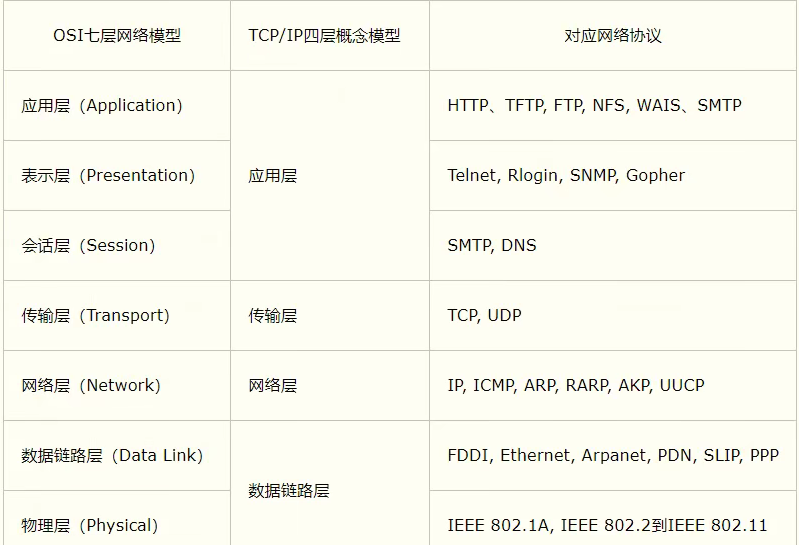

##  参考模型

## InetAddress

~~~java
// 获取本机信息
InetAddress localHost = InetAddress.getLocalHost();
// 根据指定主机名/域名获取ip地址对象
InetAddress host = InetAddress.getByName("www.baidu.com");
// 获取 InetAddress 对象的主机名
host.getHostName();
// 获取 InetAddress 对象的地址
host.getHostAddress();
~~~

## Socket

>  Socket（可翻译为 套接字） 是传输层和应用层的一个接口

> 应用程序可以通过它发送或接收数据，可对其进行像对文件一样的打开、读写和关闭等操作

网络通信其实就是Socket间的通信

- Socket允许程序把网络连接 当成一个流，数据在两个Socket间通过**IO** 传输
- 一般主动发起通信的应用程序属客户端，等待通信请求的为服务端

InetAddress:类的主要作用是封装IP及DNS

## 模拟TCP

注：如果两个Socket互相发送消息，可能会造成卡住，因为双方不知道对方有没有写完数据，需要在 写完数据后加上结束标记

~~~java
OutputStream outputStream = socket.getOutputStream();
// 3. 通过输出流，写入数据到 数据通道
outputStream.write("hello".getBytes());
// 设置写入结束标记
socket.shutdownOutput();
~~~

#### 服务端

~~~java
// 1. 在本机 9999 端口监听. 要求：9999 端口没有被占用
ServerSocket serverSocket = new ServerSocket(9999);
// 2. 当没有客户端连接 9999 端口，使程序阻塞在此等待连接
Socket socket = serverSocket.accept();
// 3. 通过 socket.getInputStream() 读取客户端写入到数据通道的数据
InputStream inputStream = socket.getInputStream();
// 4. IO 读取
byte[] buffer = new byte[1024];
int len = 0;
while ((len = inputStream.read(buffer)) != -1){
    System.out.println(new String(buffer,0,len));
}
// 5. 关闭流 和 socket
inputStream.close();
socket.close();
serverSocket.close();
~~~

#### 客户端

~~~java
// 1. 连接服务端(ip,端口)
Socket socket = new Socket("127.0.0.1", 9999);
// 2. 连接后生成 Socket，通过socket.getOutStream()得到和 socket 对象关联的输出流对象
OutputStream outputStream = socket.getOutputStream();
// 3. 通过输出流，写入数据到 数据通道
outputStream.write("hello".getBytes());
// 设置写入结束标记
socket.shutdownOutput();
// 4. 关闭流 和 socket
outputStream.close();
socket.close();
~~~

#### 字符流

客户端

~~~java
OutputStream outputStream = socket.getOutputStream();
// 3. 通过输出流，写入数据到 数据通道
BufferedWriter bufferedWriter = new BufferedWriter(new OutputStreamWriter(outputStream));
bufferedWriter.write("使用字符流");
// 插入一个换行符，表示写入内容结束，接收端需要使用readLine()!!! 
bufferedWriter.newLine();
bufferedWriter.flush();//需要手动刷新，否则数据写不到数据通道
socket.shutdownOutput();// 设置写入数据的结束标记
~~~

服务端

~~~java
InputStream inputStream = socket.getInputStream();
// 4. IO 读取
BufferedReader bufferedReader = new BufferedReader(new InputStreamReader(inputStream));
// 需要使用readLine()!!!
System.out.println(bufferedReader.readLine());
~~~

## UDP相关

1. **DatagramSocket** 和 **DatagramPacket** 实现基于UDP协议网络程序
2. UDP数据报通过数据报套接字**DatagramSocket** 发送和接收
3. **DatagramPacket** 对象凤凰了UDP 数据报，在数据包中包含了发送端的IP地址和端口号以及接收端的IP地址和端口号
4. UDP协议中每个数据报都有完整的地址信息 

~~~java
// 基本流程
1. 建立发送端，接收端
2. 建立数据包
3. 调用DatagramSocket的发送、接收方法 
4. 关闭
~~~

#### 发送端

~~~java
// 1. 准备发送
DatagramSocket socket = new DatagramSocket(9998);
// 2. 将需要发送的数据封装到 DatagramPacket 对象
byte[] data = "hello,你好".getBytes();
// 3. 发给谁
DatagramPacket packet = new DatagramPacket(data, data.length, InetAddress.getByName("127.0.0.1"), 9999);
socket.send(packet);//发送
// 4. 关闭资源
socket.close();
~~~

#### 接收端

~~~java
// 1. 等待接收
DatagramSocket socket = new DatagramSocket(9999);
// 2. 构建一个 DatagramPacket 准备接收数据
byte[] buffer = new byte[1024];
DatagramPacket packet = new DatagramPacket(buffer, buffer.length);
// 3. 调用接收方法，将通过网络传输的 DatagramPacket 对象填充到packet对象
//    没有从 9999 端口接收到数据会阻塞等待
socket.receive(packet);
// 4. 拆包，取出数据
int length = packet.getLength();// 实际接收的长度
byte[] data = packet.getData();// 接收到的数据
System.out.println(new String(data, 0, length));
// 5. 关闭
socket.close();
~~~

## 编码与解码

~~~java
// 编码
URLEncoder.encode("字符串","编码格式");
// 解码
URLDecoder.decode("字符串","编码格式");
~~~

