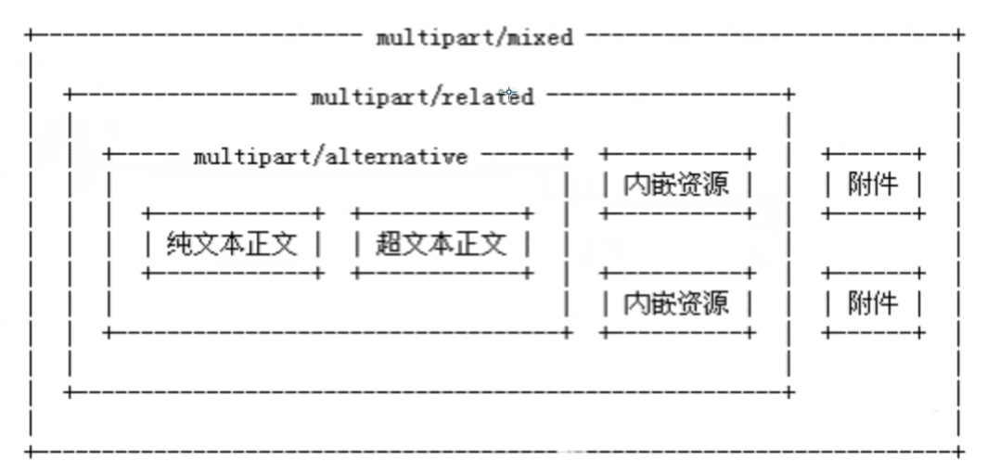

## 文件上传

浏览器在上传的过程中是将文件以流的形式提交到服务器端的

需要用到两个包 ：

Commons-io  [Maven :commons-io](https://mvnrepository.com/artifact/commons-io/commons-io)

commons-fileupload  [Maven :commons-fileupload ](https://mvnrepository.com/artifact/commons-fileupload/commons-fileupload)

#### 注意事项

1. 为保证服务器安全，上传文件应该放在外界无法直接访问的目录下，比如放在WEB-INF目录下
2. 为了防止文件覆盖的现象发生，要为上传文件产生一个唯一的文件名
3. 要限制上传文件的最大值
4. 可以限制上传文件的类型，在收到上传文件名时，判断后缀是否合法

#### 用到的类

**ServletFileUpload** 负责处理上传的文件数据，并将表单中每个输入项封装成一个 **FileItem** 对象，在使用ServletFileUpload独享解析请求时需要 **DiskFileItemFactory** 对象。我们需要在进行解析工作前构造好 DiskFileItemFactory对象，通过 ServletFileUpload对象的构造方法或setFileltemFactory() 方法设置ServletFileUpload对象的 **fileltemFactory** 属性

- FileItem 类

在HTML页面input必须有**`name <input="file" name="filename">`**

**表单如果包含一个文件上传输入项的话，这个表单的 enctype 属性就必须设置为`enctype="multipart/form-data"`**

- ServletFileUpload 类

封装成 FileItem 对象后，使用其 **parseRequest(HttpServletRequest) 方法** 可以将通过表单中每一个HTML标签提交的数据封装成一个 FileItem 对象，然后以List列表的形式返回。使用该方法处理上传文件简单易用

- DiskFileItemFactory 类

#### 代码实现(感觉有问题)

~~~java
public class FileServlet extends HttpServlet {
    @Override
    protected void doPost(HttpServletRequest req, HttpServletResponse resp) throws ServletException, IOException {
        req.setCharacterEncoding("UTF-8");
        resp.setContentType("text/html;charset=UTF-8");
        resp.setCharacterEncoding("UTF-8");
        try {
            // 判断上传的文件是普通表单还是带文件的表单
            if (!ServletFileUpload.isMultipartContent(req)){
                return; // 如果是一个普通表单，直接返回
            }
            // 创建上传文件的保存路径，建议在WEB-INF路径下，安全，用户无法直接访问上传的文件
            String uploadPath = req.getSession().getServletContext().getRealPath("/WEB-INF/upload");
            System.out.println(uploadPath);
            File uploadFile = new File(uploadPath);
            if (!uploadFile.exists()){
                uploadFile.mkdirs(); // 创建这个文件
            }

            // 缓存，临时文件
            // 临时路径，假如文件超过了预期的大小，就将其放到一个临时文件中，过几天自动删除，提醒用户转为永久
            String tmpPath = this.getServletContext().getRealPath("/WEB-INF/tmp");
            File tmpFile = new File(tmpPath);
            if (!tmpFile.exists()){
                tmpFile.mkdirs(); // 创建这个临时目录
            }

            // 处理上传的文件，一般都需要通过流来获取，可以使用request.getInputStream(),原生态的文件上传流获取，十分麻烦
            // 改用 Apache的文件上传组件来实现，commons-fileupload，需要依赖于 commons-io 组件

            // 1.创建DiskFileItemFactory 对象，处理文件上传路径或者大小限制
            DiskFileItemFactory factory = new DiskFileItemFactory();
            /**         有默认值，可以不设置
            // 通过这个工厂设置一个缓冲区，当上传的文件大于这个缓冲区的时候，将他放到临时文件中
            factory.setSizeThreshold(1024*1024);//缓存区大小为 1M
            factory.setRepository(tmpFile);//临时目录的保存目录，需要一个File
            */
            // 2.设置ServletFileUpload
            ServletFileUpload upload = new ServletFileUpload(factory);
            /**         有默认值，可以不设置
            // 监听文件上传进度
            upload.setProgressListener(new ProgressListener() {
                // PBytesRead：已经读取到的文件大小
                // pContentLength：文件大小
                @Override
                public void update(long pBytesRead, long pContentLength, int pItems) {
                    System.out.println("总大小：" + pContentLength + "已上传：" +pBytesRead);
                }
            });
            // 处理乱码问题
            upload.setHeaderEncoding("UTF-8");
            // 设置单个文件的最大值
            upload.setFileSizeMax(1024*1024*10);
            // 设置总共能上传文件的大小
            // 1024 = 1kb * 1024 = 1M * 10 = 10Mb
            upload.setSizeMax(1024*1024*10);
            */
            upload.setHeaderEncoding("UTF-8");
            //3. 处理上传的文件
            // 把前端请求解析，封装成一个fileItem对象
            List<FileItem> fileItems = upload.parseRequest(req);
            // fileItem 每一个表单对象
            for (FileItem fileItem : fileItems) {
                if (fileItem.isFormField()){ // 判断上传的文件是普通的表单还是带文件的表单
                    // getFieldName 指的是前端表单控件的 name
                    String name = fileItem.getFieldName();
                    String value = fileItem.getString("UTF-8"); // 处理乱码
                    System.out.println(name + ":" + value);
                }else{  // 文件
                    //===================================处理文件================================//
                    String uploadFileName = fileItem.getName();
                    System.out.println("上传的文件名："+uploadFileName);
                    // 可能存在文件名不合法的情况
                    if (uploadFileName.trim().equals("") || uploadFileName == null){
                        continue;
                    }
                    // 获得上传的文件名
                    String fileName = uploadFileName.substring(uploadFileName.lastIndexOf("/")+1);
                    // 获得文件的后缀名
                    String fileExName = uploadFileName.substring(uploadFileName.lastIndexOf(".")+1);

                    System.out.println("文件信息：文件名："+fileName+"---->文件类型"+fileExName);

                    req.setAttribute("name",fileName);
                    // 可以使用 UUID(唯一识别的通用码)，保证文件名唯一
                    // UUID.randomUUID(),随机生一个唯一识别的通用码
                    String uuidPath = UUID.randomUUID().toString();

                    //===================================存放地址================================//

                    // 文件真实的存在路径 realPath
                    String realPath = uploadPath + "/" + uuidPath;
                    // 給每个文件创建一个对应的文件夹
                    System.out.println(realPath);
                    File realPathFile = new File(realPath);
                    if (!realPathFile.exists()){
                        realPathFile.mkdirs();
                    }

                    //===================================文件传输================================//

                    // 获得文件上传的流
                    InputStream inputStream = fileItem.getInputStream();
                    // 创建一个文件输出流
                    // realPath = 真实的文件夹
                    // 差了一个文件，加上输出文件的名字+"/"+uuidFilename
                    FileOutputStream fos = new FileOutputStream(realPath + "/" + fileName);

                    // I/O 操作
                    byte[] buffer = new byte[1024 * 1024];
                    int len = 0;
                    while ((len = inputStream.read(buffer)) > 0){
                        fos.write(buffer,0,len);
                    }
                    // 关闭流
                    fos.close();
                    inputStream.close();

                    fileItem.delete();
                }
            }

        } catch (FileUploadException e) {
            e.printStackTrace();
        }
        req.getRequestDispatcher("/abc.jsp").forward(req,resp);
    }
~~~

~~~java
// 如果要限制后缀名
// 定义允许上传的文件扩展名
private String Ext_Name = "gif,jpg,jpeg,png,bmp,swf,flv,mp3,wav,wma,wmv,mid,avi,mpg,asf,rm,rmvb,doc,docx,xls,xlsx,ppt,htm,html,txt,zip,rar,gz,bz2";
if(!Ext_Name.contains(fileExName)){
    System.out.println("上传文件扩展名是不允许的扩展名：" + fileExName);
	return;
}
~~~

> 不明白为什么，上传中文的名字时，总显示 &#12313 不显示中文，这个是unicode编码格式。

## 邮件发送

#### SMTP

​	SMTP（Simple Mail Transfer Protocol）即简单邮件传输协议，它是一组用于由源地址到目的地址传送邮件的规则，由它来控制信件的中转方式。

#### POP3

​	使用客户端远程管理在服务器上的电子邮件

需要用到两个包

main [Maven : mail](https://mvnrepository.com/artifact/javax.mail/mail)

activation [Maven : activation ](https://mvnrepository.com/artifact/javax.activation/activation)

**QQ 举例**

需要授权码

#### 简单邮件

~~~java
public class SendEasyMail {
    public static void main(String[] args) throws GeneralSecurityException, MessagingException {

        Properties properties = new Properties();
        properties.setProperty("mail.host","smtp.qq.com");        // 设置QQ邮件服务器
        properties.setProperty("mail.transport.protocol","smtp"); // 邮件发送协议
        properties.setProperty("mail.smtp.auth","true");          // 需要验证用户名密码

        // 关于QQ邮箱，需要设置SSL加密
        MailSSLSocketFactory sf = new MailSSLSocketFactory();
        sf.setTrustAllHosts(true);
        properties.put("mail.smtp.ssl.enable","true");
        properties.put("mail.smtp.ssl.socketFactory",sf);

        // 使用JavaMail 发送邮件的 5个步骤

        // 1. 创建定义整个应用程序所需的环境信息 Session 对象
        // QQ才有！
        Session session = Session.getDefaultInstance(properties, new Authenticator() {
            public PasswordAuthentication getPasswordAuthentication(){
                // 发送人邮件用户名、授权码
                return new PasswordAuthentication("xxxxxxxxxx@qq.com","xxxxxxx");
            }
        });
        // 开启Session 的debug模式，这样就可以查看到程序发送Email的运行状态
        session.setDebug(true);

        // 2. 通过session 得到 transport 对象
        Transport transport = session.getTransport();

        // 3. 使用邮箱的用户名和授权码连上邮件服务器
        transport.connect("xxxxxxxxxxxxxxxxx@qq.com","x");

        // 4. 创建邮件(写信)
        // 注意需要传递 Session
        MimeMessage mimeMessage = new MimeMessage(session);

        // 指明邮件的发件人
        mimeMessage.setFrom(new InternetAddress("xxxxxxxxxxx@qq.com"));

        // 指明邮件的收件人(send me test)
        mimeMessage.setRecipient(MimeMessage.RecipientType.TO,new InternetAddress("xxxxxx@qq.com"));

        // 邮件的标题
        mimeMessage.setSubject("只包含文本的简单邮件");

        // 邮件的文本内容
        mimeMessage.setContent("<h1 style='color:red'>你好呀</h1>","text/html;charset=UTF-8");

        // 5. 发送邮件
        transport.sendMessage(mimeMessage,mimeMessage.getAllRecipients());

        // 6.关闭
        transport.close();
    }
}
~~~

#### 复杂邮件（有图片和附件）

- **MimeBodyPart 类**

javax.mail.internet.MimeBodyPart 类 表示的是一个 MIME消息，他和 MimeMessage类一样都是从Part接口继承过来的

- **MimeMultipart类**

javax.mail.internet.MimeMultipart 是抽象类 Multipart 的实现子类，它用来组合多个 MIME消息。一个MimeMultipart对象可以包含多个代表MIME消息的MimeBodyPart对象

> 带图片的写法其他代码同上

 ~~~java
 // 4. 创建邮件(写信)
 // 注意需要传递 Session
 MimeMessage mimeMessage = new MimeMessage(session);
 
 // 指明邮件的发件人
 mimeMessage.setFrom(new InternetAddress("xxxxxxxxx@qq.com"));
 
 // 指明邮件的收件人(send me test)
 mimeMessage.setRecipient(MimeMessage.RecipientType.TO,new InternetAddress("xxxxxxxxxx@qq.com"));
 
 // 邮件的标题
 mimeMessage.setSubject("复杂邮件");
 
 // 邮件的文本内容(带图片的)
 
 // 图片数据
 MimeBodyPart image = new MimeBodyPart();
 // 图片经过数据处理....
 String path = "xxxxxxx";
 DataHandler dataHandler = new DataHandler(new FileDataSource(path));
 image.setDataHandler(dataHandler); // 在主体中放入这个图片处理的数据
 image.setContentID("111.jpg");     // 給图片设置一个ID，后面可以使用
 
 // 正文数据
 MimeBodyPart text = new MimeBodyPart();
 // cid 就是刚刚设置的 setContentID
 text.setContent("这是一封带图片的邮件","text/html;charset=UTF-8");
 
 //描述数据关系
 MimeMultipart mimeMultipart = new MimeMultipart();
 mimeMultipart.addBodyPart(text);
 mimeMultipart.addBodyPart(image);
 mimeMultipart.setSubType("related");
 
 // 设置到消息中，保存修改
 mimeMessage.setContent(mimeMultipart);  // 把最后编辑好的邮件放到消息当中
 mimeMessage.saveChanges();              // 保存修改
 ~~~

> 带附件的，其他代码同上

~~~java
// 附件
MimeBodyPart file = new MimeBodyPart();
String path1 = "x";
DataHandler dataHandler1 = new DataHandler(new FileDataSource(path1));
file.setDataHandler(dataHandler1);
file.setFileName("test.txt");

//描述数据关系
MimeMultipart mimeMultipart = new MimeMultipart();
mimeMultipart.addBodyPart(text);
mimeMultipart.addBodyPart(image);
mimeMultipart.addBodyPart(file);
mimeMultipart.setSubType("mixed");

// 设置到消息中，保存修改
mimeMessage.setContent(mimeMultipart);  // 把最后编辑好的邮件放到消息当中
mimeMessage.saveChanges();              // 保存修改
~~~

