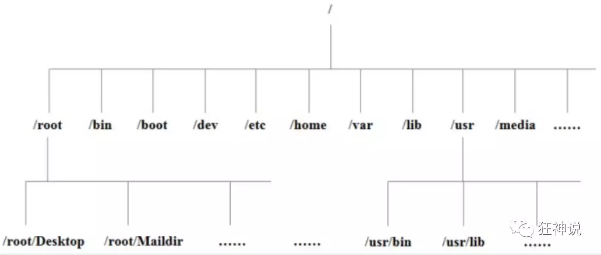

> export PATH=/bin:/usr/bin:$PATH

## 关机

~~~bash
sync			# 将数据由内存同步到硬盘中
shutdown		# 关机指令
shutdown -h now	# 现在关机
reboot			# 重启
~~~

## 防火墙

~~~bash
# 查看防火墙状态
systemctl status firewalld
# 开启防火墙
service firewalld start
# 关闭防火墙
service firewalld stop
# 重启
service firewalld restart

# 查看防火墙规则
firewall-cmd --list-all			# 查看全部信息
firewall-cmd --list-ports       # 只差看端口信息

#开启端口
firewall-cmd --zone=public --add-port=xx/tcp --permanent
#移除端口
firewall-cmd --zone=public --remove-port=xx/tcp --permanent

# 含义
--zone 				# 作用域
--add-port=xx/tcp	# 添加端口 	格式为：端口/通讯协议
--permanent			# 永久生效	缺少此参数重启后失效
~~~

## 目录结构

1.  linux 一切皆文件
2.  根目录**`/`** 所有文件都挂载在这个节点下

- **/bin：**bin是Binary缩写，这个目录存放这经常使用的命令

- **/boot：**

    存在着启动linux时使用的一些核心文件，包括一些连接文件以及镜像文件

- **/dev ：**
    dev 是 Device(设备) 的缩写, 存放的是 Linux 的外部设备，在 Linux 中访问设备的方式和访问文件的方式是相同的

- **/etc：**etc 目录用来存放所有的系统管理所需要的配置文件和子目录

- **/home**：用户的主目录，在 Linux 中，每个用户都有一个自己的目录，一般该目录名是以用户的账号命名的

- **/lib**：lib 是 Library(库) 的缩写这个目录里存放着系统最基本的动态连接共享库，其作用类似于 Windows 里的 DLL 文件。几乎所有的应用程序都需要用到这些共享库

- **/lost+found**：这个目录一般情况下是空的，当系统非法关机后，这里就存放了一些文件

- **/media**：linux 系统会自动识别一些设备，例如U盘、光驱等等，当识别后，Linux 会把识别的设备挂载到这个目录下

- **/mnt**：系统提供该目录是为了让用户临时挂载别的文件系统的，我们可以将光驱挂载在 /mnt/ 上，然后进入该目录就可以查看光驱里的内容了。（会吧一下本地文件挂载在这个目录下）

- **/opt**：opt 是 optional(可选) 的缩写，这是给主机额外安装软件所摆放的目录。比如你安装一个ORACLE、mysql数据库则就可以放到这个目录下。默认是空的

- /proc：proc 是 Processes(进程) 的缩写，/proc 是一种伪文件系统（也即虚拟文件系统），这个目录是一个虚拟的目录，它是系统内存的映射（不用管）

- **/root**：该目录为系统管理员，也称作超级权限者的用户主目录

- **/sbin**：s 就是 Super User 的意思，是 Superuser Binaries (超级用户的二进制文件) 的缩写，这里存放的是系统管理员使用的系统管理程序

- **/selinux**：这个目录是 Redhat/CentOS 所特有的目录，Selinux 是一个安全机制，类似于 windows 的防火墙，但是这套机制比较复杂，这个目录就是存放selinux相关的文件的

- **/srv**： 该目录存放一些服务启动之后需要提取的数据

- **/usr**：这是一个非常重要的目录，用户的很多应用程序和文件都放在这个目录下，类似于 windows 下的 program files 目录

- **/sys**：这是 Linux2.6 内核的一个很大的变化。该目录下安装了 2.6 内核中新出现的一个文件系统 sysfs 

- **/tmp**：tmp 是 temporary(临时) 的缩写这个目录是用来存放一些临时文件的

- **/usr/bin：**系统用户使用的应用程序

- **/usr/sbin：**超级用户使用的比较高级的管理程序和系统守护程序

- **/usr/src：**内核源代码默认的放置目录

- **/var**：var 是 variable(变量) 的缩写，这个目录中存放着在不断扩充着的东西，我们习惯将那些经常被修改的目录放在这个目录下。包括各种日志文件

- **/run**：是一个临时文件系统，存储系统启动以来的信息。当系统重启时，这个目录下的文件应该被删掉或清除

- **/www：**存放服务器网站相关的资源、环境、网站的项目

## 常用命令

> man [命令] 查看命令的使用文档

> hostname 			查看主机名
>
> hostname 名字	 修改主机名

> find						查找当前目录下文件

- -name：按名称查找

> whereis  程序	定位命令的二进制程序、源代码文件

> ls 命令

-l ：列出所有文件，包含文件的属性和权限

-a：显示所有文件，包括隐藏文件

> cd 命令

cd 目录名

cd ~  回到当前用户目录下

> pwd

显示当前所在目录

> mkdir 创建一个目录

mkdir 目录名

mkdir -p 目录1/目录2/目录3	：递归创建目录

> rmdir  删除一个目录

rmdir 目录名		: 只能删除空的目录

rmdir -p  目录1/目录2/目录3 

> cp 复制文件或者目录

cp 原来的地方  新的地方

> rm 移除文件或者目录

-f : 忽略不存在的文件，不会出现警告，强制删除

-r ：递归删除目录

-i ： 删除询问是否删除

> mv 移动文件或者目录	也可以重命名文件

-f : 强制移动

-u ：只替换已经更换过的文件

mv 文件名 文件名2

## 文件属性

linux 中文件属性第一个字符代表的含义

- [ **d**] 是目录
- [ **-**]  是文件
- [ **l**]  是链接
- [ **b**]  是装置文件，里面的可供储存的接口设备
- [ **c**]  是装置文件，里面的有串行端口设备，例如键盘、键鼠

接下来的字符，三个为一组，且均为 [ rwx ] 的三个参数的组合

其中[ **r** ]代表可读（read）、[ w ] 代表可写（write）、[ **x** ]代表可执行（execute）。如果没有相应的权限以 [ **-** ]代替

- 前三个代表 属于**主**权限	类似于windows(administrator)
- 中间三个代表 属于**组**权限 类似于windows(user)
- 后面三个代表 **其他用户**权限

> 接着的数字

代表着有几个文件

> 接着的两个单词

- 第一个代表属 主，也就是谁创建的
- 第二个代表属 组，也就是用户组

> 接着的是大小，创建日期

如果是个链接，后面的文件会写指向了谁

#### 修改文件属性

> chgrp：更改文件属组

charp [-r] 属组名 文件名

-r 递归更改文件属组

> chown ：更改文件属主，也可以同时更改文件属组

chown [-r] 属主名 文件名

chown [-r] 属主名：属组名  文件名

> *chmod：更改文件（必须掌握）

~~~bash
r:4					w:2					x:1
~~~

- chmod 数字 文件名（常用）

例如：chmod 777 可读可写可操作性	chmod 666  可读可写

​			chmod 555 可读可操作				chmod 333 可写可操作 

​			chmod 700

- chmod 符号 文件名

#### 文件内容

> cat 显示文件内容

cat [参数] 文件名

-n：显示行数，空行也算

-s：显示行数，多个空行算一个

-b：显示行数，空行不算

tac 倒着显示文件内容

> more  一页一页显示文件内容（空格代表翻页，enter代表看下一行）

-f：行号

> less 与more 类似，但是可以使用 上下键翻动页面。但退出需要q键

查找字符串	按**n** 会往下寻找查到的字符串 **N** 往上

- 使用 /字符串 向下查询

- 使用 ?字符串 向上查询

> touch 创建文件

> echo 输出字符串到终端	
>
> echo "nihao"  >> 写入的文件

#### 硬链接

>  软链接（符号链接）就像 windows 中的快捷方式

- 硬链接以文件副本的形式存在，但不占用实际空间
- 硬链接不允许給目录创建硬链接
- 硬链接只有在同一个文件系统中才能创建

> ln [ 参数 ] [ 源文件目录] [ 目标文件目录]

## Vim 编辑器

> :set nu

显示行号

> %s/字符串1/字符串2/g

全局将**字符串1** 换为**字符串2**

> 数字<space>  

0 光标会移动到一行的最开始

其他数字指的是将光标往后移动 几个

> 数字<Enter>

将光标往后移动到几行

> ctrl+u

等同于windows下的ctrl+z

## 账号管理

实质上是对**`/etc/passwd`** 文件的更新

> useradd   添加用户

useradd -选项 用户名

- -c ：添加描述
- -d ：用户组，指定用户所属的用户组
- -m：自动创建这个用户的主目录 /home/用户名

> userdel      删除用户

userdel -r 用户名：删除用户的时候将他的目录一并删除

> usermod      修改用户

> su 用户名     		切换用户

> passwd 用户名  	设置密码
>
> passwd -l 用户名	锁定用户，被锁定的用户就不能在登录系统了
>
> passwd -u 用户名    給用户解锁
>
> passwd -S 用户名	查看用户状态

- `LK` ： 密码被锁定
- `NP`： 没有设置密码
- `PS `： 密码已设置

#### 用户组

实质上是对**`/etc/group`** 文件的更新

> groupadd   创建一个用户组

groupadd  [ -g xxx ] 用户组名	-g xxx 来指定用户组的id，不写就是默认 1000之后自增 1

> groupdel      删除一个用户组

> groupmod

## 磁盘

> df 			查看整体磁盘使用量
>
> df 	-h     显示熟知的MB GB

> du 			查看当前目录下文件大小
>
> du	-h	 显示熟知的 KB

挂载磁盘

> mount  /dev/···   /mnt

卸载

> umount -f [挂载位置]

## 进程管理

> ps 查看当前系统中正在执行的各种进程的信息

- -a：显示所有终端机下执行的程序
- a： 显示所有终端机下执行的程序，包括其他用户的程序
- -A：显示所有的程序
- -u：显示程序的状况
- -x：显示所有的程序，不以终端机来区分

**`ps -ef ：`** 可以查看到父进程的信息

~~~bash
# 进程数
pstree -pu
-p 显示父id
-u 显示用户组
~~~

**常用：** ps -aux | grep mysql

#### 结束进程

kill -9 进程的id

## 环境安装

安装软件的三种方式：

- rpm
- 解压缩
- yum在线安装

#### 以安装 Java举例 rpm

1. 官网下载 jdkxxxxx.rpm
2. 安装java 环境

~~~bash
rpm -ivh rpm包					   # 安装
# 卸载
rpm -qa|grep jdk					# 查看jdk版本
rpm -e --nodeps jdk查到的jdk版本		 # 卸载
~~~

3. 配置环境变量	**`/etc/profile`**	（有问题，不要配置，后面学到再改）

~~~bash
# 先查看jdk的路径 在 /usr/java/jdkxxxx
# 在 /etc/profile 文件里添加：
JAVA_HOME=/usr/java/jdk1.8.0_321-amd64
CLASSPATH=%JAVA_HOME%/lib;%JAVA_HOME%/jre/lib
PATH=$JAVA_HOME/bin;$JAVA_HOME/jre/bin
export PATH CLASSPATH JAVA_HOME
~~~

~~~bash
source /etc/profile			# 使配置生效
~~~

#### 以安装Tomcat举例解压缩

1. 下载Tomcat 的linux版本
2. 解压这个文件

~~~bash
tar -zxvf  apache-tomcat-9.0.58.tar.gz
~~~

3. 启动tomcat

~~~bash
./startup.sh		# 启动
./shutdown.sh		# 停止
~~~
