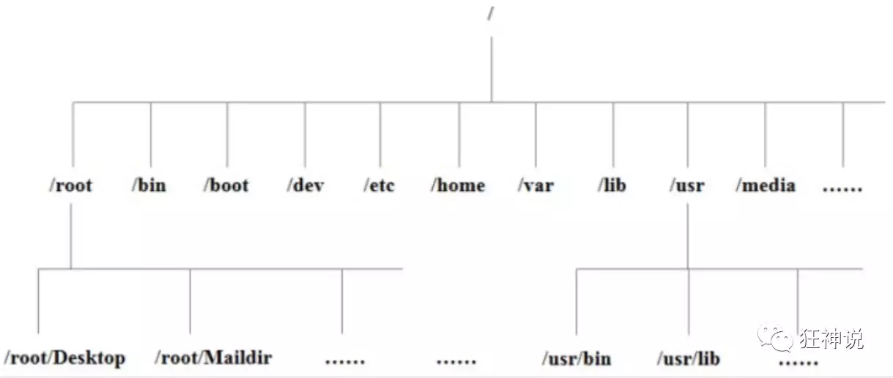

## 关机

~~~bash
sync			# 将数据由内存同步到硬盘中
shutdown		# 关机指令
shutdown -h now	# 现在关机
reboot			# 重启
~~~

## 目录结构

1.  linux 一切皆文件
2.  根目录**`/`** 所有文件都挂载在这个节点下

- **/bin：**bin是Binary缩写，这个目录存放这经常使用的命令

- **/boot：**

    存在着启动linux时使用的一些核心文件，包括一些连接文件以及镜像文件

- **/dev ：**
    dev 是 Device(设备) 的缩写, 存放的是 Linux 的外部设备，在 Linux 中访问设备的方式和访问文件的方式是相同的

- **/etc：**etc 目录用来存放所有的系统管理所需要的配置文件和子目录

- **/home**：用户的主目录，在 Linux 中，每个用户都有一个自己的目录，一般该目录名是以用户的账号命名的

- **/lib**：lib 是 Library(库) 的缩写这个目录里存放着系统最基本的动态连接共享库，其作用类似于 Windows 里的 DLL 文件。几乎所有的应用程序都需要用到这些共享库

- **/lost+found**：这个目录一般情况下是空的，当系统非法关机后，这里就存放了一些文件

- **/media**：linux 系统会自动识别一些设备，例如U盘、光驱等等，当识别后，Linux 会把识别的设备挂载到这个目录下

- **/mnt**：系统提供该目录是为了让用户临时挂载别的文件系统的，我们可以将光驱挂载在 /mnt/ 上，然后进入该目录就可以查看光驱里的内容了。（会吧一下本地文件挂载在这个目录下）

- **/opt**：opt 是 optional(可选) 的缩写，这是给主机额外安装软件所摆放的目录。比如你安装一个ORACLE、mysql数据库则就可以放到这个目录下。默认是空的

- /proc：proc 是 Processes(进程) 的缩写，/proc 是一种伪文件系统（也即虚拟文件系统），这个目录是一个虚拟的目录，它是系统内存的映射（不用管）

- **/root**：该目录为系统管理员，也称作超级权限者的用户主目录

- **/sbin**：s 就是 Super User 的意思，是 Superuser Binaries (超级用户的二进制文件) 的缩写，这里存放的是系统管理员使用的系统管理程序

- **/selinux**：这个目录是 Redhat/CentOS 所特有的目录，Selinux 是一个安全机制，类似于 windows 的防火墙，但是这套机制比较复杂，这个目录就是存放selinux相关的文件的

- **/srv**： 该目录存放一些服务启动之后需要提取的数据

- **/usr**：这是一个非常重要的目录，用户的很多应用程序和文件都放在这个目录下，类似于 windows 下的 program files 目录

- **/sys**：这是 Linux2.6 内核的一个很大的变化。该目录下安装了 2.6 内核中新出现的一个文件系统 sysfs 

- **/tmp**：tmp 是 temporary(临时) 的缩写这个目录是用来存放一些临时文件的

- **/usr/bin：**系统用户使用的应用程序

- **/usr/sbin：**超级用户使用的比较高级的管理程序和系统守护程序

- **/usr/src：**内核源代码默认的放置目录

- **/var**：var 是 variable(变量) 的缩写，这个目录中存放着在不断扩充着的东西，我们习惯将那些经常被修改的目录放在这个目录下。包括各种日志文件

- **/run**：是一个临时文件系统，存储系统启动以来的信息。当系统重启时，这个目录下的文件应该被删掉或清除

- **/www：**存放服务器网站相关的资源、环境、网站的项目

## 常用命令

> ls 命令

-l ：列出所有文件，包含文件的属性和权限

-a：显示所有文件，包括隐藏文件

> cd 命令

cd 目录名

cd ~  回到当前用户目录下

> pwd

显示当前所在目录

> mkdir 创建一个目录

mkdir 目录名

mkdir -p 目录1/目录2/目录3	：递归创建目录

> rmdir  删除一个目录

rmdir 目录名		: 只能删除空的目录

rmdir -p  目录1/目录2/目录3 

> cp 复制文件或者目录

cp 原来的地方  新的地方

> rm 移除文件或者目录

-f : 忽略不存在的文件，不会出现警告，强制删除

-r ：递归删除目录

-i ： 删除询问是否删除

> mv 移动文件或者目录	也可以重命名文件

-f : 强制移动

-u ：只替换已经更换过的文件

mv 文件名 文件名2