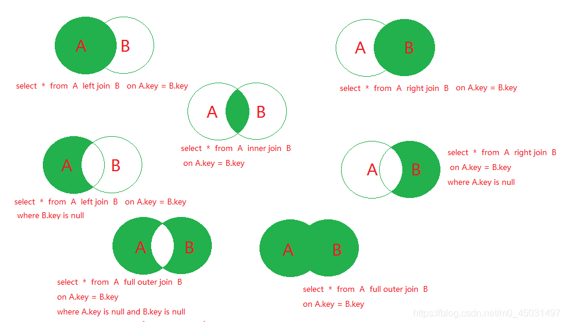

## 数据库分类

#### 关系型数据库

- Mysql、Oracle、Sql server······
- 通过表和表之间，行和列之间的关系进行数据的存储

#### 非关系型数据库

- Redis、MongoDB
- 非关系型数据库，对象存储，通过对象的自身属性来决定

#### DBMS

> DataBase Management System

数据库的管理软件，科学有效的管理我们的数据，维护和获取数据

## 数据库引擎和编码

~~~sql
-- 查看所有的存储引擎
show engines;
~~~

#### MYISAM和InnoDB区别

InnoDB 是默认使用的

myisam 是早些年使用

|                    | InnoDB               | myisam | Memory       |
| :----------------- | -------------------- | ------ | ------------ |
| 访问、添加数据速度 |                      | 快     | 快           |
| 事务支持           | 支持                 | 不支持 | 不支持       |
| 数据行锁定         | 支持                 | 不支持 | 不支持       |
| 外键约束           | 支持                 | 不支持 | 不支持       |
| 全文索引           | 不支持               | 支持   | 不支持       |
| 表空间的大小       | 较大，约为myisam 2倍 | 较小   | **在内存中** |

InooDB 在5.7之前版本重启数据库自增量会从 1 开始(因为存在在内存中)。

Memory的数据都在内存中，关机或者mysql重启，数据会丢失表结构还在

**常规使用操作**

- myisam 	节约空间，速度较快
- InnoDB      安全性高，事务的处理，多表多用户操作
- Memory     用户的在线状态 

**修改存储引擎**

~~~sql
alter table '表' engine = innodb;
~~~

#### 字符集编码

创表语句后面加上  charset=utf8. 推荐此方法，因为代码拿了就能运行

不设置的话，mysql默认字符集编码是**Latin1**，不支持中文

如果存在字符**有email表情**，需要将编码改为 utf8mb4

> 也可以在my.ini文件中配置默认的编码

~~~ini
character-set-server=utf8
~~~

**校对规则：**

utf8_bin：区分大小写

utf8_general_ci：不区分大小写

## 安装mysql

> sc delete mysql	清空服务;     在安装出现意外时使用

- 官网下载 [MySQL](https://www.mysql.com/)   （在网页最下面找）（最好下载压缩包，自己配置。     '.exe'不好卸载）
- 解压
- 配置环境变量
- 在mysql目录下新建mysql配置文件my.ini文件（如果都面出现登不进去，打开任务管理器，点开服务，找到mysql，手动点击启动，如果这个时候发现启动一下马上变成已停止。就把my.ini移动到/bin目录下，清空服务，在来一遍）

~~~mysql
[client]
# 设置mysql客户端连接服务端时默认使用的端口
port=3306
[mysqld]
# 路径后面加上"\",路径为自己 mysql 的安装目录
basedir=路径\
# 不要自己新建data，自动生成
datadir=路径\data\
port=3306
# 用来跳过密码验证，配置完可以删掉
ship-grant-tables
~~~

- 启动**管理员模式**下的CMD，并将路径切换到mysql下的 ==**bin目录**==，然后输入**`mysqld -install`** (安装mysql)
- 输入**`mysqld --initialize-insecure --user=mysql`** 初始化数据文件
- 输入 **`net start mysql`** 启动mysql
- 输入**`mysql -u root -p`** 进入到mysql管理界面 -p后面不加东西空格也不要，直接回车
- 进入后修改root密码，mysql语句后面一定要记得**`;`**

~~~mysql
update mysql.user set authentication_string=password('123456') where user='root' and Host='localhost';
~~~

~~~sql
-- mysql8 版本上面语句可能报错，使用如下语句修改root密码：
alter user 'root'@localhost identified by '123456';
~~~

- 输入**` flush privileges;`**刷新权限
- 修改my.ini 文件的跳过密码验证(可以注释掉)

## 数据库的列和字段

#### 数据库的列类型

数据库的列类型代表的就是数据类型

**数值**

- tinyint			十分小的数据	1个字节       java的Integer
- smallint          较小的数据        2个字节       java的Integer
- int                   标准的整数        4个字节       java的int
- bigint             较大的数据         8个字节       java的long
- float               单精度浮点数      4个字节      java的float
- double           双精度浮点数     8个字节       java的double
- decimal         字符串形式的浮点数   金融计算的时候，一般使用

decimal(9,2)	 代表 整数 9 位，小数 2 位      **java.math.BigDecimal**

**字符串**

- char				  字符串固定的大小 		**0~255 字符 **               java的String
- **varchar           可变字符串                    0~65535字节**  常用    java的String

- tinytext             微型文本                        
- text               文本串 , 可以当做不指定默认大小的varchar   0~65535     java的String
- longtext             文本串 ，保存大文本      0~2^32-1

注：

1. 如果是utf8编码（一个字符三字节），再需要1-3个字节记录大小，则最大为21844字符

    如果是gbk编码（一个字符两个字节）, 再需要1-3个字节记录大小 , 则最大为(65535-3)/2

2. 也就是 varchar(4) 表示4个字符且**不区分汉字或者字母**，具体多少个字节，按照编码计算

3. char(4) 是定长，即使插入'a'，只使用一个字符空间，但仍然会分配4个字符的空间

    varchar(4) 是变长(可变)，插入'a'，实际就只占一个字符的空间，具体多少字节按照编码计算（还需要再加上varchar本身需要的1-3字节来记录大小）

4. 查询速度 **char > varchar**，所以可以确定固定大小的时候，使用char，比如md5加密等

**时间日期**

- date					YYYY-MM-DD 			日期时间
- time                     HH:mm:ss                 时间格式
- **datetime             YYYY-MM-DD HH:mm:ss**   常用   java的Date（jdk1.8及其以后可以使用LocalDateTime）
- timestamp           时间戳              1970.1.1到现在的毫秒数  常用
- year                       年份表示

> null

#### 数据库的字段属性

**Unsigned**

- 无符号的整数
- 声明了该列不能存入负数
- 假设-128~127，则声明为无符号之后范围则变为 0~255

> Zerofill

- 0填充的	不足的为数，使用0来填充

> 自增

- 必须是整数类型
- 通常理解为自增，自动在上一条记录的基础上 +1(默认)
- 通常用来设计唯一的主键
- 可以自定义设计主键自增的起始值和步长

## 基础命令

~~~sql
use  数据库名;		  		 -- 切换数据库
show databases;			    -- 查看所有数据库
show tables;				-- 查看数据库中所有的表
describe 数据库名;			 -- 显示数据库中所有的表信息
exit;						-- 退出连接
~~~

> 如果不希望給大写，可以在前后加上**`** 符号。用来区别关键字和标识符

## DDL操作数据库

#### 操作数据库

~~~sql
create database 数据库名;	-- 创建数据库
drop database 数据库名;		-- 删除数据库
use 数据库名;				-- 使用数据库
show databases;			   -- 显示所有数据库
~~~

~~~sql
-- [if not exists]可选项，为如果不存在 在创建
create database [if not exists] 数据库名;
~~~

#### 创建数据表

~~~sql
-- 表名 和 字段 尽量使用 `` 括起来
-- auto_increment 自增
-- comment ''	备注
-- default 设置默认值
-- unique	唯一，不能重复(null 除外，null可以有多个)
create table if not exists `student`(
	`id` int not null auto_increment comment '学号',
    `name` varchar(30) not null default '匿名' comment '姓名' unique,
    `pwd` varchar(20) not null default '123456' comment '密码',
    `sex` varchar(2) not null default '男' comment '性别',
    `birthday` datetime default null comment '出生日期',
    `address` varchar(30) default null comment '家庭住址',
    `email` varchar(20) default null comment '邮箱',
    primary key(`id`)
 )engine=InnoDB charset=utf8 collate=utf8_general_ci
 -- engine=InnoDB	引擎
 -- charset=utf8	设置字符集
 -- collate=utf8_general_ci 设置校验规则(此处为不区分大小写)
~~~

~~~sql
-- 自增长默认从1开始，可以通过如下命令修改开始的值
alter table 表名 auto_increment = 新开始的值;
-- 如果添加数据时，给自增长字段指定了一个值，则按照指定的值开始自增长
~~~

**公式**

~~~sql
create table [if not exists] `表名`(
	'字段名' 列类型 [属性] [索引] [注释],
    ......
    '字段名' 列类型 [属性] [索引] [注释]
)[表类型][字符集设置][注释]
~~~

**可以查看语句**

~~~sql
show create database 数据库名;	 -- 查看创建数据库的语句
show create table 表名;		  -- 查看创建数据表的语句
desc 表名;					  -- 查看表的具体结构
~~~

#### 修改和删除数据表

~~~sql
-- 修改表名
alter table 旧表名 rename as 新表名;
-- 修改表的字符集
alter table 表名 character set 字符集;
-- 增加表的字段
alter table 表名 add 列名 类型();
-- 修改表的字段
alter table 表名 modify 列名 类型();		  	-- 不能改名字
alter table 表名 change 旧列名 新列名 类型();	  -- 可以改名字
-- 删除表的字段
alter table 表名 drop 列名;
-- 删除表(最好判断一下存在在删除)
drop table [if exists] 表名;
~~~

#### 修改加密方式

- 修改为普通加密

    ~~~sql
    -- yourpassword  你的密码
    ALTER USER 'root'@'localhost' IDENTIFIED WITH mysql_native_password BY 'yourpassword';
    ~~~

- 修改为caching_sha2_password 加密 （默认的加密方式）

    ~~~sql
    -- yourpassword  你的密码
    ALTER USER 'root'@'localhost' IDENTIFIED WITH caching_sha2_password BY 'yourpassword';
    ~~~

## 数据管理

#### 外键

> 设置外键的前提：主表必须具有主键约束或unique约束，且主表有想要设置为外键的列

保持数据一致性，完整性，主要目的是控制存储在外键表中的数据。使两张表形成关联，外键只能引用外表中列的值！

外键值可以为 null（允许的话）

删除有外键关系的表的时候，必须先删除引用别人的表，再删除被引用的表

> 方式一  在创建表的时候，增加约束

~~~sql
key `FK_约束名` (`本表列名`),
constraint `FK_约束名` foreign key (`作为外键列名`) references `引用的表名`(`列名`);
~~~

> 方式二  在创建表的时候没有外键关系

~~~sql
alter table `表名` add constraint `约束名` foreign key (`作为外键的列名`) references `被引用的表名`(`被引用的列名`);
~~~

以上操作都是物理外键，数据库级别的外键，不建议使用 (避免数据库过多造成困扰)

**最好办法**

- 数据库就是单纯的表，只用来存数据，只有行（数据）和列（字段）
- 想使用多张表的数据，想使用外键（使用程序去实现）

#### 删除外键

~~~sql
alter table `表名` drop foreign key `约束名`;
~~~

#### check约束

check 用于强制行数据必须满足的条件

注：mysql5.7 的check只作语法校验，不会真实生效，mysql8.0.16后支持，oracle和sql server 支持 check 约束

~~~sql
-- 列名 类型 check(条件)
sex varchar(2) check(sex in('男'),('女'))，
sal double check（sal > 1000 and sal <2000）
~~~

#### 枚举

可以当成约束使用

~~~sql
sex ENUM('男','女'),
~~~

## DML

#### 插入

~~~sql
-- 插入值
insert into `表名`(`列名1`,`列名2`) values (`列名1的值`,`列名2的值`);
-- 不写列名，插入的值会和表中的列一一匹配
insert into `表名` values (`列名1的值`,`列名2的值`);
-- 插入多条数据
insert into `表名` values('',''···),('',''···);
~~~

#### 修改

> 这个操作之前最好先备份，不然有可能需要跑路

~~~sql
-- 修改一个
update `表名` set 列名 = 表达式 where 条件;
-- 修改过个 逗号隔开
update `表名` set 列名 = 表达式[,列名 = 表达式] where 条件;
~~~

#### 删除

> 这个操作之前最好先备份，不然可能吃国家饭

~~~sql
-- 删除数据(会全部删除)
delete from `表名` ;
-- 删除指定数据
delete from `表名` where 条件;
~~~

**TRUNCATE**

作用：完全清空一个数据库表，表的结构和索引约束不会变

~~~sql
-- 删除数据,只能清除表，没有where
truncate `表名`;
~~~

**delete 和 truncate 的区别**

- 相同点：都能删除数据，都不会删除表结构
- 不同点：
    - truncate 重新设置 自增列 计数器会归零
    - truncate 不会影响事务

#### 表复制与去重

~~~sql
create table test01 like test; 	-- 将test表的结构(列)，复制到test01
~~~

~~~sql
-- 将 test 表数据复制到 test01 
insert into test01(id,name,sal······)
		select id,name,sal······ from test;
-- 自我复制
insert into test01
		select * from test01;
~~~

**去重**

思路：

1. 先创建一张临时表，该表的结构和 test 一样
2. 把test 的记录 通过 distinct 关键字处理后复制到临时表
3. 清除掉 test 记录
4. 将临时表的记录复制到 test中
5. drop 掉 临时表

~~~sql
create table temp like test;
insert into temp 
		select distinct * from test;
delete * from test
insert into test
		select * from temp;
drop table temp;
~~~

## *DQL

> select 语法

~~~sql
select [all | distinct] from `表名`  
[left | right | inner join `表名`]  -- 联合查询
[where ...]		   			-- 满足指定条件
[group by...]				-- 按照指定哪几个字段进行分组
[having] 					-- 过滤分组的记录必须满足的次要条件
[order by...(asc|desc)]		-- 指定查询的记录 按照一个或多个条件排序
[limit ]					-- 指定查询的记录从哪条到哪条(分页)
~~~

~~~sql
-- 查询
select 列名 from `表名`;
-- 起别名
select 列名1 as 别名,列名2 as 别名 from `表名` as 别名;
-- 函数 Concat(a,b)
select concat('姓名：',列名) as 别名 from `表名`;
~~~

> 数据库的列（表达式）

~~~sql
select version() 	  		-- 查询系统版本
select 100*2-1 as 计算结果    -- 用来计算
select @@auto_increment_increment -- 查询自增的步长(变量)

select `列名`+1 from `表名`    -- 还能給数字加 1
~~~

**去重distinct**

作用：去除 select 查询出来的结果中重复的数据即重复的只显示一条

~~~sql
select distinct `列名` from `表名`;
~~~

**any 和 all**

~~~sql
-- all 代表比全部高|低，相当于MAX()
select * from t where sal > all(select sal from t where id = 1);
-- 相当于
select * from t where sal > (select MAX(sal) from t where id = 1);
~~~

~~~sql
-- any 代表比任何一个高|低，相当于MIN()
select * from t where sal > any(select sal from t where id = 1);
-- 相当于
select * from t where sal > (select MIN(sal) from t where id = 1);
~~~

#### where 条件语句

**逻辑运算符**

- and：多个条件同时成立
- or：多个条件任一成立
- not：不成立，即取反

**比较运算符**

- <、>、>= 、<=、 =、 <>（ !=）：小于、大于、大于等于、小于等于、等于、不等于

- between....and....：显示在某一区间的值，闭区间

    ~~~sql
    where test between 10 and 20;
    -- 相当于
    where test >= 10 and test <= 20;
    ~~~

- in（）：显示括号中的包含的值

- is null：判断是否为空

- like '张'：模糊查询. '%' 表示0到多个任意字符. '_' 表示单个字符 

~~~sql
where like '张';		-- = 张的
where like '%张';	-- 以张 结尾 的
where like '张%';	-- 以张 开头 的
where like '%张%';	-- 包含 张 的

where like '张_';	-- 查找叫 张x 的人
~~~

#### 联表查询 join

**union all**：合并查询（求交集），不能自动去重

**union**	： 合并查询（求交集），能自动去重

| 操作       | 描述                                   |
| ---------- | -------------------------------------- |
| inner join | 如果表中至少有一个匹配，就返回行内值   |
| left join  | 会从左表中返回所有的值，即使右表中没有 |
| right join | 会从右表中返回所有的值，即使左表中没有 |

~~~ sql
select * from `表名1` [xxx] join `表名2` on `相同的列`=`相同的列`
~~~

~~~sql
select * from `表名1` [xxx] join `表名2` on `相同的列`=`相同的列` [xxx] join `表名3` on `相同的列`=`相同的列`
~~~

注：mysql 不支持outer join，需要 union

~~~sql
select * from `表名1` [xxx] right join `表名2` on `相同的列`=`相同的列` 
union 
select * from `表名1` [xxx] left join `表名2` on `相同的列`=`相同的列`
~~~

> 原来的语句：select * from A full outer join B on A.key = B.key   需要变成

~~~sql
select * from `表名1` [xxx] right join `表名2` on `相同的列`=`相同的列`
union 
select * from `表名1` [xxx] left join `表名2` on `相同的列`=`相同的列` 
~~~

#### 分页和排序

排序 order by

~~~sql
select * from `表名` where 条件 order by `列名` asc| desc -- asc 上到下升序,小到大
~~~

分页

> 缓解数据库压力

~~~sql
-- 语法：limit 起始值，几条数据
-- 显示前五名数据
select * from student where 条件
limit 0,5
~~~

~~~ini
#第一页		limie 0,5
#第二页		limie 5,5
#第三页		limie 10,5
#第N页		limie (n-1)*5,5 
公式：(n-1)*pageSize,pageSize 
#pageSize:页面大小
#n：当前页
#(n-1)*pageSize：起始值
#数据总数/页面大小 = 总页数(向上取整)
~~~

#### 嵌套查询(子查询)

~~~sql
select * from `表名` where 列名 in (
	select 列名 from `表名` where 条件
)
~~~

#### 分组过滤

~~~sql
select * from `表名`
group by 列名					 -- 通过什么字段来分组
having 聚合函数的表达式			 -- 过滤
~~~

## Mysql函数

#### 常用函数

> 数学运算

~~~sql
select ABS(-8)		-- 绝对值
select conv(8,10,2) -- 进制转换，此处为 8是10进制的 8 转换为2进制
select CEILING(9.4)	-- 向上取整
select FLOOR(9.4)	-- 向下取整
select RAND()		-- 返回一个0~1之间的随机数
select SIGN(10)		-- 判断一个数的符号 负数返回-1  整数返回 1
~~~

> 字符串函数

~~~sql
select CHARSET(str)			-- 返回字串字符集
select UCASE(str)			-- 转换为大写
select LCASE(str)			-- 转换为小写
select LENGTH(str)			-- 字符串长度，按照字节
select CHAR_LENGTH('')	    -- 字符串长度
select CONCAT('你'[,'好'...])	   -- 拼接字符串
select replace(字符串,'要换的值','想换的值')	-- 替换字符串
select SUBSTRING(str,开始位置,要取的长度)	 -- 截取字符串,开始位置从 1 计算
select trim(str)			-- 去掉前边和后边的空格
~~~

> *时间日期（记住）

~~~sql
select current_date()			-- 获取当前日期
select curdate()				-- 获取当前日期。上面同义词
select current_time()			-- 获取当前时间
select current_timestamp()		-- 当前时间戳(有年月日时分秒)
select now()					-- 获取当前的时间(有年月日时分秒)
select localtime()				-- 本地时间
select sysdate()				-- 系统时间
select year(now())				-- 年
select minute(now())			-- 分钟

select date_add(date2,interval 时间time 年|月|日|时|分|秒) -- date2 + 时间time 单位
select date_sub(date2,interval 时间time 年|月|日|时|分|秒) -- date2 - 时间time 单位
select datediff(dite1,date2)	-- 两个日期差(结果为天)
select timediff(date1,date2)	-- 两个时间差(多少小时多少分钟多少秒)

select unix_timestamp()				-- 返回1970-1-1 到现在的秒数
select from_unixtime(unix_timestamp(),'%Y-%m-%d %H:%i:%s') -- 将unix_timestamp 秒数，转成指定格式的日期
~~~

> 系统 

~~~ sql
select system_user()			-- 当前的用户
select user()					-- 当前的用户
select version()				-- 版本
~~~

#### 聚合函数

> count()	查询多少个记录

~~~sql
select count(`列名`) from `表名`	-- 会忽略所有的null值
select count(*) from `表名`		 -- 不会忽略null值，本质计算行数 
select count(1) from `表名`		 -- 不会忽略null值，本质计算行数
-- 执行效率
-- 列名为主键，count(列名)比count(1)快
-- 列名不为主键，count(1)比count(列名)快
-- count(1) 只是查一列 count(*) 查询所有,所以count(1) 效率
~~~

> sum()、avg()、max()、min()	求和、求平均、最大值、最小值

~~~sql
select sum(列名) from `表名`
select avg(列名) from `表名`	-- 会忽略所有的null值
select max(列名) from `表名`	
select min(列名) from `表名`
~~~

####  加密

~~~sql
md5(str);		-- md5加密
update `表名` set `列名` = md5(`列名`) where 条件;
select * from `表名` where `列名` = md5(加密的值);

password(str)	-- mysql数据库默认的用户密码
~~~

#### 流程控制函数

~~~sql
if(expr1,expr2,expr3)	-- 如果expr1 为 True，则返回 expr2否则返回 expr3
ifnull(expr1，expr2)		-- 如果expr1不为空，则返回 expr1，否则返回expr2

select case 					-- 类似多重分支
		when expr1 then expr2
		when expr3 then expr4
		else expr5 end;
-- 举例：
select ename ,(select case 
              	when job = 'clerk' then '职员'
              	when job = 'manager' then '经理'
              	else job end)
		from emp;
~~~

## 函数(存储过程)

~~~sql
delimiter $$ -- 写函数之前必须写。
create function 名字()
begin
	-- sql 语句
end;
delimiter
~~~

## 事务

>  什么是事务？

**要么都成功，要么都失败**

一组 SQL 语句放在一个批次中去执行

#### 事务原则	ACID

> 原子性 、一致性 、隔离性 、持久性

**原子性（Atomicity）**

要么都成功，要么都失败

**一致性（Consistency）**

事务前后的数据完整性要保证一致。比如转账前后两个人总和不变

**隔离性（Isolation）**

多个用户并发访问数据库时，数据库为每个用户开启的事务，不能被其他事务的操作干扰

**持久性（Durability）**

事务一旦提交则不可逆，被持久化到数据库中

**一些问题：**

**脏读：**

指一个事务读取了另外一个事务未提交的数据

 **不可重复读：**		针对 **更新** 操作

在一个事务内读取表中的某一行数据，多次读取结果不同(不一定是错误的)

**虚读(幻读)	**		   针对 **插入和删除** 操作 

指一个事务内读取到了别的事务插入的数据，导致前后读取不一致(数据变多了)

#### 事务隔离级别

Mysql 隔离级别定义了 **事务与事务之间的隔离程度**

​						隔离级别		 		       脏读    不可重复读    幻读    加锁读

读未提交（Read uncommitted）		√		     	√		        √			不加锁

读已提交（Read committed）			 ×		     	√				√			不加锁

可重复读（Repeatable read）			 ×                 ×				 ×			不加锁

可串行化（Serializable）					  ×                 ×		   	  ×		     加锁（发现有个事务在操作没提交，会卡住）

 **查看隔离级别**

~~~sql
select @@tx_isolation;			-- 查看当前 会话 隔离级别	mysql5.7
select @@global.tx_isolation;	-- 查看当前 系统 隔离级别

select @@transaction_isolation;	-- mysql 8
~~~

**设置隔离级别**

mysql 默认事务隔离级别是  **可重复读（Repeatable read）**   如无必要，不用修改

~~~sql
set session transaction isolation level 隔离级别;	-- 设置当前 会话 隔离级别
set global transaction isolation level 隔离级别;	-- 设置当前 系统 隔离级别
-- 举例： 设置当前 会话 隔离级别为 读已提交（Read committed）
set session transaction isolation level Read committed;
~~~

#### 	执行事务

> mysql 使用事务需要使用 InnoDB存储引擎，Myisam不支持

~~~sql
-- mysql 是默认开启事务自动提交的
set autocommit = 0	-- 关闭
set autocommit = 1  -- 开启 (默认的)
-- 手动处理事务
set autocommit = 0; -- 关闭自动提交
-- 事务开启
start transaction;	-- 标记一个事务的开始，从这之后的sql都在同一事务内
sql...
sql...
commit; 				-- 提交到持久化
rollback;				-- 回滚：回到事务开始前的样子
-- 事务结束
set autocommit = 1;	 -- 开启自动提交
~~~

> 需要了解的

~~~sql
savepoint 保存点名;				-- 设置一个事务的保存点
rollback to savepoint 保存点名; -- 回滚到保存点
release savepoint 保存点名;		-- 撤销保存点
~~~

> 模拟场景 （转账）

~~~sql
set autocommit = 0;		-- 关闭自动提交
start transaction;		-- 开启一个事务(一组sql)
update `表名` set money = money - 500 where `name` = 'A';
update `表名` set money = money + 500 where `name` = 'B';
commit;					-- 提交事务，将被持久化
rollback;				-- 回滚
set autocommit = 1;		-- 开启自动提交	恢复默认值
~~~

## 索引

> 索引 是帮助 mysql 高效获取数据的数据结构

[CodingLabs - MySQL索引背后的数据结构及算法原理](http://blog.codinglabs.org/articles/theory-of-mysql-index.html)

索引在小数据量的时候，感觉不到，但在大数据的时候，区别十分明显

#### 分类

- 主键索引（primary key）
    - 唯一的标识，主键不可重复，只能有一个列作为主键
- 唯一索引（unique key）
    - 列不能重复，唯一索引可以重复即多个列都可以标识为 唯一索引
- 常规索引（key / index）
    - 默认的。index，key 关键字来设置
- 全文索引 （fulltext）
    - 在特定的数据库引擎下有
    - 快速定位数据

~~~sql
show index from `表名`; 		-- 显示这个表的所有索引信息
~~~

#### 增加索引

> 方式一 ：建表语句中

~~~sql
(...
...
primary key(要设置主键的列名),
unique key `索引名字`(索引的列名),
key `索引名字`(索引的列名);
)
~~~

> 方式二 ： 建表之后

~~~sql
-- 方法一：
alter table 表名 add [什么类型的索引] index `索引名`(`要建立索引的列名`);
-- 方法二 ：
create 索引类型 index `索引名` on `表`(`列名`)
~~~

~~~sql
-- explain	分析sql 执行的状况
explain sql语句;
~~~

#### 删除索引

~~~sql
drop index `索引名` on `表名`;
-- 删除主键索引
alter table `表名` drop primary key;
~~~

#### 索引原则

- 索引不是越多越好
- **不对**经常变动的数据加索引
- 小数据量的表不需要加索引
- 索引一般加载常用来查询的字段上

## 视图

> 视图是一个虚拟表，内容由查询定义，数据来自对应的真实表(视图在保存的只有一个结构)

通过视图可以修改基表的数据，基表的变化也会影响到视图的数据

视图中还可以在使用视图，查询一个视图的结果作为新视图

~~~sql
-- 创建视图
create view 视图名 as select语句;
-- 更新视图
alter view 视图名 as select语句;
-- 删除视图
drop view 视图名1,视图名2;
~~~

**视图实践**

1. 安全：有些数据表的字段是保密的，不想被直接看到，可以使用视图只查询非保密的字段
2. 性能：关系数据库的数据常常会分表存储，在查询时会使用 join连接，使用视图可以避免 join

## 用户

mysql中的用户都存储在mysql库的user表中

~~~sql
select * from mysql.user;
~~~

user表的重要字段说明：

1. host：允许登录的地址，也可以使用ip地址
2. user：用户名
3. authentication_string：密码，是通过mysql 的password()函数加密之后的密码

**创建用户**

~~~sql
-- '用户名'@'哪个主机'	% 意味着谁都能连
create user '用户名'@'%' identified by '密码';
~~~

**删除用户**

~~~sql
drop user '用户名'@'主机地址';
~~~

**修改密码**

~~~sql
-- 指定修改用户的密码
alter user '用户名'@'主机地址' identified by '密码';
alter user 'root'@'主机'	identified by '密码';		-- 修改root密码
~~~

**重命名**

~~~sql
rename user 旧用户名 to 新用户名;
~~~

**用户授权**

~~~sql
-- 基本语法
grant 权限 on 库名.表名 to '用户名'@'主机地址' [identified by '密码'];
-- identified by 可以省略，也可以写出	
-- 写出：用户存在就是修改密码，用户不存在就是创建该用户

-- grant 授予的意思
-- 多个权限用逗号分开
-- all privileges 全部的权限(比root低) 因为 grant权限依旧为 N
grant select,update,delete..... on .....;
grant all privileges on 库名.表名 to '用户名'@'主机地址';
~~~

**撤销权限**

~~~sql
-- 基本语法
revoke 权限 on 库名.表名 from '用户名'@'主机地址';
revoke all privileges on 库名.表名 from '用户名'@'主机地址';
-- 权限如果没有生效，需要刷新权限(低版本)
flush privileges;
~~~

**查询权限**

~~~sql
show grants for 用户名;
show grants for root@主机;		-- 查看root权限的时候要带着主机
~~~

## 备份

备份的目的

- 保证重要的数据不丢失
- 数据转移

备份的方式

- 直接拷贝物理文件
- 在可视化工具中手动导出
- 命令行导出 mysqldump

**命令行**

~~~ini
# mysqldump [-h主机] -u用户名 -p密码 数据库 [表名1][表名2] > 磁盘位置/文件名
# mysqldump [-h主机] -u用户名 -p密码 -B 数据库 数据库2 数据库3 > 磁盘位置/文件名
# -B 加上则认为后面都是库名，不加则认为第一个之后的为表名
mysqldump [-hlocalhost] -uroot -p123456 数据库 [表名] > D:/a.sql
mysqldump [-hlocalhost] -uroot -p123456 -B 数据库 数据库2 数据库3 > D:/a.sql

# 导入
# source 备份文件 在mysql命令行的登录情况下
source d:/a.sql
mysql -u用户名 -p密码 库名 < 备份文件
~~~

## 范式

#### 三大范式

> 实际不止三大范式，而有六种。常用三大范式

> 第一范式（1NF）、第二范式（2NF）、第三范式（3NF）、巴斯-科德范式（BCNF）、第四范式（4NF）、第五范式（5NF，又称完美范式）

**第一范式（1NF）**

- 原子性：保证每一列不可再分

**第二范式（2NF）**

- 前提：满足第一范式
- 数据库中的每一列都和主键相关，而不能只与主键的某一部分相关(主要针对联合主键而言)。比如订单金额和订单号有关，和产品号没有关系(订单号和产品号作为联合主键)

**第三范式（3NF）**

- 提前：满足第一范式和第二范式
- 数据表中的每一列数据都和主键直接相关，不能间接相关 消除间接依赖

#### 规范性 性能

关联查询的表最好不超过三张表 

若要完全遵守范式，一张表甚至要拆成很多张表，那样需要做多表联合查询会有性能问题
