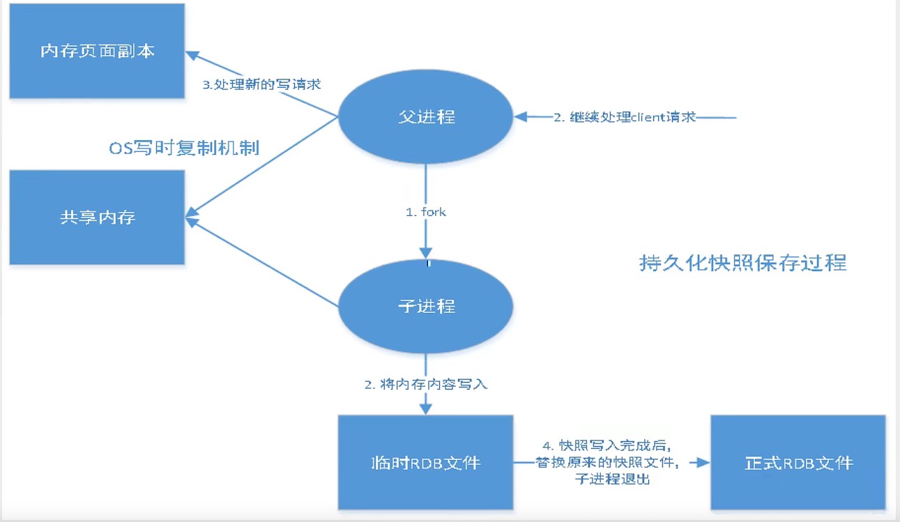
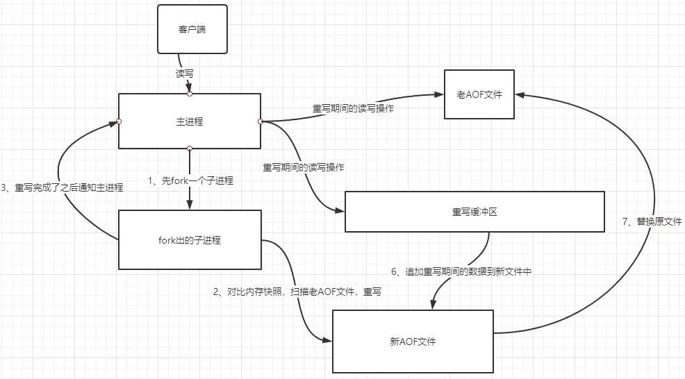
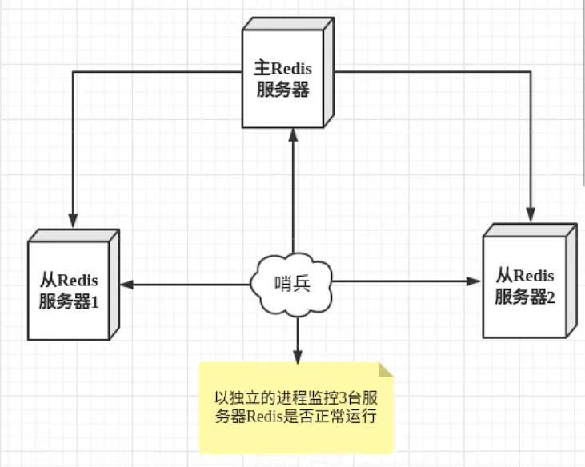
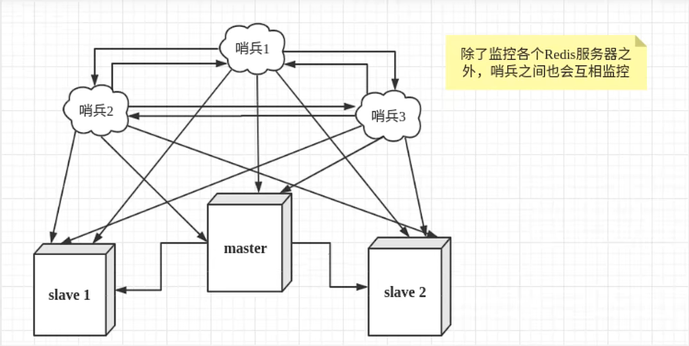

##  什么是NoSQL

> NoSQL = Not Only SQL （不仅仅是SQL） 
>
> 泛指非关系型数据库

关系型数据库：表格

**NoSQL 特点**

1. 方便扩展（数据之间没有关系，很好扩展）
2. 大数据量高性能（NoSQL的缓存记录级，是一种细粒度的缓存）
3. 数据类型是多样型的（不需要事先设计数据库，随取随用）
4. 传统 RDBMS（关系型数据库）和 NoSQL区别

~~~bash
RDEMS
- 结构化组织
- SQL
- 数据和关系都存在单独的表中
- 操作(CRUD) 数据定义语言
- 严格的一致性
- 基础的事务
- .....
~~~

~~~bash
NoSql
- 不仅仅是数据
- 没有固定的查询语句
- 键值对存储，列存储、文档存储、图形数据库(社交关系)
- 最终一致性
- CAP定理 和 BASE (异地多活)
- 高性能、高可用、可拓展
- .....
~~~

 **NoSQL四大分类**

**KV键值对：**

Redis...

**文档型数据库：**

- MongoDB
    - MongoDB 是一个基于分布式文件存储的数据库，主要用来处理大量的文档
    - MongoDB 是介于关系型数据库和非关系型数据库中间的产品！MongoDB是非关系型数据库中功能最丰富的，最像关系型数据库

**列存储数据库：**

- HBase
- 分布式文件系统

**图关系数据库：**

> 不是存图形，放的是关系。比如朋友圈社交网络，广告推荐


## Redis

>  Redis（**Re**mote **Di**ctionary **S**erver )，即远程字典服务。
>
> 是一个开源的使用 C语言编写、支持网络、可基于内存亦可持久化的日志型、Key-Value 数据库，并提供多种语言的API。

redis会周期性的把更新的数据写入磁盘或者把修改操作写入追加的记录文件，并且在此基础上实现了master-slave(主从)同步。

**Redis 能做什么**

> Redis是一个开源（BSD许可），内存存储的数据结构服务器，可用作**数据库**，**高速缓存**和**消息队列**代理。它支持字符串、哈希表、列表、集合、有序集合，位图，hyperloglogs等数据类型。内置复制、Lua脚本、LRU收回、事务以及不同级别磁盘持久化功能，同时通过Redis Sentinel提供高可用，通过Redis Cluster提供自动分区

1. 内存存储、持久化
2. 效率高，可以用于高速缓存
3. 发布订阅系统
4. 地图信息分析
5. 计时器、计数器（比如浏览量）
6. ........

[Redis 官网](https://redis.io/) 

[Redis 中文网](http://www.redis.cn/)

#### 安装

> 不推荐在 windows下使用，建议在linux下使用

[Redis 安装 | 菜鸟教程 (runoob.com)](https://www.runoob.com/redis/redis-install.html)

**windows**

1. 下载安装包：[redis ](https://github.com/tporadowski/redis/releases)              [Rides](https://github.com/microsoftarchive/redis)

2. 解压缩

3. 开启Redis： `redis-server.exe`

4. 使用 `redis-cli.exe` 来连接

    输入`ping` 来测试连通，返回`PONG` 则ok

5. 使用windows连接linux（前提开了外网链接）

~~~bash
# 调用终端
./redis-cli.exe -h 192.168.xxx.xxx -p 6379 [-a 密码]
~~~

**linux**

1. 下载获取安装包

2. 解压

    ~~~bash
    tar -zxvf redis...
    ~~~

3. 基本环境安装

~~~bash
yum install gcc-c++
# 进入到redis的目录中执行make编译     cd redis.....
make
# 进入src目录执行make install安装  		 cd src
make install
~~~

4. redis的默认安装路径`/usr/local/bin/ ` 目录下（找到安装目录）
5. 在 `usr/local/bin/` 目录下创建 一个文件夹`zconfig` 将`redis.conf` 配置文件复制进来，保证以后有问题可以恢复（可以不做）
6. redis默认不是后台启动，修改配置文件，使其默认后台启动   `daemonize` 改为 yes

   在redis....目录下找到 `redis.conf`

~~~bash
################################# GENERAL #####################################

# By default Redis does not run as a daemon. Use 'yes' if you need it.
# Note that Redis will write a pid file in /var/run/redis.pid when daemonized.
# When Redis is supervised by upstart or systemd, this parameter has no impact.
daemonize yes
~~~

7. 启动Redis服务

~~~bash
# 进入到src目录下执行
[root@zyh src]# ./redis-server ../redis.conf
~~~

8. 测试连接

~~~shell
[root@zyh bin]# ./redis-cli -p 6379
127.0.0.1:6379> ping
PONG
127.0.0.1:6379> 
~~~

9. 关闭Redis服务

~~~shell
[root@zyh bin]# ./redis-cli -p 6379
127.0.0.1:6379> shutdown
not connected> exit
~~~

#### 性能测试

**redis-benchmaek**  是一个压力测试工具


测试：

~~~shell
# 测试100 个并发，十万个请求
redis-benchmark -h localhost -p 6379 -c 100 -n 100000
~~~

~~~shell
100000 requests completed in 2.16 seconds	# 100000个请求完成时间
100 parallel clients						# 100个并发客户端
3 bytes payload								# 每次 3 个字节
keep alive: 1								# 一台服务器处理这些请求
~~~

#### 基础的知识

redis默认有 16 个数据库，默认使用的是第 0个

**select**			切换数据库

**DBSIZE** 		查看当前数据库大小

~~~shell
127.0.0.1:6379> select 1
OK
127.0.0.1:6379[1]> DBSIZE
(integer) 0
~~~

**keys**		查看所有的key

~~~shell
127.0.0.1:6379[1]> set name zhang
OK
127.0.0.1:6379[1]> set name1 zzz
OK
127.0.0.1:6379[1]> keys *
1) "name1"
2) "name"
~~~

**flushdb**  **flushall**	清空数据库

~~~shell
127.0.0.1:6379[1]> FLUSHDB	# 清空当前数据库
OK
127.0.0.1:6379> FLUSHALL	# 清空所有数据库
OK
~~~

#### 单/多线程

Redis使用单线程的原因：

1. IO多路复用
2. 维护性高，多线程会出现并发问题，并且线程切换会增加资源消耗
3. redis主要瓶颈是内存、网络，并且由于内存速度快，因此无需多线程

Redis引入多线程的原因：

> Redis在4.0就出现了多线程的概念，比如通过多线程在后台删除对象。Redis6.0正式引入多线程，但默认关闭

1. 充分利用CPU多核，6.0之前主线程只能利用一个核
2. 多线程任务可以分摊Redis同步IO读写负荷。

#### Redis-key通用命令

**exists**   判断某个key是否存在

~~~shell
127.0.0.1:6379> set name zhagn
OK
127.0.0.1:6379> EXISTS name			# 存在返回 1
(integer) 1
127.0.0.1:6379> EXISTS name1		# 不存在返回 0
(integer) 0
~~~

**move**     移动某个key到指定的数据库

~~~shell
127.0.0.1:6379> move name 1			# 移动到 1 号数据库
(integer) 1
~~~

**del**  		删除某个key

~~~shell
127.0.0.1:6379> del name			# 当前数据库删除这个key
(integer) 1
~~~

**rename** 	修改某个key

~~~shell
127.0.0.1:6379> rename name name1
OK
~~~

**expire**		设置某个存在的key多少**秒**过期

~~~shell
127.0.0.1:6379> EXPIRE name 10		# 设置十秒过期
(integer) 1
~~~

**ttl**  			查看给定的key剩余生存时间

~~~shell
127.0.0.1:6379> ttl name			
(integer) 8
127.0.0.1:6379> ttl name			# key不存在了
(integer) -2
~~~

**type**			查看key所存储的值的类型

~~~shell
127.0.0.1:6379> type name1
string
~~~

## 五大数据类型

#### String（字符串）

String类似的使用场景：value除了是字符串还可以是数字

- 计数器
- 统计多单位的数量

~~~shell
# set
# get
# append
# strlen
127.0.0.1:6379> set key1 v1				# 设置值
OK
127.0.0.1:6379> get key1				# 获取值
"v1"
127.0.0.1:6379> append key1 "hello"		# 桌架字符串，如果key不存在，就相当于 set
(integer) 7
127.0.0.1:6379> strlen key1				# 获取字符串的长度
(integer) 7
~~~

~~~shell
# i++	i--
# incr
# decr
# incrby
# decrby
127.0.0.1:6379> set i 0
OK
127.0.0.1:6379> incr i			# 自增 1
(integer) 1
127.0.0.1:6379> incr i			# 自增 1
(integer) 2
127.0.0.1:6379> decr i			# 自减 1
(integer) 1
127.0.0.1:6379> INCRBY i 10		# 自增 10
(integer) 11
127.0.0.1:6379> DECRBY i 5		# 自减 5
(integer) 6
~~~

~~~shell
# 字符串范围
# getrange
# setrange
127.0.0.1:6379> set key1 "hello"
OK
127.0.0.1:6379> getrange key1 0 3	# 截取字符串 [0,3]
"hell"
127.0.0.1:6379> GETRANGE key1 0 -1	# 和 get key1一样
"hello"
# 替换
127.0.0.1:6379> SETRANGE key1 1 xx	# 从指定位置开始替换字符串
(integer) 5
127.0.0.1:6379> get key1
"hxxlo"
~~~

~~~shell
# setex(set with expire)	# 设置过期时间
# setnx(set if not exist) 	# 不存在再设置(分布式锁中常常使用)
127.0.0.1:6379> setex key2 30 "test"	# 设置key2的值为 test，30秒后过期
OK
127.0.0.1:6379> ttl key2
(integer) 26
127.0.0.1:6379> setnx mykey "redis"		# 不存在mykey 所以成功了
(integer) 1
127.0.0.1:6379> setnx mykey "11111"		# 存在mykey 所以失败了
(integer) 0
~~~

~~~shell
# mset			# 批量设置
# mget			# 批量获取
# msetnx		# 不存在再设置，msetnx是一个原子性的操作，要么一起成功，要么一起失败
127.0.0.1:6379> mset k1 v1 k2 v2 k3 v3		# 同时设置多个值
OK
127.0.0.1:6379> mget k1 k2 k3				# 同时获取多个值
1) "v1"
2) "v2"
3) "v3"
127.0.0.1:6379> msetnx k1 v1 k4 v4			# k1 存在，所以失败了
(integer) 0
~~~

~~~shell
# getset  			# 先get然后再set
127.0.0.1:6379> getset key1 test	# 如果不存在值，则返回nil
(nil)
127.0.0.1:6379> get key1		
"test"
127.0.0.1:6379> getset key1 hello	# 如果存在值，获取原来的值，并设置新的值
"test"
127.0.0.1:6379> get key1
"hello"
~~~

~~~shell
# 可以的一个设计： user:{ud}:{filed}
127.0.0.1:6379> mset user:1:name zhang user:1:age 2
OK
127.0.0.1:6379> mget user:1:name user:1:age
1) "zhang"
2) "2"
~~~

#### List（列表）

> 在redis里面，可以将list变成 栈、队列、阻塞队列

命令是用 `L` 开头 只有push和pop才分左右，其余的不分

~~~shell
# lpush			# 将一个或多个值插入到列表头部
# rpush			# 在列表中添加一个或多个值
# lrange		# 获取列表指定范围内的元素
127.0.0.1:6379> lpush list1 one		# 插入到头部
(integer) 1
127.0.0.1:6379> lpush list1 two
(integer) 2
127.0.0.1:6379> lpush list1 three
(integer) 3
127.0.0.1:6379> lrange list1 0 -1
1) "three"
2) "two"
3) "one"
127.0.0.1:6379> rpush list1 four	# 插入到尾部
(integer) 4
127.0.0.1:6379> lrange list1 0 -1
1) "three"
2) "two"
3) "one"
4) "four"
~~~

~~~shell
# lpop				# 移出并获取列表的第一个元素 - 头
# rpop				# 移除并获取列表最后一个元素 - 尾
127.0.0.1:6379> lpop list1 1			# 移除头部
1) "three"
127.0.0.1:6379> rpop list1 1			# 移除尾部
1) "four"
127.0.0.1:6379> lrange list1 0 -1
1) "two"
2) "one"
~~~

~~~shell
# lindex            # 通过索引获取列表中的元素
# lrem				# 移除集合中指定个数的value
127.0.0.1:6379> lindex list1 0		
"two"
127.0.0.1:6379> lrem list1 1 one
(integer) 1
~~~

~~~shell
# llen				# 返回列表的长度
# ltrim				# 对一个列表进行修剪(trim)，就是说，让列表只保留指定区间内的元素，不在指定区间之内的元素都将被删除。
127.0.0.1:6379> LRANGE list1 0 -1
1) "five"
2) "four"
3) "three"
4) "two"
5) "one"
127.0.0.1:6379> ltrim list1 0 1		# 通过下标截取指定的长度
OK
127.0.0.1:6379> LRANGE list1 0 -1
1) "five"
2) "four"
~~~

~~~shell
# rpoplpush			# 	移除列表的最后一个元素，并将该元素添加到另一个列表并返回
127.0.0.1:6379> lpush key1 one two three four
(integer) 4
127.0.0.1:6379> rpoplpush key1 key2
"one"
127.0.0.1:6379> LRANGE key1 0 -1
1) "four"
2) "three"
3) "two"
127.0.0.1:6379> LRANGE key2 0 -1
1) "one"
~~~

~~~shell
# lset				# 通过索引设置列表元素的值，不存在会报错
127.0.0.1:6379> LRANGE list1 0 -1
1) "three"
2) "two"
3) "one"
127.0.0.1:6379> lset list1 0 test		# 将 list1 的索引 0 元素替换为 test
OK
127.0.0.1:6379> LRANGE list1 0 -1
1) "test"
2) "two"
3) "one"
~~~

~~~shell
# linsert			# 在列表的元素前或者后插入元素
127.0.0.1:6379> LRANGE list1 0 -1
1) "three"
2) "two"
3) "one"
127.0.0.1:6379> linsert list1 before two test	# 往 two 的前面(栈顶方向)插入
(integer) 4
127.0.0.1:6379> LRANGE list1 0 -1
1) "three"
2) "test"
3) "two"
4) "one"
~~~

**小结：**

- 实际上是一个链表，before Node after，left，right都可以插入值
- 如果key不存在，创建新的链表
- 如果key存在，新增内容
- 如果移除了所有值，变成了空链表，也就不存在了
- 在两边插入或者改动值，效率最高

lpush rpop	消息队列

lpush lpop	栈

#### Set（集合）

set中的值不能是重复的

~~~shell
# sadd				# 向集合添加一个或多个成员
# smembers			# 返回集合中的所有成员
# sismember			# 判断元素是否是集合 key 的成员
127.0.0.1:6379> sadd myset hello		# set集合中添加元素
(integer) 1
127.0.0.1:6379> sadd myset world
(integer) 1
127.0.0.1:6379> sadd myset hello
(integer) 0
127.0.0.1:6379> smembers myset			# 查看set集合中的所有值
1) "world"
2) "hello"
127.0.0.1:6379> sismember myset hello	# 判断 hello 是否在set集合中
(integer) 1
127.0.0.1:6379> sismember myset tt		# 判断 tt 是否在set集合中
(integer) 0
~~~

~~~shell
# scard				# 获取集合的成员数
# srem				# 移除集合中一个或多个成员
127.0.0.1:6379> scard myset
(integer) 2
127.0.0.1:6379> srem myset hello
(integer) 1
~~~

~~~shell
# srandmember			# 随即返回一个或多个元素
# spop					# 随机移除集合中的一个元素
127.0.0.1:6379> srandmember myset 1		# 随机返回一个
1) "hello"	
127.0.0.1:6379> srandmember myset 2		# 随机返回两个
1) "hello"
2) "world"
127.0.0.1:6379> spop myset 2			# 随机移除两个
1) "world"
2) "hello"
~~~

~~~shell
# smove					# 指定一个元素移动到另一个set集合中
127.0.0.1:6379> smove myset  myset2 test	# 将 test 移动到 myset2 中
(integer) 1
127.0.0.1:6379> smembers myset2
1) "test"
2) "hello2"
~~~

~~~shell
# sunion				# 返回给定集合的并集
# sinter				# 返回给定所有集合的交集
# sdiff					# 返回给定所有集合的差集,以 前一个为参照物
# sunionstore			# 所有给定集合的并集存储在 destination 集合中
# sinterstore			# 返回给定所有集合的交集并存储在 destination 中
# sdiffstore			# 返回给定所有集合的差集并存储在 destination 中
127.0.0.1:6379> sadd key1 a b c
(integer) 3
127.0.0.1:6379> sadd key2 c d
(integer) 2
127.0.0.1:6379> sunion key1 key2		# 并集
1) "a"
2) "c"
3) "b"
4) "d"
127.0.0.1:6379> sinter key1 key2		# 交集
1) "c"
127.0.0.1:6379> sdiff key1 key2			# 差集 以 key1 为参照(key1-key2)
1) "a"
2) "b"
127.0.0.1:6379> sdiff key2 key1			# 差集 以 key2 为参照(key2-key1)
1) "d"
127.0.0.1:6379> SUNIONSTORE key3 key1 key2	# 并集结果保存在key3
(integer) 4
127.0.0.1:6379> SINTERSTORE key4 key1 key2	# 交集结果保存在key4
(integer) 1
127.0.0.1:6379> SDIFFSTORE key5 key1 key2	# 差集结果保存在key5
(integer) 2
~~~

**小结：**

set使用举例：微博，A用户将所有关注的人放在一个set集合中，将他的粉丝也放在一个集合中

#### Hash（哈希）

~~~shell
# hset			# 将哈希表 key 中的字段 field 的值设为 value
# hget			# 获取存储在哈希表中指定字段的值
# hmset			# 同时将多个 field-value (域-值)对设置到哈希表 key 中
# hmget			# 获取所有给定字段的值
# hgetall		# 获取在哈希表中指定 key 的所有字段和值
# hdel			# 删除一个或多个哈希表字段
127.0.0.1:6379> hset key1 filed1 v1
(integer) 1
127.0.0.1:6379> hget key1 filed1
"v1"
127.0.0.1:6379> hmset key2 filed1 v1 filed3 v2
OK
127.0.0.1:6379> hmget key2 filed1
1) "v1"
127.0.0.1:6379> hmget key2 filed1 filed3
1) "v1"
2) "v2"
127.0.0.1:6379> hgetall key2
1) "filed1"
2) "v1"
3) "filed3"
4) "v2"
127.0.0.1:6379> hdel key2 filed3			# 删除 key2 中的一个字段
(integer) 1
~~~

~~~shell
# hlen				# 获取哈希表中字段的数量
# hexists			# 查看哈希表 key 中，指定的字段是否存在
# hkeys				# 获取所有哈希表中的字段
# kvals				# 获取哈希表中所有值
127.0.0.1:6379> hmset key2 filed1 v1 filed2 v2
OK
127.0.0.1:6379> hlen key2
(integer) 2
127.0.0.1:6379> hexists key2 filed2			# 判断 key2 是否存在
(integer) 1
127.0.0.1:6379> hexists key2 filed3
(integer) 0
127.0.0.1:6379> hkeys key2				# 获取所有哈希表中的字段
1) "filed1"
2) "filed2"
127.0.0.1:6379> hvals key2				# 获取哈希表中所有值
1) "v1"
2) "v2"
~~~

~~~shell
# hincrby	为哈希表 key 中的指定字段的整数值加上增量 increment 
127.0.0.1:6379> HGET key3 filed1
"1"
127.0.0.1:6379> hincrby key3 filed1 10		# key3的 filed1 字段自增 10 
(integer) 11
127.0.0.1:6379> hincrby key3 filed1 -1		# key3的 filed1 字段自减 1
(integer) 10
~~~

~~~shell
# hsetnx			# 	只有在字段 field 不存在时，设置哈希表字段的值
127.0.0.1:6379> hsetnx key3 filed1 11		# filed1 存在
(integer) 0
127.0.0.1:6379> hsetnx key3 filed2 11		# filed2 不存在
(integer) 1
~~~

#### Zset（有序集合）

~~~shell
# 排序默认是升序，降序需要加 rev 比如：
127.0.0.1:6379> zrange key2 0 -1 withscores
1) "hong"
2) "500"
3) "ming"
4) "800"
5) "zhang"
6) "1010"
127.0.0.1:6379> zrangebyscore key2 -inf +inf		# 升序
1) "hong"
2) "ming"
3) "zhang"
127.0.0.1:6379> zrevrangebyscore key2 +inf -inf		# 降序
1) "zhang"
2) "ming"
3) "hong"
~~~

~~~shell
# zadd				# 向有序集合添加一个或多个成员，或者更新已存在成员的分数
# zrange			# 通过索引区间返回有序集合成指定区间内的成员
# zrem				# 移除有序集合中的一个或多个成员
127.0.0.1:6379> zadd key1 1 one				# 1代表着索引序号
(integer) 1
127.0.0.1:6379> zadd key1 2 two 3 three
(integer) 2
127.0.0.1:6379> zrange key1 0 -1
1) "one"
2) "two"
3) "three"
127.0.0.1:6379> zrem key1 one				# 移除 one 
(integer) 1
127.0.0.1:6379> zrange key1 0 -1
1) "two"
2) "three"
~~~

~~~shell
# zrangebyscore		# 通过分数返回有序集合指定区间内的成员
127.0.0.1:6379> zadd key2 1000 zhang 500 hong 800 ming
(integer) 3
127.0.0.1:6379> zrangebyscore key2 -inf +inf	# -无穷 到 +无穷 ，从小到大排序
1) "hong"
2) "ming"
3) "zhang"
127.0.0.1:6379> zrangebyscore key2 -inf 800		# -无穷 到 800，从小到大排序
1) "hong"
2) "ming"
127.0.0.1:6379> zrangebyscore key2 -inf 800 withscores	# withscores 表示值也会被打印出来
1) "hong"
2) "500"
3) "ming"
4) "800"
~~~

~~~shell
# zcard				# 获取有序集合的成员数
# zcount			# 计算在有序集合中指定区间分数的成员数
127.0.0.1:6379> zcard key2			# 获取 key2 成员数
(integer) 3
127.0.0.1:6379> zcount key2 500 800	# 获取 key2 值在 500-800之间成员数
(integer) 2
~~~

~~~shell
# zrank				# 返回有序集合中指定成员的索引
# zincrby			# 有序集合中对指定成员的分数加上增量 increment
127.0.0.1:6379> zrange key2 0 -1
1) "hong"
2) "ming"
3) "zhang"
127.0.0.1:6379> zrank key2 hong			# hong 的索引
(integer) 0
127.0.0.1:6379> zrank key2 zhang		# zhang 的索引
(integer) 2
127.0.0.1:6379> zincrby key2 10 zhang	# 给 zhagn 的值增加 10
"1010"
~~~

小结：

案例：set 的排序版。存储班级成绩表，工资表排序

普通消息设置 1，重要消息设置 2，带权重进行判断。排行榜应用

## 三种特殊数据类型

#### geospatial地图

~~~shell
# geoadd			# 将指定的地理空间位置（纬度、经度、名称）添加到指定的key中
# 规则：两级无法直接添加，一般会下载城市数据，通过程序一次性导入
# 有效的经度从-180度到180度。
# 有效的纬度从-85.05112878度到85.05112878度。
# 参数 key value 经度、维度、名称
127.0.0.1:6379> geoadd china:city 116.40 39.90 beijing
(integer) 1
127.0.0.1:6379> geoadd china:city 39.90 116.40 test
(error) ERR invalid longitude,latitude pair 39.900000,116.400000	# 这种错误是说经纬度超出范围了(此处是写反了)
~~~

~~~shell
# geopos			# 从key里返回所有给定位置元素的位置（经度和纬度）
# geodist			# 返回两个给定位置之间的距离 m 表示单位为米、km 表示单位为千米、mi 表示单位为英里、ft 表示单位为英尺
127.0.0.1:6379> geopos china:city beijing
1) 1) "116.39999896287918091"
   2) "39.90000009167092543"
127.0.0.1:6379> geodist china:city beijing shenzhen km
"1945.7881"
~~~

~~~shell
# georadius				 # 以给定的经纬度为中心， 找出某一半径内的元素
# georadiusbymember		 # 	找出位于指定范围内的元素，中心点是由给定的位置元素决定
127.0.0.1:6379> georadius china:city 110 30 1000 km		# 以经纬度 110 30 半径 1000km查找
1) "chongqing"
2) "shenzhen"
127.0.0.1:6379> georadiusbymember china:city beijing 1500 km 	# 用元素名代替经纬度
1) "chongqing"
2) "beijing"
127.0.0.1:6379> georadius china:city 110 30 1000 km count 1	# count 限制显示几个
1) "chongqing"
127.0.0.1:6379> georadius china:city 110 30 500 km		# 以经纬度 110 30 半径 500km查找
1) "chongqing"
127.0.0.1:6379> georadius china:city 110 30 500 km withcoord	# withcoord 同时显示对应经纬度
1) 1) "chongqing"
   2) 1) "106.49999767541885376"
      2) "29.52999957900659211"
~~~

**geospatial 底层使用的是zset**

~~~shell
127.0.0.1:6379> zrank china:city beijing
(integer) 2
127.0.0.1:6379> zrank china:city chongqing
(integer) 0
127.0.0.1:6379> zrank china:city shenzhen
(integer) 1
127.0.0.1:6379> zrange china:city 0 -1
1) "chongqing"
2) "shenzhen"
3) "beijing"
127.0.0.1:6379> zrem china:city chongqing
(integer) 1
127.0.0.1:6379> zrange china:city 0 -1
1) "shenzhen"
2) "beijing"
~~~

#### hyperloglog基数

> 基数：不重复的数，比如数据集{1,2,3,3,4,5,5} 的基数就是 5，基数是可以接受误差的

**hyperloglog**

> 是一种基数统计的算法

场景： 网页的 UV（页面访问量）

一个人多次访问，只能算作一个人。传统的方式：set保存用户的id，然后统计set中的元素数量，这种方式如果保存大量的用户id，会比较麻烦，会占用大量空间

~~~shell
# pfadd						# 添加指定元素到 HyperLogLog 中
# pfcount					# 返回给定 HyperLogLog 的基数估算值
# pfmerge					# 将多个 HyperLogLog 合并为一个 HyperLogLog
127.0.0.1:6379> pfadd key1 a b c d e f g h a
(integer) 1
127.0.0.1:6379> pfcount key1
(integer) 8
127.0.0.1:6379> pfadd key2 i j k l m p o
(integer) 1
127.0.0.1:6379> pfcount key2
(integer) 7
127.0.0.1:6379> pfmerge key3 key1 key2		# 合并 key1 和 key2 到key3
OK
127.0.0.1:6379> pfcount key3
(integer) 15
~~~

#### Bitmap位图

> 用来指代状态 凡是只有两种状态的，都可以使用 Bitmaps

~~~shell
# getbit				# 对 key 所储存的字符串值，获取指定偏移量上的位(bit)
# setbit 				# 对 key 所储存的字符串值，设置或清除指定偏移量上的位(bit)
# bitcount				# 获取对应 key 中所存储的状态为 1 的数量和
127.0.0.1:6379> setbit mykey 0 1 			# 周一 1代表打卡了
(integer) 0
127.0.0.1:6379> setbit mykey 1 1			# 周二 1代表打卡了
(integer) 0
127.0.0.1:6379> setbit mykey 2 1			# 周三 1代表打卡了
(integer) 0
127.0.0.1:6379> setbit mykey 3 1			# 周四 1代表打卡了
(integer) 0
127.0.0.1:6379> setbit mykey 4 1			# 周五 1代表打卡了
(integer) 0
127.0.0.1:6379> setbit mykey 5 0			# 周六 0代表打卡了
(integer) 0
127.0.0.1:6379> setbit mykey 6 0			# 周日 0代表打卡了
(integer) 0
127.0.0.1:6379> getbit mykey 1				# 获取周二打卡状态
(integer) 1
127.0.0.1:6379> getbit mykey 6				# 获取周日打卡状态
(integer) 0
127.0.0.1:6379> bitcount mykey				# 获取所有值为 1 的数量
(integer) 5
~~~

## 事务

- Redis单条命令是保证原子性的，但是Redis的事务**不保证原子性**

- Redis事务**没有隔离级别**的概念

- Redis事务本质：一组命令的集合	一个事务中的所有命令**都会被序列化**，在事务执行过程中，会按照顺序执行

redis的事务：所有的命令在事务中，并没有直接被执行，只有发起执行命令的时候才会被执行 exec

- 开启事务（multi）
- 命令入队（......）
- 执行事务（exec）

~~~shell
127.0.0.1:6379> multi					# 开启事务
OK
# 命令入队
127.0.0.1:6379(TX)> set k1 v1
QUEUED
127.0.0.1:6379(TX)> set k2 v2
QUEUED
127.0.0.1:6379(TX)> get k2
QUEUED
127.0.0.1:6379(TX)> exec				# 执行事务
1) OK
2) OK
3) "v2"
~~~

~~~shell
# discard				# 取消事务
127.0.0.1:6379> multi					# 开启事务
OK
127.0.0.1:6379(TX)> set k1 v1
QUEUED
127.0.0.1:6379(TX)> set k2 v2
QUEUED
127.0.0.1:6379(TX)> get k2
QUEUED
127.0.0.1:6379(TX)> discard				# 取消事务
OK
127.0.0.1:6379> keys *
(empty array)
~~~

**编译型异常**（代码有问题），事务中所有的命令都不会被执行

~~~shell
127.0.0.1:6379> multi 
OK
127.0.0.1:6379(TX)> set k1 v1
QUEUED
127.0.0.1:6379(TX)> set k2 v2
QUEUED
127.0.0.1:6379(TX)> get1 k1				# 命令有问题
(error) ERR unknown command `get1`, with args beginning with: `k1`, 
127.0.0.1:6379(TX)> get k1
QUEUED
127.0.0.1:6379(TX)> exec
(error) EXECABORT Transaction discarded because of previous errors.
127.0.0.1:6379> keys *					# 看到所有的命令都不执行
(empty array)
~~~

**运行时异常**		事务中其他命令可以正常执行（所以 Redis 的事务不保证原子性），错误命令抛出异常

~~~shell
127.0.0.1:6379> set k1 v1
OK
127.0.0.1:6379> multi
OK
127.0.0.1:6379(TX)> incr k1
QUEUED
127.0.0.1:6379(TX)> set k2 v2
QUEUED
127.0.0.1:6379(TX)> get k1
QUEUED
127.0.0.1:6379(TX)> exec
1) (error) ERR value is not an integer or out of range
2) OK
3) "v1"
~~~

#### 实现乐观锁

监控！ Watch

**悲观锁：** 很悲观，认为什么时候都**会**出问题，无论做什么都会加锁，所以效率低

**乐观锁：** 很乐观，认为什么时候都**不会**出问题，所以不会上锁。更新数据的时候去判断一下，在此期间是否有人修改过这个数据

1. 获取  version
2. 更新的时候比较 version

**正常执行**

~~~shell
127.0.0.1:6379> set money 100
OK
127.0.0.1:6379> set out 0
OK
127.0.0.1:6379> watch money				# 监视 money 对象
OK
127.0.0.1:6379> multi					# 期间数据没有发生变动，正常执行
OK
127.0.0.1:6379(TX)> decrby money 20
QUEUED
127.0.0.1:6379(TX)> incrby out 20
QUEUED
127.0.0.1:6379(TX)> exec
1) (integer) 80
2) (integer) 20
~~~

**测试多线程修改值**，使用 watch 可以当做redis的乐观锁操作

~~~shell
127.0.0.1:6379> set money 100
OK
127.0.0.1:6379> set out 0
OK
127.0.0.1:6379> watch money					# 监视
OK
127.0.0.1:6379> multi
OK
127.0.0.1:6379(TX)> decrby money 20
QUEUED
127.0.0.1:6379(TX)> incrby out 20
QUEUED
127.0.0.1:6379(TX)> exec					# money 的值被改变了，导致事务执行失败
(nil)
127.0.0.1:6379> get money
"90"
~~~

~~~shell
# 执行事务前的代码
127.0.0.1:6379> decrby money 10
(integer) 90
~~~

## Jedis

> Jedis 是使用java操作 Redis 的连接开发工具（像JDBC）

1. 导入依赖

~~~xml
<!-- https://mvnrepository.com/artifact/redis.clients/jedis -->
<dependency>
    <groupId>redis.clients</groupId>
    <artifactId>jedis</artifactId>
    <version>3.3.0</version>
</dependency>
~~~

2. 编码测试
    1. 连接数据库
    2. 操作命令
    3. 断开连接

~~~java
public class TestPing {
    public static void main(String[] args) {
        // 1. new Jedis
        Jedis jedis = new Jedis("127.0.0.1",6379);
        System.out.println(jedis.ping());
        // 3. 关闭连接
        jedis.close();
    }
}
~~~

**事务**

~~~java
// 1. new Jedis
Jedis jedis = new Jedis("127.0.0.1",6379);
jedis.flushDB();
Transaction multi = jedis.multi();  // 开启事务
try{
    multi.set("user1", "test");
    int i = 1 / 0;                  // 有异常，执行事务失败
    multi.set("user2","test2");
    multi.exec();                   // 执行事务
}catch (Exception e){
    multi.discard();                // 放弃事务
    e.printStackTrace();
}finally {
    System.out.println(jedis.get("user1"));
    System.out.println(jedis.get("user2"));
    jedis.close();
}
~~~

## SpringBoot整合Redis

在SpringBoot2.x之后，原来使用的 Jedis 被替换为了 lettuce

Jedis：采用的是直连，多个线程操作是不安全的，如果想要安全使用，需要jedis pool连接池

lettuce：采用netty，实例可以在多个线程中进行共享，不存在线程不安全的情况，可以减少线程数据，更像 NIO 模式

~~~xml
<dependency>
    <groupId>org.springframework.boot</groupId>
    <artifactId>spring-boot-starter-data-redis</artifactId>
</dependency>
~~~

2. 测试

~~~java
@Autowired
private RedisTemplate redisTemplate;

@Test
void contextLoads() {
    // redisTemplate.opsForValue  操作 String
    // redisTemplate.opsForList   操作 List
    // ......
    // RedisConnection connection = redisTemplate.getConnectionFactory().getConnection();
    // connection.flushDb();           // 对数据库进行操作
    redisTemplate.opsForValue().set("key1","v1");
    System.out.println(redisTemplate.opsForValue().get("key1"));
}
~~~

#### Spring Data Redis

~~~xml
<dependency>
    <groupId>org.springframework.boot</groupId>
    <artifactId>spring-boot-starter-data-redis</artifactId>
</dependency>
~~~

Spring Data Redis中提供了一个高度封装的类：RedisTemplate，针对jedis客户端大量api进行了归类封装，将同一类型操作封装为operation接口

- ValueOperations：简单k-v操作
- SetOperations：set类型数据操作
- ZSetOperations：zset类型数据操作
- HashOperaitions：针对map类型的数据操作
- ListOperations：针对list类型的数据操作

~~~properties
# Redis相关配置
spring.redis.host=localhost
spring.redis.port=6379
#spring.redis.password=123456
# 连接的是 0 号数据库
spring.redis.database=0
# 连接池配置
# 最大连接数
spring.redis.jedis.pool.max-active=8
# 连接池最大空闲连接
spring.redis.jedis.pool.max-idle=4
# 连接池最大阻塞等待时间
spring.redis.jedis.pool.max-wait=1ms
# 连接池中的最小空闲连接
spring.redis.jedis.pool.min-idle=0
~~~

2. 测试

~~~java
@Autowired
private RedisTemplate redisTemplate;

@Test
void contextLoads() {
    redisTemplate.opsForValue().set("key1","v1");
    System.out.println(redisTemplate.opsForValue().get("key1"));
}
~~~

#### 自定义redisTemplate

默认是jdk序列化，在redis中会看到转义字符，需要自定义redisTemplatte

~~~shell
127.0.0.1:6379> keys *
1) "\xac\xed\x00\x05t\x00\x04key1"
~~~

1. 自定义一个RedisTemplate

```java
@Configuration
public class RedisConfig {

    // 自定义一个RedisTemplate
    @Bean
    public RedisTemplate<String,Object> redisTemplate(RedisConnectionFactory factory){
        // 为了方便自己开发，换成了<String,Object>
        RedisTemplate<String, Object> template = new RedisTemplate<>();
        template.setConnectionFactory(factory);
        // Json序列化配置
        Jackson2JsonRedisSerializer jackson2JsonRedisSerializer = new Jackson2JsonRedisSerializer(Object.class);
        ObjectMapper mapper = new ObjectMapper();
        mapper.setVisibility(PropertyAccessor.ALL, JsonAutoDetect.Visibility.ANY);
        mapper.activateDefaultTyping(LaissezFaireSubTypeValidator.instance, ObjectMapper.DefaultTyping.NON_FINAL);
        jackson2JsonRedisSerializer.setObjectMapper(mapper);
        // String的序列化
        StringRedisSerializer stringRedisSerializer = new StringRedisSerializer();
        // key采用String的序列化方式
        template.setKeySerializer(stringRedisSerializer);
        // hash的key采用String的序列化方式
        template.setHashKeySerializer(stringRedisSerializer);
        // hash的value采用String的序列化方式,对value序列化可能会报错LocalDateTime,注掉就好
        template.setHashValueSerializer(stringRedisSerializer);
        // value采用 jackson 的序列化方式，对value序列化可能会报错LocalDateTime，注掉就好
        template.setValueSerializer(jackson2JsonRedisSerializer);
        template.afterPropertiesSet();

        return template;
    }
}
```

## Redis.conf配置

**网络 network**

~~~shell
bind 127.0.0.1 -::1			# 绑定的ip
protected-mode yes			# 保护模式
port 6379					# 端口设置
~~~

**通用 general**

~~~shell
daemonize yes				# 以守护进程的方式运行，默认为no，我们需要自己开启为 yes
pidfile /var/run/redis_6379.pid  # 如果以后台的方式运行，需要指定一个 pid 文件

# 日志级别
# Specify the server verbosity level.
# This can be one of:
# debug (a lot of information, useful for development/testing)
# verbose (many rarely useful info, but not a mess like the debug level)
# notice (moderately verbose, what you want in production probably)  生产环境
# warning (only very important / critical messages are logged)
loglevel notice
logfile ""					# 日志的文件位置名
databases 16				# 数据库的数量，默认是 16 个数据库
always-show-logo no			# 是否总是显示 logo
~~~

**快照 SNAPSHOTTING 持久化**

~~~shell
save 900 1				# 如果 900s 内，至少有 1 个key进行了修改，就进行持久化操作 
save 300 10				# 如果 300s 内，至少有 10 个key进行了修改，就进行持久化操作 
save 60 10000			# 如果 60s 内，至少有 10000 个key进行了修改，就进行持久化操作 
stop-writes-on-bgsave-error yes	# 持久化如果出错，是否停止工作
rdbcompression yes		# 是否压缩 rdb 文件，需要消耗一些 cpu 资源
rdbchecksum yes			# 保存 rdb 文件的时候，是否进行错误的校验
dir ./					# rdb 文件保存的目录
~~~

**主从复制 REPLICATION**

~~~shell
~~~

**安全 security**

Redis 默认没有密码

~~~shell
# 设置密码
127.0.0.1:6379> config get requirepass			# 获取redis的密码
1) "requirepass"
2) ""
127.0.0.1:6379> config set requirepass 123456	# 设置redis的密码
OK
127.0.0.1:6379> config get requirepass
1) "requirepass"
2) "123456"
127.0.0.1:6379> auth 123456 					# 登录(先连接上来在登录)
~~~

**限制 CLIENTS**

~~~shell
maxclients 10000			# 设置能连接上 redis 的最大客户端的数量
maxmemory <bytes>			# redis 配置最大的内存容量
maxmemory-policy noeviction	# 内存到达上限之后的处理策略
	1、volatile-lru：只对设置了过期时间的key进行LRU（默认值） 
    2、allkeys-lru ： 删除lru算法的key   
    3、volatile-random：随机删除即将过期key   
    4、allkeys-random：随机删除   
    5、volatile-ttl ： 删除即将过期的   
    6、noeviction ： 永不过期，返回错误
~~~

**aof配置  APPEND ONLY MODE**

~~~shell
appendonly no				# 默认不开启 aof 模式，默认是使用 rdb方式持久化的，大部分情况下 rdb 完全够用
appendfilename "appendonly.aof"	# 持久化的文件名字

# appendfsync always		# 每次修改都会 sync，消耗性能
appendfsync everysec		# 每秒执行一次 sync，可能会丢失这 1s的数据
# appendfsync no			# 不执行 sync，让操作系统自己同步，速度最快
~~~

#### 外网连接

1.  daemonize yes
2. 注释 bind 127.0.0.1
3. protected-mode no（可能不需要）
4. 开放端口

如果还不行，就配置一个密码

~~~shell
127.0.0.1:6379> config set requirepass 123456
~~~

## Redis持久化

Redis 是内存数据库，如果不将内存中的数据库状态保存到磁盘，那么服务器一旦进行退出，服务器中的数据库状态也会小时，所以Redis提供了持久化功能

#### rdb

在指定的时间间隔内将内存中的数据集快照写入磁盘，也就是snapshot快照，它恢复是将快照文件直接读到内存中。



Redis会单独创建一个子进程来进行持久化，会先将数据写入到一个临时文件中，待持久化过程结束了，再将这个临时文件替换上次持久化好的文件。整个过程中，主进程不进行任何IO操作，有极高的性能。如果需要进行大规模数据的恢复，一旦对于数据恢复的完整性不是非常敏感，那么 rdb 方式比aof方式更加高效。rdb的缺点是最后一次持久化后的数据可能会丢失

**rdb 保存的文件是 dump.rdb**

~~~shell
# 修改 保存机制
save 60 3		# 60s 内改动三个key就会进行持久化操作
~~~

~~~shell
bgsave	：Redis会在后台异步进行快照操作， 快照同时还可以响应客户端请求。
save	：save时只管保存，其它不管，全部阻塞。手动保存。不建议。
~~~

**触发机制**

1. 执行 flushall 命令，会触发 rdb（但产生的是个空的，没有意义）
2. 退出redis，也会产生 rdb 文件
3. 执行 `save` 命令

**恢复 rdb 文件**

1. 将 rdb 文件放在redis 启动目录就可以
2. 查看需要存放的位置

~~~shell
127.0.0.1:6379> config get dir
1) "dir"
2) "/usr/local/bin"				# 如果此目录下存在 dump.rdb文件，启动就会自动恢复其中的数据
~~~

**优点：**

	1. 适合大规模的数据恢复
	1. 对数据的完整性要求不高

**缺点：**

	1. 需要一定的时间间隔进程操作，如果redis意外宕机了，最后一次修改的数据就没有了
	1. fork进程的时候，会占用一定的内存空间

#### AOF

> AOF  （Append Only File）



将所有的命令都记录下来，history，恢复的时候会将这个文件全部再执行一遍

**aof 保存的是 appendonly.aof 文件**

~~~shell
# 默认不开启，需要手动开启
appendonly yes
~~~

如果 aof 文件出现了错误，redis启动不起来，需要修复这个aof文件

redis提供了一个工具 `redis-check-aof`

~~~shell
redis-check-aof --fix redis-check-aof
~~~

**优点：**

	1. 每一次修改都同步，文件的完整性会更好
	1. 默认开启每秒同步一次，可能会丢失一秒的数据
	1. 从不同步，效率最高

**缺点：**

	1. 相对于数据文件来说，aof 远远大于 rdb，修复的速度也比 rdb 慢
	1. aof 运行效率也要比 rdb慢，所以redis默认的配置就是rdb持久化

#### 小结

1. rdb 持久化方式能够在指定的时间间隔内对数据进行快照存储
2. aof 持久化方式记录每次对服务器 **写** 的操作，当服务器重启的时候会重新执行这些命令来恢复原始的数据，每次都是追加到文件末尾，Redis 还能对aof文件进行后台重写，使aof文件体积不至于过大
3. **只做缓存，可以不做任何持久化**
4. 同时开启两种持久化方式
    1. 这种情况下，当redis重启的时候会优先载入aof文件来恢复原始的数据，因为通常情况下aof文件保存的数据比rdb文件保存的数据集更完整
    2. rdb的数据不实时，同时使用两者时服务器重启也只会找aof文件
5. 性能建议
    1. rdb文件可以作后备用途，建议开启 15 分钟备份一次
    2. 如果 Enable aof，好处是最恶劣的情况下最多只丢失两秒的数据，代价是带来了持续的 IO
    3. 如果不 Enable aof，仅靠Master-Alave Repllcation（主从复制）实现高可用性也可以省掉一大笔 IO，也减少了readwrite带来的系统波动。代价是如果Master/Slave同时倒掉（比如断电的情况）会丢失十几分钟的数据，启动脚本也要比较 Master/Slave中的rdb文件。载入新的

## 发布订阅（了解）

Redis 发布订阅 (pub/sub) 是一种消息通信模式：发送者 (pub) 发送消息，订阅者 (sub) 接收消息。

Redis 客户端可以订阅任意数量的频道。

~~~shell
# subscribe					# 订阅给定的一个或多个频道的信息
# publish					# 将信息发送到指定的频道

# 订阅端
127.0.0.1:6379> subscribe zhang				# 订阅一个频道
Reading messages... (press Ctrl-C to quit)	# 等待读取推送的信息
1) "subscribe"
2) "zhang"
3) (integer) 1
127.0.0.1:6379> subscribe zhang
Reading messages... (press Ctrl-C to quit)
1) "subscribe"
2) "zhang"
3) (integer) 1
1) "message"								# 消息
2) "zhang"									# 哪个频道
3) "test"									# 消息的具体信息
# 在开一个终端发送消息
127.0.0.1:6379> publish zhang test			# 给指定频道发送信息，信息为 test
(integer) 1
~~~

**原理：**

Redis 通过 publish、subscribe、psubscribe 等命令实现发布和订阅功能

通过 subscribe 命令订阅某频道后，redis-server里面维护了一个字典，字典的键就是一个个的频道，而字典的值则是一个链表。链表中保存了所有订阅这个 channer的客户端。 subscribe命令就是将客户端添加到给定的 channel 的订阅立案表中

通过publish 命令向所有订阅者发送消息， redis-server 会使用给定的频道作为键，在其维护的channel 字典中查找记录了订阅这个频道的所有客户端的链表，遍历这个链表，将消息发布給所有的订阅者

## 主从复制

主从复制，是指将一台Redis服务器的数据，复制到其他的Redis服务器。前者称为主节点（master）后者称为从节点（slave）; **数据的复制是单向的，只能由主节点到从节点** Master 以写为主，slave以读为主

默认情况下，每台Redis服务器都是主节点，且一个主节点可以有多个从节点或没有从节点，但一个从节点只能有一个主节点

**主从复制的作用：**

1. 数据冗余：主从复制实现了数据的热备份，是持久化之外的一种数据冗余方式
2. 故障恢复：当主节点出现问题时，可以由从节点提供服务，实现快速的故障恢复
3. 负载均衡：在主从复制的基础上，配合读写分离，可以由主节点提供写服务，由从节点提供读服务，分担服务器负载，尤其是写少读多的场景下
4. 高可用基石：主从复制还是哨兵和机群能够实施的基础 

**环境配置**

只配置从库，不用配置主库

~~~~shell
127.0.0.1:6379> info replication		# 查看当前库的信息
# Replication
role:master								# 角色
connected_slaves:0						# 从机数(此时没有从机)
master_failover_state:no-failover
master_replid:54e9b9bd78247058d4520c57033ff2797c22c5b6
master_replid2:0000000000000000000000000000000000000000
master_repl_offset:0
second_repl_offset:-1
repl_backlog_active:0
repl_backlog_size:1048576
repl_backlog_first_byte_offset:0
repl_backlog_histlen:0
~~~~

复制 3 个配置文件，然后修改对应的信息（因为在一台服务器上）

1. 端口 2. pid名字 3. log文件名字 4. dump.rdb 名字 

~~~shell
port 6381
pidfile /var/run/redis_6380.pid
logfile "6380.log"
dbfilename dump6380.rdb
# 查看
[root@zyh bin]# ps -ef | grep redis
root     10150     1  0 19:35 ?        00:00:00 redis-server 127.0.0.1:6380
root     10158     1  0 19:35 ?        00:00:00 redis-server 127.0.0.1:6381
root     10203     1  0 19:36 ?        00:00:00 redis-server 127.0.0.1:6379
~~~

**配置主从**

~~~shell
# slaveof				# 将当前服务器转变为指定服务器的从属服务器
127.0.0.1:6380> slaveof 127.0.0.1 6379
OK
~~~

真实的主从配置应该在配置文件中配置，这样才是永久，这里是命令配置，只是暂时的重启就没了

~~~shell
replicaof <masterip> <masterport>			# 配置主机是谁
masterauth <master-password>				# 如果主机有密码
~~~

**细节：**

- 主机可以写，从机不能写只能读，朱继忠的所有信息和数据，都会自动被从机保存
- 主机宕机了，从机依旧连接到主机的，但是没有写操作，如果主机回来了，从机依旧可以直接获取到主机写的信息

**从机变为主机**

如果主机宕机了，可以手动将一个从机升级为主机，SLAVEOF NO ONE 不会丢弃同步所得数据集

~~~shell
127.0.0.1:6381> slaveof no one			# 从机变为主机
OK
~~~

**复制原理：**

Slave 启动成功连接到 master 后会发送一个 sync 同步命令

master 接到命令后，启动后台的存盘进程，同时收集所有接收到的用于修改数据集命令，在后台进程执行完毕后，**master将发送整个数据文件到slave，并完成一次完全同步**

**全量复制：** slave服务在接收到数据文件的数据后，将其存盘并加载到内存中

**增量复制：** master 继续将新的所有收集到的修改命令一次传给slave，完成同步

只要是重新连接master，一次全量复制就将被自动执行

#### 哨兵模式

能够后台监控主机是否故障，如果故障了会根据投票数**自动将从机转换为主机**



这里的哨兵有两个作用

- 通过发送命令，让Redis服务器返回监控其运行状态，包括主服务器和从服务器
- 当哨兵检测到master宕机，会自动将slave切换为master，然后通过**发布订阅**通知其他的从服务器，修改配置文件，让它们切换主机

然而一个哨兵进程对Redis服务器进行监控，也可能会出现问题，因此，可以使用多个哨兵进行监控



假设主服务器宕机，哨兵1先检测到这个结果，系统并不会立马进行failover过程，仅仅是哨兵1主观的认为主服务器不可用，这个现象称为**主观下线**。当后面的哨兵也检测到主服务器不可用，并且数量达到一定值时，哨兵之间就会进行一次投票，投票的结果由一个哨兵发起，进行failover[故障转移]操作。切换成功后，就会通过**发布订阅** 模式让各个哨兵把自己监控的从服务器实现切换主机，这个过程称为**客观下线**

**配置**

1. 配置哨兵配置文件 sentinel.conf

~~~shell
# 默认端口
port 26379
# sentinel monitor 被监控的名称 host port 这个数字1代表主机挂了，投票某一从机变成主机
sentinel monitor mytest 127.0.0.1 6379 1
~~~

2. 启动哨兵

~~~shell
[root@zyh bin]# redis-sentinel zconfig/sentinel.conf 
~~~

**测试主机宕机**

~~~shell
# 主机宕机后 哨兵日志
16957:X 20 Apr 2022 21:53:20.450 * +failover-state-send-slaveof-noone slave 127.0.0.1:6380 127.0.0.1 6380 @ mytest 127.0.0.1 6379
16957:X 20 Apr 2022 21:53:20.527 * +failover-state-wait-promotion slave 127.0.0.1:6380 127.0.0.1 6380 @ mytest 127.0.0.1 6379
16957:X 20 Apr 2022 21:53:21.487 # +promoted-slave slave 127.0.0.1:6380 127.0.0.1 6380 @ mytest 127.0.0.1 6379
16957:X 20 Apr 2022 21:53:21.488 # +failover-state-reconf-slaves master mytest 127.0.0.1 6379
16957:X 20 Apr 2022 21:53:21.557 * +slave-reconf-sent slave 127.0.0.1:6381 127.0.0.1 6381 @ mytest 127.0.0.1 6379
16957:X 20 Apr 2022 21:53:22.513 * +slave-reconf-inprog slave 127.0.0.1:6381 127.0.0.1 6381 @ mytest 127.0.0.1 6379
16957:X 20 Apr 2022 21:53:22.513 * +slave-reconf-done slave 127.0.0.1:6381 127.0.0.1 6381 @ mytest 127.0.0.1 6379
16957:X 20 Apr 2022 21:53:22.565 # +failover-end master mytest 127.0.0.1 6379
16957:X 20 Apr 2022 21:53:22.565 # +switch-master mytest 127.0.0.1 6379 127.0.0.1 6380
16957:X 20 Apr 2022 21:53:22.565 * +slave slave 127.0.0.1:6381 127.0.0.1 6381 @ mytest 127.0.0.1 6380
16957:X 20 Apr 2022 21:53:22.565 * +slave slave 127.0.0.1:6379 127.0.0.1 6379 @ mytest 127.0.0.1 6380
16957:X 20 Apr 2022 21:53:52.601 # +sdown slave 127.0.0.1:6379 127.0.0.1 6379 @ mytest 127.0.0.1 6380
~~~

**如果此时主机回来了， 那么只能归并到新的主机下，当做从机**

**优点：**

 	1. 哨兵集群，基于主从复制模式，所有的主从配置优点哨兵模式都有
 	2. 主从可以切换，出故障可以转移，系统的可用性变好
 	3. 哨兵模式就是主从模式的升级，手机到自动，更加健壮

**缺点：**

 	1. Redis 不好在线扩容，集群容量一旦到达上线，在线扩容十分麻烦
 	2. 实现哨兵模式的配置很麻烦

**哨兵模式的全部配置**

~~~shell
# Example sentinel.conf
 
# 哨兵sentinel实例运行的端口 默认26379
port 26379
 
# 哨兵sentinel的工作目录
dir /tmp
 
# 哨兵sentinel监控的redis主节点的 ip port 
# master-name  可以自己命名的主节点名字 只能由字母A-z、数字0-9 、这三个字符".-_"组成。
# quorum 当这些quorum个数sentinel哨兵认为master主节点失联 那么这时 客观上认为主节点失联了
# sentinel monitor <master-name> <ip> <redis-port> <quorum>
sentinel monitor mymaster 127.0.0.1 6379 1
 
# 当在Redis实例中开启了requirepass foobared 授权密码 这样所有连接Redis实例的客户端都要提供密码
# 设置哨兵sentinel 连接主从的密码 注意必须为主从设置一样的验证密码
# sentinel auth-pass <master-name> <password>
sentinel auth-pass mymaster MySUPER--secret-0123passw0rd
 
 
# 指定多少毫秒之后 主节点没有应答哨兵sentinel 此时 哨兵主观上认为主节点下线 默认30秒
# sentinel down-after-milliseconds <master-name> <milliseconds>
sentinel down-after-milliseconds mymaster 30000
 
# 这个配置项指定了在发生failover主备切换时最多可以有多少个slave同时对新的master进行 同步，
这个数字越小，完成failover所需的时间就越长，
但是如果这个数字越大，就意味着越 多的slave因为replication而不可用。
可以通过将这个值设为 1 来保证每次只有一个slave 处于不能处理命令请求的状态。
# sentinel parallel-syncs <master-name> <numslaves>
sentinel parallel-syncs mymaster 1

# 故障转移的超时时间 failover-timeout 可以用在以下这些方面： 
#1. 同一个sentinel对同一个master两次failover之间的间隔时间。
#2. 当一个slave从一个错误的master那里同步数据开始计算时间。直到slave被纠正为向正确的master那里同步数据时。
#3.当想要取消一个正在进行的failover所需要的时间。  
#4.当进行failover时，配置所有slaves指向新的master所需的最大时间。不过，即使过了这个超时，slaves依然会被正确配置为指向master，但是就不按parallel-syncs所配置的规则来了
# 默认三分钟
# sentinel failover-timeout <master-name> <milliseconds>
sentinel failover-timeout mymaster 180000
 
# SCRIPTS EXECUTION
 
#配置当某一事件发生时所需要执行的脚本，可以通过脚本来通知管理员，例如当系统运行不正常时发邮件通知相关人员。
#对于脚本的运行结果有以下规则：
#若脚本执行后返回1，那么该脚本稍后将会被再次执行，重复次数目前默认为10
#若脚本执行后返回2，或者比2更高的一个返回值，脚本将不会重复执行。
#如果脚本在执行过程中由于收到系统中断信号被终止了，则同返回值为1时的行为相同。
#一个脚本的最大执行时间为60s，如果超过这个时间，脚本将会被一个SIGKILL信号终止，之后重新执行。
 
#通知型脚本:当sentinel有任何警告级别的事件发生时（比如说redis实例的主观失效和客观失效等等），将会去调用这个脚本，
#这时这个脚本应该通过邮件，SMS等方式去通知系统管理员关于系统不正常运行的信息。调用该脚本时，将传给脚本两个参数，
#一个是事件的类型，
#一个是事件的描述。
#如果sentinel.conf配置文件中配置了这个脚本路径，那么必须保证这个脚本存在于这个路径，并且是可执行的，否则sentinel无法正常启动成功。
#通知脚本
# sentinel notification-script <master-name> <script-path>
  sentinel notification-script mymaster /var/redis/notify.sh
 
# 客户端重新配置主节点参数脚本
# 当一个master由于failover而发生改变时，这个脚本将会被调用，通知相关的客户端关于master地址已经发生改变的信息。
# 以下参数将会在调用脚本时传给脚本:
# <master-name> <role> <state> <from-ip> <from-port> <to-ip> <to-port>
# 目前<state>总是“failover”,
# <role>是“leader”或者“observer”中的一个。 
# 参数 from-ip, from-port, to-ip, to-port是用来和旧的master和新的master(即旧的slave)通信的
# 这个脚本应该是通用的，能被多次调用，不是针对性的。
# sentinel client-reconfig-script <master-name> <script-path>
sentinel client-reconfig-script mymaster /var/redis/reconfig.sh
~~~

## 缓存问题

服务的高可用问题

#### 缓存穿透

查询不到导致的

> 用户想要查询一个数据，发现redis内存数据库没有，也就是缓存没有命中，于是向持久层数据库查询，持久层数据库也没有。当用户很多的时候，缓存都没有命中（比如秒杀），于是都去请求持久层数据库。这个时候就容易出现缓存穿透

**解决：**

**布隆过滤器**

布隆过滤器是一种数据结构，对所有可能查询的参数以hash形式存储，在控制层先进行校验，不符合则丢弃，从而避免了对底层存储系统的查询压力

**缓存空对象**

当存储层不命中后，及时返回的是空对象也将其缓存起来，同时设置一个过期时间，之后在访问这个数据将会从缓存中获取，保护后端数据源

存在的两个问题：

1. 如果空值能够被缓存起来，就意味着缓存需要更多的空间存储更多的键，但这些键都是空值
2. 即使对空值设置了过期时间，还是会存在缓存层和存储层的数据会有一段时间的不一致，对需要保持一致性的业务会有影响

#### 缓存击穿

缓存过期的一瞬间，数据量太大

> 缓存击穿是指一个key非常热点，在不停的扛着大并发，大量数据集中对这一个点进行访问，当这个key在失效的瞬间，持续的大并发就穿破缓存，直接请求数据库，就像墙被凿开了一个洞

**解决方案：**

**设置热点数据永不过期**

从缓存层面上看，没有设置过期时间，就不会出现热点key 过期问题

**加互斥锁**

分布式锁：使用分布式锁，保证对于每个key同时只有一个线程去查询后端服务，其他线程没有分布式锁的权限，因此需要等待。这种方式将高并发的压力转移到了分布式锁，因此对分布式锁的考验很大

#### 缓存雪崩

指在某一个时间段，缓存集中过期失效。Redis 宕机

> 产生雪崩的原因：比如抢购，一波商品比较集中的放入缓存，设置了一小时过期，在开始一小时过期的时候，对这波商品的访问查询就落到了数据库上，就发生了 雪崩

**解决方案：**

**redis高可用**

既然redis可能挂掉，那就多加几台设备，搭建集群（异地多活）

**限流降级**

在缓存失效后，通过加锁或者队列来控制读数据库写缓存的线程数量

或者停掉一些服务

**数据预热**

在正式部署之前，先把可能的数据先访问一遍
