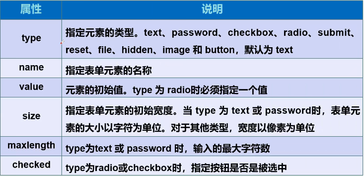

## 行元素、块元素、行内块元素

display:inline				转为行元素

display:block				转为块元素

display:inline-block	转为行内块元素

#### 行元素

1. 设置宽高无效
2. 对margin仅设置左右方向有效，上下无效；padding设置上下左右都有效，即撑大空间
3. 不会自动进行换行

行内元素有：a、b、u、span、**img**、input、strong、select、sub、sup、label、em、button、textarea、tt、var、samp、br、cite、code、font、strike等等

#### 块状元素

1. 能识别宽高
2. margin和padding的上下左右都对其有效
3. 可以自动换行
4. 多个块状元素写在一起，默认排列为从上至下

块级元素有：h1、p、hr、ul、ol、table、form、div等等

#### 行内块元素

1. 不自动换行
2. 能识别宽高
3. 默认排列方式从左到右

## 列表

#### 有序列表

~~~
<ol>
	<li></li>
	<li></li>
</ol>
~~~

#### 无序列表

~~~
<ul>
	<li></li>
	<li></li>
</ul>
~~~

#### 自定义列表

~~~
<dl>
	<dt></dt>
	
	<dd></dd>
	<dd></dd>
</dl>
~~~

## 表格

行：tr

列：td

~~~bash
<table>
	<tr>
		<td colspan="4"></td> #colspan 跨列
		<td rowspan="4"></td> #rowspan 跨行
	</tr>
</table>
~~~

## 媒体元素

#### 视频

~~~~bash
#controls 控制条
#autoplay 自动播放
<video src="path" controls autoplay> </video>
~~~~

#### 音频

~~~bash
#controls 控制条
#autoplay 自动播放
<audio src="path" controls autoplay> </audio>
~~~

## *表单

~~~
<form method="提交方式" action="提交位置">
	<input name="" type=""/>
</form>
~~~

input 的 一些属性 name一样表示一个组

> radio 			单选框						checkbox	  多选框

按钮

> button			普通按钮					image			  图像按钮
>
> submit			提交按钮					reset				重置按钮

#### 下拉框

~~~
<select name="列表名称">
	<option ></option>
	<option ></option>
</select>
~~~

#### 文本域

~~~bash
<textarea name="" cols="50" rows="10"></textarea> #50列10行
~~~

#### 初级验证

为了一些安全，及缓解压力，写在input标签里

placeholder="  "		提示信息

required					  非空判断，也就是必须要填写

pattern="正则语句"	正则表达式