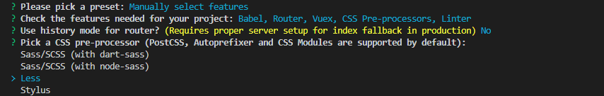
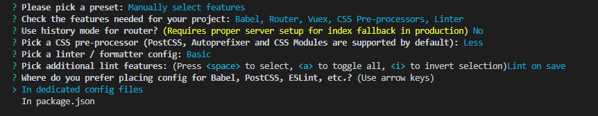
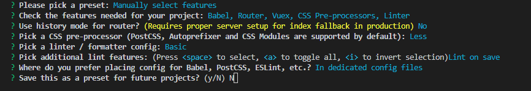

## 安装

全局安装过旧版本的 `vue-cli`(1.x 或 2.x)要先卸载它，否则跳过此步：

~~~bash
npm uninstall vue-cli -g
~~~

Vue cli 3 需要nodejs至少8.9以上版本

~~~bash
npm install -g @vue/cli
~~~

## 使用

新建项目

~~~bash
vue create xxxx # xxxx是创建的文件名
~~~

1. 首先，会提示选择preset(预设).除最后两个**，**其他选项都是你此前保存的预设配置

default（babel，eslint）：默认设置非常适合快速创建一个新项目的原型，没有带任何辅助功能的 npm包

Manually select features：自定义配置是我们所需要的面向生产的项目，提供可选功能的 npm 包

2. 如果选择了 Manually select features

~~~bash
( ) Babel //转码器，可以将ES6代码转为ES5代码，从而在现有环境执行。 
( ) TypeScript// TypeScript是一个JavaScript（后缀.js）的超集（后缀.ts）包含并扩展了 JavaScript 的语法，需要被编译输出为 JavaScript在浏览器运行，目前较少人再用
( ) Progressive Web App (PWA) Support// 渐进式Web应用程序
( ) Router // vue-router（vue路由）
( ) Vuex // vuex（vue的状态管理模式）
( ) CSS Pre-processors // CSS 预处理器（如：less、sass）
( ) Linter / Formatter // 代码风格检查和格式化（如：ESlint）
( ) Unit Testing // 单元测试（unit tests）
( ) E2E Testing // e2e（end to end） 测试
~~~

3. 是否使用 history router：

4.  css 预处理器

5. ESlint	提供一个插件化的javascript代码检测工具，ESLint + Prettier //使用较多

6. 何时检测

7. 如果存放位置

8. 是否保存本次配置

