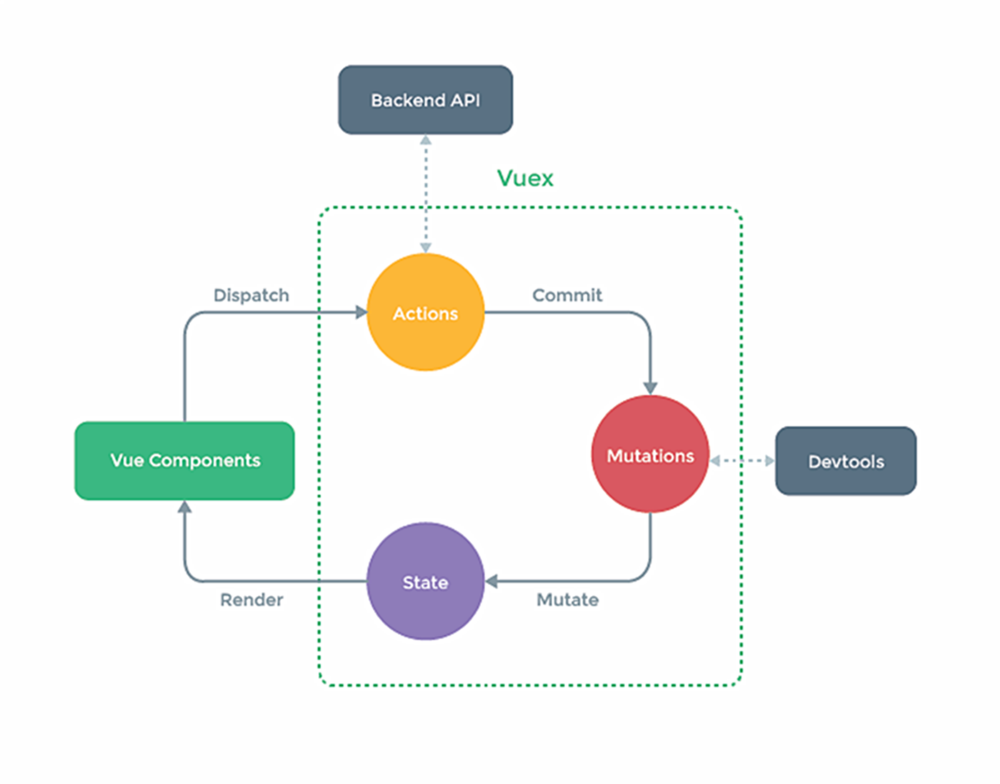

## 第一个vue-cli 程序

**main.js**

~~~js
import Vue from 'vue'
import App from './App.vue'
Vue.config.productionTip = false

new Vue({
    el: "#app",
    render: h => h(App)
})
~~~

**App.vue**

~~~vue
<template>
    

        <School></School>
    

</template>

~~~

**components/School.vue**

~~~vue
<template>

    <h3>学校名称：{{name}}</h3>
    <h3>学校地址：{{address}}</h3>
    

</template>

~~~

#### 注意点：

可能会报一个错误：error  Component name "School" should always be multi-word  vue/multi-word-component-names

1. 需要在School的name上面加上（第一种方法）

~~~js
// eslint-disable-next-line vue/multi-word-component-names
~~~

2.  在vue.config.js 加上关闭语法检测（第二种方法）

~~~js
lintOnSave:false  // 关闭语法检测
~~~

## 配置分析

#### render

~~~js
import Vue from 'vue'
new Vue({
  // render: h => h(App), 原貌如下
  render: function(h){
    return h('标签名','内容')
  },
}).$mount('#app')
~~~

1. vue.js 和vue.runtime.xxx.js 的区别：
    1.   vue.js是完整版的Vue。包含：核心功能+模板解析器
    2.   vue.runtime.xxx.js是运行版的Vue。只包含：核心功能
2. 因为vue.runtime.xxx.js没有模板解析器，所有不能使用template配置项，需要使用**render**函数接收到的xx(上面是h)去指定具体内容

#### 修改配置

> 因为vue把配置文件都隐藏了，所以需要使用`vue inspect > xx.js` 把配置打印出来

需要使用vue.config.js 可以对脚手架进行个性化定制[配置参考 | Vue CLI ](https://cli.vuejs.org/zh/config/)

## ref="" ($refs)

ref属性：

1. 被用来給元素或者子组件注册引用信息（id的替代者）

2. 应用在html标签上获取的是真实DOM元素，应用在组件标签上是组件实例对象

3. 使用方式：

    打标识：<h 1 ref="xxx">...</h 1>		获取：this.$refs.xxx

~~~vue
<template>

    <h1 ref="title">nihao</h1>
    <button @click="show()">点我获取</button>
    <school ref="bth"></school>
    

</template>

~~~

## 组件props

父传子

~~~vue
<school name="name1"></school>			<!--传的是字符串-->
<school v-bind:name="name1"></school>	<!--会进行绑定，传的会是表达式-->
~~~

~~~js

~~~

功能：让组件接收外部传过来的数据

1. 传递数据<Demo name="xxx"/>
2. 接受数据：
    1. 第一种（只接收）：props:['name']	（常用）
    2. 第二种（限制类型）：props:{name:String}
    3. 第三种（限制类型、限制必要性、指定默认值）：props:{name:{type:xxx,required:xxx,default:xxx}}
3. props是只读的，Vue底层会检测对props的修改，如果进行了修改就会发出警告。如果数据必须要修改，就复制一份props的内容到data中，然后修改data中的数据。如：

~~~vue

~~~

## mixin混入

school.vue

~~~vue
<template>

    <h3 @click="show()">学校名称：{{name}}</h3>
    <h3 @click="show1()">学校地址：{{address}}</h3>
    

</template>

~~~

mixin.js

~~~js
export const hunhe = {
    methods: {
        show(){
            alert(this.name)
        }
    },
}
export const hunhe2 = {
    methods: {
        show1(){
            alert(this.address)
        }
    },
}
~~~

功能：可以吧多个组件共用的配置提取成一个混入对象

**混入如果和组件的data或methods重合了，按照组件的data或methods为准，别的会都执行**

使用方法：

1. 第一步定义混合
2. 第二步使用混入
    1. 局部混入：mixins:[xxx]
    2. 全局混入：Vue.mixin(xxx)   

## 插件

~~~js
// 对象.install = function(Vue,options)
export default{
    install(){
        alert("nihaoa!")
    }
}
~~~

main.js

~~~js
import Vue from 'vue'
import App from './App.vue'
// 引入插件
import plugins from './plugins'
Vue.config.productionTip = false

// 应用插件
Vue.use(plugins)
new Vue({
    el: "#app",
    render: h => h(App)
})
~~~

功能：用于增强Vue

本质：包含了install方法的一个对象，install的第一个参数是Vue，之后的参数是插件使用者传递的数据

使用：Vue.use()

## scoped 样式

~~~vue

~~~

作用：让样式在局部生效，防止冲突

写法：< style scoped>

## $nextTick

1. 语法：`this.$nextTick(回调函数)`
2. 作用：在下一次DOM更新结束后执行其指定的回调
3. 什么时候用：当改变数据后，要**基于更新后**的新DOM进行某些操作时，要在nextTick所指向的回调函数中执行

## Todo-list 案例

[Todo-list案例]: ./Todo-list案例.md

## webStorage

1. 存储内容大小一般支持5MB左右（不同浏览器可能不同）

2. 浏览器端通过Window.sessionStorage 和 Window.localStorage属性来实现本地储存机制

3. 相关API：

    1. `xxxStorage.setItem('key','value');` 

        该方法接收一个键和一个值作为参数，把键值对添加到存储中，如果键名存在，则更新其值

    2. `xxxStorage.getItem('key');`

        该方法接收一个键作为参数，返回键名对应的值

    3. `xxxStorage.removeItem('key');`

        该方法接收一个键名作为参数，并把该键名从存储汇总删除

    4. `xxxStorage.clear();`

        该方法会清空存储中的所有数据

4. 备注：

    1. sessionStorage存储的内容会随着浏览器窗口关闭而消失
    2. localStorage存储的内容，需要手动清除才会消失，因为被保存在硬盘中了
    3. `xxxStorage.getItem('key');` 如果获取不到对应key的value，那么返回值为null

## 自定义事件

给谁绑的自定义事件就找谁触发事件。给谁绑的找谁解绑

#### 绑定

School.vue

~~~vue
<template>

    <h3>学校名称：{{name}}</h3>
    <h3>学校地址：{{address}}</h3>
    <button @click="getSchoolName">点我获取学校名</button>
    

</template>

~~~

App.vue

~~~vue
<template>

    <!-- 通过父组件给子组件绑定一个自定义事件，实现子给父传数据（第一种写法） -->
    <!-- <school @getName='getName1'></school> -->
    <!-- 通过父组件给子组件绑定一个自定义事件，实现子给父传数据（第二种写法）更灵活 -->
    <school ref='getName'></school>
    

</template>

~~~

~~~vue
<template>
	<!--如果想给组件加原生事件，需要 .native修饰符。Vue会将这个原生事件绑定到组件最外层的标签上(解释了为什么只可以有一个根标签)-->
	<school @click.native='xxx'></school>
</template>
~~~

#### 解绑

$off()

school.vue

~~~vue
<template>
  

      <h3>学校名称：{{name}}</h3>
      <h3>学校地址：{{address}}</h3>
      <button @click="getSchoolName">点我获取学校名</button>
      <button @click="unbind">点我解绑</button>
  

</template>

~~~

#### 总结

1. 一种组件间通信的方式，适用于： 子组件==>父组件

2. 绑定自定义事件

    1. 第一种方式，在父组件中：`<Demo @xxx='test'/>`

    2. 第二种方式，在父组件中

        ~~~js
        <Demo ref='demo'/>
        .....
        mounted(){
            this.$refs.demo.$on('xxx',this.test)
        }
        ~~~

    3. 如果想让自定义事件只触发一次，可以使用`.once`修饰符

3. 触发自定义事件：`this.$emit('xxx',参数)`

4. 解绑自定义事件:`this.$off('xxx')`

5. 组件上可以绑定原生DOM事件，需要使用`.native`修饰符

6. 注意：通过`this.$refs.demo.$on('xxx',this.test)` 绑定自定义事件时，`test` 要么配置在methods中，要么使用箭头函数，否则this的指向会有问题

## 全局事件总线

> 任意组件间通信

main.js

~~~js
new Vue({
    el: "#app",
    render: h => h(App),
    beforeCreate(){
    	Vue.prototype.$bus = this   // 安装全局事件总线
    }
})
~~~

school.vue

~~~vue

~~~

student.vue

~~~vue
<template>
	

    <button @click="sendStudentName">点我发送</button>
    

</template>

~~~

1. 一种组件间通信的方式，适用于任意组件间通信

2. 安装全局总线

    ~~~vue
    new Vue({
        ......
        beforeCreate(){
        	Vue.prototype.$bus = this   // 安装全局事件总线
        },
    	......
    })
    ~~~

3. 使用事件总线：

    1. 接收数据：A组件想接收数据，则在A组件中给$bus绑定自定义事件，事件的回调留在A组件自身

        ~~~vue
        methods(){
        	demo(data){....}
        },
        ......
        mounted(){
        	this.$bus.$on('xxx',this.demo)
        }
        ~~~

    2. 提供数据：`this.$bus.$emit('xxx',数据)`

4. 最好在 beforeDestroy钩子中，用$off去解绑当前组件所用到的事件

#### 解绑问题

1. 如果不是全局总线，需要在绑定方解绑，也就是给谁绑定的，就在它那里解绑
1. 如果是全局总线，在哪里解绑都可以

## 消息订阅与发布

需要引用第三方库

~~~bash
npm i pubsub-js
~~~

Student.vue

~~~vue
<template>
  

      <h3>学生名称：{{name}}</h3>
      <h3>学生年龄：{{age}}</h3>
      <button @click="sendStudentName">点我发送</button>
  

</template>

~~~

School.vue

~~~vue
<template>

    <h3>学校名称：{{name}}</h3>
    <h3>学校地址：{{address}}</h3>
    <button @click="unbind">点我解绑</button>
    

</template>

~~~

1. 一种组件间通信的方式，适用于任意组件间通信

2. 使用步骤：

    1. 安装pubsub `npm i pubsub-js`

    2. 引入：`import pubsub from 'pubsub-js'`

    3. 接收数据：A组件想接收数据，则在A组件中订阅消息，订阅的回调留在A组件自身

        ~~~js
        methods:{demo(data){....}}
        .......
        mounted(){this.pid = pubsub.subscribe('xxx',this.demo)//订阅消息，有可能需要使用一个参数占位，第一个可能是自己定义的消息名}
        ~~~

    4. 提供数据：`pubsub.publish('xxx',数据)`

    5. 最好在 beforeDestroy钩子中，用`pubsub.unsubscribe(this.pid)`取消订阅

## 过渡动画

1. 作用：在插入、更新或移除DOM元素时，在合适的时候给元素添加样式类名

2. 写法：

    1. 准备好样式

        - v-enter：进入的起点

        - v-enter-active：进入过程中

        - v-enter-to：进入的终点

            

        - v-leave：离开的起点

        - v-leave-active：离开的过程中

        - v-leave-to：离开的终点

    2. 使用`<transition>`包裹要过渡的元素，并配置name属性

        ~~~vue
        <transition name="hello">
            <h1 v-show="isShow">你好</h1>
        </transition>
        ~~~

    3. 如果需要多个元素需要过渡，则需要使用：`<transition-group>` 且每个元素都要指定`key` 值

#### animate

[animate 网站 ](https://animate.style/)

~~~bash
npm install animate.css
~~~

~~~vue
<template>
  

        <button @click="isShow = !isShow">显示/隐藏</button>
        <transition  appear							<!--appear 载入就播放动画-->
        name="animate__animated animate__bounce"	<!--animate__animated animate__bounce animate__infinite-->
        enter-active-class="animate__zoomIn"		<!--进入动画-->
        leave-active-class="animate__zoomOut"		<!--离开动画-->
        >
            <h1 v-show="isShow">你好</h1>
        </transition>
  

</template>

~~~

注意：如果在`<transition>`标签中引入，使用name="xxx"  在别的标签中引入是class="xxxxx"

## 配置代理,跨域

**方式一：**

App.vue

~~~vue
<template>
  

    <button @click="getStudents">获取学生信息</button>
  

</template>

~~~

vue.config.js

~~~js
const { defineConfig } = require('@vue/cli-service')
module.exports = defineConfig({
  transpileDependencies: true,
  lintOnSave:false,  // 关闭语法检测
  devServer: {
    proxy: 'http://localhost:5000'  // 只要写到端口号就可以
  }
})

~~~

缺点：

1. 如果请求的资源，前端存在，则不会去转发（优先匹配前端资源）
2. 只能代理一台，不能灵活的控制请求是否走代理

**方式二：**

App.vue

~~~vue
<template>
  

    <button @click="getStudents">获取学生信息</button>
    <button @click="getCars">获取汽车信息</button>
  

</template>

~~~

vue.config.js

~~~js
const { defineConfig } = require('@vue/cli-service')
module.exports = defineConfig({
    transpileDependencies: true,
    lintOnSave:false,  // 关闭语法检测
    devServer: {
        proxy: {
            '/api': {          					  // 请求前缀
                target: 'http://localhost:5000',  // 请求的地址
                pathRewrite: {'^/api':''},  	  // 重写地址:{'':''}第一个换成第二个
                // ws: true,    				  // 用于支持websocket
                // 用于控制请求头中的host。true即改成要请求的地址一样，设置false的host就是真实的。vue-cli默认为true
                changeOrigin: true 
            },
            '/demo': {          
                target: 'http://localhost:5001',  
                pathRewrite: {'^/demo':''},
                changeOrigin: true 
            },
        }
    }
})
~~~

## 插槽

作用：让父组件可以向子组件指定位置插入html结构，也是组件间通信的方式。使用于  父组件===>子组件

#### 默认插槽

App.vue

~~~vue
<template>
  

    <category title="美食">
      <ul>
          <li v-for="(g,index) in foods" :key="index">{{g}}</li>
      </ul>
    </category>
  

</template>

~~~

Category.vue

~~~vue
<template>
  

      <h3>{{title}}分类</h3>
      <!-- 定义一个插槽(挖个坑，等着组件的使用者进行填充) -->
      <slot>我是一个默认值，使用者没有传递具体结构时，我会出现</slot>
  

</template>

~~~

#### 具名插槽

> 具有名字的插槽

App.vue			第一种写法

~~~vue
<template>
  

    <category title="美食">
      <ul slot="demo1">
          <li v-for="(g,index) in foods" :key="index">{{g}}</li>
      </ul>
      <!-- 插槽不会覆盖，会往后放 -->
      <ul slot="demo1">
          <li v-for="(g,index) in foods" :key="index">{{g}}</li>
      </ul>
    </category>
  

</template>
~~~

App.vue			第二种写法

~~~vue
<template>
  

    <category title="美食">
      <!-- 如果包在template中可以使用 v-slot:xxx -->
      <template v-slot:demo1>
        <ul>
            <li v-for="(g,index) in foods" :key="index">{{g}}</li>
        </ul>
      </template>
    </category>
  

</template>
~~~

Category.vue

~~~vue
<template>
  

      <h3>{{title}}分类</h3>
      <slot name="demo1">我是一个默认值，使用者没有传递具体结构时，我会出现</slot>
  

</template>
~~~

#### 作用域插槽

理解：**数据在组件的自身，但根据数据生成的结构需要组件的使用者来决定**

有点像子组件把值传给了父组件

App.vue

~~~vue
<template>
  

    <category title="美食">
      <!-- <template scope="test"> 也可以这么写。test是传递过来的对象-->
      <template slot-scope="test">
        {{test}}
        <!-- 无序列表 -->
        <ul>
            <li v-for="(g,index) in test.games" :key="index">{{g}}</li>
        </ul>
      </template>
    </category>
    <category title="游戏">
      <template slot-scope="test">
        <!-- 有序列表 -->
        <ol>
            <li v-for="(g,index) in test.games" :key="index">{{g}}</li>
        </ol>
      </template>
    </category>
  

</template>
~~~

Category.vue

~~~vue
<template>
  

      <h3>{{title}}分类</h3>
      <!-- :那边接受对象的一个参数="要给的值" -->
      <slot :games="foods">我是一个默认值，使用者没有传递具体结构时，我会出现</slot>
  

</template>

~~~

## vuex

> 专门在Vue中实现集中式状态（数据）管理的一个Vue插件

1. 多个组件依赖于同一状态
2. 来自不同组件的行为需要变更同一状态
3. 使用时机：多个组件需要共享数据时

#### 安装

2022.2.7，vue3成为了默认版本。npm i vuex安装的就是vue3中最新的vuex4版本，只能在vuex3中使用。简言之 vue2要用vuex3版本，vue3用vuex4版本

> npm i vuex@3

1. 创建文件：`src/store/index.js`

~~~js
// 改文件用于创建Vuex中最为核心的store

import Vue from 'vue'
// 引入Vuex
import Vuex from 'vuex'
// 应用插件
Vue.use(Vuex)
// 准备actions --用于响应组件中的动作
const actions = {}
// 准备mutations --用于操作数据(state)
const mutations = {}
// 准备state --用于存储数据
const state = {}

// 创建并暴露store
export default new Vuex.Store({
    actions:actions,
    mutations:mutations,
    state:state
})
~~~

2. 在`main.js`中创建vm时传入`store` 的配置项

~~~js
import Vue from 'vue'
import App from './App.vue'
import store from './store/index'
Vue.config.productionTip = false
new Vue({
  render: h => h(App),
  store,
}).$mount('#app')
~~~

3. 为什么不在`main.js` 中使用插件，而在`../store/index.js` 中使用？是因为import导入会被优先执行，而插件没被应用，会报错

#### 求和案例

main.js

~~~js
import Vue from 'vue'
import App from './App.vue'
import Vuex from 'vuex'
import store from './store/index'
Vue.config.productionTip = false
new Vue({
  render: h => h(App),
  store,
}).$mount('#app')
~~~

App.vue

~~~vue
导入使用Count.vue
~~~

Count.vue

~~~vue
<template>
  

      <h1>当前求和为：{{$store.state.sum}}</h1>
      <select v-model.number="n">
          <option value="1">1</option>
          <option value="2">2</option>
          <option value="3">3</option>
      </select>
      <button @click="add">+</button>
      <button @click="jian">-</button>
      <button @click="jiadd">当前求和为奇数再加</button>
      <button @click="waitadd">等一等再加</button>
  

</template>

~~~

store/index.js

~~~js
.....
const actions = {
    jishujia(context,value){
        if(context.state.sum % 2 ){
            context.commit('JIA',value)
        }
    },
    waitjia(context,value){
        setTimeout(()=>{
            context.commit('JIA',value)
        },500)
    }
}
const mutations = {
    JIA(context,value){
        console.log(context,value);
        state.sum += value
    },
    JIAN(context,value){
        state.sum -= value
    }
}
const state = {
    sum: 0,
}
........
~~~

1. 组件中读取vuex中的数据：`$store.state.sum`
2. 组件中修改vuex中的数据：`$store.dispatch('action中的方法名',数据)` 或者 `$store.commit('mutations中的方法名',数据)`

#### getters

> 有点像计算属性

1. 概念：当state中的数据需要加工后在使用，可以使用getters加工
2. 在`store/index.js` 中追加 `getters` 配置
3. 组件读取数据 `$store.getters.bigSum`

~~~js
// 准备getters --用于加工state中的数据
const getters = {
    bigSum(state){
        return state.sum *10
    }
}
~~~

#### mapxxxxx

> mapState方法：用于帮助我们映射`state` 中的数据为计算属性
>
> getters方法：用于帮助我们映射`getters` 中的数据为计算属性

本来的写法

~~~js
// $store.state.sum 太长了
computed:{
    sum(){return this.$store.state.sum}
}
~~~

使用mapxxx的写法

~~~js
import {mapState} from 'vuex'	// 先导入
computed:{
    // 借助mapState生成计算属性，从state中读取数据(对象写法)
    ...mapState({sum:'sum',xxxxx})	// mapxxx是个对象 ...是ES6语法
    // 借助mapState生成计算属性，从state中读取数据(数组写法)
    ...mapState(['sum'])	// 这个sum必须在state中存在，不然找不到
}
~~~

> mapActions方法：用于帮助我们生成与`actions` 对话的方法，即包含`$store.dispatch(xxx)的函数`
>
> mapMutations方法：用于帮助我们生成与`mutations` 对话的方法，即包含`$store.commit(xxx)的函数`

之前的写法

~~~html
<button @click="add">+</button>
<button @click="waitadd">等一等再加</button>

~~~

使用mapxxxx的写法

~~~html
<!--需要手动传参，不然会把$event传过去-->
<button @click="add(n)">+</button>			  <!--@click=JIA(n) 数组写法-->
<button @click="waitadd(n)">等一等再加</button> <!--@click=waitjia(n) 数组写法-->

~~~

#### 模块化

index.js

~~~js
import Vue from 'vue'
// 引入Vuex
import Vuex from 'vuex'
// 应用插件
Vue.use(Vuex)
const countAbout = {
    namespaced:true,	// 不要忘记命名空间
    actions:{
        jishujia(context,value){
            if(context.state.sum % 2 ){
                context.commit('JIA',value)
            }
        },
        waitjia(context,value){
            setTimeout(()=>{
                context.commit('JIA',value)
            },500)
        }
    },
    mutations:{
        JIA(context,value){
            console.log(context,value);
            this.state.countAbout.sum += value
        },
        JIAN(context,value){
            this.state.countAbout.sum -= value
        }
    },
    state:{
        sum: 0,
    },
    getters:{
        bigSum(state){
            return state.sum *10
        }
    }
}
export default new Vuex.Store({
    modules:{	// 不要忘记modules
        countAbout:countAbout,
    }
})
~~~

Count.vue			

~~~html
<template>
  

      <h1>当前求和为：{{sum}}</h1>
      <h1>当前方法十倍为：{{bigSum}}</h1>
      <select v-model.number="n">
          <option value="1">1</option>
          <option value="2">2</option>
          <option value="3">3</option>
      </select>
      <button @click="add(n)">+</button>
      <button @click="jian(n)">-</button>
      <button @click="jiadd(n)">当前求和为奇数再加</button>
      <button @click="waitadd(n)">等一等再加</button>
  

</template>
~~~

原生写法

~~~vue

~~~

使用mapxxxx写法

~~~vue

~~~

#### 模块化总结

1. 目的：让代码更好维护，让多种数据分类更加明确

2. 开启命名空间后，组件中读取state数据：

    ~~~js
    // 方式一：自己直接读取
    this.$store.state.xxxx.data
    // 方式二：借助mapstate读取
    ...mapState('xxx',{'':'',····})
    ~~~

3. 开启命名空间后，组件中读取getters数据：

    ~~~js
    // 方式一：自己直接读取
    this.$store.getters['xxxx/bigSum']
    // 方式二：借助mapGetters读取
    ...mapGetters('xxxxx',{bigSum:'bigSum'})
    ~~~

4. 开启命名空间后，组件中调用dispatch：

    ~~~js
    // 方式一：自己直接dispatch
    this.$store.dispatch('xxx/jishujia',数据)
    // 方式二：借助mapActions
    ...mapActions('xxxx',{'jiadd':'jishujia','waitadd':'waitjia'})
        },
    ~~~

5. 开启命名空间后，组件中调用commit：

    ~~~js
    // 方式一：自己直接commit
    this.$store.commit('xxxx/JIA',数据)
    // 方式二：借助mapMutations
    ...mapMutations('xxxxx',{'add':'JIA','jian':'JIAN'}),
    ~~~

## 路由

> vue的路由是一个插件库

一个路由就是一组映射关系（key - value）key是路径，value可你是function或component

前端路由：value是component，用于展示页面内容

后端路由：value是function，用于处理客户端提交的请求

#### 安装

2022.2.7，vue3成为了默认版本。npm i vue-router安装的就是vue3中最新的vue-router4版本，只能在vuex3中使用。简言之 vue2要用vue-router3版本，vue3用vue-router4版本

> npm i vue-router@3

1. 创建文件：`src/router/index.js`

~~~js
// 改文件专门用于创建整个应用的路由器
import VueRouter from "vue-router"; 
// 引入组件
import About from '../components/About.vue'
import Home from '../components/Home.vue'
// 创建并暴露一个路由器
export default new VueRouter({
    routes:[
        {
            path:'/about',
            component: About
        },
        {
            path:'/home',
            component: Home
        }
    ]
})
~~~

2. 在`main.js`中创建vm时传入`router` 的配置项

~~~js
import Vue from 'vue'
import App from './App.vue'
import router from './router'
import VueRouter from 'vue-router'
Vue.config.productionTip = false
Vue.use(VueRouter)
new Vue({
  render: h => h(App),
  router,
}).$mount('#app')
~~~

3. 在需要使用的地方实现路由切换和呈现的位置

~~~html
<!-- 原始html中我们使用a标签实现页面的跳转 -->
<!-- <a class="list-group-item" href="./about.html">About</a>
<a class="list-group-item active" href="./home.html">Home</a> -->

<!-- Vue中借助router-link标签实现路由的切换 -->
<router-link class="list-group-item" active-class="active" to="/about">About</router-link>
<router-link class="list-group-item" active-class="active" to="/home">Home</router-link>

<!-- 指定组件的呈现位置 -->
<router-view></router-view>
~~~

路由使用注意点：

1. 路由组件通常放在`pages`文件夹下，一般组件通常放在`components` 文件夹
2. 通过切换，路由组建不是被隐藏了，而是被**销毁掉了**，需要时在挂载
3. 每个组件都有自己的`$route` 属性，里面存储着自己的路由信息
4. 整个应用只有一个router，可以通过组件的`$router` 属性获取到

#### 嵌套(多级)路由

1. 配置路由规则，使用children配置项：

~~~js
routes:[
    {
        path:'/about',
        component: About
    },
    {
        path:'/home',
        component: Home,
        children: [
            {
                path:'news',//不是一级路由不要加'/'
                component: News
            },
            {
                path:'message',
                component: Message
            }
        ]
    }
]
~~~

2. 跳转（要写完整路径）：

~~~html
<router-link class="list-group-item" active-class="active" to="/home/news">News</router-link>
~~~

#### 路由命名和元数据

**路由命名**

作用：可以简化路由的跳转

~~~js
routes:[
    ..................
    children: [
        {   
            name: 'test',	// 给路由命名
            path: 'detail',
            component: Detail
        }
    ]
    ..................
]
~~~

简化跳转：

~~~html
<!--简化前-->
<router-link :to="{path:'/home/message/detail'}"></router-link>
<!--简化后-->
<router-link :to="{name:'test'}"></router-link>
~~~

**路由元数据**

~~~js
routes:[
    {
        path:'/about',
        component: About,
        meta: {title : '123'}	// 可以看成data
    },
]
~~~

#### 路由传参

**使用`$route.query.xxx` 进行传参**

1. 传递参数

~~~html
<!-- 跳转路由并携带query参数，to的字符串写法 -->
<router-link :to="`/home/message/detail?id=${item.id}&title=${item.title}`">{{item.title}}</router-link>
<!-- 跳转路由并携带query参数，to的对象写法 -->
<router-link :to="{
                  path:'/home/message/detail',
                  query:{
                  id: item.id,
                  title:item.title }
                  }">{{item.title}}</router-link>
~~~

2. 接收参数

~~~js
$route.query.xxx
~~~

**使用`params` 进行传参**

1. 路由配置

~~~js
routes:[
    ..................
    children: [
        {   
            name: 'test',	// 给路由命名
            path: 'detail/:id/:title',  // 使用占位符接收params参数
            component: Detail
        }
    ]
    ..................
]
~~~

2. 传递参数

~~~html
<!-- 跳转路由并携带params参数，to的字符串写法 -->
<router-link :to="`/home/message/detail/${item.id}/${item.title}}`">{{item.title}}</router-link>
<!-- 跳转路由并携带params参数，to的对象写法 -->
<router-link :to="{
                  name:'test',    // 如果是对象写法，params不能用path必须用name
                  params:{
                  id: item.id,
                  title:item.title }
                  }">{{item.title}}</router-link>
~~~

3. 接收参数

~~~js
$route.params.xxx
~~~

**使用`props配置`进行传参**

作用：让路由组建更方便的收到参数

~~~js
children: [
    {   
        name: 'test',
        path: 'detail',	// 配合第二种写法：  path: 'detail/:id/:title',
        component: Detail,
        // 第一种写法：props值为对象，该对象中所有的key-value的组合最终都会通过props传给Detail组件
        props:{a:10,b:20}   // 值被写死了
        // 第二种写法：props值为布尔值，布尔值为true，则把路由收到的所有params参数通过props传给Detail组件
        props:true
        // 第三种写法：props值为函数，该函数返回的对象中每一组key-value都会通过props传给Detail组件
        props($route){
            return {id:$route.query.id,title:$route.query.title}
        }
    }
]
~~~

~~~js
export default {
    name: 'Detail',
    props:['id','title']	// 接收
}
~~~

#### replace属性

1. 作用：控制路由跳转时操作浏览器历史记录的模式

2. 浏览器的历史记录有两种写入方式：分别是`push` 和 `replace`，`push` 是追加历史记录，`replace` 是替换当前记录。路由跳转默认为 `push`

3. 开启`replace` 模式：

    ~~~html
    <router-link replace  active-class="active" to="/about">About</router-link>
    ~~~

#### 编程式路由导航

1. 作用：不借助`<router-link>` 实现路由跳转，让路由跳转更加灵活
2. 具体编码：

之前

~~~html
<router-link :to="{
                  name:'test',
                  params:{
                  id: item.id,
                  title:item.title }
                  }">{{item.title}}</router-link>
~~~

~~~js
// $router的两个API
methods:{
    pushShow(item){
        this.$router.push({
            name:'test',
            params:{
                id: item.id,
                title:item.title }
        })
    },
     pushShow(item){
         this.$router.replace({
             name:'test',
             params:{
                 id: item.id,
                 title:item.title }
        })
    },
}
this.$router.forward()	// 前进
this.$router.back()		// 后退
this.$router.go(x)		// 可前进也可后退，x正数则前进x步，x负数则后退x步
~~~

#### 缓存路由组件

1. 作用：让不展示的路由保持挂载，不被销毁
2. 具体编码：

~~~html
<!--include="组件名"-->
<keep-alive :include="['news']"><!--可以缓存多个-->
<keep-alive include="news">
    <router-view></router-view>
</keep-alive>
~~~

#### 路由独有的生命周期钩子

1. 作用：路由组件所独有的两个钩子，用于捕获路由组件的激活状态
2. 具体：
    1. `activated` 路由组件被激活时触发
    2. `deactivated` 路由组件失活时触发

#### 路由守卫（权限）

1. 作用：对路由进行权限控制
2. 分类：全局守卫、独享守卫、组件内守卫

**全局守卫**

~~~js
// 全局前置路由守卫--初始化的时候被调用、每次路由切换之前被调用
router.beforeEach((to,from,next)=>{
    console.log(to,from);
    if(to.name === 'xinwen' || to.name === 'xiaoxi'){
        alert('不给进')
    }else{
        next()
    }
})
// 全局后置路由守卫--初始化的时候被调用、每次路由切换之后被调用
router.afterEach((to,from)=>{
    document.title = to.meta.title  // 进到一个页面之后改title
})
~~~

**独享守卫**

> 某个路由独享的守卫，写在相应的路由里。**只有前置独享守卫**

~~~js
beforEnter(to,from,next){
    // 代码...
}
~~~

组件内守卫

~~~js
// 进入守卫：通过路由规则，进入该组件时被调用。必须是通过路由才有效
beforeRouteEnter(to,from,next){  
}
// 离开守卫：通过路由规则，离开该组件时被调用。必须是通过路由才有效
beforeRouteLeave(to,from,next){
}
~~~

#### 两种工作模式

1. 对于一个url来说，什么是 hash值：# 及其后面的内容就是hash值
2. hash值不会包含在http请求中，即：hash值不会带给服务器
3. hash模式：
    1. 地址中永远带着 `#` 号，不美观
    2. 若以后将地址通过第三方手机app分享，若app检验严格，则地址会被标记为不合法
    3. 兼容性较好
4. history模式：
    1. 地址干净，美观
    2. 兼容性比hash模式相比略差
    3. 应用部署上线时需要后端支持，解决刷新页面报404错误

## 部署vue项目

~~~bash
npm run build	# 打包
~~~

~~~bash
# 进入生成的dist文件夹
cd dist
npm install anywhere # 生成前端静态资源服务器插件
anywhere -p 端口
~~~

~~~bash
# linux服务器上-部署到nginx
server {
    listen       80;
    server_name  localhost;
    client_max_body_size 1024m;
    root	/home/zyh/dist;
    location / {
    }
}
~~~

#### 修改端口

方法一：在package.json 文件下设置

~~~json
{
    "scripts": {
    "serve": "vue-cli-service serve --port xxxx",
    "build": "vue-cli-service build",
    "lint": "vue-cli-service lint"
  },
} 
~~~

方法二：在 vue.config.js 文件下配置

~~~js
module.exports = {
    devServer: {
        port: xxxx, // 端口
    }
    // lintOnSave: false // 取消 eslint 验证
}
~~~

