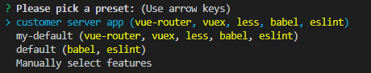
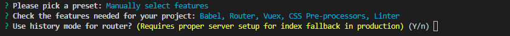
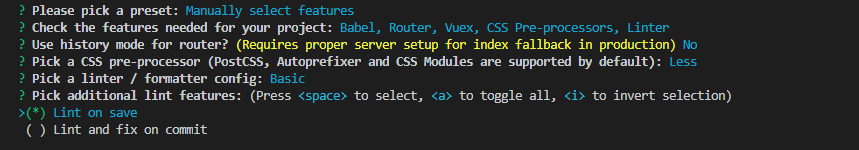

## JavaScript框架

- jQuery
- Angular  特点：将后台的MVC模式搬到了前端，增加了模块化开发
- React ：提出了 虚拟DOM，用于减少真实DOM操作，在内存中模拟DOM操作，提升了前端渲染效率，但较为复杂
- Vue：一款渐进式JavaScript框架，所谓渐进式，就是逐步实现新特性的意思。实现模块化开发、路由、状态管理等新特性。综合了Angular(模块化)和React(虚拟DOM)的优点
- Axios：前端通信框架；因为Vue边界明确，就是为了处理DOM，所以不具备通信能力。当然也可以使用jQuery提供的AJAX

## UI框架

- Ant-Design：阿里巴巴出品，基于React的UI框架
- ElementUI、iview、ice：饿了么出品，基于Vue的UI框架
- Bootstrap：Twitter推出用于前端开发的开源工具包
- AmazeUI：又叫 "妹子UI" ，一款HTML5跨屏前端框架 

## MVVM

- Model 是指数据模型
- View 是视图层，用户界面，主要HTML和CSS来构建
- ViewModel 对后端取得的Model 数据进行处理，双向绑定

## vue 基础

[Vue.js (vuejs.org)](https://cn.vuejs.org/)

> vue 就是一个MVVM的实现者，核心就是实现了DOM监听和数据绑定

vs code 一个插件 Vue 3 Snippets

**两个重要的原则：**

1. 所被Vue管理的函数，最好写成普通函数，这样this的指向才是vm或组件实例对象
2. 所有不背Vue管理的函数(例如定时器的回调函数、ajax的回调函数等)，最好写成箭头函数，这样this的指向才是vm或组件实例对象

#### 第一个vue

~~~html

    {{message}}

<!-- 导入 Vue.js -->

~~~

**注意： 一个容器只能和一个实例绑定**

#### 数据代理

Object.defineProperty

Vue中data的数据来自_data，做了数据代理

~~~html

~~~

Vue 监测对象里数据的原理其实就是 监测 set(){} 

**Vue.set（target,key,value）**   ===   vm.set(target,key,value)

> 问题：想不修改代码的情况下，页面展示一个sex. 但是注意：data不能作为target。也就是不能给data加，可以给data里面的对象加

~~~html

    <h3>{{name}}</h3>
    <h3>{{age}}</h3>
    <h3>{{student.name}}</h3>
    <h3>test:{{student.sex}}</h3>

~~~

**Vue监视数据总结：**

1. vue会监视data中所有层次的数据

2. 如何监测对象中的数据

    ​	通过 setter 实现监视，且要new Vue时就传入要监测的数据

    1. 对象中后追加的属性，Vue默认不做响应式处理
    2. 如需給后添加的属性做响应式，需要借助 Vue.set()或vm.$set

3. 如何监测数组中的数据

    ​    通过包裹数组更新元素的方法实现，本质做了两件事情：

    1. 调用原生对应的方法对数组进行更新
    2. 重新解析模板，进而更新页面

4. 在Vue修改数组中的某个元素需要用以下方法：

    1. 使用API：push()、pop()、shift()、unshift()、splice()、sort()、reverse()
    2. Vue.set 或 vm.$set()

5. 需要注意：Vue.set() 和 vm.$set() 不能给vm或者vm的根数据对象添加属性(data)

#### 指令

> `v-xxx` 就是一个指令

**v-bind** 主要用于属性绑定，单向绑定	可以使用简写"v-bind:xxx"==>":xxx"

~~~html

    鼠标悬停···

<!-- 导入 Vue.js -->

~~~

**v-show**

> 底层实现是用 display:none 节点还在  不能和template使用

~~~html

    <h1 v-show="message==='1'">1</h1>

<!-- 导入 Vue.js -->

~~~

**v-if**

> 节点不在了

~~~html

    <h1 v-if="message==='1'">1</h1>
    <h1 v-else-if="message==='2'">2</h1>
    <h1 v-else>no</h1>

<!-- 导入 Vue.js -->

~~~

**v-for**

1. 用于展示列表数据
2. 语法   v-for="(value,index) in xxx" :key="yyy"   key唯一
3. 可遍历：数组、对象、字符串、指定次数

~~~html

    <!-- v-for="(value,key) in xxxx" 先是值，后是键-->
    <h1 v-for="item in items">{{item.message}}</h1>

<!-- 导入 Vue.js -->

~~~

**关于 v-for 的key**（内部原理）

key 是虚拟DOM对象的标识，当数据发生变化时，Vue会根据【新数据】生成【新的虚拟DOM】，随后Vue进行【新虚拟DOM】与【旧虚拟DOM】的差异比较(diff算法)，规则如下：

1. 对比规则：

    1. 旧虚拟DOM中找到了与新虚拟DOM相同的key：

        1. 若虚拟DOM中内容没变，直接使用之前的真的DOM
        2. 若虚拟DOM中内容变了，则生成新的真实DOM，随后替换掉页面中之前的真是DOM

    2. 旧虚拟DOM中未找到与新虚拟DOM相同的key

       ​        创建新的真是DOM，随后渲染到页面

2. 用index作为key可以会引发的问题

    1. 若对数据进行了：逆序添加、逆序删除等破坏顺序的操作：

       会产生没有必要的真是DOM更新 ==> 界面效果没问题，但效率低

    2. 如果结构中还包含输入类的DOM：

       会产生错误的DOM更新   ==>  界面会有问题

3. 开发中如何选择key？：

    1. 最好使用每条数据的唯一标识作为key
    2. 如果不存在对数据进行逆序操作等破坏顺序的操作，仅仅用于渲染列表用于展示，使用index作为key是没有问题的

**v-on**   

`事件`  可以使用简写 "v-on:xxx"==>"@xxxx"

~~~html

    <!--click就是一个点击事件-->
    <button v-on:click="sayHi">chilk me</button>
    <button v-on:click="saybb">chilk me</button>

<!-- 导入 Vue.js -->

~~~

**v-cloak**      v-cloak指令没有值

- 本质是一个特殊的属性，Vue实例创建完毕并接管容器后，会删掉v-cloak属性
- 使用css配合v-cloak可以解决网速慢时页面出现{{xxxx}}的问题

~~~html

    <h3 v-cloak>{{xxx}}</h3>

~~~

**v-once**

- v-once 所在的节点在初次动态渲染后，就变成静态内容了
- 以后的数据改变不会引起v-once所在结构的更新，可以用于优化性能

**v-pre**

- 跳过所在节点的编译过程

#### 自定义指令

~~~html

    <h3>当前的值：{{n}}</h3>
    <h3>十倍后的值：</h3>
    <button @click="n++">值加1</button>

~~~

**自定义指令总结**

1. 定义语法：

    1. 局部指令：

        new Vue({

        ​	directives:{指令名:配置对象}

        })

    2. 全局指令：

        Vue.directive(指令名,配置对象)

2. 配置对象中常用的3个回调：

    1.  **.bind**：指令与元素成功绑定时调用
    2.  **.inserted**：指令所在元素被插入页面时调用
    3.  **.update**：指令所在模板结构被重新解构时调用

3. 备注：

    1. 指令定义时不加 `v-`，但使用时需要加`v-`
    2. 指令命如果是多个单词，要使用xxx-xxx，不能使用xxxXxxx

#### 事件

**事件修饰符**

~~~html

    <!-- prevent:阻止默认事件 -->
    <a href="http://www.baidu.com" @click.prevent="showInfo">点我</a>
    

        <!-- stop 阻止事件冒泡.写在里面 -->
        <button @click.stop="showInfo">点我</button>
        <!--可以链式调用-->
        <!-- <a href="http://www.baidu.com" @click.prevent.stop="showInfo">点我</a> -->
    

    <!-- once 事件只触发一次 -->
    <button @click.once="showInfo">点我3</button>

~~~

**键盘事件**

~~~html

    <!-- Vue 常用按键别名：
        回车 ==> enter  删除 == > delete 退出 ==> esc 空格 ==> space
        换行 ==> tab（需要配合keydown） 上  ==> up  下 ==> down 左 ==> left 右==>right
        需要注意的按键：ctrl alt shift meta(win键) 使用keyup需要搭配别的键，最好使用keydown-->
    <input type="text" placeholder="按下回车提示输入" @keyup.enter="showInfo">

~~~

#### 双向绑定

**v-model** 一般应用在表单类元素上，v-model 默认收集的是value的值

~~~html

    <input type="text" v-model="message">{{message}}

<!-- 导入 Vue.js -->

~~~

**收集表单数据**

1. 若<input type ="text"/ > 则v-model收集的是value值，用户输入的就是value值

2. 如<input type ="radio"/ > 则v-model 收集的是value值，且要给标签配置value值

3. 若<input type ="checkbox"/ >

    1. 没有配置input的value属性，那么收集的就是checked（勾选 or 未勾选，是布尔值）
    2. 配置input的value属性：
        1. v-model 的初始值是非数组，那么收集的就是checked（勾选 or 未勾选，是布尔值）
        2. v-model 的初始值是数组，那么收集的就是value组成的数组

    备注： v-model 的三个修饰符

    - lazy：失去焦点在收集数据
    - number：输入字符串转为有效的数字
    - trim：输入首尾空格过滤（忽略首尾空格）

#### 列表过滤与排序

**列表过滤**

~~~html

    <h2>人员列表</h2>
    <input type="text" placeholder="请输入名字" v-model="keymod">
    <ul>
        <li v-for="item in filPersons" :key="item.id">
            {{item.name}}:{{item.age}}:{{item.sex}}
        </li>
    </ul>

~~~

**列表排序**

~~~html

    <h2>人员列表</h2>
    <input type="text" placeholder="请输入名字" v-model="keymod">
    <button @click="sortType = 2">年龄升序</button>
    <button @click="sortType = 1">年龄降序</button>
    <button @click="sortType = 0">原顺序</button>
    <ul>
        <li v-for="item in filPersons" :key="item.id">
            {{item.name}}:{{item.age}}:{{item.sex}}
        </li>
    </ul>

~~~

#### Axios 异步通信

> Axios 是一个用在浏览器端和NodeJs的异步通信框架

[axios中文文档](http://www.axios-js.com/zh-cn/docs/)

~~~json
// data.json
{
    "name":"hello",
    "age":"20",
    "sex":"男"
}
~~~

~~~html

    {{info.name}}

<!-- 导入 axios -->

~~~

可能会出现` Cross origin requests are only supported for protocol schemes`这种错误，需要使用服务器，VS Code可以使用Live Service插件

#### 计算属性

计算属性的重点在`属性`(计算是个动词,属性是个名词)这里的`计算`就是个函数；简单的说，**`计算属性`** 是一个将计算结果缓存起来的属性，该属性的值是计算出来的，可以想象成**缓存**

> 原理：底层借助了Object.defineproperty 方法提供的get set

~~~html

    
currentTime1:{{currentTime1()}}

    
currentTime2:{{currentTime2}}

<!-- 导入 Vue.js -->

~~~

如果打开浏览器的 Console 可以发现，每次调用 currentTime1,值一直在改变，而调用 currentTime2,值不会变

#### 监视属性

监视属性watch：

1. 当被监视的属性变化时，回调函数自动调用(handler)，进行相关操作
2. 监视的属性必须存在，才能进行监视 

~~~html

    {{info}}
    <button @click="change()">切换</button>

~~~

深度监视

>  Vue中watch默认不检测对象内部值的改变，配置deep:true可以检测内部

~~~html

    <h3>a:{{numbers.a}}</h3>
    <button @click="numbers.a++">a加</button>
    <h3>b:{{numbers.b}}</h3>
    <button @click="numbers.b++">b加</button>

~~~

**计算属性 vs 监视属性**

computed 和 watch 之间的区别：

1. computed能完成的功能，watch都能完成
2. watch能完成的功能，computed不一定能完成。例如：watch可以进行异步操作

#### 绑定样式

**绑定css**

~~~html

    <!-- 绑定class样式--字符串写法，适用于：样式的类名不确定，需要动态切换 -->
    

    <!-- 绑定class样式--数组写法，适用于：绑定的样式不确定、名字也不确定 -->
    

    <!-- 绑定class样式--对象写法，适用于：要绑定的样式、名字确定，需要动态选择用不用 -->
    

~~~

**绑定style**

~~~html

    <!-- 绑定style样式--对象写法 -->
    

~~~

#### 生命周期

> vm的一生：xxx时候 ==> 调用了？？？函数

1. 生命周期又名：生命周期回调函数、生命周期函数、生命周期钩子
2. 指的是什么：Vue在关键时刻帮我们调用的一些特殊函数
3. 生命周期函数的名字不可更改，但函数具体内容由自己编写
4. 生命周期函数中的this指向的是vm或者组件实例对象

**创建 ==> 挂载 ==> 更新 ==> 销毁**	（mounted、beforeDestroy比较重要）

销毁时自定义事件会失效，但原生的DOM事件依然有效

**常用：**

1. mounted：发送ajax请求、启动定时器、绑定自定义事件、订阅消息等【初始化操作】
2. beforeDestroy：清除定时器、解绑自定义事件、取消订阅消息等【收尾工作】

#### 组件

~~~html

    <mycomponent v-for="item in items" v-bind:temp="item"></mycomponent>

<!-- 导入 Vue.js -->

~~~

#### 插槽

~~~html

    <test>
        <title-test1 slot="title-test" v-bind:title="title"></title-test1>
        <item-test1 slot="item-test" v-for="item in items" v-bind:item="item"></item-test1>
    </test>

<!-- 导入 Vue.js -->

~~~

注意：定义标签名字的时候，不能有大写字母，要换成"-"

#### 自定义事件分发

**this.$emit("自定义事件名",参数)**

~~~html

    <test>
        <title-test1 slot="title-test" v-bind:title="title1"></title-test1>
        <!-- v-for 的index索引往后面放 -->
        <item-test1 slot="item-test" v-for="(item1,index) in items"
                    v-bind:item="item1"  v-bind:index="index" v-on:remove111="removeitems(index)"></item-test1>
    </test>

<!-- 导入 Vue.js -->

~~~

> 难点就一个：是谁绑了我，而我又绑了谁

## 组件

Vue中使用组件的三大步骤：

1. 定义组件（创建组件）
2. 注册组件
3. 使用组件（写组件标签）

- 定义组件：
    - 使用Vue.extend(options)创建
    - el不能写，因为所有的组件需要交给vm一个管理，由vm中的el决定服务于哪个容器
    - data必须写成函数
    - let x = Vue.extend({}) 可以直接简写成    let x = {}
- 使用注册组件
    - 局部注册：靠new Vue的时候传入components选项
    - 全局注册：靠Vue,component('组件名',组件)
- 使用组件
    - <组件名></组件名>

**Vue组件名注意：**

- 如果是单个单词，可以全小写或者首字母大写
- 如果是多个单词，写成my-component，如果写成MyComponent需要Vue脚手架支持

VueComponent和vm的内置关系

为了让组件实例对象可以访问到Vue原型上的属性、方法

#### 非单文件组件

> 一个文件中包含有n个组件

~~~html

    <school></school>
    

    <student></student>
    

    <hello></hello>

~~~

**嵌套组件**

~~~html

    <school></school>

~~~

**真正开发中，使用app组件进行管理。其他组件注册app中，app注册到vm中**

关于VueComponent：

1. 组件本质是一个名为VueComponent的构造函数，且不是程序员定义的，是Vue.extend生成的
2. 我们只需要写<组件名></组件名>，Vue解析时会帮我们创建组件的实例对象，即Vue会执行：new VueComponent(options)
3. 每次调用Vue.extend. 返回的都是一个全新的VueComponent
4. 关于this的指向：
    1. 组件配置中的data、methods、watch、computed中的函数，他们的this均是【VueComponent实例对象】
    2. new Vue(options)配置中的data、methods、watch、computed中的函数，它们的指向均是【Vue实例对象】
5. VueComponent的实例对象简称 vc （组件实例对象）

#### 单文件组件

> 一个文件中只包含有 1 个组件

## vue-cli

> vue-cli 是官方提供的一个脚手架，用于快速生成一个vue的项目模板

下载

~~~bash
npm install vue-cli -g
~~~

#### 第一个 vue-cli(2.xx)

在cmd窗口下初始化 vue-cli

~~~bash
npm i -g @vue/cli-init # 为了能使用旧版本的 vue init
vue init webpack xxxx # xxxx是创建的文件名
~~~

然后会有一些提示

~~~bash
Project name：项目名称，默认回车即可
Project description：项目描述，默认回车即可
Author：项目作者，默认回车即可
Install vue-router：是否安装vue-router，选择n不安装（后期需要再手动添加）
Use ESLint to lint your code:是否使用ESLint做代码检查，选择n不安装（后期需要再手动添加)
Set up unit tests:单元测试相关，选择n不安装（后期需要再手动添加）
Setupe2etests with Nightwatch：单元测试相关，选择n不安装（后期需要再手动添加）
Should we run npm install for you after the,project has been created:创建完成后直接初始化，选择n，我们手动执行；运行结果
~~~

初始化并运行

~~~bash
cd myvue
npm install
# 安装依赖的时候可能会出错，按照提示，运行就
npm run dev
~~~

#### 第一个 @vue/cli

[配置参考 | Vue CLI ](https://cli.vuejs.org/zh/config/)

[vue cli3.0快速搭建项目详解（网上） ](https://www.cnblogs.com/coober/p/10875647.html)

[vue cli3.0快速搭建项目详解（本地）](./vue cli3.0.md)

~~~bash
# npm uninstall vue-cli -g  卸载老版本
npm install -g @vue/cli	
# vue -V	查看版本
~~~

在cmd窗口下初始化 vue-cli

~~~bash
vue create xxxx # xxxx是创建的文件名
# 可以直接选择默认
~~~

~~~bash
npm run serve 	# 热加载 ctrl+c 停止服务
~~~

因为vue把配置文件都隐藏了，所以需要使用`vue inspect > xx.js` 把配置打印出来

**修改端口**

方法一：在package.json 文件下设置

~~~json
{
    "scripts": {
    "serve": "vue-cli-service serve --port xxxx",
    "build": "vue-cli-service build",
    "lint": "vue-cli-service lint"
  },
} 
~~~

方法二：在 vue.config.js 文件下配置

~~~json
module.exports = {
    devServer: {
        port: xxxx, // 端口
    }
    // lintOnSave: false // 取消 eslint 验证
}
~~~

#### 安装

全局安装过旧版本的 `vue-cli`(1.x 或 2.x)要先卸载它，否则跳过此步：

~~~bash
npm uninstall vue-cli -g
~~~

Vue cli 3 需要nodejs至少8.9以上版本

~~~bash
npm install -g @vue/cli
~~~

#### 使用

新建项目

~~~bash
vue create xxxx # xxxx是创建的文件名
~~~

1. 首先，会提示选择preset(预设).除最后两个**，**其他选项都是你此前保存的预设配置

default（babel，eslint）：默认设置非常适合快速创建一个新项目的原型，没有带任何辅助功能的 npm包

Manually select features：自定义配置是我们所需要的面向生产的项目，提供可选功能的 npm 包

2. 如果选择了 Manually select features

~~~bash
( ) Babel //转码器，可以将ES6代码转为ES5代码，从而在现有环境执行。 
( ) TypeScript// TypeScript是一个JavaScript（后缀.js）的超集（后缀.ts）包含并扩展了 JavaScript 的语法，需要被编译输出为 JavaScript在浏览器运行，目前较少人再用
( ) Progressive Web App (PWA) Support// 渐进式Web应用程序
( ) Router // vue-router（vue路由）
( ) Vuex // vuex（vue的状态管理模式）
( ) CSS Pre-processors // CSS 预处理器（如：less、sass）
( ) Linter / Formatter // 代码风格检查和格式化（如：ESlint）
( ) Unit Testing // 单元测试（unit tests）
( ) E2E Testing // e2e（end to end） 测试
~~~

3. 是否使用 history router：

4.  css 预处理器

5. ESlint	提供一个插件化的javascript代码检测工具，ESLint + Prettier //使用较多

6. 何时检测

7. 如果存放位置

8. 是否保存本次配置

