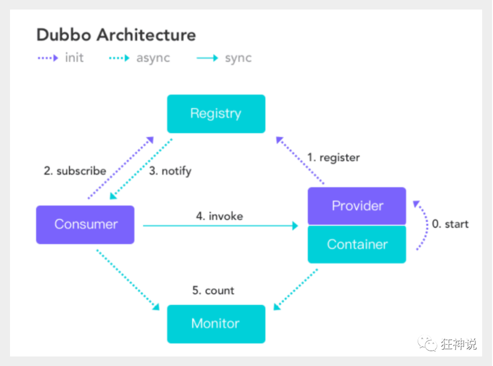

## 分布式

> 分布式系统是若干个独立计算机的集合，这些计算机对于用户来说就像一个相关系统
>
> 分布式系统是由一组通过网络进行通信、为了完成共同的任务而协调工作的计算机节点组成的系统。为了用廉价的、普通的机器完成单个计算机无法完成的计算、存储任务

## RPC

> Remote Procedure Call  远程过程调用
>
> 是一种技术思想，不是一种规范。允许程序调用另一个地址空间的过程或函数（A电脑上的方法调用B电脑上的方法）

两个核心：**通讯** 		**序列化**

## Dubbo

> 是一款高性能、轻量级的开源 Java RPC 框架
>
> 六大核心(其中三个)：面向接口的远程方法调用，智能容错和负载均衡、服务自动注册和发现

[Apache Dubbo](https://dubbo.apache.org/zh/)

**服务提供者**（Provider）：暴露服务的服务提供方，服务提供者在启动时，向注册中心注册自己提供的服务。

**服务消费者**（Consumer）：调用远程服务的服务消费方，服务消费者在启动时，向注册中心订阅自己所需的服务，服务消费者，从提供者地址列表中，基于软负载均衡算法，选一台提供者进行调用，如果调用失败，再选另一台调用。

**注册中心**（Registry）：注册中心返回服务提供者地址列表给消费者，如果有变更，注册中心将基于长连接推送变更数据给消费者

**监控中心**（Monitor）：服务消费者和提供者，在内存中累计调用次数和调用时间，定时每分钟发送一次统计数据到监控中心

## zookeeper

> Zookeeper是 Apache Hadoop 的子项目，是一个树型的目录服务，支持变更推送，适合作为 Dubbo 服务的**注册中心**，工业强度较高

#### 下载安装

[Index of /zookeeper/zookeeper-3.8.0 (apache.org)](https://dlcdn.apache.org/zookeeper/zookeeper-3.8.0/)

下载带 bin的

下载后运行 `/bin/zkServer.cmd` ，这个时候可能会闪退，解决方案：编辑 `zkServer.cmd` 文件尾加上pause

然后会有一个报错信息` Reading configuration from: D:\Environment\apache-zookeeper-3.8.0-bin\bin\..\conf\zoo.cfg` 是说没找到这个`zoo.cfg` 文件

进入`/conf` 目录下，复制一份 `zoo_sample.cfg`  将名字改为 `zoo.cfg`

~~~bash
# zoo.cfg 文件其中两个配置
dataDir=/tmp/zookeeper				# 临时文件存放的位置
clientPort=2181						# 端口
~~~

## 安装 Dubbo-admin

> dubbo本身并不是一个服务软件。它其实就是一个jar包，能够帮你的java程序连接到zookeeper，并利用zookeeper消费、提供服务。
>
> 是一个监控管理后台

1. 下载   （当前下载的是0.2.0）

地址 ：https://github.com/apache/dubbo-admin/tree/master

2. 在项目目录下打包dubbo-admin 

~~~bash
mvn clean package -Dmaven.test.skip=true
~~~

打的包在`\dubbo-admin-master-0.2.0\dubbo-admin\target` 目录下

3. 启动 zookeeper
4. 启动刚打的jar包
5. 测试 http://localhost:7001

账户密码是root-root

## SpringBoot+Dubbo+zookeeper

1. 创建一个空项目
2. 创建一个模块，实现服务提供者，选择web依赖
3. 写一个服务，比如卖票的服务

编写接口

~~~java
public interface TicketService {
    String getTicket();
}
~~~

编写实现类

~~~java
public class TickServiceImpl implements TicketService{
    @Override
    public String getTicket() {
        return "你好呀~";
    }
}
~~~

4. 创建一个模块，实现服务消费者，选择web依赖
5. 写一个服务，比如用户的服务

编写接口

~~~java
public interface UserService {
    // 想拿到provider的票
}
~~~

6. 导入依赖，两个都需要

~~~xml
<!-- Dubbo Spring Boot Starter -->
<dependency>
    <groupId>org.apache.dubbo</groupId>
    <artifactId>dubbo-spring-boot-starter</artifactId>
    <version>2.7.3</version>
</dependency>
<!-- https://mvnrepository.com/artifact/com.github.sgroschupf/zkclient -->
<dependency>
    <groupId>com.github.sgroschupf</groupId>
    <artifactId>zkclient</artifactId>
    <version>0.1</version>
</dependency>
~~~

~~~xml
<!-- 引入zookeeper及其依赖包，解决日志冲突，还需要剔除日志依赖；-->
<dependency>
    <groupId>org.apache.curator</groupId>
    <artifactId>curator-framework</artifactId>
    <version>2.12.0</version>
</dependency>
<dependency>
    <groupId>org.apache.curator</groupId>
    <artifactId>curator-recipes</artifactId>
    <version>2.12.0</version>
</dependency>
<dependency>
    <groupId>org.apache.zookeeper</groupId>
    <artifactId>zookeeper</artifactId>
    <version>3.4.14</version>
    <!--排除这个slf4j-log4j12-->
    <exclusions>
        <exclusion>
            <groupId>org.slf4j</groupId>
            <artifactId>slf4j-log4j12</artifactId>
        </exclusion>
    </exclusions>
</dependency>
<dependency>
    <groupId>junit</groupId>
    <artifactId>junit</artifactId>
</dependency>
~~~

#### 服务提供者

1. 需要在springboot的配置文件中配置dubbo相关的属性

~~~properties
server.port=8081
# 服务应用名字
dubbo.application.name=provider-server
# 注册中心地址
dubbo.registry.address=zookeeper://127.0.0.1:2181
# 哪些服务要被注册(扫描到包)
dubbo.scan.base-packages=com.example.provider
~~~

2. service的实现类中配置服务注解

~~~java
package com.example.provider.service;
import org.apache.dubbo.config.annotation.Service;
import org.springframework.stereotype.Component;
@Component            // 注册到Spring，如果换成@Service注解，要注意导的包问题
@Service              // 这个@Service的注解是dubbo下的
public class TickServiceImpl implements TicketService{
    @Override
    public String getTicket() {
        return "你好呀~";
    }
}
~~~

3. 启动服务

#### 服务消费者

1. 需要在springboot的配置文件中配置dubbo相关的属性

~~~properties
# 消费者去拿服务需要暴露自己的名字
dubbo.application.name=consumer-test
# 注册中心的地址
dubbo.registry.address=zookeeper://127.0.0.1:2181
~~~

2. 正常步骤是需要将服务提供者的接口打包，然后用pom文件导入，我们这里使用简单的方式，直接将服务的接口拿过来，路径必须保证正确，即和服务提供者相同；

~~~bash
# 这是服务提供者的接口地址，要确保一样，不然会扫描不到
com.example.provider.service.TicketService
~~~

3. 编写消费者的服务类

~~~java
package com.example.consumer.service;
import com.example.provider.service.TicketService;
import org.apache.dubbo.config.annotation.Reference;
import org.springframework.stereotype.Component;
@Component    // 注册到Spring容器中
public class UserService {
    // 想拿到provider的票,要去注册中心拿到服务
    
    @Reference  // 远程引用指定的服务，他会按照全类名进行匹配，看谁给注册中心注册了这个全类名
    TicketService ticketService;
    public void bugTicket(){
        String ticket = ticketService.getTicket();
        System.out.println("在注册中心买到"+ticket);
    }
}
~~~

4. 测试类

~~~java
@SpringBootTest
class ConsumerApplicationTests {
    @Autowired
    UserService userService;
    @Test
    void contextLoads() {
        userService.bugTicket();
    }
}
~~~

#### 测试

1. 开启zookeeper
2. 打开dubbo-admin监控【可以不做】
3. 开启服务者
4. 运行消费者测试

