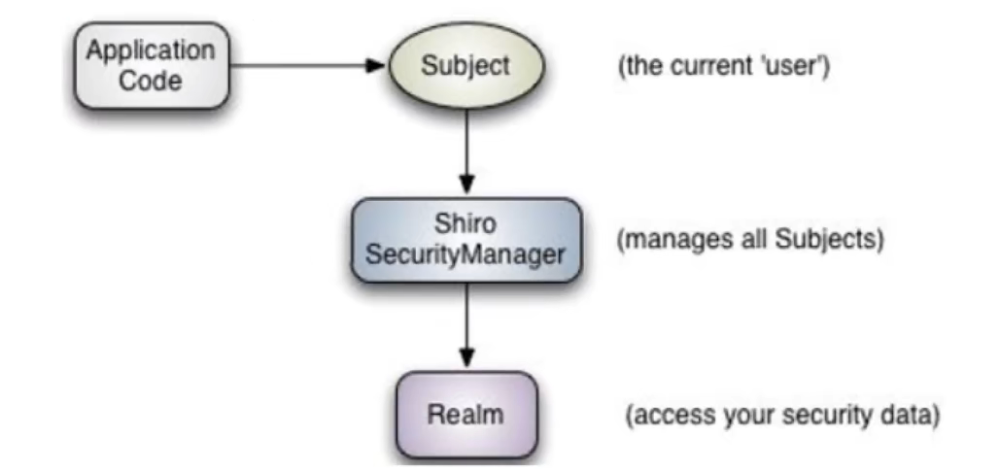

## SpringSecurity

注: 导入之后，先把依赖注掉，测一下其他功能正不正常。不注掉依赖，启动项目会一直跳转到一个登录界面

> 是针对Spring项目的安全框架，也是SpringBoot底层安全模块默认的技术选型，可以实现强大的Web安全控制

**几个重要的类：**

- WebSecurityConfigurerAdapter：自定义Security策略
- AuthenticationManagerBuilder：自定义认证策略
- @EnableWebSecurity：开启WebSecurity模式

SpringSecurity的两个主要目标 "认证" 和  "授权" (访问控制)

"认证" （Authentication）

"授权"（Authorization）

>  概念是通用的，不仅仅在SpringSecurity中存在

**导入依赖**

~~~xml
<dependency>
    <groupId>org.springframework.boot</groupId>
    <artifactId>spring-boot-starter-security</artifactId>
</dependency>
~~~

#### 认证和授权

1. 编写 Security 配置类

参考官网：https://spring.io/projects/spring-security 

对应的帮助文档： [Java Configuration :: Spring Security](https://docs.spring.io/spring-security/reference/servlet/configuration/java.html#jc-httpsecurity)

~~~java
@EnableWebSecurity  // 开启WebSecurity模式
public class SecurityConfig extends WebSecurityConfigurerAdapter {

    // 授权
    @Override
    protected void configure(HttpSecurity http) throws Exception {
        http.authorizeRequests()    // 首页所有人可以访问，功能页设置有对应权限的人访问
                .antMatchers("/").permitAll()
                .antMatchers("/level1/**").hasRole("vip1")
                .antMatchers("/level2/**").hasRole("vip2")
                .antMatchers("/level3/**").hasRole("vip3");

        http.formLogin()   // 没有权限默认会到登录页面 // 默认 /authentication/login(官方写好的)
            .loginPage("/toLogin")         // 指定登录页面的跳转路径
            .failureUrl("/test")           // 登录错误的跳转路径
            .loginProcessingUrl("/login"); // 处理登录请求，就是from表单提交的地址
        //                .usernameParameter("username")  // 前端input的用户名的name
        //                .passwordParameter("password") // 前端input的密码的name
    }

    // 认证
    @Override
    protected void configure(AuthenticationManagerBuilder auth) throws Exception {
        // 这是在内存中定义的，后面会有数据库的方式
        auth.inMemoryAuthentication().
                .withUser("admin").password("123456").roles("vip2","vip3")		  // admin用户的权限有 vip2、vip3
                .and()
                .withUser("root").password("123456").roles("vip1","vip2","vip3"); // root用户的权限有 vip1、vip2、vip3
    }
}
~~~

可能会报出` There is no PasswordEncoder mapped for the id "null"`  这是密码没有设置编码格式，修改 认证处的代码为

~~~java
// 认证
@Override
protected void configure(AuthenticationManagerBuilder auth) throws Exception {
    // 这是在内存中定义的，后面会有数据库的方式
    auth.inMemoryAuthentication().passwordEncoder(new BCryptPasswordEncoder())
        .withUser("admin").password(new BCryptPasswordEncoder().encode("123456")).roles("vip2","vip3")
        .and()
        .withUser("root").password(new BCryptPasswordEncoder().encode("123456")).roles("vip1","vip2","vip3");
}
~~~

#### 权限控制和注销

1. 前端

~~~html
<a class="item" th:href="@{/logout}">
    <i class="address card icon"></i> 注销
</a>
~~~

2. 注销功能

~~~java
// 在授权功能中添加
// 授权
@Override
protected void configure(HttpSecurity http) throws Exception {
    http.authorizeRequests()    // 首页所有人可以访问，功能页设置有对应权限的人访问
        .antMatchers("/").permitAll()
        .antMatchers("/level1/**").hasRole("vip1")
        .antMatchers("/level2/**").hasRole("vip2")
        .antMatchers("/level3/**").hasRole("vip3");
        http.logout()    // 注销.  // The default is that accessing the URL "/logout"
               // .logoutUrl("/logout1")       // 注销跳转的路径
                .logoutSuccessUrl("/");        // 注销成功后跳转的界面
               //.deleteCookies("remove")              // 注销后移除 cookie
               //.invalidateHttpSession(false)         // 改成 true 则 注销后移除 session
}
~~~

注销可能不成功，因为为了防止 *跨站请求伪造* 攻击。需要使用 post 方式提交或者使用

~~~java
http.csrf().disable();
~~~

#### 记住我

~~~java
http.rememberMe();  // 记住我功能 cookie实现，默认保存两周
~~~

## Shiro

> Apache Shiro 是一个 Java的安全（权限）框架
>
> Shiro 可以在JavaSE 和 JavaEE 环境
>
> Shiro 可以完成 认证、授权、加密、会话管理，Web继承，缓存等

官网：[Apache Shiro | Simple. Java. Security.](https://shiro.apache.org/index.html)

**核心三大对象：**

- Subject：当前的用户
- SecurityManager：管理所有用户。本质上是一个应用程序单例，默认的SecurityManager实现是POJO，可以使用任何与POJO兼容的配置机制进行配置，基本上可以使用任何能够实例化类和调用JavaBeans兼容方法的东西。
- Realm：连接数据，是一个特定于安全性的DAO：它封装了数据源的连接细节，并根据需要将相关数据提供给Shiro

[10 Minute Tutorial on Apache Shiro | Apache Shiro](https://shiro.apache.org/10-minute-tutorial.html) 

~~~java
Subject currentUser = SecurityUtils.getSubject();	// 获取当前的用户对象Subject

Session session = currentUser.getSession();			// 通过当前用户拿到session
session.setAttribute( "someKey", "aValue" );		// 存值
String value = (String) session.getAttribute("someKey");// 取值

// 判断当前的用户是否被认证
if ( !currentUser.isAuthenticated() ) {
    UsernamePasswordToken token = new UsernamePasswordToken("lonestarr", "vespa");
    token.setRememberMe(true);			// 设置记住我
    try {
        currentUser.login( token );		// 执行登录操作
    } catch ( UnknownAccountException uae ) {
        // 未知的账户
    } catch ( IncorrectCredentialsException ice ) {
        // 密码不对
    } catch ( LockedAccountException lae ) {
        // 用户名被锁定了
    }
    ... more types exceptions to check if you want ...
        } catch ( AuthenticationException ae ) {
    //unexpected condition - error? 意外错误
}
}

currentUser.getPrincipal()					// 用户的主要信息
currentUser.hasRole( "schwartz" ) 			// 用户的角色
currentUser.isPermitted( "lightsaber:wield" )// 拥有的权限
currentUser.isPermitted( "winnebago:drive:eagle5" )// 拥有的权限
    
currentUser.logout(); 	// 注销
~~~

#### 整合到springboot

导入依赖

~~~xml
<!-- https://mvnrepository.com/artifact/org.apache.shiro/shiro-spring -->
<dependency>
    <groupId>org.apache.shiro</groupId>
    <artifactId>shiro-spring</artifactId>
    <version>1.8.0</version>
</dependency>
~~~

1. 编写Shiro配置

- 先编写一个UserRealme

~~~java
// 自定义的 UserRealm  需要 extends AuthorizingRealm
public class UserRealm extends AuthorizingRealm {
    // 授权
    @Override
    protected AuthorizationInfo doGetAuthorizationInfo(PrincipalCollection principalCollection) {
        System.out.println("===AuthorizationInfo===执行了");
        return null;
    }
    // 认证
    @Override
    protected AuthenticationInfo doGetAuthenticationInfo(AuthenticationToken authenticationToken) throws AuthenticationException {
        System.out.println("===AuthenticationInfo===执行了");
        return null;
    }
}
~~~

- ShiroConfig

~~~java
@Configuration
public class ShiroConfig {
    // shiroFilterFactoryBean
    @Bean
    public ShiroFilterFactoryBean getShiroFilterFactoryBean(DefaultWebSecurityManager DefaultWebSecurityManager){
        ShiroFilterFactoryBean shiroFilterFactoryBean = new ShiroFilterFactoryBean();
        // 设置安全管理器
        shiroFilterFactoryBean.setSecurityManager(DefaultWebSecurityManager);
        return shiroFilterFactoryBean;
    }
    // DefaultWebSecurityManager
    @Bean
    public DefaultWebSecurityManager getDefaultWebSecurityManager(UserRealm userRealm){
        DefaultWebSecurityManager securityManager = new DefaultWebSecurityManager();
        // 关联UserRealm
        securityManager.setRealm(userRealm);
        return securityManager;
    }
    // 创建 realm 对象，需要自定义类
    @Bean
    public UserRealm userRealm(){
        return new UserRealm();
    }
}
~~~

#### 登陆拦截

- 测试的controller

~~~java
@Controller
public class MyController {
    @RequestMapping("/")
    public String toIndex(){ return "index";}
    @RequestMapping("/user/add")
    public String add(){ return "user/add";}
    @RequestMapping("/user/update")
    public String update(){ return "user/update";}
    @RequestMapping("/toLogin")
    public String login(){ return "login";}
    
    @RequestMapping("/login1")
    public String login(String username,String password,Model model){
        // 获取当前的用户
        Subject subject = SecurityUtils.getSubject();
        // 封装用户的登录信息
        UsernamePasswordToken token = new UsernamePasswordToken(username, password);

        try {
            subject.login(token);   // 执行登录的方法，如果没有异常，说明 ok
            return "index";
        } catch (UnknownAccountException e) {
            model.addAttribute("msg","用户名错误");
            return "login";
        }catch (IncorrectCredentialsException e){
            model.addAttribute("msg","密码错误");
            return "login";
        }
    }
}
~~~

ShiroConfig的配置

~~~java
@Bean
public ShiroFilterFactoryBean getShiroFilterFactoryBean(DefaultWebSecurityManager DefaultWebSecurityManager){
    ShiroFilterFactoryBean shiroFilterFactoryBean = new ShiroFilterFactoryBean();
    // 设置安全管理器
    shiroFilterFactoryBean.setSecurityManager(DefaultWebSecurityManager);
    /*
            anon：无需认证就可以访问
            authc：必须认证了才能访问
            user：必须拥有记住我功能才能用
            perms：拥有对某个资源的权限才能访问
            role：拥有某个角色权限才能访问
            logout: 退出过滤器，配置一个url就可以使用
         */
    // 添加shiro的内置过滤器
    Map<String, String> filerMap = new HashMap<>();
    // 拦截
    filerMap.put("/user/*","authc");
    shiroFilterFactoryBean.setFilterChainDefinitionMap(filerMap);
    // 设置登录的请求
    shiroFilterFactoryBean.setLoginUrl("/toLogin");
    return shiroFilterFactoryBean;
}
~~~

#### 用户认证

- Controller 层接收这些参数，并进行判断

> 应该在service层，这里比较简单，写在Controller

~~~java
@RequestMapping("/login1")
public String login(String username,String password,Model model){
    // 获取当前的用户
    Subject subject = SecurityUtils.getSubject();
    // 封装用户的登录信息
    UsernamePasswordToken token = new UsernamePasswordToken(username, password);

    try {
        subject.login(token);   // 执行登录的方法，如果没有异常，说明 ok
        return "index";
    } catch (UnknownAccountException e) {
        model.addAttribute("msg","用户名错误");
        return "login";
    }catch (IncorrectCredentialsException e){
        model.addAttribute("msg","密码错误");
        return "login";
    }
}
~~~

- Shiro 认证

~~~java
// 认证
@Override
protected AuthenticationInfo doGetAuthenticationInfo(AuthenticationToken authenticationToken) throws AuthenticationException {
    System.out.println("===AuthenticationInfo===执行了");
    // 用户名、密码
    String username = "root";
    String password = "123123";
    UsernamePasswordToken userToken = (UsernamePasswordToken) authenticationToken;
    if (!userToken.getUsername().equals(username)){
        return null;    // 会自动抛出异常 UnknownAccountException
    }
    // 密码认证，shiro做
    return new SimpleAuthenticationInfo("",password,"");
}
~~~

#### 整合Mybatis

Mapper

~~~java
@Mapper
public interface UserMapper {
    User queryUserByName(String name);
}
~~~

~~~java
@Autowired
UserMapper UserMapper;
// 认证
@Override
protected AuthenticationInfo doGetAuthenticationInfo(AuthenticationToken authenticationToken) throws AuthenticationException {
    System.out.println("===AuthenticationInfo===执行了");
    UsernamePasswordToken userToken = (UsernamePasswordToken) authenticationToken;
    // 连接真实的数据库
    User user = userService.queryUserByName(userToken.getUsername());
    if (user == null){	// 没有这个人
        return null;	// 会自动抛出异常 UnknownAccountException
    }
    // 密码认证，shiro做
    // SimpleAuthenticationInfo(将当前用户放到subject,获取当前用户的密码,用户名字)
    return new SimpleAuthenticationInfo(user,user.getPassword(),"");
}
~~~

#### 用户授权

MyController

~~~java
@RequestMapping("/noauth")
@ResponseBody
public String unauth(){
    return "未经授权";
}
~~~

UserRealm

~~~java
// 授权
@Override
protected AuthorizationInfo doGetAuthorizationInfo(PrincipalCollection principalCollection) {
    System.out.println("===授权===执行了");
    SimpleAuthorizationInfo simpleAuthorizationInfo = new SimpleAuthorizationInfo();
    //        simpleAuthorizationInfo.addStringPermission("user:add");
    // 拿到当前登录的这个对象
    Subject subject = SecurityUtils.getSubject();
    User currentUser = (User) subject.getPrincipal(); // 拿到User对象
    // 设置当前用户的权限
    simpleAuthorizationInfo.addStringPermission(currentUser.getPerms());
    return simpleAuthorizationInfo;
}
~~~

shiroConfig

~~~java
// 添加shiro的内置过滤器
// 拦截
Map<String, String> filerMap = new HashMap<>();
// 授权   没有授权会跳到未授权的页面
filerMap.put("/user/add","perms[user:add]");
filerMap.put("/user/update","perms[user:update]");

filerMap.put("/user/*","authc");    // 未经授权就访问 authc
//filerMap.put("/logout1","logout");   // 注销功能。要放在最后
shiroFilterFactoryBean.setFilterChainDefinitionMap(filerMap);
// 设置登录的请求
shiroFilterFactoryBean.setLoginUrl("/toLogin");
// 设置未授权的页面
shiroFilterFactoryBean.setUnauthorizedUrl("/noauth");

return shiroFilterFactoryBean;
~~~

#### 用户注销

html 中

~~~html
<a href="/logout1">logout</a>
~~~

- 方法一 在 ShiroConfig中配置 

~~~java
Map<String, String> filerMap = new HashMap<>();
// 授权 
filerMap.put("/user/add","perms[user:add]");
filerMap.put("/user/update","perms[user:update]");
filerMap.put("/user/*","authc");

//filerMap.put("/logout1","logout");   // 注销功能。要放在最后
shiroFilterFactoryBean.setFilterChainDefinitionMap(filerMap);
~~~

- 方法二 在Controller中配置

~~~java
@RequestMapping("/logout1")
@ResponseBody
public String logout1(){
    Subject subject = SecurityUtils.getSubject();
    if (subject.getPrincipal() != null) {
        subject.logout();
        return "退出成功";
    }
    return "没有可以退出的用户";
}
~~~

