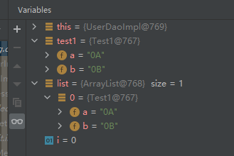
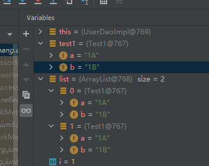

## 关于ArrayList值覆盖问题

~~~java
class Test1{
    private String a;
    private String b;

    public String getA() {
        return a;
    }

    public void setA(String a) {
        this.a = a;
    }

    public String getB() {
        return b;
    }

    public void setB(String b) {
        this.b = b;
    }
}

Test1 test1 = new Test1();
ArrayList<Test1> list = new ArrayList<>();
for (int i = 0; i < 10; i++) {
    test1.setA(""+i+"A");
    test1.setB(""+i+"B");
    list.add(test1);
}
~~~

**现象：**

因为 ArrayList 的 add 方法是引用对象内存地址，所以，当test1 的值变了时，在添加时，list前面 的值也会变化

#### 解决办法

新建一个对象就可以

~~~java
for (int i = 0; i < 10; i++) {
    Test1 test1 = new Test1();
    test1.setA(""+i+"A");
    test1.setB(""+i+"B");
    list.add(test1);
}
~~~